# Menu
## Tìm TODO để xem những phần chưa hoàn thành
- **I. Linux booting sequence**
  - [I. Linux booting sequence](#i-linux-booting-sequence)
    - [1. First stage loader](#1-first-stage-loader)
    - [2. Second program loader (Phase MLO của Uboot)](#2-second-program-loader-phase-mlo-của-uboot)
    - [3. Uboot phase (phase 2 của Uboot)](#3-uboot-phase-phase-2-của-uboot)
- **II. Build Uboot và kernel**
  - [II. Build Uboot và kernel](#ii-build-uboot-va-kernel)
    - [1. Tải compile gcc](#1-tải-compile-gcc)
    - [2. Export ra để dễ gọi compile](#2-export-ra-để-dễ-gọi-compile)
    - [3. Build code Uboot](#3-build-code-uboot)
    - [4. Build kernel](#4-build-kernel)
- **III. Build root file system (rootfs)**
  - [III. Build root file system (rootfs)](#iii-build-root-file-system-rootfs)
    - [1. Copy uboot, kernel, rootfs vào thẻ nhớ](#1-copy-uboot-kernel-rootfs-vào-thẻ-nhớ)
    - [2. Copy thành phần khác vào sdcard](#2-copy-thành-phần-khác-vào-sdcard)
- **IV. Uboot Basic Concept & Uboot architecture**
  - [IV. Uboot Basic Concept & Uboot architecture](#iv-uboot-basic-concept--uboot-architecture)
    - [1. Uboot](#1-uboot)
      - [1.1 Phase 1: Rom code - first stage loader](#11-phase-1-rom-code---first-stage-loader)
      - [1.2 Phase 2: SPL - second program loader](#12-phase-2-spl---second-program-loader)
      - [1.3 Phase 3: TPL - third program loader](#13-phase-3-tpl---third-program-loader)
      - [1.4 Đặt vấn đề](#14-đặt-vấn-đề)
    - [2. Modify Uboot](#2-modify-uboot)
      - [2.1 Tại sao cần modify Uboot](#21-tại-sao-cần-modify-uboot)
      - [2.2 uEnv.txt - custom Uboot](#22-uenvtxt---custom-uboot)
      - [2.3 Script uboot hoạt động như nào](#23-script-uboot-hoạt-động-như-nào)
- **V. Linux OS structure**
  - [V. Linux OS structure](#v-linux-os-structure)
    - [1. Cấu trúc của Linux OS](#1-cấu-trúc-của-linux-os)
    - [2. Build Root basic concept](#2-build-root-basic-concept)
      - [2.1 Buildroot bao gồm:](#21-buildroot-bao-gồm)
      - [2.2 Cách build bằng buildroot](#22-cách-build-bằng-buildroot)
      - [2.3. Output buildroot](#23-output-buildroot)
      - [2.4. Đọc ghi file trong linux](#24-đọc-ghi-file-trong-linux)
        - [2.4.1. Khái niệm](#241-khái-niệm)
        - [2.4.2. Phân loại file](#242-phân-loại-file)
        - [2.4.3. Thao tác với file trong linux](#243-thao-tác-với-file-trong-linux)
- **VI. Linux kernel**
  - [VI. Linux kernel](#vi-linux-kernel)
    - [1. Kernel](#1-kernel)
    - [2. Kernel module](#2-kernel-module)
      - [2.1 Khái niệm](#21-khái-niệm)
      - [2.2 Static linking](#22-static-linking)
      - [2.3 Dynamic linking](#23-dynamic-linking)
      - [2.4 Kernel module example](#24-kernel-module-example)
      - [2.5 Tương tác file trong linux](#25-tương-tác-file-trong-linux)
      - [2.6 Device file concept](#26-device-file-concept)
        - [2.6.1 Tạo device file](#261-tạo-device-file)
      - [2.7. Cross Compile](#27-cross-compile)
- **VII. BeagleBone Black**
  - [VII. BeagleBone Black](#vii-beaglebone-black)
    - [1. Configue pin mux](#1-configue-pin-mux)
    - [2. Build code với kernel header](#2-build-code-với-kernel-header)
    - [3. Code với kernel](#3-code-với-kernel)
- **VIII. Device tree**
  - [VIII. Device tree](#viii-device-tree)
    - [1. Device tree là gì](#1-device-tree-là-gì)
- **IX. PWM driver**
  - [IX. PWM driver](#ix-pwm-driver)
    - [1. Ứng dụng của PWM](#1-ứng-dụng-của-pwm)
    - [2. TỔng quan](#2-tổng-quan)
    - [3. Pin controller - cấy hình pin cho PWM](#3-pin-controller---cấy-hình-pin-cho-pwm)

# I. Linux booting sequence
Quá trình boot của linux có 3 giai đoạn chính
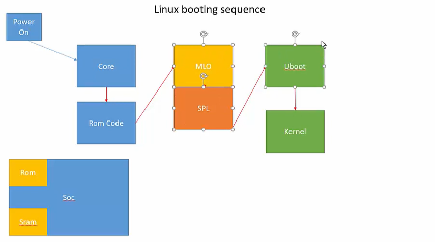
## 1. First stage loader
- Khi cấp nguồn, Core sẽ thực thi các lệnh trong Rom Code: khởi tại clock cơ bản, khởi tạo 1 số data, load và chạy file thực thi của phase 2 lên bộ nhớ ram
## 2. Second program loader (Phase MLO của Uboot)
- MLO (SPL) nhiệm vụ chính: khởi tạo phần cứng tối thiểu cần thiết để load DRAM (DRAM controller), thiết lập UART/serial, I2C/SPI nếu cần, và sau đó load U-Boot chính (u-boot.img/u-boot-dtb.img) từ cùng hoặc thiết bị khác.
- Tại sao cần SPL: ROM nhỏ không đủ chức năng để khởi tạo DRAM phức tạp nên SPL chịu trách nhiệm chuẩn bị RAM để U-Boot lớn hơn có thể chạy.
- Hành vi: SPL nằm ở vùng mà ROM có thể đọc; sau khi DRAM sẵn sàng, SPL copy u-boot từ SD/eMMC vào RAM và nhảy tới nó.
## 3. Uboot phase (phase 2 của Uboot)
- Xác định kernel image (zImage/vmlinuz) và DTBs.
- Thiết lập bootargs (kernel command line) bao gồm root=, console=, rw/ro, v.v.
- Load kernel (zImage/Image) và DTB vào RAM; nếu dùng initramfs thì load initramfs (initrd).
- Nhảy sang kernel (bootm/bootz/kexec tuỳ U-Boot và format).

> **Notes**: Vì sao không load thẳng các file ở phase 2 vào bộ nhớ Rom code của SoC mà lại chia thành 2 phase?
> - Rom code của SoC thường có size rất nhỏ chỉ đủ để thực thi vài lệnh nên việc load cả chương trình vào là không thể.
> - Phase từ MLO tới Uboot là nằm trong code của uboot, mà code uboot là code mã nguồn mở, có tính linh động cao, support được nhiều dòng chip và không phải các chip đều có ngoại vi giống nhau. **Vì vậy cần cách li phần cấu hình uboot sang 1 phase riêng (phase 2) để cho phù hợp với SoC đang dùng, đảm bảo sự linh động của uboot**
***
# II. Build Uboot và kernel
<a id="ii-build-uboot-va-kernel"></a>
[Digikey Uboot](https://www.youtube.com/redirect?event=video_description&redir_token=QUFFLUhqbFVQTDVTS242WEVjUVdUYV8yZUxJY3lzNE1mQXxBQ3Jtc0trTm9KdkJJcFlib3kyUzZWLXlzUjZFZGFibDhIbE1IeUFEYTVIeERzSDV1UlZuckE4SFUtZU5mX3dBZW1mR2hTNFJBdGNZdXNka25ZVnJVLXQyNlRFOTNfNWFvTk1qWTltQ05iMHlZOUN4SVdKWWJ0TQ&q=https%3A%2F%2Fforum.digikey.com%2Ft%2Fdebian-getting-started-with-the-beaglebone-black%2F12967&v=RfEtorHpThU)
## 1. Tải compile gcc
```wget -c https://mirrors.edge.kernel.org/pub/tools/crosstool/files/bin/x86_64/11.5.0/x86_64-gcc-11.5.0-nolibc-arm-linux-gnueabi.tar.xz```

- Compile này để build kernel 
## 2. Export ra để dễ gọi compile
```export CC32=`pwd`/gcc-11.5.0-nolibc/arm-linux-gnueabi/bin/arm-linux-gnueabi-```
## 3. Build code Uboot
- Tải uboot về rồi build (xem link đầu chapter)
## 4. Build kernel
- Tải kernel về rồi build (xem link đầu chapter)
***
# III. Build root file system (rootfs)
**Notes:**
- Là các ứng dụng trong OS

```wget -c https://rcn-ee.com/rootfs/eewiki/minfs/debian-13-minimal-armhf-2025-04-02.tar.xz```

## 1. Copy uboot, kernel, rootfs vào thẻ nhớ
- Cắm thẻ nhớ vào Ubuntu
- Export usb ra biến môi trường: ```export DISK=/dev/sdb```
- Xóa phân vùng thẻ nhớ: ```sudo dd if=/dev/zero of=${DISK} bs=1M count=10``` - ghi 0 vào DISK với 10 sector, mỗi sector 1MB
- Copy binary của Uboot vào thẻ nhớ: ```sudo dd if=MLO of=${DISK} count=2 seek=1 bs=128k``` - với sector là 128K và offset(seek) là 1 là dịch đầu ghi lên 128K, sau đó mới chép MLO vào. 128K = 131072Byte, mà block sector của thẻ thường là 512bytes. Vậy thì ta đã lưu MLO ở sector thứ 131072/512=256 để Rom code có thể đọc (Rom code luôn đọc ở địa chỉ nhất định)

    >**Notes:** Trong bbb, nó phân vùng SoC, trong SoC có chứa 1 đoạn Rom code. Trong Rom code, khi nó cấp nguồn, thì bbb sẽ boot từ địa chỉ default. Vì boot bằng sdcard nên trong Rom code quy định: khi mở nguồn, bbb sẽ copy lệnh từ địa chỉ nhất định của sdcard: đây là địa chỉ để mapping khối MLO để chip có thể thực thi lệnh MLO
- Copy code bootloader: `sudo dd if=./u-boot/u-boot-dtb.img of=${DISK} count=4 seek=1 bs=384k`
- Phân vùng thẻ nhớ: thẻ sẽ chia ra 2 phân vùng chính: boot(fat32 - chứa MLO và uboot) và ext4. 
    ```
    sudo sfdisk ${DISK} <<-__EOF__
    4M,7475M,L,*
    __EOF__
    ```
## 2. Copy thành phần khác vào sdcard
- `cd kernelbuildscripts`
- Check kernel version: `cat kernel_version`
- Export nó: export kernel_version=số kernel từ lệnh trên
- Mount thẻ nhớ vào ubuntu: 
    ```
    - sudo mkdir /media/rootfs
    - sudo mkfs.ext4 -L rootfs -O ^metadata_csum,^64bit ${DISK}1
    - sudo mount ${DISK}1 /media/rootfs
    ```
- Copy rootfs:
    ```
    sudo tar xfvp ./debian-*-*-armhf-*/armhf-rootfs-*.tar -C /media/rootfs/
    ```
- Ghi kernel_version vào boot/uEnv.txt: để chương trình boot lên biết đang chạy ver nào
    ```
    sudo sh -c "echo 'uname_r=${kernel_version}' >> /media/rootfs/boot/uEnv.txt"
    ```
- Copy kernel image vào sdcard
    ```
    sudo cp -v ./deploy/${kernel_version}.zImage /media/rootfs/boot/vmlinuz-${kernel_version}
    ```
- Copy device tree
    ```
    - sudo mkdir -p /media/rootfs/boot/dtbs/${kernel_version}/
    - sudo tar xfv ./deploy/${kernel_version}-dtbs.tar.gz -C /media/rootfs/boot/dtbs/${kernel_version}/
    ```
- Copy file system table
    ```
    sudo sh -c "echo '/dev/sdb1 / auto errors=remount-ro 0 1' >> /media/rootfs/etc/fstab"
    ```
- Umount sdcard
    `sudo umount /media/rootfs`

## 3. Cấu trúc thẻ nhớ để boot được BBB
Thẻ nhớ cần được chia thành 2 phân vùng
### 3.1 BOOT
- Kích thước khoảng 512MB
- Chứa 
    - device tree
    - MLO
    - u-boot.img
    - uEnv.txt
    - kernel image: zImage hoặc uImage
- Cần gắn flag: boot, lba
### 3.2 ROOTFS
- Kích thước lớn (phần còn lại của sdcard)
- Chứa root file system
- rootfs lấy từ file .img -> copy nội dung trong img này vào partition ROOTFS


# IV. Uboot Basic Concept & Uboot architecture
## 1. Uboot
- [I. Linux booting sequence](#i-linux-booting-sequence)
- Vai trò chính của uboot: load nhân của hệ điều hành lên DRam
### 1.1 Phase 1: Rom code - first stage loader
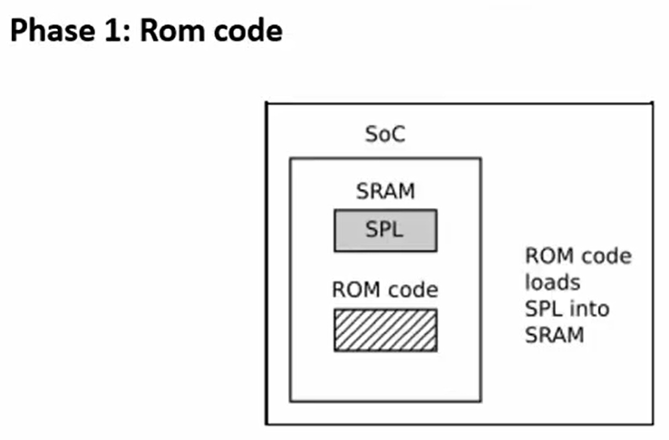
- Là mã nguồn được nhà sản xuất chip ghi sẵn vào flash của chip, khi cấp nguồn, chip đầu tiên sẽ chạy rom code
- Nhiệm vụ: init các clock cơ bản, load phase 2 lên bộ nhớ SRAM của chip (SPL ở bộ nhớ).
### 1.2 Phase 2: SPL - second program loader
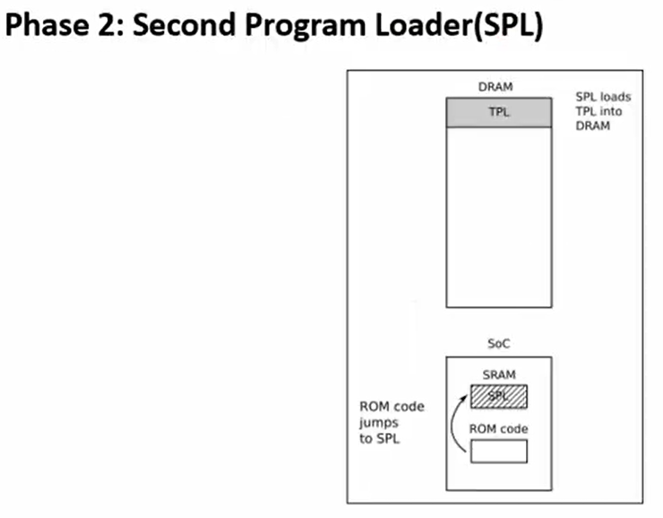
- Sau khi rom code đã load được SPL lên ram rồi, CPU sẽ thực thi code ở vùng SRAM (SRAM rất bé).
- SPL sẽ khởi tạo các ngoại vi cao hơn: DDR controller (mở rộng bộ nhớ RAM để load phase 3 - TPL)
### 1.3 Phase 3: TPL - third program loader
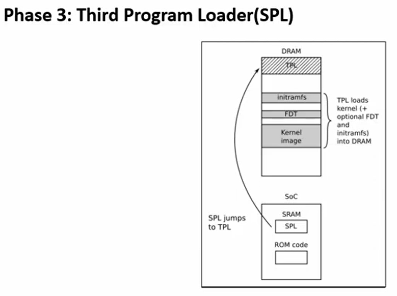
- DRAM đã được khởi tạo 
- Loader code kernal vào DRAM, trao quyền cho kernel để phân chia tài nguyên hệ thống, khởi chạy hệ điều hành

### 1.4 Đặt vấn đề
- **Làm sao Uboot biết địa chỉ để load SPL?**
    + Địa chỉ này được lập trình trong Rom code, phụ thuộc hãng sản xuất và từng SoC.
    + spruh73q.pdf - rom code có 2 chế độ boot
        - 26.1.8.5.5 Raw mode: có ghi địa chỉ mà Rom code sẽ lấy lệnh từ sdcard/mmd. Rom code sẽ nhảy tới 4 địa chỉ mặc định và quét các địa chỉ đó, và kiểm tra xem vùng địa chỉ đó tồn tại CHSETTINGS hay không? CÓ thì rom thực thi lệnh. Dùng lệnh `sudo dd if=MLO of=${DISK} count=2 seek=1 bs=128k` để đặt MLO vào sdcard tại offset 128k, chiều dài tối đa là 2*128 và ROM Code chỉ đọc vài byte đầu tiên (tối đa là 1 sector 512 byte)
        - 26.1.8.5.6 FAT mode: phân vùng thẻ thành FAT, lưu file MLO vào, sau đó rom code sẽ tìm file có tên là MLO và thực thi lệnh.
        - Dùng lệnh `sudo hexdump -C -s 0x20000 -n 100 /dev/sdb` với 0x20000 là  thể hiện cho offset 128KB
- **Làm sao SPL biết địa chỉ để load TPL?**
    + Cpu cần biết địa chỉ để đọc TPL và địa chỉ đó được ghi trong u-boot/.config
    + u-boot/.config: là file chứa config chung cho phase SPL
        - CONFIG_SYS_MMCSD_RAW_MODE_U_BOOT_USE_SECTOR=y: dùng Raw mode
        - CONFIG_SYS_MMCSD_RAW_MODE_U_BOOT_SECTOR=0x300: địa chỉ để load code TPL, vì vậy cần lưu code TPL vào 0x300
        - `sudo dd if=./u-boot/u-boot-dtb.img of=${DISK} count=4 seek=1 bs=384k`: lệnh để ghi TPL vào 0x300 
            + 384 * 1 * 1024 = 0x60000 - là địa chỉ ghi TPL xuống thẻ nhớ byte thứ 60000
            + 0x300: TPL đặt lại sector 0x300
            + Hoặc có thể hiểu 0x300(hex) = 768(dec), mà 1 sector của sdcard thường là 512 nên 768 * 512 = 60000
                > Cpu sẽ thực thi code ở byte 0x60000
- **Làm sao TPL biết địa chỉ để load kernel?**
    + Cpu cần biết địa chỉ để TPL load kernel và địa chỉ đó được ghi trong u-boot/.config
    + u-boot/.config:
        - CONFIG_SYS_LOAD_ADDR=0x82000000: cần đặt sẵn file kernel vào địa chỉ này để load được kernel. 
        - Có thể thay đổi địa chỉ load kernel thông qua uEnv.txt hoặc có thể sửa code uBoot

    > Những câu hỏi trên sẽ cần để port Uboot lên 1 board khác ngoài BBB

## 2. Modify Uboot
### 2.1 Tại sao cần modify Uboot
> Code Uboot rất linh động, có thể chạy trên nhiều nền tảng:x86, arm,... Mỗi dòng board đều gắn các linh kiện khác nhau: có/không sdcard, có/không emmc, ..., việc cần làm là thay đổi code Uboot để boot kernel dưới các điều kiện khác nhau.

### 2.2 uEnv.txt - custom Uboot
- thường được lưu ở /boot/uEnv.txt
- Khi uboot chay, nó đọc file uEnv.txt
- viết script để chỉnh sửa hành vi uboot
- Command uboot
    - `Loadaddr <destination address> <file to load>`: load file tới đích
    - `Setenv <variable> <value>`: set value cho 1 biến trong uboot
    - `Printenv <variable>`: in biến môi trường trong uboot ra
    - `Run`: chạy bất cứ biến môi trường nào của uboot

### 2.3 Script uboot hoạt động như nào
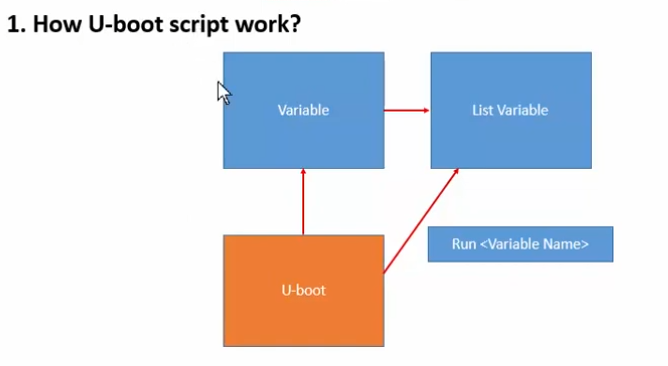
- Uboot là tập hợp nhiều biến môi trường. Nó sẽ setup các varible sau đó sắp các biến đó thành List variable và thiết lập mối liên kết giứa các biến môi trường. Sau đó dùng run để thực thi biến môi trường
- Nhấn space liên tục lúc boot để vào uboot ở bbb
- uEnv.txt example:
    > bootargs=console=tty00,115200 root=/dev/mmcblk0p1 rw
bootcmd=echo "Running bootcmd ..."; load mmc 0:1 0x82000000 /boot/vmlinuz-5.4.288-bone69; load mmc 0:1 0x880000 /boot/dtbs/5.4.288-bone69/am335x-boneblack.dtb; bootz 0x82000000 - 0x88000000;
boot=echo "Running boot script use /boot/uEnv.txt"; run bootcmd;

# V. Linux OS structure
## 1. Cấu trúc của Linux OS
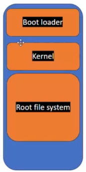
- Bootloader: có chức năng load kernel vào bộ nhớ. U-boot là 1 trong các phiên bản bootloader thường được dùng, nó support nhiều kiến trúc, size nhỏ, dùng để load kernel 
- Kernel: quản lý tài nguyên, task, process, thread, quản lý bộ lập lịch
- Root file system: là hệ thống file được public tới người dùng, để người dùng tương tác thông qua file

## 2. Build Root basic concept
- Buildroot là dự án mã nguổn mở gồm các script và makefiles để tự động hóa build hệ thống
### 2.1 Buildroot bao gồm:
+ Toolchain: là các compile, hỗ trợ build chéo từ máy host ra image cho target
+ Kernel: buildroot có thể tự động tải kernel source, apply patches, cấu hình tùy chọn kernel dựa vào target platform
+ Root filesystem: chứa các thư viện, binary cần thiết
+ Bootloaders: hỗ trợ nhiều BL bao gồm Uboot
- Output của buildroot: output nằm trong sdcard và boot từ sdcard
    + Uboot image
    + kernel image
    + root file system
    + device tree binary
### 2.2 Cách build bằng buildroot
- Vào folder buildroot-2026.02
- chạy các lệnh như trong file: buildroot-2026.02/board/beagleboard/beaglebone/readme.txt
- cầu hình trong menucondfig: Xem `Linux Embedded #22 Build Root build and generate package` - lưu ý TTY port cần set là ttyS0

### 2.3. Output buildroot
- /buildroot-2023.08/output/images/
- sdcard.img: gồm tất cả mọi thứ (bootloader, kernel, ...)
- To copy the image file to the sdcard use dd:
    + umount /dev/sdx
    + dd if=output/images/sdcard.img of=/dev/XXX
    + thẻ nhớ sẽ được chia thành 2 vùng 16M (để boot) và 512M (rootfs)

### 2.4. Đọc ghi file trong linux
#### 2.4.1. Khái niệm
- Linux quy định: mọi giao tiếp với phần cứng đều phải giao tiếp qua file
- Khi đã viết được driver, ta cần cung cấp giao diện file để app có thể đọc ghi phần cứng
- File ở linux là:
    - Thực thể của 1 đối tượng trong hệ điều hành
    - Mọi đối tượng trong hđh đều phải được biểu diễn trong qua file nào đấy
- struct của file: linux/fs.h
- /proc : chứa các process đang chạy, mỗi process là có 1 file/folder đại diện cho nó
#### 2.4.2. Phân loại file
- Regular file: là file đại diện cho dữ liệu trong ổ cứng (data trong ổ cứng)
- Directory file (file thư mục): là file mà data của nó là danh sách file chứa trong nó (chính là khái niệm folder)
- Các loại file khác: file đại diện phần cứng, cho ngắt, ... . Điểm chung là không được lưu ở ổ cứng, chúng sẽ được tạo lại khi linux boot lên
#### 2.4.3. Thao tác với file trong linux
- giá trị fd bắt đầu từ số 3 trở đi vì chương trình dã mở các file fd 0,1,2 từ khi khởi động: 
    - stdin(0)
    - stdout(1)
    - stderr(2)
- Vì sao fd là số nguyên chứ không phải là con trỏ? Đó là file table
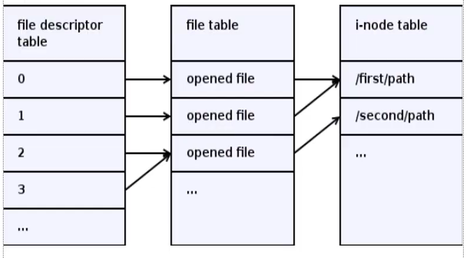
    - file table là bảng đính kèm cùng tiến trình
    - mỗi ô trong table là 1 con trỏ trỏ tới địa chỉ nằm ở ram của 1 file nào đó
    - mỗi khi mở 1 file, chương trình sẽ tìm hàng trống gần nhất nhỏ nhất chưa trỏ đến file nào, nó mở file và trả về index cho fd
    - fd chỉ đại diện cho thứ tự lần mở, chứ không đại diện cho file đó là gì nên nếu nhiều process (không liên quan nhau) có fd là cùng 1 số thì không ảnh hưởng gì vì mỗi process có 1 file table riêng
#### 2.4.4. Vấn đề với hàm read/write file
- Hàm read/write đều gây block chương trình cho đến khi đọc/ghi xong
- Cách khắc phục:
    - Read/write bất đồng độ: dùng thư viện aio.h
    - Tạo thread mới để đọc/ghi

# VI. Linux kernel
## 1. Kernel
- Hầu hết các hệ thống có ứng dụng hệ điều hành (window, linux, macos) đều có khái niệm nhân
- Nhân là trái tim hệ điều hành, có nhiệm vụ:
    - quản lý tài nguyên hệ thống, process, task 
    - nó giống như 1 cầu nối giữa tầng người dùng với phần cứng.
### 1.1. User space và kernel space
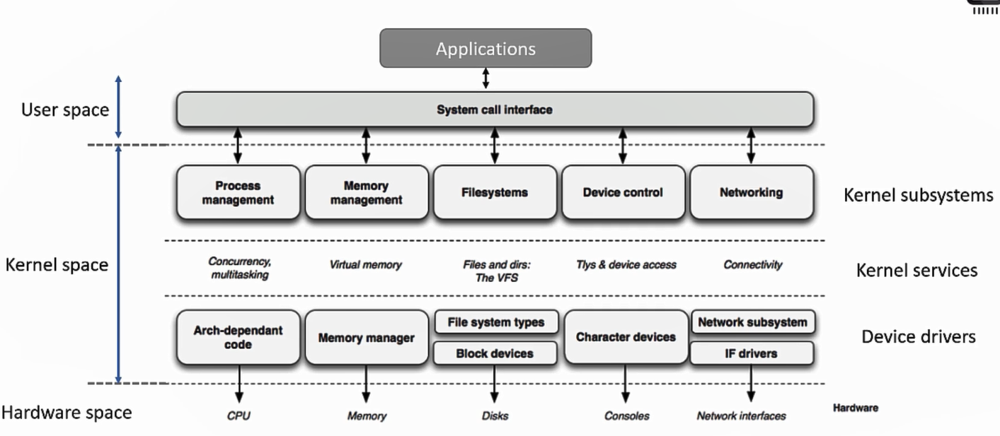
- Khi code kernel space chạy trên CPU, chế độ của CPU là chế độ toàn quyền truy cập các tài nguyên của hệ thống như memory, ngoại vi, processor, ...
- Khi code user space chạy trên CPU, chế độ của CPU là chế độ giới hạn truy cập, nó không thể truy cập các tài nguyên như kernel space
- Nếu user space muốn truy cập memory hoặc ngoại vi, nó phải request tới kernel sử dụng system call interface

## 2. Kernel module
### 2.1 Khái niệm
- là những module được viết để thực thi trong kernel
- nó có khả năng load và unload vào kernel trong quá trình mà linux kernel đang chạy
- có khả năng mở rộng tính năng của kernel mà không cần reboot lại cả hệ thống linux (window thì cần khởi động lại, chính vì thể nhiều hệ thống server dùng linux để tránh việc khởi động lại làm mất dữ liệu, tốn năng lượng khởi động)
- Ưu điểm: 
    + bản thân kernel module không cần build với nhân, vì vậy giảm được size của kernel, giúp code kernel linh động hơn
    + không cần build lại kernel khi thay đổi driver, tiết kiệm thời gian, chi phí
    + Không cần reboot khi có update kernel module

- `__init`: 
    - đánh dấu cho compiler rằng hàm này được đặt trong phân đoạn bộ nhớ .init.text
    - khi kernel module đã khởi tạo xong, linux sẽ giải phóng vùng nhớ này để lấy lại RAM
    - nếu không xóa, thì việc khởi tạo hàng trăm kernel module sẽ chiếm 1 vùng rất lớn trên ram
    - ngoài ra còn có `__intidata` dùng cho biến khi khởi tạo kernel module
- `__exit`:
    - đánh dấu cho compiler rằng hàm này được đặt trong phân đoạn bộ nhớ .exit.text
    - loại bỏ code khỏi final kernel để giảm dung lượng
- `printk`: 
    - không in được số thực, đọc thêm các kiểu data tại `linux/Documentation/printk-formats.txt`
    - cấu hình log level: TODO -> check `"C:\Users\dungx\Máy tính\Learning\1. linux-device-driver-programming-using-beaglebone-black\02 - Linux kernel module\012 printk.mp4"`
- `dmesg | tail`: lấy phần đuôi dmesg
- `dmesg | head`: lấy phần đầu dmesg
- menuconfig: chạy lệnh `make ARCH=arm menuconfig` tại `ldd/source/linux_bbb_5.10.168-ti-rt-r76` để cấu hình kernel

> ### Bản chất tại sao có thể load và unload kernel runtime được? Tới 2 phần linking tiếp theo
### 2.2 Static linking
- Link tất cả file obj thành 1 file thống nhất -> tăng kích thước Linux kernel image
- Tất cả code thành 1 file linking duy nhất, không thể unload module trong runtime
- Linking time: xảy ra ở lúc compile
- Flexible: ít linh động, sửa 1 thì phải build lại cả chương trình
- Hiệu năng: khởi chạy nhanh hơn dynamic linking 
- Hàm init được gọi trong quá trình hệ thống khởi động
- Hàm exit có thể không cần implement khi dùng static kernel vì nó được hủy khi hệ thống shutdown
### 2.3 Dynamic linking
- Link các thư viện bên ngoài
- FIle thực thi khi build ra khá nhỏ vì lúc nào cần dùng thư viện nào thì nó mới link vào chương trình
- Linking time: xảy ra ở lúc runtime
- Có thể load và unload bằng lệnh: insmod, rmmod
- Flexible: linh động hơn, dễ maintain, sửa thư viện nào thì build lại thư viện đó thôi
- Hiệu năng: khởi chạy chậm hơn static linking
- Hàm init được gọi khi kernel module được load
- Code example: codeExamples/dynamicLinking
> ### Cơ chế loadable của kernel module tương tự như Dynamic linking. 
> ### File kernel module đã build rồi load vào kernel bản chất là link code vào kernel
> ### Người ta ưa thích dynamic linking cho kernel vì kernel nhỏ thì hệ thống load nhanh
- Có 2 loại dynamic kernel:
    - In tree module: là module nằm trong cây thư mục linux -> check `"C:\Users\dungx\Máy tính\Learning\1. linux-device-driver-programming-using-beaglebone-black\02 - Linux kernel module\Not done 011 Intree building.mp4"`
    - Out of tree module: là module năm ngoài cây thư mục linux, là các kernel module tự viết rồi build .ko thông thường
        -Ví dụ: `[14675.796696] hello_module: loading out-of-tree module taints kernel.`

### 2.4 Kernel module example
- codeExamples/kernelModule
- 2 thư viện quan trọng
    - linux/module.h: cung cấp API (module_init, module_exit)
    - linux/init.h: 
- Kernel dùng kbuild để build code
- Chỉ có quyền sudo mới load, unload, ... kernel (sudo -s)
- Load kernel: `insmod kernel.ko`
- Unload kernel: `rmmod kernel.ko`
- Check thông tin kernel: `modinfo name.ko`
- kbuild: là hệ thống build kernel của linux 
- Makefile:
    - obj-<x> := module.o -> x tương ứng là:
        - n: do not compile
        - y: compile as static kernel
        - m: compile as dynamic kernel

### 2.5 Tương tác file trong linux
- codeExamples/file_handling
- tất cả đối tượng của linux đều là file
- Khi load code của kernel module vào kernel thì linux sẽ tạo ra 1 file để đại diện cho kernel module đó 
- Application sẽ tương tác với kernel module bằng device file đó
- API để tương tác với file: check lại `man7.org`
- Linux quản lý file qua file table, linux quản lý các file qua trường index và tương tác qua file nào thì cần dùng index của file đó và tìm index qua hàm open()

### 2.6 Device file and Device driver concept
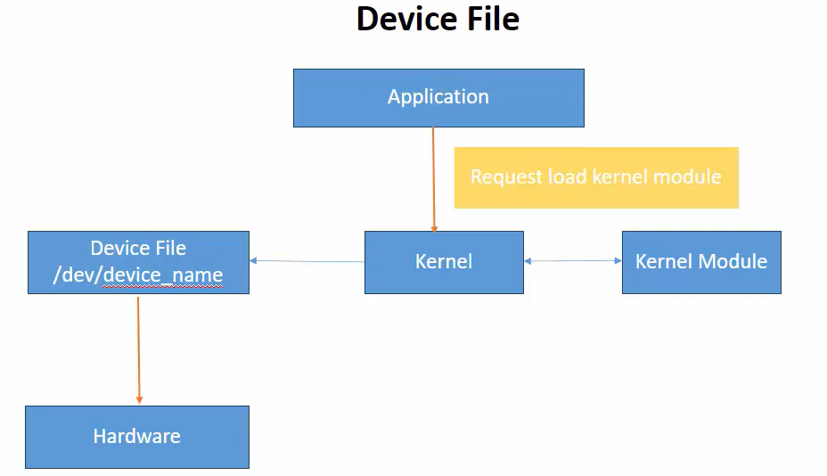
- Khi link kernel module vào kernel, linux sẽ tạo ra 1 device file
- Device file là file trong linux, đại diện cho 1 module
- Module đó đại diện cho 1 hardware tương ứng
- Hiểu đơn giản là hardware đó cần 1 trình điều khiển để user tương tác được thông qua software
- Flow: 
    + user tương tác với kernel module thông qua device file này
    + device file này gửi dữ liệu xuống kernel module 
    + kernel module tương tác với phần cứng
#### 2.6.1 Device driver là gì
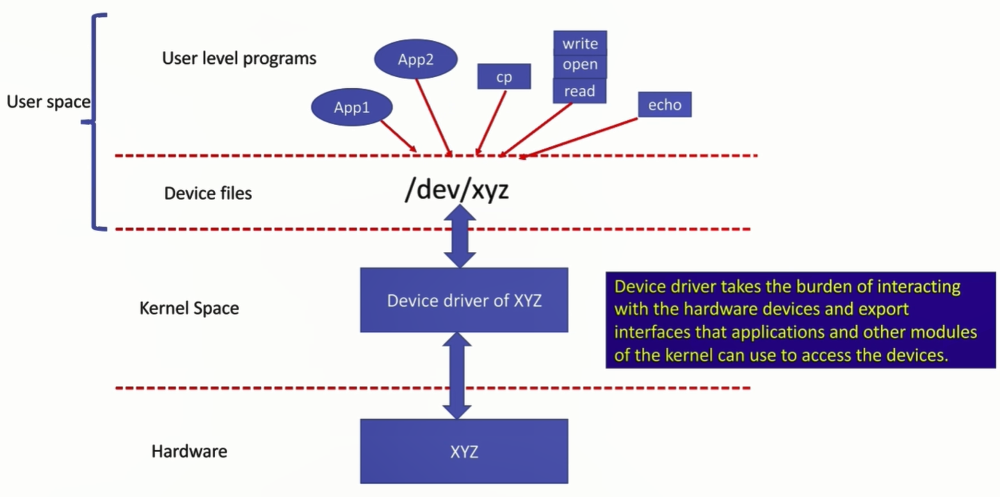
- là 1 phần của code dùng để cấu hình, điều khiển và quản lý device 
- nó cung cấp `device file` ở /dev/ cho user space để thực hiện request tới phần cứng
- Nếu không có device driver thì user space không thể biết cách điều khiển phần cứng
- Khi device driver được load, nó kết nối tới kernel và dùng các service của kernel để giao tiếp với user-space
- Hầu hết các Device Driver hiện đại đều được triển khai dưới dạng Kernel Module, nhưng không phải Kernel Module nào cũng là Device Driver.
- Có 3 loại device driver:
    - Character device drivers: điều khiển theo từng byte, control RTC, keyboard, sensor, gpio...
    - Block device drivers: điều khiển 1 lượng byte lớn (vài ngàn KB, ...) control emmc, eeprom, flash
    - Network device drivers: control wifi, ethernet
- Các check device driver là loại gì:
    - ls /dev
    - cột đầu tiên:
        - `c`: character device
        - `b`: block device
        - `d`: folder

#### 2.6.2 Char driver, char device and char device number
- Device number (major & minor)
    + code: `codeExamples/character_device_with_device_numer`
    + Để có thể kết nối giữa userspace và kernel space, kernel sử dụng device number
    + `a:b`: 
        - 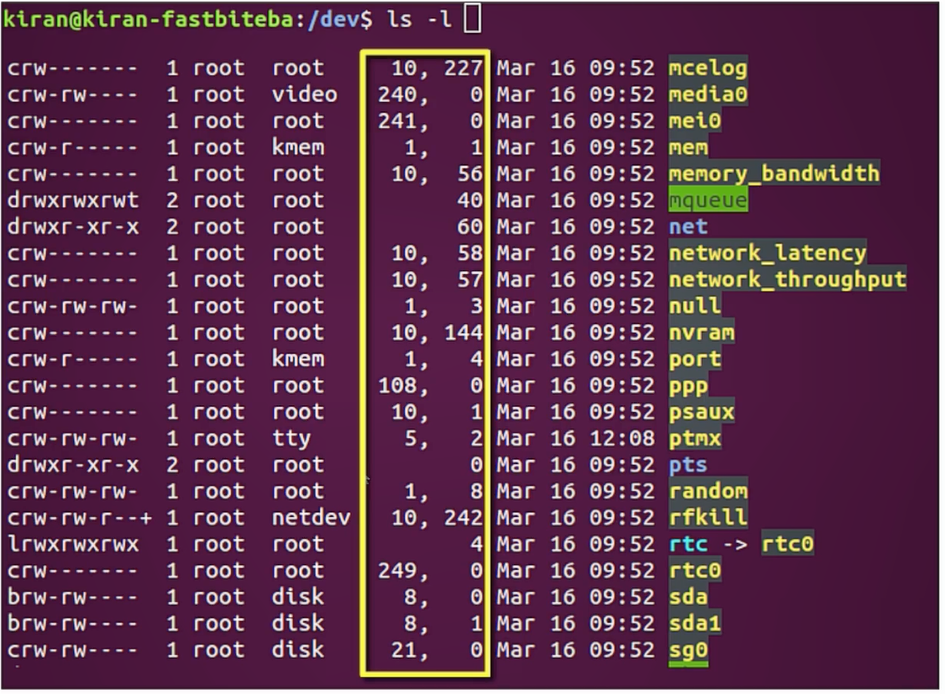
        - a: major number - đăng ký với driver nào
        - b: minor number - instance thứ b của driver
    + Khi user space gọi tới kernel space, system call sẽ xử lý VFS(virtual file system) trong kernel space. VFS sẽ lấy device number của user đó để so sánh nó trong danh sách driver đã đăng kí và lấy ra đúng driver đang đăng ký với driver number đó
    + device_number: 
        - type là dev_t (typedef of u32); nó là sự kết hợp của major và minor. 12 bit chứa số major và 20 bit chứa số minor
        - dùng MAJOR và MINOR macro trong /linux/kdev_t.h để lấy số major và minor
        - nếu đã có major và minor, dùng MKDEV(int major, int minor) và nó sẽ trả về device_number
    + Các API để tạo và đăng ký device number:
        - Khi khởi tạo:
            - /linux/fs.h/alloc_chrdev_region(): tạo device number
            - /linux/cdev.h/cdev_init(); cdev_add();: đăng ký device với VFS
            - /linux/device.h/class_create(); device_create();: tạo device file
        - Khi hủy:
            - /linux/fs.h/unregister_chrdev_region(): xóa device number
            - /linux/cdev.h/cdev_del(): xóa đăng ký device với VFS
            - /linux/device.h/class_destroy(); device_destroy();: xóa device file
        - Copy data từ user: 
            - /linux/uaccess.h: copy_to_user(), copy_from_user()
        - Ngoài ra, để đơn giản hóa, có thể dùng linux/miscdevice.h -> example: `codeExamples/device_file/device_file_kernel_module.c`
- **struct cdev:**
    - struct này đươch VFS âm thầm sử dụng mỗi khi user tương tác với device file
    - cdev_init dùng để đăng ký file_operation với cdev
    - cdev_add dùng để đăng ký major minor với cdev

#### 2.6.3 Device file
- Device file được tạo ra từ device driver
- Device file là cổng giao tiếp, không phải nơi lưu dữ liệu
- codeExamples/device_file
- Có 3 cách tạo device file
    - dùng command mknod
    - dùng thư viện udev
    - dùng Misc module: build 1 kernel module dạng misc module
- **struct inode:** đại diện cho 1 tệp vật lý trên hệ thống, giữ thông tin chung như tên tệp, số inode (định danh mà VFS dùng để nhận diện tệp)
- **struct file_operations:** chứa các con trỏ hàm đến các phương thức hoạt động của driver
    - open
    - close
    - read: `ssize_t read(struct file *filp, char __user *buff, size_t count, loff_t *f_pos)`
        + param của read có `char __user *buff`, __user đặt trước để cảnh báo rằng đây là con trỏ user, nó không được tin tưởng trong kernel space và không được lấy giá trị trực tiếp -> bắt buộc dùng copy_from_user, copy_to_user
        + cần check count phải nhỏ hơn DEV_MEM_SIZE (512 byte - giá trị mình tự define)
        + nếu f_pos + count > DEV_MEM_SIZE thì count = DEV_MEM_SIZE - f_pos
        + copy count từ device memory tới user buffer
        + update f_pos
        + return số byte đọc thành công hoặc error code
        + nếu f_pos đứng tại EOF (end of file) -> return 0
        + f_pos: 
            - dùng để track file memory access 
            - khi open 1 file, VFS set f_pos là 0
            - user muốn đọc 6 byte từ vị trí 0, thì f_pos sẽ gán thành 6, lần đọc tiếp theo, f_pos sẽ bắt đầu từ 6. User muốn ghi 2 byte thì sẽ băt đầu ghi từ vị trí 6 và kết thúc ở 7, sau đó f_pos là 8
            - muốn thay đổi f_pos thì dùng lseek
            - khi f_pos trỏ ra vùng nhớ sau byte thứ 512, thì return 0 để báo người dùng rằng không thể đọc tiếp
        + nếu dùng lệnh cat để đọc file, thì hàm read sẽ chạy mãi cho tới khi nó return 0
        + copy_to_user() và copy_from_user()
            + để trả data cho user space
            + nếu return 0: thành công
            + nếu return số: đó là số byte không thể copy
    - write: `ssize_t write(struct file *filp, const char __user *buff, size_t count, loff_t *f_pos)`
        + tương tự như read
        + cần return về số byte ghi thành công hoặc error code, không nên return 0
        + nếu f_pos đã ở cuối của mảng data thì không thể ghi vào được nữa
    - llseek: `loff_t lseek(struct file *filp, loff_t offset, int whence)`
        + thay đổi file position `f_pos`
        + cần implement:
            + whence = SEEK_SET có nghĩa là: `filp->f_pos = offset`
            + whence = SEEK_CUR có nghĩa là: `filp->f_pos += offset`
            + whence = SEEK_END có nghĩa là: `filp->f_pos = DEV_MEM_SIZE + offset` - cần check giới hạn bộ nhớ ở đây vì size max là DEV_MEM_SIZE
            + whence còn có nhiều enum khác nữa
- **error code**: 
    - error code sẽ được gửi từ kernel space tới user space và user space sẽ biết được lỗi gì đang xảy ra
    - xem `include/uapi/asm-generic/errno-base.h` để biết các error code
    - return -Mã_lỗi (dấu - để biểu thị cho linux biết đây là lỗi)
    - **error handling trong linux**:
        + goto thường hạn chế dùng trong C nhưng với linux thì goto được khuyên dùng cho error handling
        + 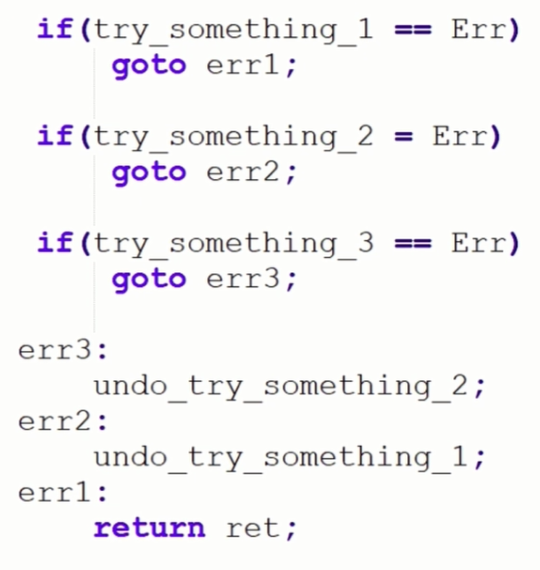
        + Khi xảy ra error, cần gỡ các tài nguyên trước đó đã khởi tạo thành công để tránh chiếm tài nguyên
        + nếu function return về con trỏ lỗi, dùng hàm IS_ERR(có phải lỗi không) kết hợp với PRT_ERR (convert pointer to error code) hoặc ERR_PTR(convert error code to pointer) trong linux/err.h để lấy giá trị lỗi từ con trỏ return của function bị lỗi đó
- **struct file:** đại diện cho 1 tệp đang mở bởi 1 tiến trình
- **Cơ chế hoạt động của system call open:**
    - Khi 1 device file được tạo, VFS sẽ khởi tạo inode của nó với 1 hàm dummy là chardev_open
    - Khi user gọi open, kernel tạo ra 1 file object
    - Hàm chardev_open sau đó tìm kiếm cdev thực tế tương ứng với device number, lấy các function thực sự của driver thay thế vào file object đó
    - Cuối dùng, hàm open thực tế của driver  sẽ được gọi
- **Tạo device file**: `codeExamples/character_device_with_device_numer/main.c`
    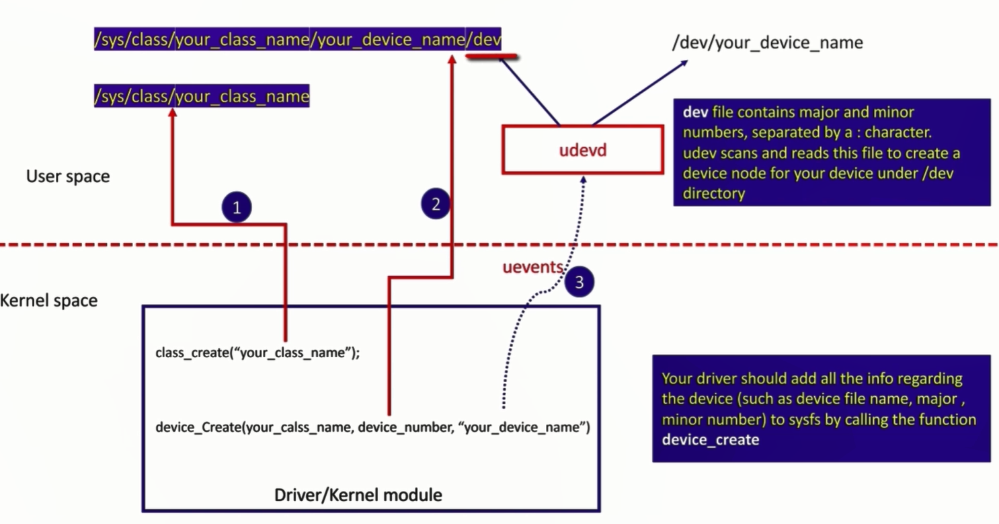
    - Trong linux, có thể tạo device file tự động khi có nhu cầu, nghĩa là không cần tạo thủ công device file trong /dev
    - udev lắng nghe sự kiện uevents được tạo ra từ việc hot plug hoặc từ kernel modules khi gọi device_create()
    - khi udev nhận thấy có uevent gửi tới, thông tin Major/Minor và tên thiết bị đã được đóng gói sẵn trong uevent đó (qua Netlink socket), udev đọc trực tiếp từ đó để tạo device file trong /dev mà không cần quét /sys/class
    - Lưu ý: việc quét /sys/class chỉ xảy ra 1 lần duy nhất khi hệ thống khởi động (qua lệnh `udevadm trigger`) để tái tạo device file cho các thiết bị đã tồn tại trước khi udevd chạy
    - /sys/class chứa bản đồ phân cấp thiết bị
    - class_create(): tạo 1 folder trong /sys/class/<class_name>
    - device_create(): tạo subfolder trong /sys/class/<class_name>, phát ra uevent để udev tạo device file
    - Sau khi load kernel module vào, class sẽ được tạo trong /sys/class và device nằm trong /sys/class/<class_name>. Trong folder device sẽ có dev (chứa major và minor), uevent chứa major, minor và devname

#### 2.6.4. Character device với nhiều device nodes
- Có nghĩa là chỉ có 1 driver hoặc kernel module điều khiển nhiều devices -> giúp tiết kiệm bộ nhớ, dễ dàng quản lý, hỗ trợ các thiết bị giống nhau
- driver sẽ quyết định device nào sẽ được truy cập từ user space để xử lý yêu cầu
- Ví dụ: 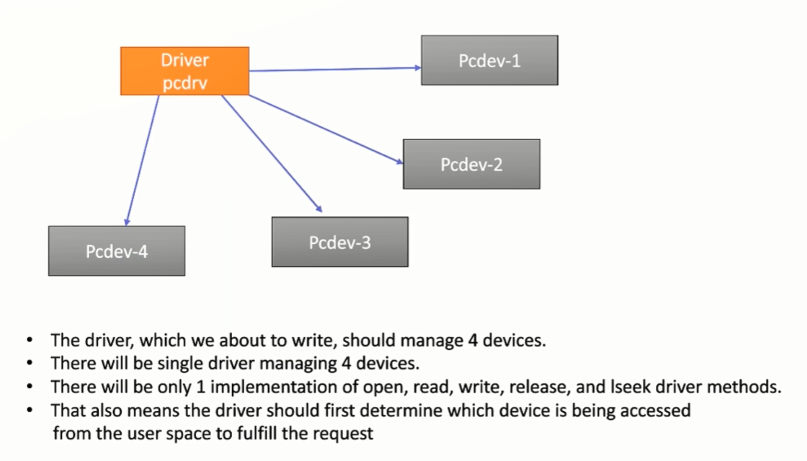 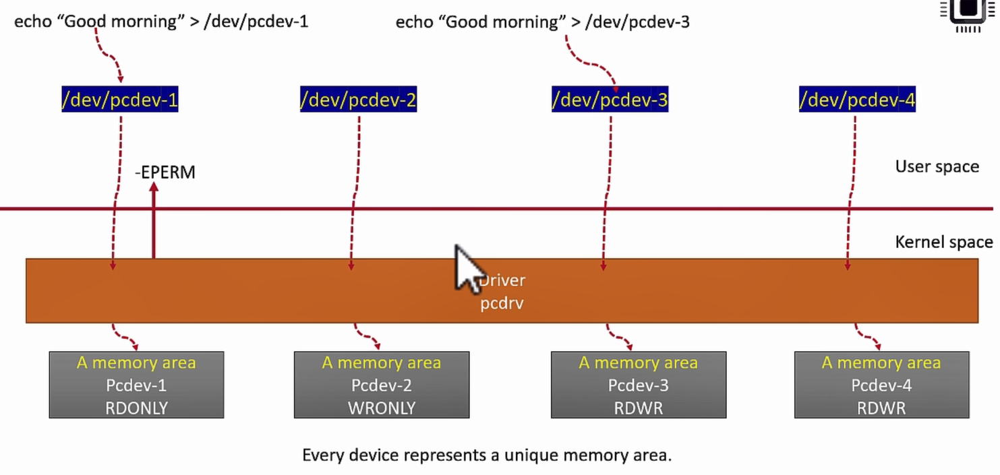
- tất cả device đều có private data của nó:
    + Serial number
    + Start address
    + Size
    + Permission: RDONLY, WRONLY, RDWR
- để thay đổi device cần điều khiển, thì thay đổi minor
- chỉ cần 1 class, trong class đó sẽ chứa nhiều device
- TODO: đang xem tới 05/005 

### 2.7. Cross Compile
- codeExamples/cross_compile
- Để các file execute chạy được trên BBB thì file đó phải được build với tập lệnh của arm
- Tiết kiệm hiệu năng cho target machine vì code đã được build ở máy khác
- `Khi cross compile kernel, phiên bản header của bbb và pc phải giống nhau`
- `Khi cross compile app, phiên bản header để build nhỏ hơn hoặc bằng header kernel của bbb`

### 2.8. Update kernel cho board
- Vì sao Kernel cần nâng cấp? Chạy mượt hơn, bảo mật hơn, ít lỗi driver hơn, và sẵn sàng cho các công nghệ kết nối mới hơn.
- Step update kernel:
    - `BBB_docs/docs/016 Updating-the-latest-kernel-image-Steps.pdf`
    - script: `https://github.com/niekiran/linux-device-driver-1/blob/master/scripts/kernel_compilation_steps.txt`
- /lib/modules: là nơi chứa các kernel module được biên dịch dạng .ko


# VII. BeagleBone Black
## 1. Configue pin mux
- Để biết pin có mux gì thì cần biết thanh ghi nào
- Xem `spruh73q.pdf - 9. Control module` ghi địa chỉ các thanh ghi để cấu hình pin mux
- Lệnh check nhanh pin mux trên board
    - `sudo cat /sys/kernel/debug/pinctrl/44e10800.pinmux-pinctrl-single/pins`
    - pin 0 (PIN0) 0:gpio-0-31 44e10800(offset) 00000031(mode) pinctrl-single
- Code sáng led khi load kernel: `codeExamples/led_init`
## 2. Build code với kernel header 
- Khi build cross compile kernel, cần trỏ tới đường dẫn KERNEL với số phiên bản đúng như ở BBB
    - Sửa các dòng sau trong KERNEL/Makefile về phiên bản như ở BBB:
        - VERSION = 6
        - PATCHLEVEL = 18
        - SUBLEVEL = 23
        - EXTRAVERSION = -bone28
        - chạy `make ARCH=arm CROSS_COMPILE=/usr/bin/arm-linux-gnueabihf- LOCALVERSION= modules_prepare`
    - Nếu bị lỗi hiện dấu '+' ở sau phiên bản kernel, chạy lệnh:
        - `make ARCH=arm CROSS_COMPILE=/usr/bin/arm-linux-gnueabihf- LOCALVERSION= modules_prepare`

## 3. Code với kernel
- con trỏ ở tầng use và kernel không tương thích với nhau nên khi trao đổi dữ liệu, cần dùng `copy_from_user` để lấy data từ user
- Khi write trong kernel, cần read từ pin ra trước rồi mới ghi để keep những giá trị bit khác và chỉ thay đổi bit mình muốn

# VIII. Device tree
## 1. Device tree là gì
- Sửu dụng để mô hình hóa lại các cấu hình phần cứng
- Ví dụ stm32 có 2 ngoại vi timer, 4 ngoại vi uart, ... Mỗi ngoại vi có cấu hình đi kèm: baud rate, config,... Bình thường, mình sẽ define cấu hình của các ngoại vi ở 1 file riêng dạng struct, array, ... và nạp xuống vdk.
    - Nhược điểm: 
        - Muốn đổi cấu hình baudrate chẳng hạn -> cần đổi cấu hình và build lại source -> tốn thời gian update từ board này qua board khác
        - Phức tạp, có thể cấu hình sai vì không có 1 chuẩn chung
- Từ khó khăn trên, người ra định nghĩa ra device tree
- Device tree là cây chứa cấu hình phần cứng, nó nằm trong bộ nhớ thiết bị dưới dạng file nhị phân (binary).
    - File nhị phân này nằm ở 1 vùng bộ nhớ
    - Khi update chỉ cần update file nhị phân này
    - Tránh build lại toàn project
    - Dễ phát triển driver mà không cần phụ thuộc phần cứng nhiều

## 2. Platform bus, platform devices và platform drivers
### 2.1 Platform bus và platform device
- bus là đường dây truyền thông tin giữa các device
- platform bus là thuật ngữ dùng trong mô hình thiết bị linux. Nó đại diện cho các bus không thể discoverable của embedded platform như i2c, gpio, ADC, UART, ...
- Nó là 1 pseudo bus hoặc 1 bus linux ảo
- Hệ thống không tự nhận diện được các thiết bị này cho tới khi ta khai báo
- Về phía linux, tất cả các device không thể discoverable đều giao tiếp qua platform bus và các thiết bị kết nối tới patform bus gọi là platform device (I2C, UART, ... là các platform device)
- Cách mà hệ điều hành phát hiện ra phần cứng:
    + Mỗi phần cứng (chuột, bàn phím, ...) đều có các thông số và tài nguyên riêng. Để hệ điều hành có thể điều khiển được chúng, OS bắt buộc phải biết những thông tin này
    + Ở PC (win hoặc ubuntu), khi cắm usb hoặc VGA vào thì OS tự nhận diện ngay
    + Ở hệ thống nhúng, các ngoại vi được kết nối với CPU qua các bus i2c, spi, ... Nhưng các bus này không có khả năng tự động nhận diện 
    + Ta cần cung cấp thông tin thủ công thông tin các platform device này cho linux kernel qua 2 cách:
        - Lúc complile time: viết hard code thông tin phần cứng vào code
        - Load bằng kernel module
        - Lúc boot time: dùng device tree
### 2.2 Platform drivers
- Là 1 driver được khởi chạy trong thời gian khởi động của OS dùng để điều khiển platform devices
- Platform driver có thể là 1 character driver, hoặc 1 block driver và về cơ bản nó là 1 driver xử lý thiết bị thực
- Người ta gọi thiết bị cố định và không tự khai báo là platform device
- Nó phân tích device tree, biết được cấu hình hardware -> thực hiện action để khởi tạo hệ thống
- Ví dụ: khi booting, mình cần ethernet, platform driver sẽ kiểm tra device tree để tìm cấu hình thích hợp cho ethernet -> nó sẽ khởi tạo ngoại vi tương ứng
- Platform device cần được khai báo những thông tin sau để kernel load đúng driver điều khiển nó:
    + Memory hoặc I/O mapped base address và range
    + IRQ number
    + Device identification information (thông tin định danh thiết bị)
    + DMA channel information
    + Device address
    + Pin configuration
    + Power, voltage param
    + Other device specific data
- Khi viết platform driver, nó có 1 số API đặc trưng:
    - `struct resource *platform_get_resource(struct platform_device *pdev, unsigned int type unsigned int n);` - đọc device tree và lấy ra 1 node trong device tree, biết được thông tin
    - `struct resource *platform_get_resource_byname(struct platform_device *pdev, unsigned int type, const char *name);` - lấy resource theo tên
    - `int platform_get_irq(struct platform_device *pdev, unsigned int n);` - get thông tin của interrupt của 1 node trong device tree
- Các cách thêm platform device vào kernel:
    + Lúc compile: -> **phương pháp này không được khuyến khích**
        - hard code, đây là phương pháp static, thông tin phần cứng sẽ là 1 phần của kernel file (board file, driver) 
        - Khi update device, cần rebuild lại toàn bộ kernel hoặc board file
    + Load bằng kernel module -> **phương pháp này không được khuyến khích**
    + Lúc boot kernel: dùng device tree -> **dùng cái này**
        - Dữ liệu về phần cứng nằm ngoài kernel source 
        - Device tree là phương pháp encode thông tin phần cứng
### 2.3 Đăng ký platform device và platform driver
- Dùng macro `platform_driver_register(drv)` trong linux/platform_device.h
- struct platform_driver 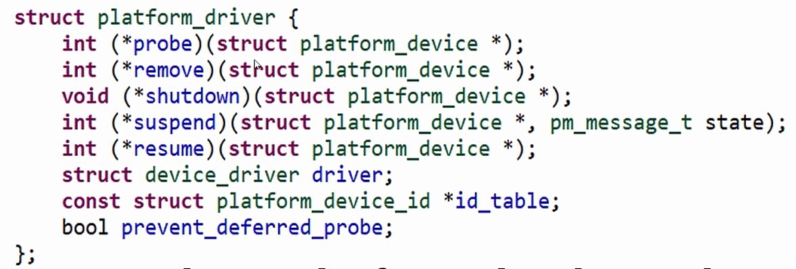
- struct platform_device 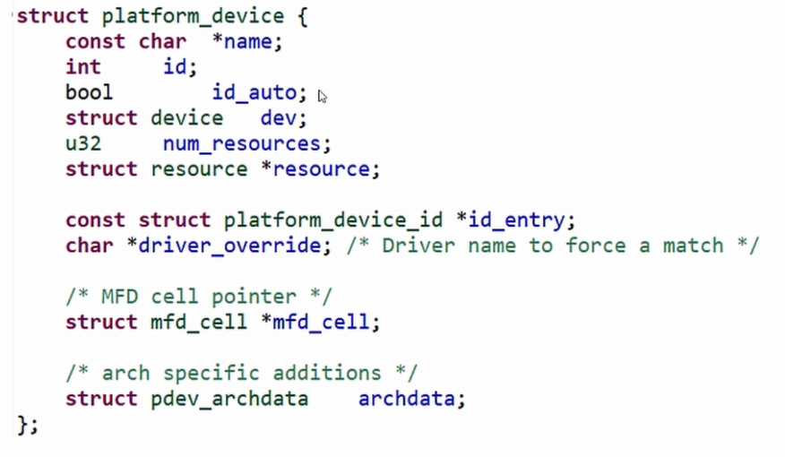
- Cách mà platform device và platform driver matching với nhau:
    + Nhờ cơ chế matching của platform bus mà linux kernel thực hiện
    + 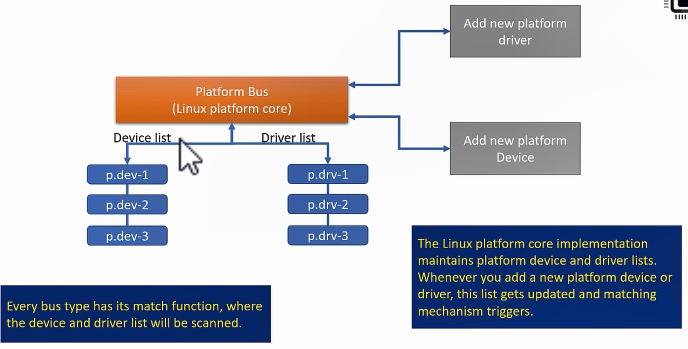
    + tên của platform device sẽ được hàm matching của platform bus kiểm tra xem trùng với platform driver nào khi 1 platform device hoặc 1 platform driver mới được add
    + nếu match thì hàm probe của platform driver được gọi
    + hàm probe có nhiệm vụ:
        - Khởi tạo device
        - Allocate bộ nhớ
        - Mapping i/o memory
        - đăng ký ngắt
        - đăng ký device tới kernel
        - ...
        - return 0 nếu thành công hoặc error code
    + Cần implement hàm remove: 
        - huỷ tài nguyên của device khỏi kernel
        - giải phóng bộ nhớ
- platform device sau khi được tạo nằm ở `/sys/devices/platform`

### 2.4 API cấp nhát bộ nhớ trong kernel
- include thư viện `linux/slab.h`
- `void* kmalloc(size_t size, gfp_t flags)`
    + được sử dụng để cấp phát bộ nhớ trong kernel space 
    + 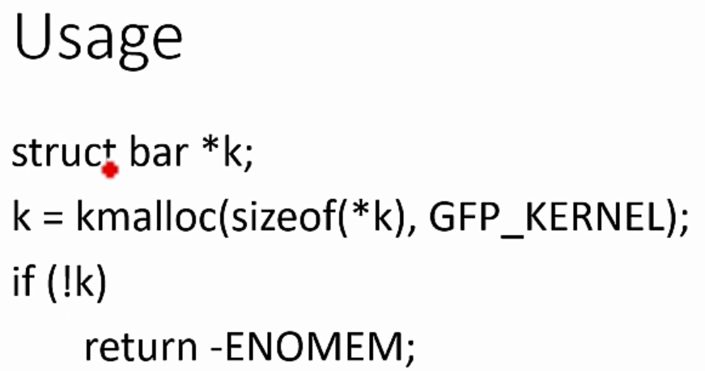
    + bộ nhớ được cấp bởi hàm này nằm liên tục trên bộ nhớ vật lý
    + `size`: max size mà có thể được cấp bởi kmalloc là có giới hạn. Giới hạn này phụ thuộc vào phần cứng và cấu hình kernel. Tối nhất là đặt size nhỏ hơn page size (4KB)
    + `flags`: thay đổi hành vi của bộ cấp phát bộ nhớ, GFP: get free pages
        - %GFP_KERNEL: cấp bộ nhớ từ RAM kernel, nếu không thể cấp, có thể kernel đưa process đó vào trạng thái blocked. Khi bộ nhớ trở nên khả dụng, process sẽ được unblocked
        - %GFP_NOWAIT
        - %GFP_ATOMIC: yêu cầu bộ nhớ cho interupt
        - %GFP_HIGHUSER
    + return NULL nếu cấp phát lỗi hoặc hành công thì sẽ trả về địa chỉ ảo của ô nhớ đầu tiên được cấp
    + Ngoài `kmalloc` còn có:
        - `kmalloc_array()`
        - `kcalloc`
        - `kzalloc`
            + `void *kzalloc(size_t size, gfp_t flags)`
            + tương tự như kmalloc nhưng kzalloc set memory về zero
            + việc set memory về zero để tránh con trỏ được cấp từ kmalloc nhận giá trị rác, giá trị rác này có thể trỏ vào vùng nhớ không được phép truy cập hoặc vùng chỉ đọc, làm cho các hàm ghi giữ liệu crash
        - `krealloc`
            + `void *krealloc(const void *p, size_t new_size, gfp_t flags)`
            + reallocate vùng nhớ đã được allocate từ kmalloc hoặc kzalloc 
            + `*p`: là con trỏ được tạo từ kmalloc hoặc kzalloc 
            + `new_size`: kích thước mới cần allocate
            + dữ liệu trong vùng nhớ của kmalloc hoặc kzalloc vẫn được giữ nguyên
            
- `void kfree(const void *objp)`
    + giải phóng bộ nhớ động được cấp trước đó
    + `objp`: là con trỏ được trả về từ `kmalloc`
    + chỉ giải phóng con trỏ được cấp bằng `kmalloc`
- `void kzfree(const void *objp)`
    + tương tự kfree nhưng trả 0 về cho bộ nhớ

### 2.5 Example
- Code theo cách không dùng device tree: `codeExamples/pcd_platform_driver`

## 3. Layout của device tree
- Bản chất nó là cấu trúc dữ liệu được build và nạp xuống bộ nhớ
- Tại thời điểm khởi động os, khối data này được os phân tích: các hệ thống liên quan sẽ được khởi tạo
- Ví dụ: 
    - thời điểm khởi động, cần khởi tạo cache, cpu, ngoại vi thì cần định nghĩa trong device tree
    - Khi port từ board A qua B, thì thay đổi config trong device tree
- File device tree có ký hiệu: 
    - .dts: file device tree gốc
    - .dtsi: file device tree có thể include vào file khác
    - .dtb: file binary output sau khi buld dts
    - .dtbo
- Cấu trúc của file device tree: `https://github.com/beagleboard/devicetree-source/blob/master/arch/arm/boot/dts/am33xx.dtsi`
    - `/ {` - Start bằng ký hiệu 
    -  `compatible = "ti,am33xx";` - mapping giữa device tree với driver điều khiển, nếu string này match với string được khai báo ở driver thì hàm proc sẽ được gọi để khởi tạo hệ thống
    - `ti,...`: define custom của riêng Ti, không có trong cú pháp device tree
    - `interrupt-parent = <&intc>;` - chỉ định hệ thống dùng interrupt controller nào
    - `#address-cells = <1>` - 1(chip 32bit) hoặc 2(chip 64bit), đặc trưng cho viết địa chỉ của register, ngoại vi
    - `#size-cells = <1>` - 1(32bit) dải địa chỉ của chip là 1 số 32bit hoặc 2(64bit) giải địa chỉ là 2 số 32bit
    - `chosen { };` 
        - để rỗng như này tức là trường này được define ở nơi khác, các trường thông tin có thể được ghi đè lẫn nhau
        - `base_dtb = "am335x-boneblack.dts`: device tree này build ra file device tree binary .dtb nào
        - `base_dtb_timestamp = __TIMESTAMP`: chỉ thị của compiler, record lại thời gian build để biết thông tin ngày giờ build, phiên bản build
    - `aliases {i2c0 = &i2c0, v.v`: là dạng define ngoại vi i2c, uart, spi, ...
    - `cpus {`: khai báo thông tin cpu (bao nhiêu nhân, compatible, ...)
    - `ocp:` - on chip peripherals - trường thuộc tính cho ngoại vi
        - node `edma`:
            - `edma@49000000`: sau tên là @ và đia chỉ base address
            - `reg =`: địa chỉ baseaddress và size
            - `reg-names`: tên của thanh ghi
            - `interrupts = <12 13 14>`: các line interrupt 0x12 0x13 0x14 mà edma có thể dùng
            - `interrupt-names`: tên interrupt tương ứng với line
            - `dma-requets = <64>`: số lượng requets dma mà driver có thể hỗ trợ 
            - `#dma-cells = <2>`: support cho cấu hình dma, 2 cell thì có 1 cell cho dma controller và 1 cell cho dma channel. 
    - `status = "okay"`: ngoại vi này có nên enable hay không

## 4. Ví dụ mẫu cho code device tree
- `codeExamples/device_tree`
### 4.1. Thêm cấu hình trong file dts
- file dts có thể compile từ file dtb lấy từ BBB
    - `dtc -I dtb -O dts -o am335x-boneblack.dts am335x-boneblack.dtb`
- check `user-data` trong `codeExamples/device_tree/am335x-boneblack.dts`
### 4.2. Viết driver để parse cấu hình node device tree vừa thêm
- `codeExamples/device_tree/device_tree_BBB_kernel_module.c`
- Hàm `probe`: gọi ra khi device tree và driver matching với nhau, thực hiện các đoạn code để tải 
- Hàm `remove`: gọi khi driver được unload khỏi kernel, deinit các tài nguyên trong hàm `probe`
- `module_platform_driver(device_tree_driver)`: khởi tạo struct của driver

### 4.3. Build lại devicetree
- Chạy script `make build_dtb` để build lại .dtb
- Load lại file .dtb vào BBB:/boot/dtbs/$(uname -r)/
- Khởi động lại BBB
- Load kerner device_tree_BBB_kernel_module.ko vào parse device tree
- Kiểm tra /proc/device-tree xem đã có node mới thêm chưa
> Phần này chưa hoàn thiện, device tree đưa vào nhưng hàm probe không start

# IX. PWM driver
## 1. Ứng dụng của PWM
- Điều khiển động cơ
- Điều khiển điện áp
## 2. TỔng quan 
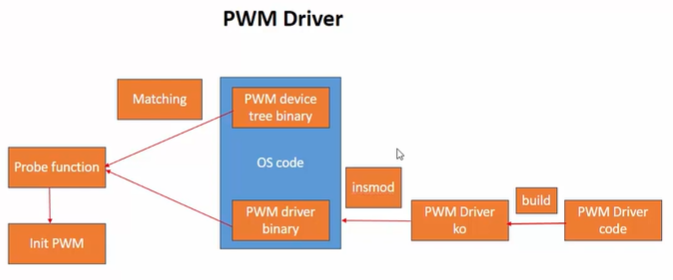
- Để viết và điều khiển được PWM ngoại vi cần:
    - Device tree cho PWM: define thông số hoạt động của PWM bằng device-tree
    - Viết PWM driver: viết và build file .ko rồi load .ko vào linux
    - Sau khi load pwm driver ko vào, os tiến hành quết danh sách device trong device-tree và tìm ra device và drive match nhau qua trường compatible -> hàm probe được gọi dể khởi tạo PWM

## 3. Pin controller - cấy hình pin cho PWM
- Thông thường làm việc với embedded linux, người ta không cấu hình pinmux trong code c. Mà người ta dùng pin controller để cấu hình pinmux
- Pin controler được define trong Pin controler device tree (file dts)
- Pin controller driver được load trong thời điểm booting
- Sau khi pin controler driver được load, nó scan toàn bộ device tree và cấu hình pin mux cho các device có pin hợp lệ
- Để biết pin nào hợp lệ, pin controler có tài liệu pin controler binding `https://www.kernel.org/doc/Documentation/devicetree/bindings/pinctrl/pinctrl-bindings.txt`. Tài liệu này quy định cần có 2 trường:
    - pinctrl-0: list cấu hình pin mà người dùng muốn pin controler cấu hình
    - pinctrl-names: 
- Sau khi câu hình xong thì build lại device tree và load vào bbb rồi reboot

-- Bài 43: 5:20 youtube