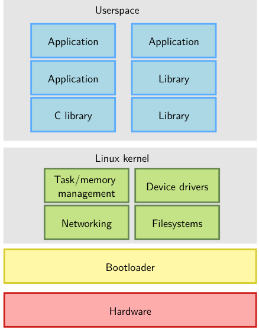
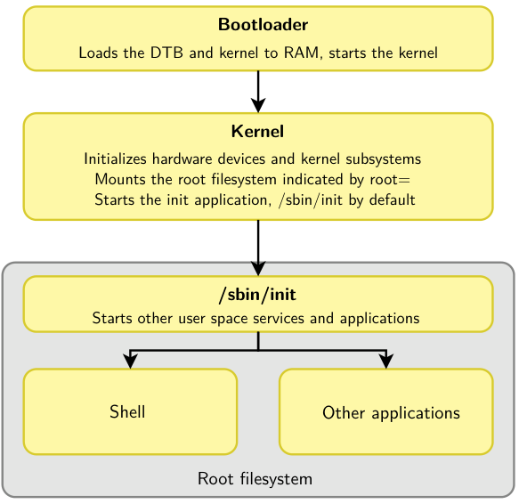
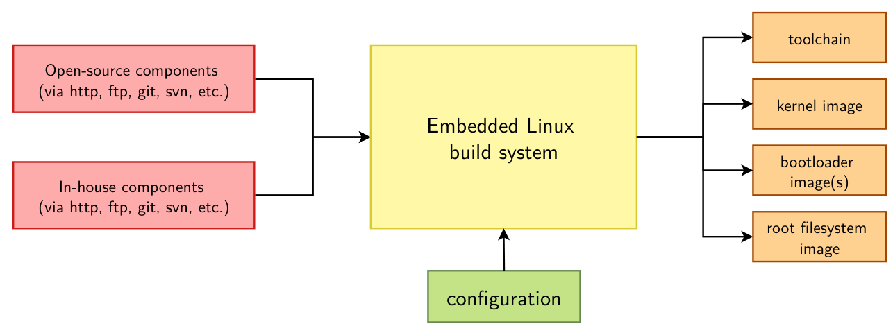
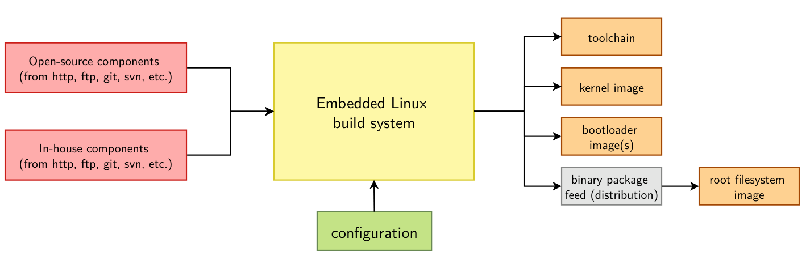
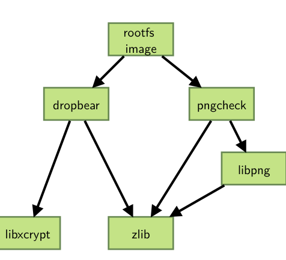
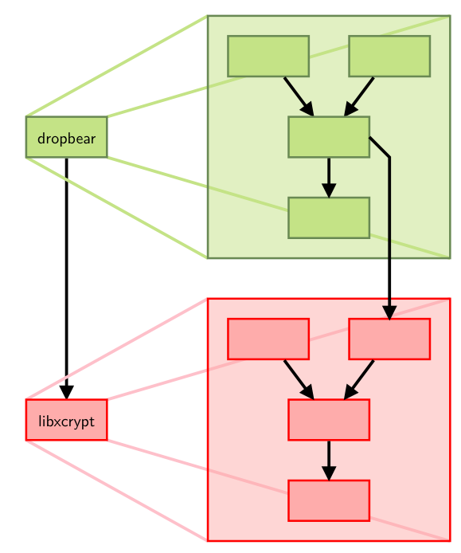
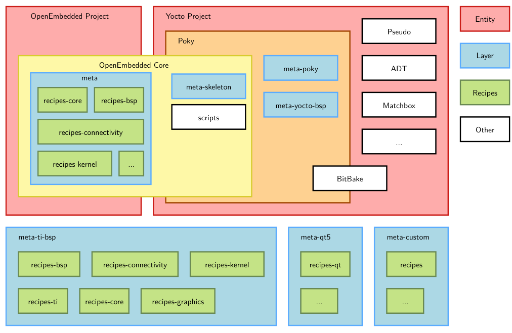
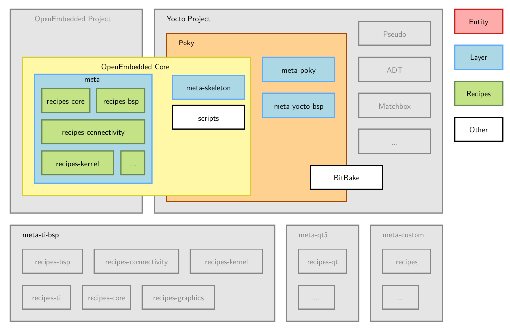

# Menu

# Introduction to Embedded Linux
## Simplified Linux system architecture 
- Kiến trúc chung của hệ thống Linux
- 
## Overall Linux boot sequence
- 
## Embedded Linux work - công việc về embedded linux
- BSP work: port bootloader và Linux kernel cho nhiều kiến trúc, phát triển Linux device driver
- system integration work: tích hợp tất cả thành phần thuộc user space cần cho hệ thống, cấu hình chúng, ...
- application development: viết các ứng dụng và thư hiện cụ thể
## Embedded Linux build system: principle
- nguyên lý của hệ thống build Linux embedded:
    + 
    + biên dịch từ source code nên rất linh hoạt
    + tận dụng được sức mạnh CPU từ việc cross compile
    + sử dụng các recipe để việc build dễ dàng hơn
## Embedded Linux build system: tools
- có nhiều giải pháp để build hệ thống linux: Yocto/OpenEmbedded, buildroot, ...

# Yocto Project and Poky reference system overview
## The Yocto project overview
### Yocto: principle
- 
- Yocto luôn build ra các gói binary
- Cuối cùng yocto sẽ build ra rootfs
### Lexicon: bitbake - thuật ngũ: bitbake
- trong Yocto/OpenEmbedded, bitbake đóng vai trò là build engine
- bitbake tương tự như make, nó phân tích các text file để biết build như nào
### Lexicon: recipes
- Loại file chính mà bitbake phân tích là `recipes`, mỗi `recipes` mô tả 1 component software cụ thể
- Mỗi `recipes` mô tả cách fetch và build 1 software component như: 1 program, 1 library, 1 image
- `recipes` có cú pháp cụ thể
- `bitbake` có thể build bất cứ recipe nào, nó sẽ tự build các thành phần phụ thuộc
- 
### Lexicon: tasks
- quá trình build được thực hiện bởi 1 `recipe` được chia thành nhiều `tasks`
- mỗi task thực hiện 1 bước build cụ thể: fetch, configure, compile, package
- các task có thể phụ thuộc lẫn nhau
- 
### Lexicon: metadata and layers
- input của `bitbake` được gọi là `metadata`
- `metadata` bao gồm các file config, recipes, classes và include files
- `metadata` được bố trí trong `layers`, các layers này có thể kết hợp với nhau để tạo ra các thành phần khác nhau
    + 1 `layer` là tập hợp của các `recipes`, `config files` và `classes` phục vụ cho 1 mục đích chung
        - ví dụ cho board của TI, cần layer `meta-ti-bsp` 
    + nhiều `layer` có thể được sử dụng, tùy thuộc vào mục đích và sự cần thiết
### `openembedded-core` là core layer của Yocto project
    + là khung xương của Yocto
    + tất cả các layer khác được build dựa trên layer `openembedded-core`
    + nó hỗ trợ nhiều kiến trúc như ARM, MIPS, ...
    + nó cũng hỗ trợ QEMU để mô phỏng những kiến trúc trên
### Lexicon: Poky
- Poky có nhiều nghĩa:
    + Là git repo được tập hợp từ: bitbake, openembedded-core, yocto-docs và meta-yocto
    + Hoặc có thể là 1 bản phân phối được cung cấp bởi Yocto project
- `meta-poky` là layer được cung cấp bởi các bản phân phối poky
### The Yocto Project lexicon
- 
- Yocto có thể được thêm bớt các layers tùy thuộc target
### Example of a Yocto Project based BSP
- để build 1 image cho BBB, ta cần
    + Poky reference system, gồm toàn bộ các recipes và tools
    + layer `meta-ti-bsp`: tập hợp các recipes của TI
- nếu muốn sửa layer, cần tạo 1 custom layer để sửa, không được tự ý sửa trong các layer của bên thứ 3 hoặc vendor
## The Poky reference system overview
### Getting the Poky reference system
- `https://git.yoctoproject.org/`
- `git clone -b scarthgap https://git.yoctoproject.org/git/poky`
- cứ 6 tháng thì có 1 bản mới được release và được bảo trì trong 7 tháng
- Bản LTS được bảo trì 4 năm
- Mỗi bản release có 1 code name, ví dụ: `kirkstone` hoặc `scarthgap`
- các bản release ở `https://wiki.yoctoproject.org/wiki/Releases`
### Poky
- cấu trúc của Poky trong Yocto project
- 
### Poky source tree
- bitbake: chứa các script mà lệnh bitbake cần
- meta: chứa metadata của Openembedded-core
- meta-skeleton: chứa các recipe template cho BSP và kernel development
- meta-poky: chứa các cấu hình cho bản phân phối Poky
- meta-yocto-bsp: là layer phần cứng mẫu đi kèm, chứa các cấu hình để giúp linux chạy được trên device nhúng mà Yocto hỗ trợ
- oe-init-build-env: script để set up môi trường build, nó sẽ tạo folder build
- scripts: chứa script dùng để cấu hình môi trường, development tools và các tool để flash image vào target
### Documentation
- `https://docs.yoctoproject.org/singleindex.html`
- các thuật ngũ: `https://docs.yoctoproject.org/genindex.html`

# Using Yocto Project - basics
## Environment setup
### Environment setup
- Tất cả các file gốc của Poky không được phép sửa đổi khi muốn build 1 custom image, ta cần tạo layer riêng để sửa
- Các file cấu hình cụ thể và các folder trong lúc build được gom vào folder `build`
- `oe-init-build-env`: thiết lập thư mục build và các biến môi trường
### oe-init-build-env
- script này làm thay đổi môi trường làm việc của terminal hiện tại nên cần dùng thêm lệnh `source`
- script này thêm các biến môi trường để bitbake sử dụng
- giúp ta có thể dùng các lệnh của Poky
- `source oe-init-build-env <build-folder-name>`
### The initial build/ directory
- `oe-init-build-env` tạo 1 folder build và 1 sub-folder `conf` (chứa cấu hình cho layer và các cấu hình cho image)
### Exported environment variables
- Yocto project xuất ra các biến môi trường, trong đó:
    + BUILDDIR: đường dẫn tuyệt đối của thư mục build
    + PATH: chứa đường dẫn tới các executable programs, đường dẫn tới `scripts/` và `bitbake/bin/` sẽ được chèn vào
### Available commands
- `bitbake`