# Menu

- [Introduction to Embedded Linux](#introduction-to-embedded-linux)
  - [Simplified Linux system architecture](#simplified-linux-system-architecture)
  - [Overall Linux boot sequence](#overall-linux-boot-sequence)
  - [Embedded Linux work - công việc về embedded linux](#embedded-linux-work---công-việc-về-embedded-linux)
  - [Embedded Linux build system: principle](#embedded-linux-build-system-principle)
  - [Embedded Linux build system: tools](#embedded-linux-build-system-tools)
- [Yocto Project and Poky reference system overview](#yocto-project-and-poky-reference-system-overview)
  - [The Yocto project overview](#the-yocto-project-overview)
    - [Yocto: principle](#yocto-principle)
    - [Lexicon: bitbake - thuật ngũ: bitbake](#lexicon-bitbake---thuật-ngũ-bitbake)
    - [Lexicon: recipes](#lexicon-recipes)
    - [Lexicon: tasks](#lexicon-tasks)
    - [Lexicon: metadata and layers](#lexicon-metadata-and-layers)
    - [`openembedded-core` là core layer của Yocto project](#openembedded-core-là-core-layer-của-yocto-project)
    - [Lexicon: Poky](#lexicon-poky)
    - [The Yocto Project lexicon](#the-yocto-project-lexicon)
    - [Example of a Yocto Project based BSP](#example-of-a-yocto-project-based-bsp)
  - [The Poky reference system overview](#the-poky-reference-system-overview)
    - [Getting the Poky reference system](#getting-the-poky-reference-system)
    - [Poky](#poky)
    - [Poky source tree](#poky-source-tree)
    - [Documentation](#documentation)
- [Using Yocto Project - basics](#using-yocto-project---basics)
  - [Environment setup](#environment-setup)
    - [Environment setup](#environment-setup-1)
    - [oe-init-build-env](#oe-init-build-env)
    - [The initial build/ directory](#the-initial-build-directory)
    - [Exported environment variables](#exported-environment-variables)
    - [Available commands](#available-commands)
  - [Configuring the build system](#configuring-the-build-system)
    - [The build/conf/ directory](#the-buildconf-directory)
    - [Configuring the build](#configuring-the-build)
  - [Building an image](#building-an-image)
    - [Compilation](#compilation)
    - [The build/ directory after the build](#the-build-directory-after-the-build)
  - [Thực hành](#thực-hành)
- [Using Yocto Project - advanced usage](#using-yocto-project---advanced-usage)
  - [Advanced build usage and configuration](#advanced-build-usage-and-configuration)
  - [A little reminder](#a-little-reminder)
  - [Variables](#variables)
    - [Overview](#overview)
    - [Operators:](#operators)
    - [bitbake-getvar](#bitbake-getvar)
    - [overrides](#overrides)
    - [Order of variable assignment](#order-of-variable-assignment)
    - [Overrides for conditional asignment](#overrides-for-conditional-asignment)
  - [Virtual provides](#virtual-provides)
    - [Variant examples](#variant-examples)
    - [Provider selection](#provider-selection)
    - [Version selection](#version-selection)
  - [Selection of packages to install](#selection-of-packages-to-install)
  - [The power of BitBake](#the-power-of-bitbake)
    - [Common BitBake options](#common-bitbake-options)
    - [shared state cache](#shared-state-cache)
  - [Thực hành](#thực-hành-1)
- [Writing recipes - basics](#writing-recipes---basics)
  - [Recipes: overview](#recipes-overview)
  - [Organization of a recipe](#organization-of-a-recipe)
  - [Applying patches](#applying-patches)
  - [Example of a recipe](#example-of-a-recipe)
  - [Ví dụ về 1 recipe có phần không phụ thuộc phiên bản](#ví-dụ-về-1-recipe-có-phần-không-phụ-thuộc-phiên-bản)
  - [Debugging recipes](#debugging-recipes)
  - [Thực hành](#thực-hành-2)
- [Writing recipes - advanced](#writing-recipes---advanced)
  - [Extending a recipe](#extending-a-recipe)
  - [Virtual providers (tiếp tục)](#virtual-providers-tiếp-tục)
  - [Classes](#classes)
  - [Bitbake file inclusions - gộp các file trong bitbake](#bitbake-file-inclusions---gộp-các-file-trong-bitbake)
  - [More recipe debugging tools](#more-recipe-debugging-tools)
  - [Network usage](#network-usage)
- [Layers](#layers)
  - [Giới thiệu về layers](#giới-thiệu-về-layers)
  - [Lời khuyên về layer](#lời-khuyên-về-layer)
  - [Tạo 1 layer](#tạo-1-layer)
  - [Thực hành](#thực-hành-3)
- [BSP Layers](#bsp-layers)
  - [Giới thiệu về BSP layers trong Yocto](#giới-thiệu-về-bsp-layers-trong-yocto)
  - [Các file cấu hình phần cứng - machine files](#các-file-cấu-hình-phần-cứng---machine-files)
  - [Bootloader](#bootloader)
  - [Kernel](#kernel)
  - [Thực hành](#thực-hành-4)
- [Distro layers](#distro-layers)
  - [Các khái niệm](#các-khái-niệm)
  - [Cách dùng trong thực tế](#cách-dùng-trong-thực-tế)
  - [Tạo 1 file cấu hình Distro](#tạo-1-file-cấu-hình-distro)
  - [Biến DISTRO_FEATURES](#biến-distro_features)
  - [Lựa chọn toolchain](#lựa-chọn-toolchain)
  - [Sample files](#sample-files)
- [Images](#images)

# Introduction to Embedded Linux
## Simplified Linux system architecture 
- Kiến trúc chung của hệ thống Linux
- 
## Overall Linux boot sequence
- 
## Embedded Linux work - công việc về embedded linux
- BSP work: port bootloader và Linux kernel cho nhiều kiến trúc, phát triển Linux device driver
- system integration work: tích hợp tất cả thành phần thuộc user space cần cho hệ thống, cấu hình chúng, ...
- application development: viết các ứng dụng và thư hiện cụ thể
## Embedded Linux build system: principle
- nguyên lý của hệ thống build Linux embedded:
    + 
    + biên dịch từ source code nên rất linh hoạt
    + tận dụng được sức mạnh CPU từ việc cross compile
    + sử dụng các recipe để việc build dễ dàng hơn
## Embedded Linux build system: tools
- có nhiều giải pháp để build hệ thống linux: Yocto/OpenEmbedded, buildroot, ...

# Yocto Project and Poky reference system overview
## The Yocto project overview
### Yocto: principle
- 
- Yocto luôn build ra các gói binary
- Cuối cùng yocto sẽ build ra rootfs
### Lexicon: bitbake - thuật ngũ: bitbake
- trong Yocto/OpenEmbedded, bitbake đóng vai trò là build engine
- bitbake tương tự như make, nó phân tích các text file để biết build như nào
### Lexicon: recipes
- Loại file chính mà bitbake phân tích là `recipes`, mỗi `recipes` mô tả 1 component software cụ thể
- Mỗi `recipes` mô tả cách fetch và build 1 software component như: 1 program, 1 library, 1 image
- `recipes` có cú pháp cụ thể
- `bitbake` có thể build bất cứ recipe nào, nó sẽ tự build các thành phần phụ thuộc
- 
### Lexicon: tasks
- quá trình build được thực hiện bởi 1 `recipe` được chia thành nhiều `tasks`
- mỗi task thực hiện 1 bước build cụ thể: fetch, configure, compile, package
- các task có thể phụ thuộc lẫn nhau
- 
### Lexicon: metadata and layers
- input của `bitbake` được gọi là `metadata`
- `metadata` bao gồm các file config, recipes, classes và include files
- `metadata` được bố trí trong `layers`, các layers này có thể kết hợp với nhau để tạo ra các thành phần khác nhau
    + 1 `layer` là tập hợp của các `recipes`, `config files` và `classes` phục vụ cho 1 mục đích chung
        - ví dụ cho board của TI, cần layer `meta-ti-bsp` 
    + nhiều `layer` có thể được sử dụng, tùy thuộc vào mục đích và sự cần thiết
### `openembedded-core` là core layer của Yocto project
+ là khung xương của Yocto
+ tất cả các layer khác được build dựa trên layer `openembedded-core`
+ nó hỗ trợ nhiều kiến trúc như ARM, MIPS, ...
+ nó cũng hỗ trợ QEMU để mô phỏng những kiến trúc trên
### Lexicon: Poky
- Poky có nhiều nghĩa:
    + Là git repo được tập hợp từ: bitbake, openembedded-core, yocto-docs và meta-yocto
    + Hoặc có thể là 1 bản phân phối được cung cấp bởi Yocto project
- `meta-poky` là layer được cung cấp bởi các bản phân phối poky
### The Yocto Project lexicon
- 
- Yocto có thể được thêm bớt các layers tùy thuộc target
### Example of a Yocto Project based BSP
- để build 1 image cho BBB, ta cần
    + Poky reference system, gồm toàn bộ các recipes và tools
    + layer `meta-ti-bsp`: tập hợp các recipes của TI
- nếu muốn sửa layer, cần tạo 1 custom layer để sửa, không được tự ý sửa trong các layer của bên thứ 3 hoặc vendor
## The Poky reference system overview
### Getting the Poky reference system
- `https://git.yoctoproject.org/`
- `git clone -b scarthgap https://git.yoctoproject.org/git/poky`
- cứ 6 tháng thì có 1 bản mới được release và được bảo trì trong 7 tháng
- Bản LTS được bảo trì 4 năm
- Mỗi bản release có 1 code name, ví dụ: `kirkstone` hoặc `scarthgap`
- các bản release ở `https://wiki.yoctoproject.org/wiki/Releases`
### Poky
- cấu trúc của Poky trong Yocto project
- 
### Poky source tree
- Yocto cần layer của Openembedded-core vì OE chứa các nền móng cơ bản nhất để xây dựng 1 hệ điều hành linux: class nền tảng, recipe nền tảng, kết nối các layer, ...
- bitbake: chứa các script mà lệnh bitbake cần
- meta: chứa metadata của Openembedded-core
- meta-skeleton: chứa các recipe template cho BSP và kernel development
- meta-poky: chứa các cấu hình cho bản phân phối Poky
- meta-yocto-bsp: là layer phần cứng mẫu đi kèm, chứa các cấu hình để giúp linux chạy được trên device nhúng mà Yocto hỗ trợ
- oe-init-build-env: script để set up môi trường build, nó sẽ tạo folder build
- scripts: chứa script dùng để cấu hình môi trường, development tools và các tool để flash image vào target
### Documentation
- `https://docs.yoctoproject.org/singleindex.html`
- các thuật ngũ: `https://docs.yoctoproject.org/genindex.html`

# Using Yocto Project - basics
## Environment setup
### Environment setup
- Tất cả các file gốc của Poky không được phép sửa đổi khi muốn build 1 custom image, ta cần tạo layer riêng để sửa
- Các file cấu hình cụ thể và các folder trong lúc build được gom vào folder `build`
- `oe-init-build-env`: thiết lập thư mục build và các biến môi trường
### oe-init-build-env
- script này làm thay đổi môi trường làm việc của terminal hiện tại nên cần dùng thêm lệnh `source`
- script này thêm các biến môi trường để bitbake sử dụng
- giúp ta có thể dùng các lệnh của Poky
- `source oe-init-build-env <build-folder-name>`
### The initial build/ directory
- `oe-init-build-env` tạo 1 folder build và 1 sub-folder `conf` (chứa cấu hình cho layer và các cấu hình cho image)
### Exported environment variables
- Yocto project xuất ra các biến môi trường, trong đó:
    + BUILDDIR: đường dẫn tuyệt đối của thư mục build
    + PATH: chứa đường dẫn tới các executable programs, đường dẫn tới `scripts/` và `bitbake/bin/` sẽ được chèn vào
### Available commands
- `bitbake`: lệnh build chính, dùng để thực hiện các task của recipe (download, configure, compile, ...)
- `bitbake-*`: các lệnh cụ thể liên quan tới bitbake build engine
## Configuring the build system
### The build/conf/ directory
- thư mục `build/conf/ chứa 2 file cấu hình
    + bblayers.conf: danh sách các layers cần dùng
    + local.conf: cấu hình các biến liên quan tới việc build
    + site.conf: (optional) cấu hình các biến dùng cho network, CPU/memory usage
### Configuring the build
- cấu hình `conf/local.conf`:
    + `BB_NUMBER_THREADS`: số lượng task thực hiện đồng thời, mặc định là bằng số thread của CPU đang có
    + `PARALLEL_MAKE`: số lượng process được dùng khi compile, mặc định là bằng số thread của CPU đang có
    + `MACHINE`: target mình muốn build (ví dụ `beaglebone`)
## Building an image
### Compilation
- Việc biên dịch được thực hiện bởi bitbake build engine
- `bitbake [options] [recipename/target ...]`
- để build 1 target: `bitbake [target]`
- build image tối giản: `bitbake core-image-minimal`, lệnh này thực hiện build toàn bộ cho target được chọn
### The build/ directory after the build
- ý nghĩa các folder 
    - conf/: chứa các file cấu hình
    - downloads/: các file mã nguồn, gói cài đặt được tải về từ internet
    - sstate-cache/: bộ đệm để bitbake tái sử dụng
    - tmp/: chứa toàn bộ output của build system
    - tmp/work/: các đường dẫn được phân loại theo kiến trúc, được dùng để giải nén, cấu hình, buid package. Nó chứa patch source, các file object, log
    - tmp/sysroots/: chứa các shared libraries và header để compile app cho target và host
    - tmp/deploy/: output cuối cùng của việc build
    - tmp/deploy/images/: chứa image được build bởi OpenEmbedded build system, image này dùng để flash vào target
    - tmp/buildstats/: file log phân tích quá trình build (CPU usage, time, ....)
## Thực hành
- chạy lệnh source poky/oe-init-build-env trước
- cấu hình trong các file `bblayers.conf`, `local.conf`
- `bitbake core-image-minimal`
- output nằm ở `$BUILDDIR/tmp/deploy/images/beaglebone`
- flash vào sdcard: `xz -dc /home/as/Desktop/linuxEmbeddedBBB/bootlin/Yocto-Project/yocto-bbb-labs/build/tmp/deploy/images/beaglebone/core-image-minimal-beaglebone.rootfs-20260823132757.wic.xz | sudo dd of=/dev/sda conv=fdatasync bs=4M status=progress`
- output của Yocto đã bao gồm: bootloader, kernel, dtb, rootfs

# Using Yocto Project - advanced usage
## Advanced build usage and configuration
- 4 chủ đề nâng cao trong việc build Yocto
    + Variable operators and overrides: các toán tử gán, nối chuỗi, cơ chế đè dữ liệu
    + Select package variants: cách lựa chọn phiên bản của từng gói phần mềm
    + Manually add packages to the generated image: cách thêm thủ công các gói phần mềm mong muốn
    + Run specific tasks with BitBake: điều khiển Bitbake build tác vụ theo ý muốn
## A little reminder
- Recipe: mô tả các fetch, cấu hình, compile và cài đặt các software component (app, lib, ...)
- Các task có thể chạy độc lập (nếu dependencies của chúng đáp ứng được)
- các package có sẵn trong layer mặc định không được chọn để build, cần cấu hình để chọn cái gì được build cùng image
- 1 số recipe cung cấp cùng 1 chức năng, vì vậy có thể cần cấu hình để chỉ định dùng cái nào
## Variables
### Overview
- OpenEmbedded build system dùng các biến để lưu thông tin
- tên biến thường đươc viết in hoa
- giá trị là string
- Biến được định nghĩa trong `Configuration Files (*.conf)` có scope là global
- Biến được định nghĩa trong `Recipes (*.bb, .bbappend, .bbclass)` có scope là local
- Các recipe có thể truy cập biến global
- **Expansion time**: là thời điểm mà hệ thống thực sự đọc giá trị cuối cùng của biến, thay vì thời điểm khai báo biến đó
### Operators: 
- basic assignment
    - `VAR = "value"`
    - xuống dòng thì dùng `\`: 
        ```c
        LIST = "this \ 
                and that"
        ```
    - gán tên biến làm giá trị trong 1 biến khác
        ```c
        COLOUR = "blue"
        SKY = "the sky is ${COLOUR}"
        ```
- immediate expansion
    + phép toán `:=` ngay lập tức gán giá trị, không delay
    ```c
    COLOUR = "blue"
    SKY := "the sky is ${COLOUR}"
    COLOUR = "grey"
    PHRASE = "Look, ${SKY}"
    ```
        - COLOUR ở dòng thứ 2 ngay lập tức lấy "blue" gán luôn, không bị trì hoãn tới dòng thứ 4
    + phép toán `=` không tính ngay
    ```c
    COLOUR = "blue"
    SKY = "the sky is ${COLOUR}"
    COLOUR = "grey"
    PHRASE = "Look, ${SKY}"
    ```
        - COLOUR ở dòng 2 chưa tính, mà đến dòng thứ 4 dùng thì mới gán COLOUR là "grey"
    + chỉ nên dùng `:=` khi cần, còn đa số cứ dùng `=`
- appending and prepending: thêm vào cuối hoặc đầu
    + `+=`: thêm vào cuối cùng khoảng trắng
    + `=+`: thêm vào đầu cùng khoảng trắng
    + `.=`: thêm vào cuối không có khoảng trắng
    + `=.`: thêm vào đầu không có khoảng trắng
- default and weak default values: `?=` và `??=`
    + `?=`: kiểm tra xem biến đã có giá trị từ trước chưa, nếu rồi thì dùng giá trị trước đó, không thì dùng giá trị được gán vào
        - 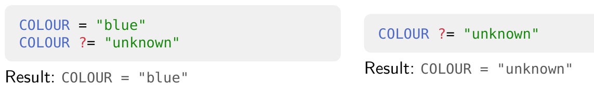
    + `??=`: yếu hơn `?=` và `=`, nếu biến đã được gán giá trị từ `?=` hoặc `=` thì giá trị của `??=` không còn tác dụng, kể cả khi `??=` đặt trước hay sau lệnh `?=`/`=`
- caveats - lưu ý
    + Kết hợp toán từ `?=` và `+=` (...) có thể gây sai lệch 
        - 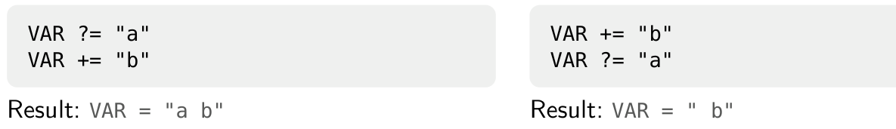
    + trong 1 project có nhiều file cấu hình (conf, bb, ..) không thể biết được thứ tự các toán tử. **Vì vậy cần tránh dùng `+=`, `=+`, `.=`, `=.` trong file `conf/local.conf`. Ta nên cùng cơ chế `override`**
### bitbake-getvar
- bitbake-getvar được dùng để hiểu và debug biến
- nó liệt kê được các file có cấu hình giá trị biến, kể cả giá trị trước và cuối cùng
- `bitbake-getvar <VARIABLE>`: hiển thị giá trị của biến global scope
- `bitbake-getvar -r <recipe> <VARIABLE>`: hiển thị giá trị của biến local scope trong recipe
### overrides
- Cơ chế override của Bitbake cho phép append, prepend hoặc modify giá trị của 1 biến tại thời điểm Expansion time, khi giá trị của biến thực sự được đọc
- Cú pháp override: `<VARIABLE>:<override> = "value"`
- Override để modify giá trị của biến
    + thêm giá trị vào cuối biến (không có space)
        - `IMAGE_INSTALL:append = " dropbear"`
    + thêm giá trị vào đầu biến (không có space)
        - `PATH:prepend = "home/as/:"`
    + xóa giá trị khỏi biến
        - `IMAGE_INSTALL:remove = "i2c-tools"`
### Order of variable assignment
- 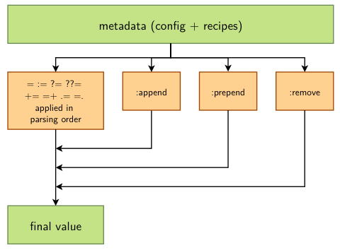
- Thứ tự khi gán giá trị cho biến
    + các toán tử sẽ gán giá trị trước
    + các toán tử append, prepend, remove sẽ thay đổi giá trị của biến theo thứ tự append đổi trước, prepend tiếp theo, cuối cùng là remove bất kể thứ tự dòng code là gì
### Overrides for conditional asignment
- Khi khai báo 1 biến `OVERRIDES="dung:manh:mai" thì nếu biến chứa 1 trong các string này, có thể gán giá trị dựa theo string đó
- Ví dụ 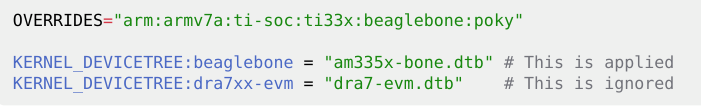
    + `OVERRIDES` định nghĩa các giá trị cho phép
    + Biến KERNEL_DEVICETREE sẽ thay đổi giá trị tùy vào chuỗi trong `OVERRIDES`
    + giá trị của `OVERRIDES` do hệ thống sinh ra dựa theo kiến trúc cpu
- precedence: độ ưu tiên của các lệnh gán giá trị
    + lệnh nào càng chi tiết cụ thể về target, lệnh đó sẽ được ưu tiên hơn
    + ví dụ nếu khai báo:
        ```c
        IMAGE_INSTALL:beaglebone = "busybox mtd-utils i2c-tools"
        IMAGE_INSTALL = "busybox mtd-utils
        ```
        - hệ thống nhận thấy lệnh `IMAGE_INSTALL:beaglebone` cụ thể hơn cho target nên nó sẽ lấy giá trị của lệnh này và bỏ qua lệnh dưới
- combining overrides: kết hợp các phương thức override
    + nếu ra có lệnh 
        ```c
        IMAGE_INSTALL = "busybox mtd-utils"
        IMAGE_INSTALL:append = " dropbear"
        IMAGE_INSTALL:append:beaglebone = " i2c-tools"
        ```
        - kết quả sẽ là `IMAGE_INSTALL = "busybox mtd-utils dropbear i2c-tools"` nếu machine được chỉ định là `beaglebone`
        - nếu không thì kết quả là IMAGE_INSTALL = "busybox mtd-utils dropbear"
## Virtual provides
- đặt vấn đề: có thể có nhiều recipe có chung chức năng nhưng mỗi thời điểm chỉ có thể dùng được 1
- để giải quyết, bitbake sử dụng cơ chế `virtual providers` để tạo 1 tên gọi chung cho chức năng đó
- Khi build, chỉ có 1 recipe được lựa chọn để đáp ứng nhu cầu và tích hợp vào image
### Variant examples
- virtual provider thường có tên theo dạng `virtual/<name>`
- Ví dụ:
    + virtual/bootloader: u-boot, u-boot-ti-staging
    + virtual/kernel: linux-yocto, linux-yocto-tiny, linux-yocto-rt
    + virtual/libc: glibc, musl, newlib
    + virtual/xserver: xserver-xorg
### Provider selection
- virtual provider được cấu hình qua biến `PREFERRED_PROVIDER` (thêm suffix này vào trước)
- Ví dụ:
    + `PREFERRED_PROVIDER_virtual/kernel ?= "linux-ti-staging"`
    + `PREFERRED_PROVIDER_virtual/libgl = "mesa"`
### Version selection
- mặc định, bitbake sẽ build recipe có phiên bản cao nhất từ layer có độ ưu tiên cao nhất trừ khi recipe có set `DEFAULT_PREFERENCE = "-1"`
- khi có nhiều phiên bản recipe khả dụng, ta có thể chọn đích danh 1 phiên bản với `PREFERRED_VERSION`
- ví dụ:
    + `PREFERRED_VERSION_nginx = "1.20.1"`
    + `PREFERRED_VERSION_linux-yocto = "5.14%"` (%: chỉ định nhóm version 5.14.x)
## Selection of packages to install
- Việc build recipe sẽ tạo ra các gói binary
- số lượng pkg được cài vào image được phụ thuộc vào target mình chọn (core-image-minimal, ...)
- ta có thể tự custom các pkg muốn cài vào image
- Trong quá trình debug hoặc phát triển, có thể thêm pkg mà không cần sửa recipe
- packages được quyết định bởi biến `IMAGE_INSTALL`
## The power of BitBake
### Common BitBake options
- Bitbake có thể dùng để build toàn bộ cho 1 target với lệnh `bitbake [target]`
    + target: là tên của recipe
    + ví dụ: `bitbake ncurses`, `bitbake ncurses-native`
- Có thể chèn thêm các optione
    + `-c <task>`: thực thi task
    + `-s`: liệt kê các recipe khả dụng và version của nó
    + `-f`: buộc task phải chạy
    +`world`: build tất cả recipes
- ví dụ:
    + `bitbake -c listtasks virtual/kernel`: liệt kê các task khả dụng cho gói `virtual/kernel`
    + `bitbake -c menuconfig virtual/kernel`: thực thi task `menuconfig` cho recipe `virtual/kernel`
    + `bitbake -f dropbear`: buộc recipe dropbear phải chạy tất cả các task của nó
    + `bitbake --runall=fetch core-image-minimal`: tải tất cả recipe source và dependence của chúng
    + `bitbake --help`
### shared state cache
- bitbake chứa output của mỗi task vào 1 đường dẫn, gọi là shared state cache
- shared state cache dùng để tăng tốc biên dịch
- đường dẫn của shared state cache được define bởi biến `SSTATE_DIR` và mặc định ở `build/sstate-cache`
- có thể xóa state cache bằng cách `find sstate-cache/ -type f -atime +30 -delete` (xóa các file không được truy cập quá 30 ngày)

## Thực hành 
- `bitbake -vn virtual/kernel`: xem phiên bản kernel nào đang được dùng
- Sau khi sửa file conf, chạy lệnh trên để check lại xem yocto load đúng mã nguồn mình chọn cho kernel hay chưa
- `bitbake -c listtasks virtual/kernel`: các task tồn tại trong virtual/kernel
- `bitbake -c <task> virtual/kernel`: task là tên sau chữ `do_` trong listtasks của virtual/kernel
- `bitbake --runall=fetch world`: tải tất cả source của các package và dependencies mà có trong các layer trong Yocto trên máy
- `bitbake -s`: liệt kê tất cả package local và phiên bản
- Các layer dùng có thể có recipe kernel với phiên bản khác nhau, vì vậy cần chọn 1 phiên bản qua virtual/kernel. 
- linux-bb.org là 1 recipe nằm trong bootlin/Yocto-Project/yocto-bbb-labs/meta-ti/meta-ti-bsp/recipes-kernel/linux/linux-bb.org
- `PREFERRED_VERSION_linux-bb.org:beaglebone = "6.6%"` chọn phiên bản của recipe kernel. Chọn xong thì kiểm tra đúng bản hay chưa `bitbake -e linux-bb.org | grep "^PV="`
- `bitbake virtual/kernel`: build riêng kernel và dtb

# Writing recipes - basics
## Recipes: overview
- 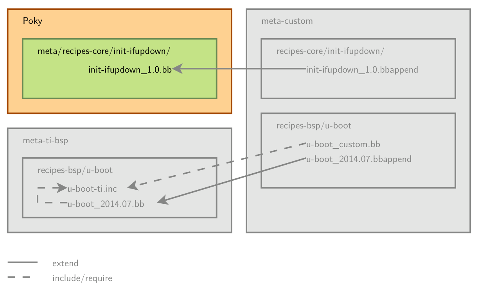
    + .bbappend: là file mở rộng của .bb
    + .inc: như file header để các file .bb include
- 1 recipe mô tả cách để xử lý các thành phần phần mềm (app, lib, ...)
    + Recipe là 1 danh sách các lệnh để lấy, patch, biên dịch, cài đặt và tạo gói binary
    + Recipe cũng định nghĩa các dependencies nào được build cùng hoặc chạy cùng trong runtime
    + Format file recipe: `<recipename>_<version>.bb`
    + Output của 1 recipe là các gói binary: `<recipename>, <recipename>-doc, <recipename>-dbg, ...`
- Nội dung chứa trong recipe
    + các biến cấu hình: name, license, dependencies, path của source code
    + các function được chạy để gọi thực thi các task (fetch, configure, compile, ...)
    + các task cung cấp các lệnh để thực thi
    + lệnh thực thi task cụ thể: `bitbake -c <task> <target>`
- Common variables
    + để giúp việc viết recipe dễ dàng hơn, 1 số biến tự động có sẵn:
        - `BPN`: tên của recipe được lấy từ recipe file name
        - `PN`: là BPN đi kèm tiền số (nativesdk-) hoặc hậu tố (-native)
        - `PV`: version của pkg được lấy từ recipe file name
        - `BP`: `${BPN}-${PV}`
    + tên và version của recipe thường khớp với tên và version của mã nguồn
    + ví dụ: dùng recipe `bash_5.1.bb` thì `bash` là BPN, `5.1` là PV
## Organization of a recipe
+ 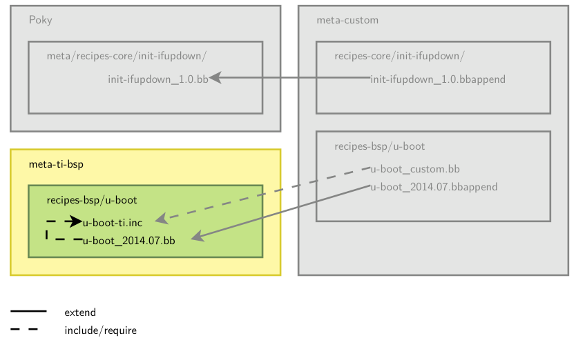
+ Nhiều ứng dụng có nhiều hơn 1 recipe để hỗ trợ nhiều phiên bản. Để tránh bị lặp mã nguồn, những common metadata được đưa vào file `.inc`
    - `<application>.inc`
    - `<application>_<version>.bb` thường chứa `require <application>.inc`
+ Có thể chia recipe ra làm 3 phần chính
    - header: what/who
    - sources: where
    - task: how
+ Header của recipe: 
    - có các biến cấu hình như sau:
        + `SUMMARY`: mô tả ngắn cho pkg
        + `DESCRIPTION`: mô tả software này làm gì
        + `HOMEPAGE`: URL tới trang chủ của project
        + `SECTION`: danh mục các gói
        + `LICENSE`: bản quyền
+ The source locations: overview
    - Ta cần lấy source từ nguồn chính thức và cả các nguồn khác để có thể cấu hình, vá, hoặc cài app
    - `SRC_URI`: là biến định nghĩa nơi lấy và cách lấy source. Nó là danh sách các URI trỏ tới resource (local hoặc remote)
    - URI syntax: `scheme://url;param1;param2`
        + `scheme`: mô tả file local bằng `file://` hoặc remote bằng `https://`, `git://`, ....
    - Mặc định, source được fetch về trong folder `build/downloads`, có thể thay đổi đường dẫn này bằng biến `DL_DIR` trong `conf/local.conf`
+ The source locations: remote files
    - Đối với các giao thức `http`, `https`, `ftp`:
        + `https://example.com/application-1.0.tar.bz2`
        + 1 số biến giúp trỏ tới các remote location lớn như `${SOURCEFORGE_MIRROR}, ${GNU_MIRROR}, ${KERNELORG_MIRROR}…`
        + Ví dụ: `${SOURCEFORGE_MIRROR}/<project-name>/${BPN}-${PV}.tar.gz`
        + các biến này cấu hình trong `meta/conf/bitbake/conf`
    - Đối với git
        + `git://<url>;protocol=<protocol>;branch=<branch>`
        + Khi dùng git, cần define `SRCREV`, giá trị của `SRVREV` là 1 commit hash cụ thể chứ không được dùng kiểu tag `v1.0`
        + tham số `branch` là bắt buộc để bitbake kiểm tra commit trong `SRVREV` có nằm trên branch đó không
    - Giá trị `checksum` cần được cung cấp để khi đảm bảo tính toàn vẹn của file khi dùng với `http, https, ftp`
        + `SRC_URI[sha256sum] = "5891b5b522d..."`
    - Có thể dùng nhiều checksum cho nhiều file bằng cách dùng tham số `name`
        ```c
        SRC_URI = "http://example.com/src.tar.bz2;name=tarball \
                   http://example.com/fixes.patch;name=patch"
        SRC_URI[tarball.sha256sum] = "97b2c3fb082241ab5c56..."
        SRC_URI[patch.sha256sum] = "b184acf9eb39df794ffd..."
        ```
+ The source locations: local files
    - Khai báo `SRC_URI` dùng `file://`, `file://` chỉ nơi chứa recipe này
    - các file local này sẽ được copy từ layer vào thư mục `work`
    - đường dẫn tìm kiếm file được định nghĩa trong biến `FILESPATH`
    - `FILESPATH` là danh sách các đường dẫn để tìm kiếm các file
    - thứ tự đường dẫn trong `FILESPATH` rất quan trọng, khi file đã được tìm thấy trong 1 path, việc tìm kiếm sẽ dừng
    - `FILESPATH`:
        + là sự kết hợp của `FILE_DIRNAME` (chứa các .bb file) và các hậu tố đi kèm như sau:
            - `${FILE_DIRNAME}/${BP}`
            - `${FILE_DIRNAME}/${BPN}`
            - `${FILE_DIRNAME}/files`
            - `${FILE_DIRNAME}`
        + có thể ghi đè đường dẫn bằng biến `FILESOVERRIDES`    
            - `${TRANSLATED_TARGET_ARCH}:${MACHINEOVERRIDES}:${DISTROOVERRIDES}`
            - ví dụ: `arm:armv7a:ti-soc:ti33x:beaglebone:poky` - hệ thống sẽ tìm từ phải qua trái
                + khi áp dụng tạo đường dẫn như trên, bitbake sẽ ưu tiên kiểm tra các đường dẫn `FILE_DIRNAME` dưới đây theo thứ tự trừ trên xuống
                + 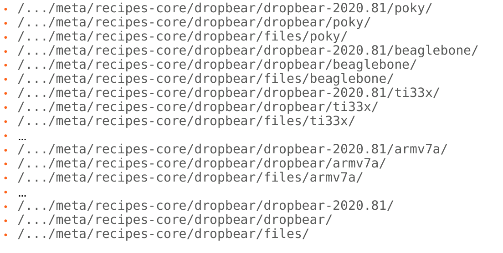
        + Cơ chế trên giúp yocto dùng chung 1 file .bb mà vẫn cấu hình được nhiều file mã nguồn khác nhau
        + ví dụ: `SRC_URI += "file://defconfig`
            - ta không cần chỉ rõ defconfig ở thư mục nào
            - nhờ vào thứ tự ưu tiên từ phải qua trái, bitbake có thể tìm được defconfig phù hợp với giá trị của `MACHINE`
            - 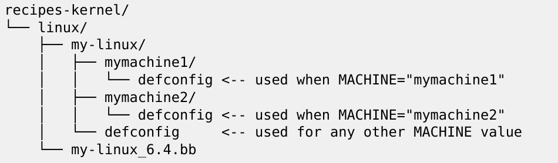
+ The source locations: tarballs - file nén
    - khi giải nén 1 file nén, bitbake mặc định ghi nhận đường dẫn đã giải nén nằm ở thư mục tên là `<application>-<version>` do biến `S` định nghĩa, nếu muốn thay đổi đường dẫn, cần thay đổi giá trị biến `S`
    - Nếu là git, `S` cần set là `${WORKDIR}/git`
+ The source locations: license files
    - các file license cần có checksum của nó
    - `LIC_FILES_CHKSUM`: khai báo URI trỏ tới file license và checksum của nó trong source code
    ```c
    LIC_FILES_CHKSUM = "file://gpl.txt;md5=393a5ca..."
    LIC_FILES_CHKSUM = "file://main.c;beginline=3;endline=21;md5=58e..."
    LIC_FILES_CHKSUM = "file://${COMMON_LICENSE_DIR}/MIT;md5=083..."
    ```
    - nếu license thay đổi, quá trình build sẽ báo lỗi vì checksum không còn khả dụng
+ Dependencies
    - 1 recipe có thể có nhiều dependencies trong quá trình build hoặc runtime. Để khai báo các yêu cầu dependencies này của recipe, cần dùng 2 biến:
        + `DEPENDS`: danh sách các dependencies cần lúc build
        + `RDEPENDS`: danh sách các dependencies cần lúc runtime, phải chỉ rõ package nào (ví dụ thêm `${PN}`)
        + `DEPENDS = "recipe-b"`: task `do_prepare_recipe_sysroot` phụ thuộc vào task `do_populate_sysroot` của recipe-b
        + `RDEPENDS:${PN} = "package-b"`: task `do_build` phụ thuộc vào task `do_package_write_<archive-format>` của recipe-b
    - đôi khi, 1 recipe bị phụ thuộc vào 1 phiên bản cụ thể của 1 recipe khác. Vậy nên bitbake cho phép lựa chọn phiên bản bằng cách
        + `RDEPENDS:$PN = "recipe-b (>= 1.2)"`
        + hỗ trợ các toán tử =, >, <, >= và <=
    - có thể dùng lệnh sau để xem dependencies theo dạng graphical
        + `bitbake -g -u taskexp core-image-minimal`
+ Tasks
    - trong recipe luôn tồn tại các task mặc định
        + do_fetch
        + do_unpack
        + do_patch
        + do_configure
        + do_compile
        + do_install
        + do_package
        + do_rootfs
    - Lệnh get danh sách các task của 1 recipe
        + `bitbake <recipe> -c listtasks`
- The main tasks
    + 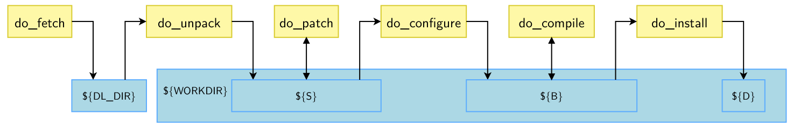
        - B: thư mục build
        - D: đường dẫn để cài đặt tạm thời
- Writing tasks
    + Cú pháp của 1 task
        ```c
        do_task() {
            action0
            action1
            ...
        }
        ```
    + Cú pháp trong recipe dùng các cú pháp shell script tiêu chuẩn, nên ta có thể thêm lệnh linux vào trong script 
    + Các biến có sẵn
        - `WORKDIR`: thư mục làm việc của recipe
        - `S`: đường dẫn chứa source code đã được giải nén
        - `B`: đường dẫn chứa các object được sinh ra trong quá trình build
        - `D`: đường dẫn nơi các file, package được cài đặt trước khi tạo image
        - Ví dụ:
            ```c
            do_compile() {
                oe_runmake
            }
            do_install() {
                install -d ${D}${bindir} //tạo thư mục /usr/bin trong vùng nhớ tạm
                install -m 0755 hello ${D}${bindir} //copy file hello vào /usr/bin đã tạo với quyền 0755
            }
            ```
            + ${bindir} là /usr/bin
- Adding new tasks
    + ta có thể add thêm task bằng `addtask` (theo cách thủ công khi muốn phát triển tính năng mới)
        ```c
        do_mkimage () {
            uboot-mkimage ...
        }
        addtask do_mkimage after do_compile before do_install
        ```
    + Thông thường, hệ thống tự chọn các task phù hợp để chèn nhanh và chính xác bằng lệnh `inherit <pkg-name>`
## Applying patches
- Các trường hợp cần patch (vá) để giải quyết vấn đề
    + Hỗ trợ version cũ của phần mềm: fix bug, bảo mật
    + Fix lỗi cross compile
    + Áp dụng patch trước khi đưa vào bản chính thức (upstream)
- Tuy nhiên, các trường hợp liên quan Makefile không cần patch.
    + Ví dụ, Makefile bản chính thức gán cứng CC hoặc CFLAGS. Ta không cần bản vá để sửa giá trị này, mà chỉ cần chạy lệnh make với `-e` để lấy các giá trị được định nghĩa từ môi trường hệ thống
- The source locations: patches
    + Các file có đuôi là .patch hoặc .diff hoặc có thuộc tính `apply=yes` đều sẽ được apply vào sau khi source được get và giải nén trong quá trình thực thi tasl `do_patch`
        - Các patch được nén với .gz, .bz2, .xz hoặc .Z đều được tự động giải nén
        ```c
        SRC_URI += "file://joystick-support.patch \
                    file://smp-fixes.diff \
                    "
        ```
    + Các patch sẽ được apply theo thứ tự khai báo trong SRC_URI
    + Có thể chọn công cụ để apply patch được khai báo trong SRC_URI bằng biến `PATCHTOOL`. Mặc định, `PATCHTOOL = "quilt"`, các giá trị khác có thể chọn là `git`, `patch`
- Resolving conflicts
    + `PATCHRESOLVE` định nghĩa các để xử lý conflict khi apply patch
    + Có 2 giá trị: 
        - noop: quá trình build thất bại nếu patch không thể áp dụng thành công
        - user: xuất hiện shell để tự sửa conflict
        - giá trị mặc định là `noop` trong `openembedded-core`
## Example of a recipe
- 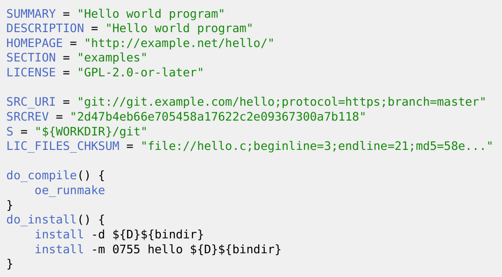
## Ví dụ về 1 recipe có phần không phụ thuộc phiên bản
- Phần này ví dụ về 1 file khai báo cấu hình dùng chung cho mọi phiên bản phần mềm
- tar.inc - không phụ thuộc phiên bản
    + 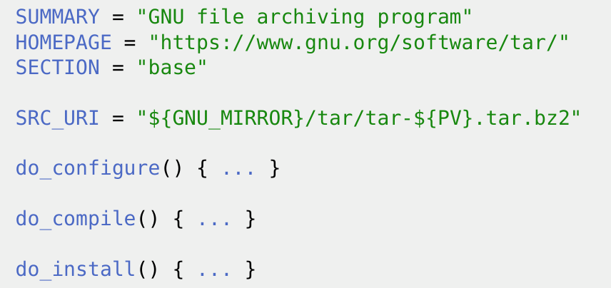
- tar_1.17.bb, tar_1.25.bb - có phụ thuộc phiên bản
    + 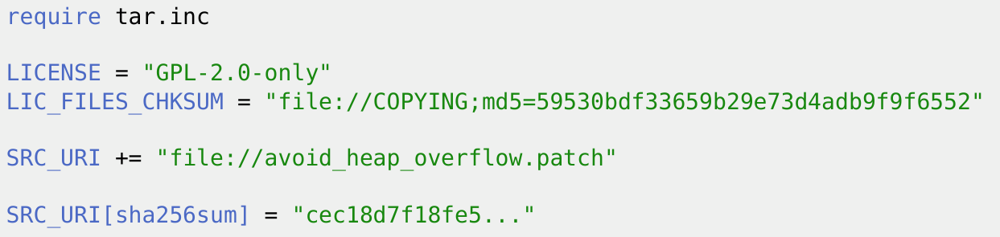
    + 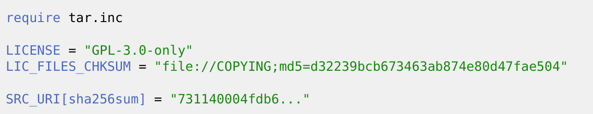
## Debugging recipes
- Log và run files
    + mỗi task đều tạo ra các file này trong folder `temp` trong folder làm việc của recipe (recipe work directory)
    + `run.do_<taskname>`: script được tạo ra từ nội dung của recipe và thực thi các task
    + `log.do_<taskname>`: output của việc thực thi task
    + Có thể đọc các file này để xem task đang làm cái gì
- Debugging variable assignments
    + `bitbake-getvar -r ncurses SRC_URI`: in ra giá trị của biến trong recipe
    + `bitbake -e`: in ra toàn bộ các biến môi trường trong global
    + `bitbake -e ncurses`: in ra toàn bộ các biến môi trường trong scope của ncurses
## Thực hành
- ncurses: là library dùng để xây dựng giao diện GUI từ text chạy trực tiếp từ terminal
- nếu tên của 1 recipe là abc_1.0.0.bb thì lệnh bitbake để run recipe này là `bitbake abc`
- Nếu không khai báo checksum cho file, bitbake sẽ báo lỗi
- SRC_URI: nếu lấy file từ sourceforge thì có thể dùng cấu trúc `SRC_URI = "${SOURCEFORGE_MIRROR}/project-name/packagename-${PV}.tar.gz"`
- `EXTRA_OEMAKE` cấu hình thêm biến cho cross-compile
    + `EXTRA_OEMAKE = " 'CC=${CC}' 'AR=${AR}' "`
    + CC và AR được tự động trỏ để phù hợp với MACHINE đã được khai báo trong local.conf
    + các cờ như CFLAGS nếu có thêm thì cần add luôn vào biến này, biến này chạy như lệnh make bình thường, cần truyền cho nó cấu hình như flag, arch, ... để build thành công
- tạo hàm do_install để sau khi build app xong, file binary của app được cài vào folder /usr/bin
    ```c
    do_install() {
        install -d ${D}${bindir}
        install -m 0755 nInvaders ${D}${bindir}/ninvaders
    }
    ```
    + nInvaders là tên thật của app mà build từ code của app mình dùng
    + `${D}${bindir}/ninvaders`: ninvaders là tên mới đặt trong /usr/bin
- **Việc tạo recipe chỉ mới là tải code về rồi build, muốn app đó có trong rootfs thì cần append app đó vào `local.conf` bằng lệnh `IMAGE_INSTALL:append = " ninvaders"`**
- Lệnh copy rootfs vào folder nfs: 
    ```
    sudo tar xpf /home/as/Desktop/linuxEmbeddedBBB/bootlin/Yocto-Project/yocto-bbb-labs/build/tmp/deploy/images/beaglebone/core-image-minimal-beaglebone.rootfs.tar.xz -C /home/as/Desktop/linuxEmbeddedBBB/bootlin/Yocto-Project/nfsroot
    ```
# Writing recipes - advanced
## Extending a recipe
- Recipe extensions - giới thiệu:
    + Đặt vấn đề: ta nên tránh chỉnh sửa các recipe của layer bên thứ 3 để việc cập nhật dễ dàng nhưng đôi khi lại cần apply patch hoặc 1 file cấu hình theo mong muốn
    + Vì vậy bitbake build engine cho phép chỉnh sửa 1 recipe bằng cách mở rộng nó. Nhiều phần mở rộng có thể được apply vào 1 recipe
    + tác dụng:
        - Chỉnh sửa, ghi đè giá trị của biến bằng toán sử `set, append, prepend, remove`
        - Chỉnh sửa task bằng `append, prepend` hoặc add thêm task
- Extend a recipe
    + 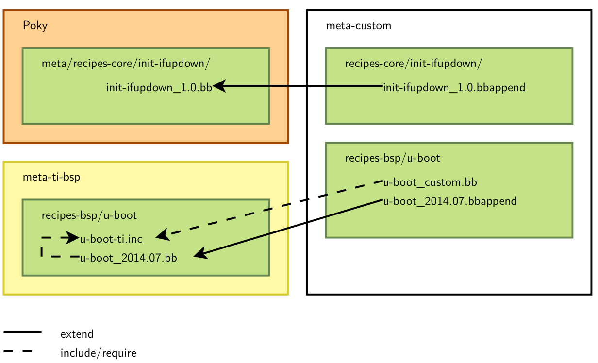
    + file mở rộng recipe có đuôi là `.bbappend`
    + file mở rộng cần phải có cùng tên với recipe chúng mở rộng, ví dụ:
        - hello_0.1.bbappend áp dụng cho hello_0.1.bb
        - hello_0.%.bbappned áp dụng cho hello_0.1.bb, hello_0.2.bb
        - ký tự % chỉ có tác dụng nếu được đặt trước `.bbappend`
    + file mở rộng cần phải chỉ định cụ thể version. Nếu recipe update lên phiên bản mới, file mở rộng cũng cần update
    + nếu thêm bất kỳ file mới nào, đường dẫn của nó phải được thêm vào đầu biến `FILESEXTRAPATHS` (dùng prepend) trong recipe. Bitbake tìm kiếm các đường dẫn trong `FILESEXTRAPATHS` theo thứ tự trái qua phải. Vì thế, việc prepend đường dẫn mới vào `FILESEXTRAPATHS` sẽ yêu cầu bitbake tìm các file của mình trước.
- Append file example
    + Giả sử ta có cấu trúc như sau:
        - 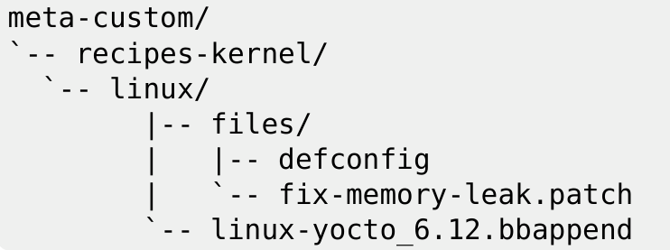
    + File recipe mở rộng tương ứng như sau:
        ```c
        FILESEXTRAPATHS:prepend := "${THISDIR}/files:" // trỏ đường dẫn để lấy các file mới
        SRC_URI += "file://defconfig \ // khai báo tên các file mới
                    file://fix-memory-leak.patch \
                    "
        ```
- Modifying existing tasks
    + task có thể mở rộng với lệnh `:prepend` hoặc `:append`
        ```c
        do_install:append() {
            install -d ${D}${sysconfdir}
            install -m 0644 hello.conf ${D}${sysconfdir}
        }
        ```
    + có thể áp dụng với cụ thể với từng MACHINE, ví dụ beaglebone
        ```c
        do_install:append:beaglebone() {
            install -d ${D}${nonarch_base_libdir}/firmware
            install -m 0644 firmware.bin ${D}${nonarch_base_libdir}/firmware
        }
        ```
## Virtual providers (tiếp tục)
- bitbake cho phép dùng tên ảo thay cho tên của recipe
- virtual name được chỉ định qua biến `PROVIDES`
- 1 vài recipe có thể có cùng tên ảo, nhưng chỉ có 1 cái được build và cài đặt vào image
- `PROVIDERS += "virtual/kernel`
## Classes
- Class cung cấp 1 lớp ảo common để có thể tái sử dụng trong nhiều recipe, nó chứa các task được chuẩn hóa, các biến cấu hình dùng chung, các, các hàm tiện ích, các thiết lập đóng gói, ...
- các task common không cần phải sửa đổi quá nhiều
- bất kỳ metadata hay task nào có ở trong recipe thì đều có thể dùng trong class
- file class có đuôi là `.bbclass`
- Các class phải được đặt trong folder `classes-recipe` (dùng trong recipe) hoặc `classes-global`(dùng ở cấu hình global) hoặc `classes`(dùng được cả 2 nơi) của 1 layer
- Cách sử dụng classes
    + recipe có thể dùng các class trong folder `classes-recipe` bằng lệnh: `inherit class1 class2 ...`
    + 1 recipe có thể kế thừa nhiều class
    + các class trong folder `classes-global` có thể được kế thừa từ file cấu hình với biến `INHERIT`
        - `INHERIT:append = " class1 class2"`
        - class được khai báo trong `INHERIT` sẽ được dùng trong mỗi lần build recipe
    + các class trong folder `classes` có thể dùng với `inherit` trong recipe hoặc biến môi trường `INHERIT` vì chúng không ràng buộc dùng trong recipe hay ở global
- các common classes
    + classes-global/base.bbclass
    + classes-recipe/kernel.bbclass
    + classes-recipe/autotools.bbclass
    + classes-recipe/autotools-brokensep.bbclass
    + classes-recipe/cmake.bbclass
    + classes-recipe/meson.bbclass
    + classes-recipe/native.bbclass
    + classes-recipe/systemd.bbclass
    + classes-recipe/update-rc.d.bbclass
    + classes/useradd.bbclass
    + xem thêm các class tại `https://docs.yoctoproject.org/ref-manual/classes.html`
- Base class
    + Mọi recipe đều tự động kế thừa 1 base class
    + base class định nghĩa các task common cơ bản như: fetch, unpack, patch, configure, compile, install, clean, listtasks,...
    + Nó tự động apply patch trong biến `SRC_URI`
    + nó định nghĩa các mirror: SOURCEFORGE_MIRROR, DEBIAN_MIRROR, GNU_MIRROR, KERNELORG_MIRROR…
    + nó định nghĩa `oe_runmake`: hàm biên dịch tiêu chuẩn với cơ thế gọi hàm `make` cùng các tham số được khai báo trong `EXTRA_OEMAKE` để thêm các biến này khi biên dịch vào lệnh `make`, nó tự động tôi ưu hóa quá trình biên dịch
- kernel class
    + Dùng để build Linux kernel
    + Class này cung cấp các task để cấu hình, compile, install kernek và kernel module
    + Nó sẽ tự động áp dụng `defconfig` được khai báo trong `SRC_URI`: `SRC_URI += "file://defconfig"`
    + kernel được chia thành 1 số package: `kernel`, `kernel-base`, `kernel-dev`, ...
    + virtual provider của kernel là `virtual/kernel`
    + Các biến cấu hình kernel
        - `KERNEL_IMAGETYPE`
        - `KERNEL_EXTRA_ARGS`
        - `INITRAMFS_IMAGE`
- autotools class
    + khai báo các task và metadata để xử lý các app bằng cách dùng hệ thống build autotools (autoconf, automake, libtool)
        - `do_configure`: tạo ra các script cấu hình bằng cách dùng `autoreconf` và load nó với các tham số hoặc cross-compile
        - `do_compile`: chạy lệnh `make`
        - `do_install`: chạy lệnh `make install`
    + Tham số cấu hình mở rộng có thể thêm vào bằng biến `EXTRA_OECONF`
    + Các cờ biên dịch có thể thêm vào bằng `EXTRA_OEMAKE`
    + Ví dụ về autotools class
        ```c
        DESCRIPTION = "Print a friendly, customizable greeting"
        HOMEPAGE = "https://www.gnu.org/software/hello/"
        SECTION = "examples"
        LICENSE = "GPL-3.0-or-later"
        SRC_URI = "${GNU_MIRROR}/hello/hello-${PV}.tar.gz"
        SRC_URI[sha256sum] = "ecbb7a2214196c57ff9340aa71458e1559abd38f6d8d169666846935df191ea7"
        LIC_FILES_CHKSUM = "file://COPYING;md5=d32239bcb673463ab874e80d47fae504"
        inherit autotools
        ```
- useradd class: 
    + class này giúp thêm user vào hệ thống linux
    + việc thêm user vào là cần thiết để tránh 1 số service chạy với quyền root
    + `USERADD_PACKAGES` cần phải khai báo khi kế thừa class `useradd` để tạo user vào gói recipe
    + các user và group sẽ được tạo trước khi thực thi `do_install`
    + ít nhất 1 trong 2 biến sau cần được set:
        - `USERADD_PARAM`: tham số truyền vào useradd
        - `GROUPADD_PARAM`: tham số truyền vào groupadd
    + Ví dụ
        ```c
        DESCRIPTION = "useradd class usage example"
        SECTION = "examples"
        LICENSE = "MIT"
        SRC_URI = "file://file0" // lấy file0 trong folder chứa recipe này
        LIC_FILES_CHKSUM = "file://${COREBASE}/meta/files/common-licenses/MIT;md5=0835ade698e0bc..."
        inherit useradd
        USERADD_PACKAGES = "${PN}" //tạo user cho gói recipe này (PN sẽ là tên recipe)
        USERADD_PARAM:${PN} = "-u 1000 -d /home/user0 -s /bin/bash user0" // các tham số để tạo user
        FILES:${PN} = "/home/user0/file0" // chỉ định file0 sẽ được đóng gói cùng package của recipe này
        do_install() {
            install -d ${D}/home/user0/
            install -m 644 file0 ${D}/home/user0/
            chown user0:user0 ${D}/home/user0/file0
        }
        ```
- bin_package class
    + đôi khi, ta chỉ muốn cài các package đã được build sẵn vào rootfs, ví dụ các firmware
    + `bin_package.bbclass` hỗ trợ việc này
        - vô hiệu hóa hàm `do_configure` và `do_compile`
        - cung cấp `do_insall` để copy mọi thứ được khai báo trong biến `S`
    + Set giá trị biến `LICENSE` thành `CLOSED` để bỏ qua kiểm tra mã nguồn

## Bitbake file inclusions - gộp các file trong bitbake
- Xác định vị trí các file trong hệ thống build
    + metadata có thể được chia sẻ bằng cách dùng các file được include
    + `BBPATH` = đường dẫn chứa recipe, class, hoặc file config
    + bitbake dùng biến `BBPATH` trong file layer.conf để tìm các file được include, nó cũng tìm trong đường dẫn hiện tại.
    + các keyword để include file từ recipe, class, hoặc file cấu hình:
        - `inherit <name>`:
            + dùng trong recipe hoặc class để kế thừa các chức năng của 1 class
            + để kế thừa chức năng của class kernel, dùng: `inherit kernel`
            + inherit sẽ tìm file có đuôi .bbclass trong đường dẫn trong `BBPATH`
            + có thể dùng `inherit %{FOO}` với FOO là biến định nghĩa từ trước
            + nếu áp dụng toàn cục, trong file cấu hình bitbake (.conf) cần dùng biến `INHERIT` để áp dụng cho mọi recipe
        - `include <name>` và `require <name>`
            + có thể dùng được trong mọi file để chèn nội dung từ 1 file khác vào file hiện tại
            + nếu đường dẫn trong 2 từ khóa này là tương đối, bitbake sẽ lấy file đầu tiên nó tìm được trong các đường dẫn của `BBPATH`
            + `include` không báo lỗi khi file không tìm thấy
            + `require` báo lỗi nếu file không tìm thấy
            + include 1 local file: `require ninvaders.inc`
            + include 1 file từ nơi khác: `require path/to/file`
    + để 1 recipe tìm thấy được recipe, class, file cấu hình được nêu trong 3 keyword trên thì bitbake cần check biến `BBPATH` để xem nó nằm ở đâu. Nếu không khai báo `BBPATH`, ta cần điền đường dẫn tuyệt đối cho keyword
## More recipe debugging tools
- xuất ra toàn bộ các biến môi trường dùng cho việc debug lỗi
    + `bitbake -c devshell <recipe>`
- để biết tác động khi thay đổi 1 recipe, bật chức năng lịch sử trong `local.conf`
    + `INHERIT += "buildhistory"`
    + sau đó dùng tool `buildhistory-diff` để check sự khác biệt giữa 2 lần build:
        - 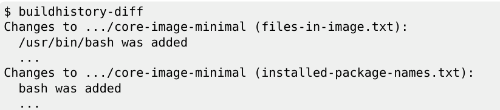
## Network usage
- Fetch source
    + bitbake sẽ tìm kiếm và tải file từ các đường dẫn sau theo thứ tự trên xuống
        - `DL_DIR`: đường dẫn local download
        - `PREMIRRORS`: nguồn máy chủ ưu tiên
        - `SRC_URI`: upstream source
        - `MIRRORS`: nguồn máy chủ dự phòng
    + nếu các mirror lỗi, việc build sẽ lỗi 
- Cách cấu hình mirror trong OpenEmbedded-core
    + trong `meta/classes-global/mirrors.bbclass`
        - 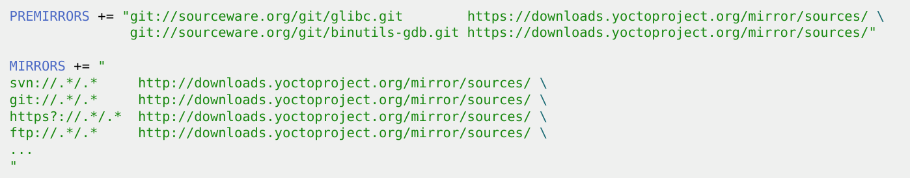
            + với PREMIRRORS, nếu bitbake tải cái gì từ sourceware.org, nó sẽ bị ép nhảy qua yoctoproject.org để tải
            + với MIRRORS, nếu bitbake tải từ các nguồn svn, git, http mà lỗi thì sẽ chuyển qua yoctoproject.org
+ Cách cấu hình PREMIRRORS theo cách riêng mình
    - Cách 1: 
        ```c
        INHERIT += "own-mirrors"
        SOURCE_MIRROR_URL = "http://example.com/my-mirror"
        ```
        + mỗi khi tải bất kỳ 1 file nào, bitbake sẽ kiểm tra `my-mirror` trước
        + cách này chỉ hỗ trợ 1 URL
    - Cách 2: dùng cho cấu hình phức tạp hơn
        + dùng prepend
        ```c
        PREMIRRORS:prepend = "\
            git://.*/.* http://example.com/my-mirror-for-git/ \
            svn://.*/.* http://example.com/my-mirror-for-svn/ \
            http://.*/.* http://www.yoctoproject.org/sources/ \
            https://.*/.* http://www.yoctoproject.org/sources/ "
        ```
        + prepend sẽ chèn các URL này lên đầu tiên bắt buộc bitbake phải check các đường dẫn này trước 
+ Tạo 1 local mirror
    - ta có thể đưa folder download trong máy mình thành 1 mirror để các máy khác kết nối vào để lấy source
    - riêng với mã nguồn tải từ git, cần nén thư mục đó lại -> dùng `BB_GENERATE_MIRROR_TARBALLS = "1"` trong local.conf để sau khi tải về từ git, bitbake sẽ nén lại thành dạng `.tar.gz` rồi đặt trong đường dẫn của `DL_DIR`
+ Ngăn cấm truy cập mạng
    - từ bản 4.0 Kirkstone, việc truy cập network chỉ được cho phép trong `do_fetch` để tránh tải các nguồn không được kiểm soát
    - có thể vô hiệu hóa quyền truy cập mạng bằng `BB_NO_NETWORK = "1"`
    - để tải tất cả source trước khi vô hiệu hóa mạng, dùng lệnh: `bitbake --runall=fetch core-image-minimal`
    - hoặc có thể giới hạn bitbake download file từ `PREMIRRORS` bằng: `BB_FETCH_PREMIRRORONLY = "1"`

# Layers
## Giới thiệu về layers
- Nguyên lý:
    + OpenEmbedded build system thao tác với các metadata
    + Layer là tập hợp của recipes, classes, configuration, ...
    + Layer cho phép tách biệt và tổ chức các metadata
    + Layer phải bắt đầu tên với tiền tố `meta-`
- Layer trong Poky
    + 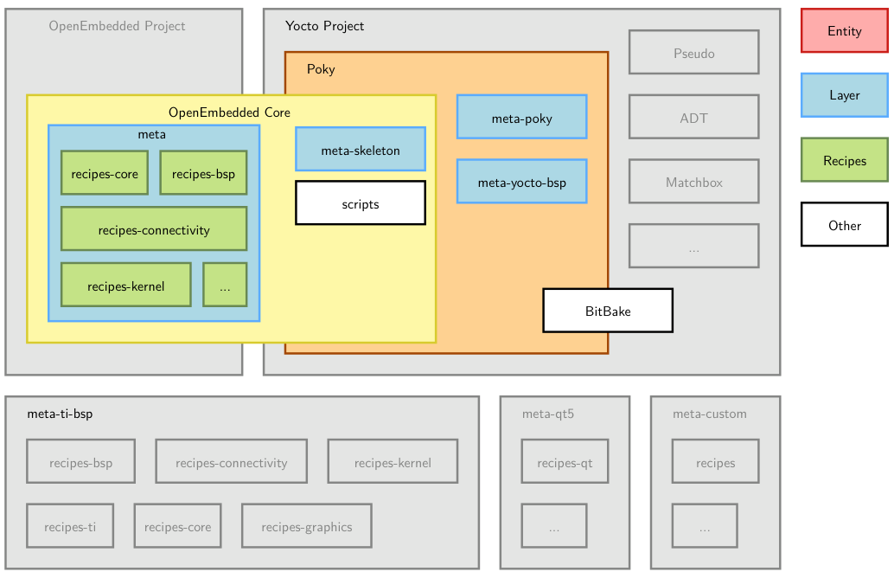
    + hệ thống Poky là tập hợp của nhiều layer common cơ bản
        - meta
        - meta-skeleton
        - meta-poky
        - meta-yocto-bsp
    + Poky chỉ chứa các layer cơ bản nhất, common nhất
    + Các layer khác nếu cần sẽ được add riêng
    + Tránh chỉnh sửa Poky, hãy tạo layer riêng để chỉnh sửa
- Layer của bên thứ 3
    + 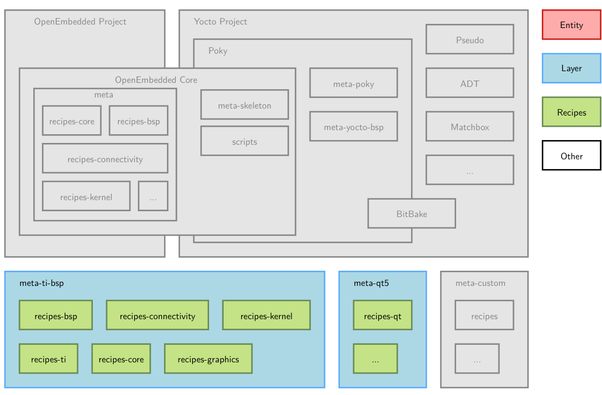
    + nằm ngoài Poky
- Tích hợp và sử dụng 1 layer
    + Danh sách các layer nằm ở `https://layers.openembedded.org/`
    + trước khi tạo 1 layer, hãy check xem nó có sẵn chưa
    + Nếu layer có sẵn rồi thì mở rộng thêm, tránh tạo layer từ đầu
    + Các layer nên đặt cùng folder với folder poky
    + khai báo các layer cho bitbake trong `conf/bblayers.conf` với biến `BBLAYERS`
    + bitbake sẽ kiểm tra mỗi layer trong `BBLAYERS` và lấy các recipes, configuration fies, classes mà các layer đó chứa.
    + Để kiểm tra các layer đang có trong `BBLAYERS`, dùng lệnh:
        - `bitbake-layers show-layers`
        - `bitbake-layers add-layer meta-custom`
        - `bitbake-layers remove-layer meta-qt5`
- Một số layer hữu ích
    + 1 vài SoC có sẵn layer hỗ trợ tốt như: `meta-ti-bsp`, `meta-freescale`, `meta-st-stm32mp`
    + 1 số layer hỗ trợ các ứng dụng như:   
        - `meta-firefox`: hỗ trợ web browser
        - `meta-filesystems`: hỗ trợ các filesystems được thêm
        - `meta-java`: hỗ trợ java
        - `meta-arm-toolchain`: recipe cho toolchain GCC của ARM
        - `meta-qt6`: module QT6
        - `meta-realtime`: công cụ realtime và chương trình test
        - ...
    + lưu ý: 1 số layer không tồn tại trong 1 số branch của Yocto, nếu muốn dùng cần checkout đúng branch có layer đó
## Lời khuyên về layer
- luôn giữ hệ thống build đơn giản, chỉ nên có ít layer khi khởi tạo build
- sau đó, nếu cần layer nào thì xem xét về cost/benefit, vì:
    + chất lượng 1 vài layer có sẵn rất tệ
    + chất lượng layer của các vendor SoC rất đa dạng
- Ví dụ về Yocto kiss
    + `https://github.com/bootlin/yocto-kiss`
    + Keep your layer simple, and here's how `https://www.youtube.com/watch?v=zCMHy2PjsaM`
## Tạo 1 layer
- Tạo 1 layer custom
    + 1 layer là tập hợp của các files, thư mục
    + lệnh bitbake để tạo mới 1 layer: `bitbake-layers create-layer -p <PRIORITY> <layer>`
        - PRIORITY: giúp cho việc chọn recipe ở layer nào sẽ được build khi recipe đó chứa trong nhiều layer
    + độ ưu tiên của layer cao hơn so với thứ tự sắp xếp version của recipe, vì vậy ta có thể hạ cấp recipe trong 1 layer. Tức là nếu layer A có độ ưu tiên cao hơn layer B, và cả 2 đều chứa cùng 1 recipe nhưng khác phiên bản a_0.1.bb trong A và a_0.2.bb trong B, thì bitbake sẽ lấy layer A và build recipe a_0.1.bb
    + 1 layer khi tạo ra sẽ có sẵn:
        - `conf/layer.conf`: file cấu hình của 1 layer, chứa thông tin về độ ưu tiên PRIORITY và các thông tin chung. File này bắt buộc phải có vì nó là entry point của layer
        - `COPYING.MIT`: license của layer này
        - `README`: mô tả cơ bản về layer
        - các recipe của layer đó phải được tổ chức như sau: `layername/recipe-*/*/*.bb`
    + Nguyên tắc:   
        - không copy hoặc chỉnh sửa recipe đã có của layer khác, thay vào đó hãy dùng các file append `*.bbappend`
        - tránh duplicate file.
        - các layer nên đặt cùng cấp với nhau
        - `LAYERDEPENDS`: layer này cần phụ thuộc vào layer được cấu hình trong `LAYERDEPENDS`
        - `LAYERSERIES_COMPAT`: định nghĩa phiên bản Yocto mà layer tương thích
## Thực hành
- 1 số lệnh để check các thuộc tính liên quan layer
    + bitbake-layers show-layers
    + bitbake-layers show-recipes 'linux-*'
    + bitbake-layers show-overlayed
    + bitbake-layers create-layer
    + bitbake-layers show-appends
- trong file bbappend:
    + SRC_URI cần để dấu `+=` vì để nó append vào file recipe gốc. Nếu để `=` thì SRC_URI trong recipe gốc sẽ mất
- folder work/armv7at2hf-neon-poky-linux-gnueabi chứa các gói phần mềm chạy ở tầng ứng dụng mà không phụ thuộc CPU
- folder work/beaglebone-poky-linux-gnueabi chứa các gói phần mềm dành riêng cho beaglebone (kernel source, u-boot, dtb, ...)
- kiểm ra SRC_URI đã nhận đủ source chưa: `bitbake-getvar -r linux-bb.org SRC_URI`

# BSP Layers
## Giới thiệu về BSP layers trong Yocto
- 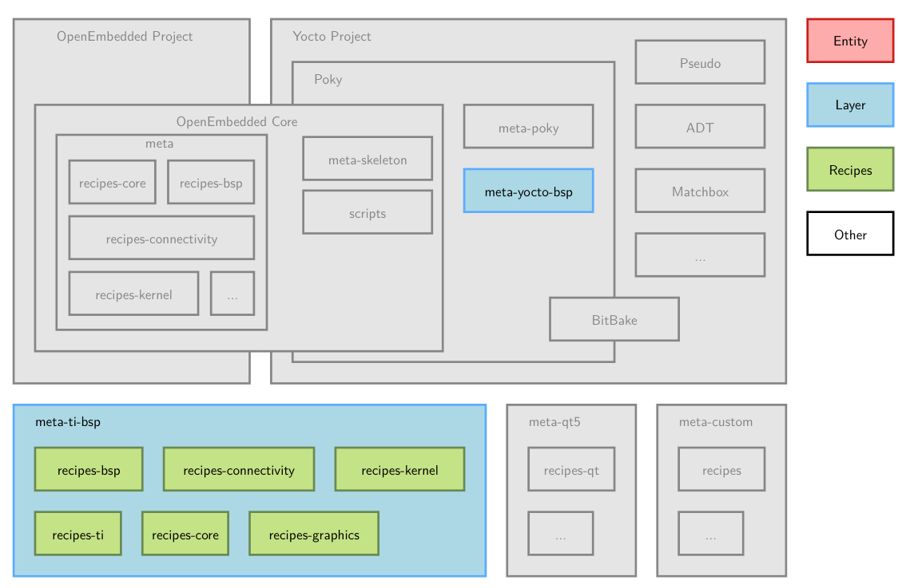
- BSP layer là tập hợp các layer con trong hệ thống layer của Yocto
- BSP layer chứa các metadata có mục tiêu hỗ trợ 1 nhóm phần cứng cụ thể
- BSP layer thường cung cấp:    
    + các file cấu hình phần cứng
    + các recipe và cấu hình cho kernel và bootloader
    + các module driver để bật các tính năng cụ thể của phần cứng
    + các file user binary, firmware được build sẵn
- Đặt tên: `meta-<bsp-name>`, ví dụ `meta-ti-bsp`, `meta-st-stm32mp`
## Các file cấu hình phần cứng - machine files
- 1 layer cung cấp 1 file machine (là file cấu hình phần cứng) cho phần cứng mà nó hỗ trợ
- Các file cấu hình này được đặt trong `meta-<bsp-name>/conf/machine/*.conf`
    + tên của file cấu hình sẽ được set theo giá trị trong biến `MACHINE`. Ví dụ `meta-ti/meta-ti-bsp/conf/machine/beaglebone.conf` với `MACHINE = "beaglebone`
- nên mô tả phần cứng mà bsp hỗ trợ trong README
- Các file cấu hình phần cứng này chứa các biến cấu hình liên quan tới kiến trúc và tính năng của machine
- 1 vài biến hỗ trợ custom kernel image hoặc filesystems
- Các biến cấu hình
    + `TARGET_ARCH`: tên kiến trúc được build
    + `PREFERRED_PROVIDER_virtual/kernel`: chỉ định dùng kernel nào
    + `MACHINE_FEATURES`: khai báo danh sách các phần cứng tồn tại trên machine như `usbgadget, usbhost, screen wifi`. Recipe sẽ check các tính năng nào được bật để build. Một số package sẽ được tự động add vào rootfs dựa vào tính năng được bật 
    + `SERIAL_CONSOLES`: cấu hình cho serial console, ví dụ `115200;ttyS0`
    + `KERNEL_IMAGETYPE`: loại image của kernel sẽ được build, ví dụ zImage
- Ví dụ file `conf/machine/beaglebone-black.conf`
    ```c
    #@TYPE: Machine
    #@NAME: Beaglebone black machine
    #@DESCRIPTION: Reference machine configuration for the http://beagleboard.org/black board
    include conf/machine/include/arm/armv7a/tune-cortexa8.inc
    IMAGE_FSTYPES = "tar.zst wic.zst wic.bmap"
    WKS_FILE = "beaglebone-yocto.wks"
    EXTRA_IMAGEDEPENDS += "virtual/bootloader"
    SERIAL_CONSOLES ?= "115200;ttyS0"
    PREFERRED_PROVIDER_virtual/kernel ?= "linux-yocto"
    PREFERRED_VERSION_linux-yocto ?= "6.18%"
    PREFERRED_PROVIDER_virtual/bootloader ?= "u-boot"
    KERNEL_IMAGETYPE = "zImage"
    KERNEL_DEVICETREE = "am335x-boneblack.dtb"
    MACHINE_ESSENTIAL_EXTRA_RDEPENDS += "kernel-image kernel-devicetree"
    MACHINE_EXTRA_RRECOMMENDS = "kernel-modules"
    SPL_BINARY = "MLO"
    UBOOT_SUFFIX = "img"
    UBOOT_MACHINE = "am335x_evm_defconfig"
    MACHINE_FEATURES = "usbgadget usbhost vfat alsa"
    IMAGE_BOOT_FILES ?= "u-boot.${UBOOT_SUFFIX} ${SPL_BINARY} ${KERNEL_IMAGETYPE} ${KERNEL_DEVICETREE}"
    ```
## Bootloader
- Mặc định ở ARM, bootloader được dùng là U-boot với version cố định trong mỗi bản Poky
- Các cấu hình được thiết lập trong `meta/recipes-bsp/u-boot/u-boot.inc`
- 1 số cấu hình của recipe u-boot có thể chỉnh sửa trong machine files ở mục trước
    + `SPL_BINARY`: đặt tên cho file spl output, mặc định là chuỗi rỗng
    + `UBOOT_SUFFIX`: bin hoặc img
    + `UBOOT_MACHINE`: target để build
    + `UBOOT_ENTRYPOINT`: địa chỉ bộ nhớ để CPU nhảy đến thực thi lệnh của uboot
    + `UBOOT_LOADADDRESS`: địa chỉ bộ nhớ để nạp file uboot vào RAM, thường trùng với địa chỉ của `UBOOT_ENTRYPOINT`
    + `UBOOT_MAKE_TARGET`: build ra file gì. Ví dụ `UBOOT_MAKE_TARGET = "u-boot.img"`
- Custom bootloader
    + có thể dùng recipe mở rộng (bbappend) để thêm các cấu hình cho recipe uboot gốc
    + có thể tạo 1 recipe mới hoàn toàn để custom uboot, hãy dùng file cấu hình chung `meta/recipes-bsp/u-boot/u-boot.inc`
## Kernel
- Recipe linux kernel trong Yocto
    + Có 2 cách để biên dịch kernel
        - tạo 1 custom kernel recipe, kế thừa `kernel.bbclass`
        - dùng gói `linux-yocto` được cung cấp bởi Poky cho các nhu cầu phức tạp
    + kernel được lựa chọn trong machine file bằng biến `PREFERRED_PROVIDER_virtual/kernel`
    + lựa chọn version kernel với biến `PREFERRED_VERSION_<kernel_provider>`
- Gói `linux-yocto` là tập hợp các recipe với tính năng nâng cao để build kernel 
    + `PREFERRED_PROVIDER_virtual/kernel = "linux-yocto"` -> chọn recipe linux-yocto làm kernel chính
    + `PREFERRED_VERSION_linux-yocto = "5.14%"` -> chọn version kernel là 5.14.x
- Cấu hình `SRC_URI` để apply nhiều file config (cfg) cho kernel
    ```c
    SRC_URI += "file://defconfig \
                file://nand-support.cfg \
                file://ethernet-support.cfg"
    ```
- Một cách khác để cấu hình cho recipe `linux-yocto` là dùng `Advanced Metadata`
    + là cách mạnh nhất để chia nhỏ các file cấu hình và các patch thành các phần nhỏ
    + nó được thiết kế để cung cấp 1 kernel có tính tùy biến cao
    + đọc thêm ở : `https://docs.yoctoproject.org/kernel-dev/advanced.html#working-with-advanced-metadata-yocto-kernel-cache`
- Kernel metadata:  
    + là 1 cách để tổ chức và chia nhỏ các file cấu hình kernel và các file patch thành các phần nhỏ, mỗi phần hỗ trợ 1 tính năng
    + 2 biến cấu hình chính:
        - `LINUX_KERNEL_TYPE`: standard, hoặc tiny (nhỏ) hoặc preempt-rt (áp dụng cho patch `PREEMPT_RT`)
        - `KERRNEL_FEATURES`: danh sách các tính năng được bật, đó là các file patch hoặc các file cấu hình
    + Các file mô tả Kernel metadata có cú pháp của nó để mô tả các tùy chọn kernel
    + 1 tính năng cơ bản được định nghĩa bao gồm 1 bản vá và 1 đoạn cấu hình. Ví dụ `features/nunchuk.scc`:
        ```c
        define KFEATURE_DESCRIPTION "Enable Nunchuk driver"
        kconf hardware enable-nunchuk-driver.cfg
        patch Add-nunchuk-driver.patch
        ```
        - sau đó tích hợp vào kernel image: `KERNEL_FEATURES += "features/nunchuk.scc"`
## Thực hành
- `DEFAULTTUNE = "cortexa8thf-neon"` trong conf: chỉ định kiểu tối ưu hóa phần cứng là cortexa8thf-neon (kiến trúc là arm cortex a8, t là tập lệnh thumb-2 của arm, hf là hardfload, neon hỗ trợ tăng tốc xử lý các tác vụ âm thanh, hình ảnh)
- Sau khi có file cấu hình machine rồi, để build với machine đó thì cần sửa `MACHINE` trong file `build/conf/local.conf`

# Distro layers
- 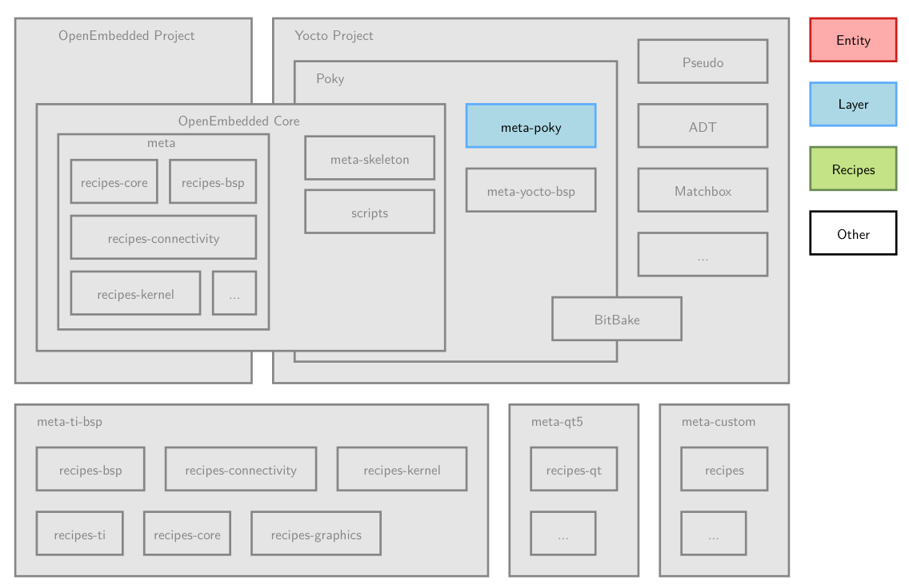
## Các khái niệm
- Ta có thể tạo 1 hệ điều hành mới bằng cách dùng 1 Distro layer.
- Distro layer chứa các cấu hình và recipe để định nghĩa "luật chơi" cho hệ điều hành
- Distro layer này cho phép thiết lập: toolchain, wayland hay x11, systemd hay sysvinit, ...
- Distro layer có thể ghi đè các giá trị của openembedded-core hoặc poky mà không chỉnh sửa các layer gốc
- Distro layer có thể chia sẻ các thiết lập trong file `conf/local.conf` cho các máy khác thay vì local.conf chỉ nằm trong thư mục build của máy local
- Poky là 1 bản phân phối nặng, chứa toàn bộ các tính năng mà có thể ta không cần hết. Vì vậy tự tạo 1 bản distro layer riêng sẽ giúp việc cấu hình trở nên tối giản, phù hợp với hệ thống
## Cách dùng trong thực tế
- Nên tách biệt distro layer khỏi các custom layer khác
- Distro layer thường chứa:
    + File cấu hình distro
    + các class đặc thù
    + các recipe đặc thù: script khởi tạo, màn hình chào mừng, ...
## Tạo 1 file cấu hình Distro
- File cấu hình distro layer thường đặt là: `conf/distro/<distro>.conf`
- Cần define biến `DISTRO_NAME` trong file này
- Có thể dùng các biến `DISTRO_*` khác
- dùng biến `DISTRO = "<distro>"` trong file `local.conf` để sử dụng cấu hình distro
    ```c
    DISTRO_NAME = "My Custom Distro"
    DISTRO_VERSION = "1.0"
    MAINTAINER = "..."
    DISTRO_FEATURES = "sysvinit ipv4 ipv6 wifi zeroconf usbgadget usbhost pni-names"
    ```
## Biến DISTRO_FEATURES
- chứa danh sách các tính năng mà bản phân phối cho phép dùng về mặt phần mềm (mặc dù phần cứng có nhưng hệ điều hành không cho thì không dùng được)
- Ví dụ, với tính năng bluetoot:
    + yêu cầu bluez phải được build và add vào image
    + bật chức năng bluetooth trong `ConnMan`
- Biến `COMBINED_FEATURES` sẽ được Yocto check và kiểm tra cấp danh sách các tính năng mà được bật trong cả `MACHINE_FEATURES` và `DISTRO_FEATURES`. Vì phải thỏa mãn cả 2 biến có tính năng đó thì tính năng đó mới hoạt động được 
## Lựa chọn toolchain
- toolchain được lựa chọn bằng biến `TCMODE`. Giá trị mặc định là `default`
- các recipe của providers sẽ định nghĩa giúp ta cách biên dịch và cài đặt toolchain
## Sample files
- 1 distro layer thường cần chứa `sample files`, được dùng như là template để tạo các file cấu hình chính. Khi người khác dùng thì chỉ cần copy ra để dùng mà không cần viết lại từ đầu
- Ví dụ các sample files:
    + bblayers.conf.sample
    + local.conf.sample
- Trong Poky, sample file được đặt trong `meta-poky/conf/templates/default/`
- Biến `TEMPLATECONF` khai báo nơi để tìm sample files và có thể export trước khi chạy lệnh `source oe-init-build-env`. 
    + Ví dụ: chạy `export TEMPLATECONF=meta-mydistro/conf/templates/myconfig` trước `source oe-init-build-env` sẽ giúp thư mục build chứa các cấu hình của mình trong file `local.conf` và `bblayers.conf`
- Để tạo các sample file từ bblayers.conf và local.conf, dùng lệnh: `bitbake-layers save-build-conf`

# Images
## Giới thiệu về images
- về bản chất, 1 image là 1 recipe ở cấp độ cao nhất của recipe và được dùng song song với machine
- image gom tất cả lại để tạo thành 1 hệ điều hành hoàn chỉnh
- image độc lập với kiến trúc, nó định nghĩa cách mà rootfs được buil, build với package nào
- Mặc định, 1 số image được cung cấp bới Poky: `meta*/recipes*/images/*.bb`
- 1 số image common:
    + core-image-base: chỉ có giao diện dòng lệnh, hỗ trợ full phần cứng
    + core-image-minimal: image nhỏ, chỉ đủ để boot device
    + core-image-minimal-dev: image nhỏ nhưng có thêm 1 vài tool, phù hợp để phát triển phần mềm
    + core-image-x11: image có hỗ trợ X11 cơ bản
    + core-image-weston: image có hỗ trợ wayland
    + core-image-rt: như core-image-minimal nhưng có thêm tool, kernel cho realtime
- 1 image có: mô tả, license, và kết thừa class `core-image`
## Cấu trúc, biến của 1 image recipe
- IMAGE_BASENAME: tên của file image output, mặc định là ${PN}
- IMAGE_INSTALL: danh sách các gói và nhóm các gói để cài vào image, nó sẽ là tên của các recipe trong các folder `packagegroups` trong 1 số layer có sẵn
- IMAGE_ROOTFS_SIZE: kích thước của rootfs final
- IMAGE_FEATURES: danh sách các tính năng được cho phép trong image, bitbake tự tìm các gói thương ứng để hỗ trợ tính năng này. `https://docs.yoctoproject.org/scarthgap/ref-manual/features.html#ref-features-image`
- IMAGE_FSTYPES: các format của image sẽ được build ra
- IMAGE_LINGUAS: các ngôn ngữ được hỗ trọ trong image
- IMAGE_PKGTYPE: loại gói phần mềm được build system sử dụng (.deb, .rpm, .ipk)
- IMAGE_POSTPROCESS_COMMAND: các lệnh shell được dùng để xử lý hậu kì ngay trước khi image được đóng gói
- EXTRA_IMAGEDEPENDS: các recipe muốn build cùng image, nhưng không cài bất cứ gì vào root filesystem (ví dụ như bootloader)
## Ví dụ 1 image
- image không cần `LICENSE` như recipe thường
    ```c
    SUMMARY = "Example image"
    IMAGE_INSTALL = "packagegroup-core-boot dropbear ninvaders"
    IMAGE_LINGUAS = " "
    inherit core-image
    ```
## Quá trình tạo root filesystem
- Quá trình tạo root filesystem 
    + 1 thư mục rỗng sẽ được tạo ra để chuẩn bị làm hệ thống root filesystem
    + Các phần mềm được khai báo trong `IMAGE_INSTALL` sé được cài đặt vào trong thư mục rootfilesystem đó
    + các image sẽ được tạo ra dựa theo biến `IMAGE_FSTYPES`
- Quá trình tạo rootfs phụ thuộc biến `IMAGE_PKGTYPE` (định nghĩa cách mà hệ thống quản lý các gói phần mềm), biến này nên được define vào image recipe
    + Nếu không định nghĩa, bibtake tự lấy giá trị đầu tiên hợp lệ trong `PACKAGE_CLASSES`
- Việc tự động cài các phần mềm vào rootfs được thực hiện bởi file class: `meta/classes-recipe/rootfs_${IMAGE_PKGTYPE}.bbclass`
## Image types
- `IMAGE_FSTYPES`: 
    + khai báo loại file image
    + có thể khai báo nhiều loại, và bitbake sẽ tạo ra mỗi loại 1 file
    + Các image thường dùng là: `ext2, ext3, ext4, squashfs, cpio, jffs2, ubifs, tar.bz2, tar.gz,...`
- Tạo 1 image type ngoài các image mà Poky cung cấp (core-image-minimal, ...)
    + Nếu muốn tạo ra nhiều phân vùng trên thẻ nhớ, ta cần tạo image type riêng
    + cần kế thừa `image_types`
    + Phải define hàm: `IMAGE_CMD:<type>`
    + sau đó append vào `IMAGE_TYPES`
    + Ví dụ: 
        ```c
        # =================================================================
        # BƯỚC 1: Kế thừa class mẹ theo đúng hướng dẫn của slide
        # =================================================================
        inherit image_types

        # =================================================================
        # BƯỚC 2: Định nghĩa hàm nhào nặn IMAGE_CMD cho định dạng "customext4"
        # =================================================================
        IMAGE_CMD:customext4 () {
            # 1. Tạo một file image trống với kích thước được tính toán tự động
            dd if=/dev/zero of=${IMGDEPLOYDIR}/${IMAGE_NAME}.rootfs.customext4 bs=1M count=${IMAGE_ROOTFS_SIZE}

            # 2. Định dạng file trống này thành hệ thống tệp tin ext4
            mkfs.ext4 -F ${IMGDEPLOYDIR}/${IMAGE_NAME}.rootfs.customext4

            # 3. Mount (gắn) file này vào thư mục tạm và sao chép toàn bộ hệ điều hành vào
            # (Yocto xử lý ngầm bước sao chép này từ thư mục ${IMAGE_ROOTFS})
            oe_runmake_ext4fs ${IMAGE_ROOTFS} ${IMGDEPLOYDIR}/${IMAGE_NAME}.rootfs.customext4

            # 4. Câu lệnh tối ưu: Tự động chạy lệnh kiểm tra và dọn dẹp phân vùng 
            # nhằm loại bỏ các block trống thừa, giúp file nhẹ nhất có thể.
            e2fsck -f -y ${IMGDEPLOYDIR}/${IMAGE_NAME}.rootfs.customext4
            resize2fs -M ${IMGDEPLOYDIR}/${IMAGE_NAME}.rootfs.customext4
        }

        # =================================================================
        # BƯỚC 3: Đăng ký định dạng này vào biến tổng của hệ thống Yocto
        # =================================================================
        IMAGE_TYPES += "customext4"
        ```
- Convert image type đã tạo
    + khi tạo ra image rồi, thường file đó nặng, nên cần conver để nhẹ đi hoặc tạo thêm các file mã hóa
    + Việc convert này như bước phụ sau khi image được tạo ra. Ví dụ tạo ra image ext4, thì class convert này tạo ra ext4.gz từ image đó
    + cần tạo 1 class có kế thừa `image_types`
    + file class này cần tạo function `CONVERSION_CMD:<type>`
    + sau đó append file này vào biến `CONVERSIONTYPES`
    + Khai báo thêm cho `IMAGE_TYPES`. Ví dụ `IMAGE_TYPES += "ext4.gz"`
- wic
    + 90% dùng wic
    + output của yocto có các file `wic` để flash vào sdcard
    + là tool để tạo image hoàn chỉnh có thể flash được 
    + có khả năng tự động chia phân vùng (ngoại trừ raw flash partition và filesystems)
    + có khả năng chọn chính xác file nào nằm ở phân vùng nào thông qua các plugin
    + cấu trúc của 1 image được mô tả trong file `.wks` hoặc `.wks.in`
    + wic có thể được mở rộng cấu hình ở bất kỳ layer nào
    + Ví dụ:
        ```c
        WKS_FILE = "imx-uboot-custom.wks.in" // file mô tả cấu trúc image
        IMAGE_FSTYPES = "wic.bmap wic" // yêu cầu output có 2 file có đuôi như này
        ```
        - File `imx-uboot-custom.wks.in`
            ```c
            part u-boot --source rawcopy --sourceparams="file=imx-boot" --no-table --align ${IMX_BOOT_SEEK}
            part /boot --source bootimg-partition --use-uuid --fstype=vfat --label boot --active --align 8192 --size 64
            part / --source rootfs --use-uuid --fstype=ext4 --label root --exclude-path=home/ --exclude-path=opt/ --align 8192
            part /home --source rootfs --rootfs-dir=${IMAGE_ROOTFS}/home --use-uuid --fstype=ext4 --label home --align 8192
            part /opt --source rootfs --rootfs-dir=${IMAGE_ROOTFS}/opt --use-uuid --fstype=ext4 --label opt --align 8192

            bootloader --ptable msdos
            ```
        - bmap là công cụ như `dd` nhưng hiện đại hơn
## Package groups
- đây là cách để gom các gọi phần mềm có chức năng, mục đích sử dụng chung
- Các packagegroup là recipe chứa 1 tổ hợp các gói cần thiết cho 1 chức năng nào đó, ví dụ để boot được device thì cần những gì thì sẽ được gom vào recipe `packagegroup-core-boot`
- các package group được dùng trong các image recipe để lập ra các gói phần mềm cần cài đặt
- về bản chất, 1 package group cũng là 1 recipe
    + sử dụng class `packagegroup`
    + các file binary được sinh ra không tự cài đặt, nó chỉ yêu cầu hệ thống cần cài các gói đi kèm
- `PACKAGE_ARCH`:
    + mặc định là `all`
    + bắt buộc dùng `${MACHINE_ARCH}` khi package group phụ thuộc 1 machine
- Các package group common:
    + packagegroup-base
    + packagegroup-core-boot
    + packagegroup-core-buildessential
    + packagegroup-core-nfs-client
    + packagegroup-core-nfs-server
    + packagegroup-core-tools-debug
    + packagegroup-core-tools-profile
- Ví dụ: `./meta/recipes-core/packagegroups/packagegroup-core-tools-debug.bb`
    ```c
    SUMMARY = "Debugging tools"
    inherit packagegroup
    RDEPENDS:${PN} = "\
        gdb \
        gdbserver \
        strace"
    ```
## Thực hành 
- `find -name packagegroups`: liệt kê các folder chứa các packagegroups
- `IMAGE_FEATURES:append = "dbg-pkgs"`: cài thêm gói `-dbg` của các gói đang có trong hệ điều hành

# Writing recipes - going further