# Menu
- [Cross-compiling toolchains](#cross-compiling-toolchains)
    - [1. Toolchain definition](#1-toolchain-definition)
    - [2. Architecture tuple and toolchain prefix](#2-architecture-tuple-and-toolchain-prefix)
    - [3. Linux vs bare-metal toochain](#3-linux-vs-bare-metal-toochain)
    - [4. Toolchain options](#4-toolchain-options)
    - [5. Obtaining a Toolchain](#5-obtaining-a-toolchain)
- [Bootloaders and firmware](#bootloaders-and-firmware)
    - [1. Bootloader role](#1-bootloader-role)
    - [2. Booting on embedded platforms](#2-booting-on-embedded-platforms)
    - [3. Bootloaders - giới thiệu 1 số bootloader phổ biến](#3-bootloaders---giới-thiệu-1-số-bootloader-phổ-biến)
    - [4. Trusted firmware](#4-trusted-firmware)
    - [5. Example boot sequence on ARM](#5-example-boot-sequence-on-arm)
    - [6. The U-boot bootloader](#6-the-u-boot-bootloader)
    - [7. TF-A: trusted firmware](#7-tf-a-trusted-firmware)
    - [8. Cách build U-boot](#8-cách-build-u-boot)
- [Linux kernel introduction](#linux-kernel-introduction)
    - [1. Linux kernel in the system](#1-linux-kernel-in-the-system)
    - [2. Linux kernel main roles](#2-linux-kernel-main-roles)
    - [3. System calls](#3-system-calls)
    - [4. Pseudo filesystems](#4-pseudo-filesystems)
    - [5. Linux kernel sources](#5-linux-kernel-sources)
    - [6. Kernel configuration](#6-kernel-configuration)
    - [7. Compiling and installing the kernel](#7-compiling-and-installing-the-kernel)
    - [8. Booting the kernel](#8-booting-the-kernel)
- [Linux root filesystem](#linux-root-filesystem)
    - [1. Filesystems](#1-filesystems)
    - [2. Root filesystem](#2-root-filesystem)
    - [Root filesystem organization](#root-filesystem-organization)
    - [Pseudo filesystems](#pseudo-filesystems)
    - [Minimal filesystem](#minimal-filesystem)
- [BusyBox](#busybox)
    - [Vì sao cần busybox](#vì-sao-cần-busybox)
    - [General purpose toolbox: BusyBox - bộ công cụ đa năng](#general-purpose-toolbox-busybox---bộ-công-cụ-đa-năng)
    - [BusyBox in the root filesystem](#busybox-in-the-root-filesystem)
    - [Configuring BusyBox](#configuring-busybox)
    - [Compiling BusyBox](#compiling-busybox)
    - [Applet highlight: busybox init - điểm nổi bật của busybox init](#applet-highlight-busybox-init---điểm-nổi-bật-của-busybox-init)
    - [Applet highlight: BusyBox vi - trình soạn thảo vi](#applet-highlight-busybox-vi---trình-soạn-thảo-vi)
    - [Folder /lib](#folder-lib)
- [Accessing hardware devices](#accessing-hardware-devices)
    - [Kernel drivers](#kernel-drivers)
    - [User-space interfaces to drivers](#user-space-interfaces-to-drivers)
    - [Using kernel modules](#using-kernel-modules)
    - [Describing non-discoverable hardware - Device tree](#describing-non-discoverable-hardware---device-tree)
    - [Discoverable hardware: USB and PCI](#discoverable-hardware-usb-and-pci)
- [Block filesystems](#block-filesystems)
    - [1. Block devices](#1-block-devices)
    - [2. Available block filesystems (dưới đây là các hệ thống file system dùng để tổ chức, phân chia, quản lý dữ liệu)](#2-available-block-filesystems-dưới-đây-là-các-hệ-thống-file-system-dùng-để-tổ-chức-phân-chia-quản-lý-dữ-liệu)
    - [3. Using block filesystems](#3-using-block-filesystems)
- [Flash storage and filesystems](#flash-storage-and-filesystems)
    - [1. Block devices vs raw flash devices: reminder](#1-block-devices-vs-raw-flash-devices-reminder)
    - [2. NAND flash storage: constraints](#2-nand-flash-storage-constraints)
    - [3. The MTD subsystem](#3-the-mtd-subsystem)
    - [4. MTD partitioning](#4-mtd-partitioning)
    - [5. MTD partitions on Linux](#5-mtd-partitions-on-linux)
    - [6. Commands to manage NAND devices](#6-commands-to-manage-nand-devices)
    - [7. Flash wear leveling](#7-flash-wear-leveling)
    - [8. UBI](#8-ubi)
    - [9. UBIFS - Unsorted Block Images file system](#9-ubifs---unsorted-block-images-file-system)
    - [10. Linux: Block emulation layer](#10-linux-block-emulation-layer)
- [Cross-compiling user-space libraries and applications](#cross-compiling-user-space-libraries-and-applications)
    - [1. Intergrating user-space libraries and applications](#1-intergrating-user-space-libraries-and-applications)
    - [2. Concept of build system](#2-concept-of-build-system)
    - [3. Target and staging spaces](#3-target-and-staging-spaces)
    - [4. Autotools](#4-autotools)
    - [5. CMake](#5-cmake)
    - [6. Meson](#6-meson)
    - [7. pkg-config](#7-pkg-config)
    - [8. Thực hành](#8-thực-hành)
- [Embedded system building tools](#embedded-system-building-tools)
    - [1. Approaches](#1-approaches)
    - [2. Embedded Linux build systems](#2-embedded-linux-build-systems)
    - [3. Builtroot](#3-builtroot)
    - [4. Yocto Project / OpenEmbedded](#4-yocto-project--openembedded)
    - [5. So sánh Buildroot và Yocto](#5-so-sánh-buildroot-và-yocto)
    - [6. Thực hành](#6-thực-hành)
- [Overview of major embedded Linux software stacks](#overview-of-major-embedded-linux-software-stacks)
    - [D-Bus](#d-bus)
    - [systemd](#systemd)
    - [Linux graphics stack overview](#linux-graphics-stack-overview)
    - [Display controller support](#display-controller-support)
    - [GPU support: OpenGL acceleration](#gpu-support-opengl-acceleration)
    - [Concept of display servers](#concept-of-display-servers)
    - [X11 and X.org](#x11-and-xorg)
    - [Wayland](#wayland)
    - [Concept of graphics toolkits](#concept-of-graphics-toolkits)
    - [Linux multimedia stack overview](#linux-multimedia-stack-overview)
    - [Linux network stack](#linux-network-stack)
    - [Thực hành](#thực-hành)
- [Embedded Linux application development](#embedded-linux-application-development)
    - [Developing applications on embedded Linux](#developing-applications-on-embedded-linux)
    - [Debugging](#debugging)
    - [Tracing and profiling](#tracing-and-profiling)
    - [Memory debugging](#memory-debugging)
    - [Thực hành](#thực-hành-1)

# Cross-compiling toolchains
## 1. Toolchain definition
- Cross compiling sinh ra để:
    + giải quyết phần cứng giới hạn ở target
    + cấu hình yếu của target
    + không muốn cài tất cả tool ở target
## 2. Architecture tuple and toolchain prefix
- tên của kiến trúc thường có 3 hoặc 4 phần: arm-linux-gnueabihf
    + tên kiến trúc: arm, riscv, ...
    + tên vendor
    + tên operating system
    + ABI/C library
- Các component của gcc toolchain
    + Binutils: bộ tool để tạo ra các file binary cho kiến trúc CPU, nó có các lệnh: as, ld, ar, ...
    + kernel header: kernel header dùng để compile cần thấp hơn hoặc bằng kernel header đang chạy ở target
    + C/C++ library: inteface giữa tầng app và tầng kernel, cung cấp các thư viện C cơ bản: glibc, uClibc, musl,...
    + C/C++ compiler: bộ compiler GNU (gcc compiler)
    + GDB debugger (optional)
## 3. Linux vs bare-metal toochain
- Linux toolchain: 
    + là toolchain đã bao gồm C standard library, sử dụng Linux system call để gọi system service
    + có thể dùng để build linux user space app và kernel space code
    + được nhận diện bởi `linux` trong cụm arm-`linux`, arm-none-`linux`-gnueabihf
- Bare metal toolchain:
    + là toolchain không bao gồm C standard library
    + sử dụng để build bare-metal code (firmware, bootloader, linux kernel)
    + được nhận diện bởi `none` trong cụm arm-`none`-eabi, ...

## 4. Toolchain options
### 4.1 ABI - Application Binary Interface
- ABI định nghĩa cách mà file binary giao tiếp với nhau và với hiệu điều hành 
    + calling conventions
    + system calls
    + cấu trúc dữ liệu
- Có 2 ABI chính
    + EABI (soft-float): phép toán số thực sẽ được xử lý bằng phần mềm, chậm
    + EDBIhf (hard-float): thực hiện phép toán số thực bằng thanh ghi số thực chuyên dụng, kiến trúc đó cần có FPU (floating point unit) thì mới dùng được EABIhf (tất cả ARMv7-A và ARMv8-A đều có FPU)

## 5. Obtaining a Toolchain
- Có nhiều các để có được toolchain:
    + Build toolchain thủ công: khó, phức tạp
    + Tìm 1 toolchain đã được build sẵn
    + Dùng các công cụ để hỗ trợ build toolchain:
        - crosstool-ng
        - buildroot
        - yocto / openEmbedded
- Sau khi build toolchain xong thì các file lib .so có thể tìm trong folder toolchain đó
---

# Bootloaders and firmware
## 1. Bootloader role
- Bootloader là 1 phần code chịu trách nhiệm cho:
    + khởi tạo phần cứng cơ bản
    + Load file binary, thường là OS kernel từ bộ nhớ, network
    + Giải nén binary
    + Thực thi application
- Bên cạnh đó, bootloader còn cung cấp shell hoặc menu:
    + menu: chọn OS để load
    + shell: lệnh để load data từ bộ nhớ, network, kiểm tra memory, test phần cứng
- Bootloader là đoạn code đầu tiên được bộ xử lý thực thi và có thể được chỉnh sửa
## 2. Booting on embedded platforms
- Phần lớn các bộ xử lý có chứa ROM code thực thi các bước khửoi tạo cho quá quá trình boot
- ROM code được viết bởi vendor và được nạp sẵn vào processor
    + ROM code không thể thay đổi
    + Hành vi của ROM code được mô tả trong datasheet
- ROM code có nhiệm vụ:
    + tìm bootloader phù hợp
    + tải nó và chạy nó từ NAND/NOR flash, usb, sd card, emmc, ...
- Thông thường, chương trình chạy với RAM chưa được khởi tạo, do đó bootloader chỉ có thể được load vào SRAM
    + Kích thước bootloader nhỏ do SRAM hạn chế
    + Quá trình khởi động được chia thành 2 bước:
        - first stage bootloader: nhỏ, chạy ở SRAM, khởi tạo external DRAM
        - second stage bootloader: lớn, chạy ở external DRAM
- Booting on AM335x:
    + 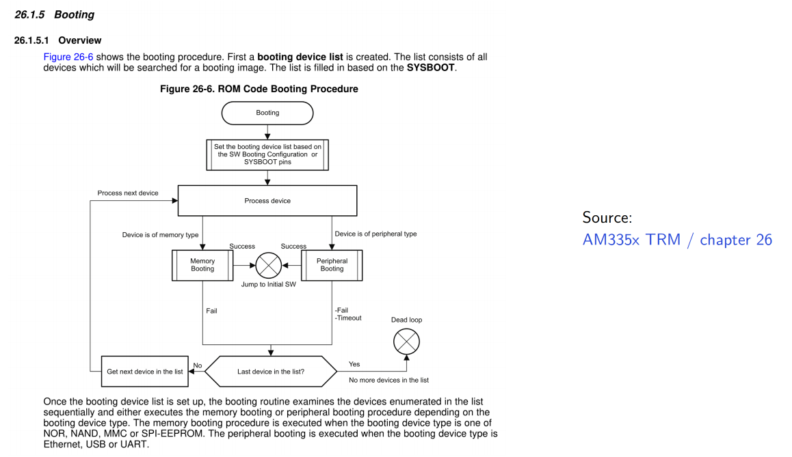
- Two stage booting sequence:
    + 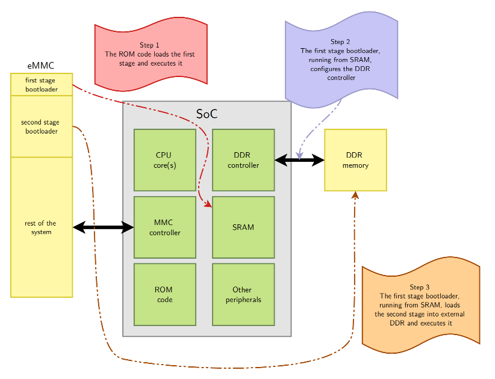
    + 1. ROM code load first stage bootloader từ bộ nhớ vào SRAM
    + 2. first stage bootloader chạy ở SRAM, khởi tạo DRAM
    + 3. first stage bootload load second stage bootloader từ bộ nhớ vào DRAM
- ROM code recovery mechanism:
    + ROM code cung cấp cơ chế phục hồi, cho phép nạp firmware cho bo mạch không có bootloader hoặc bootloader bị hỏng, thường bằng giao thức riêng cho nhà sản xuất thông qua UART hoặc USB
    + Nó thường cho phép đẩy 1 bootloader mới vào RAM, giúp việc nạp bootloader có thể thực hiện tại được
    + 1 số tool của các vendor: STM32 cube, SAM-BA, Snagboot `https://github.com/bootlin/snagboot`,...
- Booting sequence 
    + 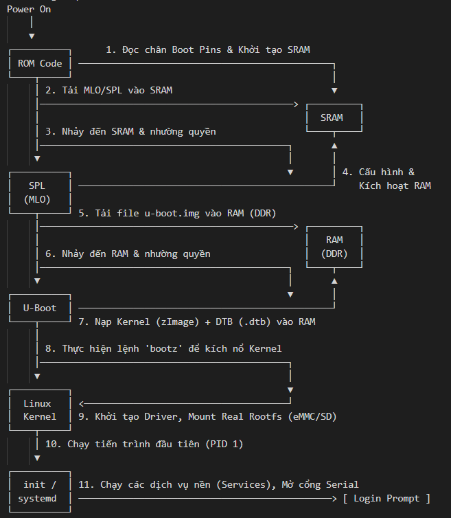

## 3. Bootloaders - giới thiệu 1 số bootloader phổ biến
- GRUB - Grand Unified Bootloader:
    + là bootloader của GNU project
    + chủ yếu dành cho x86
- Syslinux
    + dùng cho việc boot từ network và usb, sdcard
    + https://mirrors.edge.kernel.org/pub/linux/utils/boot/syslinux/
    + syslinux: boot từ FAT filesystem
    + pxelinux: boot từ network
    + isolinux: boot từ CD-ROM
    + extlinux: boot từ phần lớn kiểu filesystem
- systemd-boot
    + trình quản lý boot UEFI đơn giản
    + việc cấu hình được chứa trong EFI system partition
    + https://www.freedesktop.org/wiki/Software/systemd/systemd-boot/
- shim:
    + là bootloader UEFI nhỏ
    + dùng chủ yếu trong việc secure boot
    + https://github.com/rhboot/shim
- **U-boot:**
    + dùng rộng rãi trong phần lớn thiết bị nhúng: arm, risc-v, ....
    + support x86
    + https://docs.u-boot-project.org/en/latest/
- Barebox: 
    + 1 bootloader khác cho cpu nhúng
    + ít được sử dụng hơn U-boot
## 4. Trusted firmware
- Thông thường, bootloader chỉ được dùng trong quá trình booting
- Soc ngày nay có cơ chế bảo mật nâng cao yêu cầu chạy trusted firmware
- Trusted firmware được load bởi bootloader và nó vẫn tồn tại ngay cả sau khi quyền điều khiển đã được giao cho OS
    + trusted firmware chứa trong phần riêng biệt của DDR hoặc SRAM cụ thể, không thể truy cập được từ OS
    + nó cung cấp các service cho OS nhưng OS không thể thực hiện trực tiếp được
    + nó chịu trách nhiệm chạy 1 OS bảo mật bên cạnh OS thường
- Trusted firmware nằm ở mức đặc quyền EL3 (Exception level 3), kiểm soát tuyệt đối toàn bộ phần cứng
- Inteface with secure firmware - nhiệm vụ của trusted firmware:
    + được chuẩn hoá bởi ARM
    + ngăn chặn hệ điều hành đang hoạt động trong môi trường truy cập được vào các phần cứng quan trọng
    + Linux (EL1) giao tiêp với Secure firmware (EL3) qua interface:
        - PSCI - Power state coordination interface: quản lý nguồn điện, on/off cpu, ...
        - SCMI - System control and management interface: quản lý nguồn điện cho các vùng khác, điều chỉnh clock, sensor, hiệu năng
    + Đối với các dòng chip 64-bit hiện đại ngày nay (như dòng i.MX 8, i.MX 9 hay Raspberry Pi 4/5), Trusted Firmware là bắt buộc phải có. Nếu không có firmware này ở tầng EL3 để cung cấp dịch vụ PSCI/SCMI, Linux Kernel sẽ không thể boot được hoặc không thể điều khiển được CPU.
- TF-A - Trusted firmwate-A
    + là phần mềm mẫu mà ARM thiết kế cho các dòng Cotex-A
    + Nhiệm vụ của nó là hiện thực hóa tầng Secure Monitor chạy ở mức đặc quyền tối cao EL3
    + nó có các interface mà OS cần từ secure firmware
    + nó có driver cho khối hardware mà Linux không thể truy cập trực tiếp được
    + nó cần được port riêng cho từng dòng SoC
    + dựa theo platform, có thể nó cần port cho từng board
- Trusted OS, OP-TEE
    + 1 trusted operating system có thể chạy ở secure world được gọi là trusted Execution Environment (TEE)
    + Phân vùng phần cứng giữa secure world và normal world: 1 vài tài nguyên phần cứng chỉ khả dụng trong secure world, bởi trusted OS
    + cho phép chạy app/service tách biệt khỏi linux và có thể cung cấp các service cho Linux app
    + OP-TEE là OS mã nguồn mở bảo mật - secure OS
- Sơ đồ tổng quát trusted firmware: 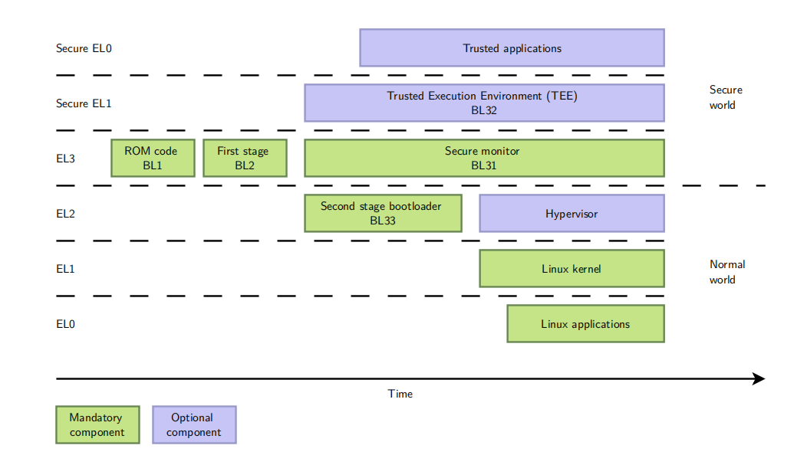
## 5. Example boot sequence on ARM
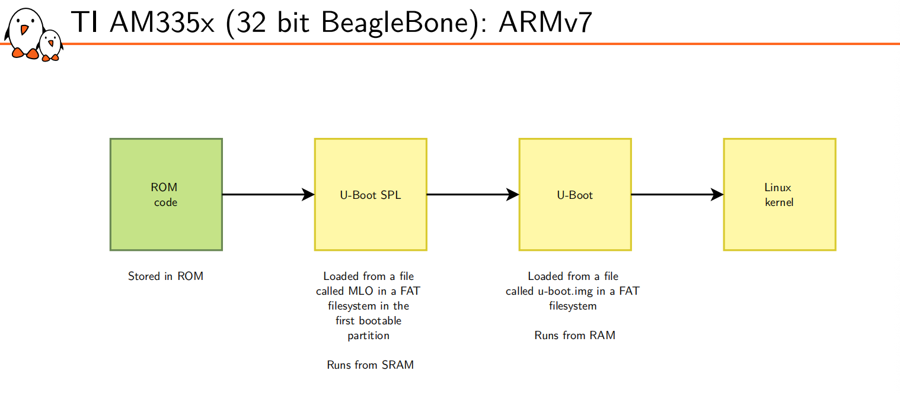
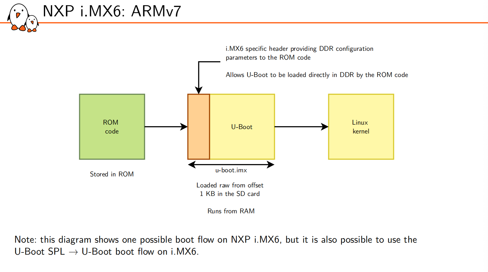
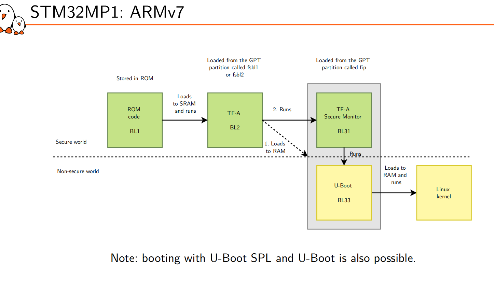
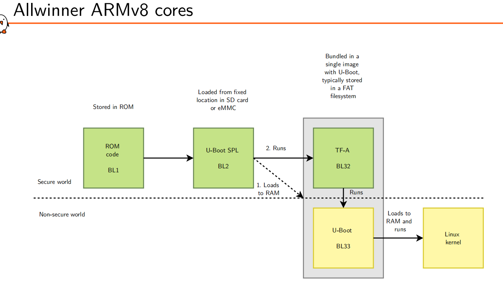
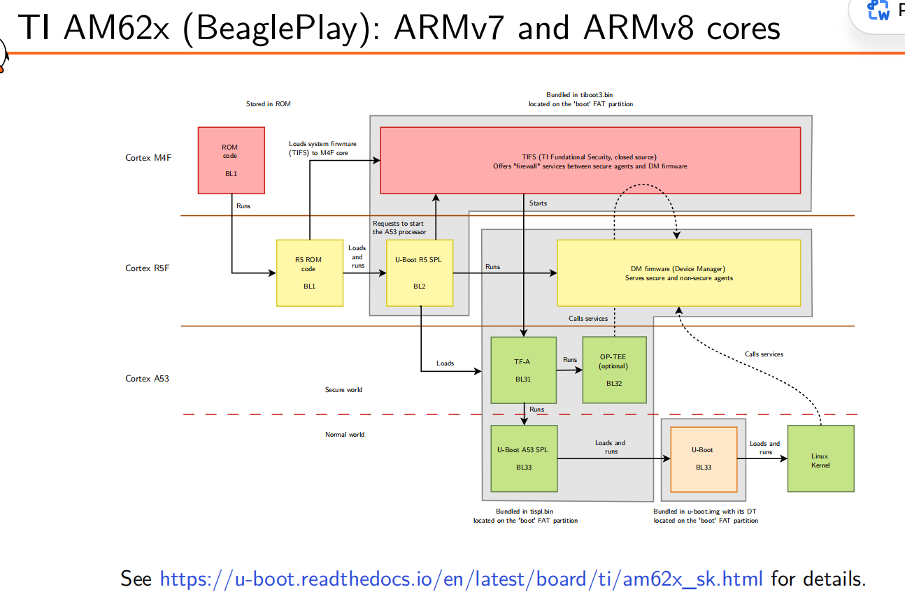

## 6. The U-boot bootloader
- U-boot cấu hình hệ thống dựa vào kconfig từ Linux kernel
- folder configs chứa file cấu hình hỗ trợ nhiều board hoặc platform
    + file cấu hình đó có thể là 1 cấu hình mà hỗ trợ nhiều board có cùng processor
    + file cấu hình định nghĩa tất cả tuỳ chọn liên quan: loại CPU, drivers cần thiết, tính năng U-boot được compile cùng
- U-boot configuration:
    + U-boot cần được cấu hình trước khi compile
    + cấu hình được chứa trong file .config
    + Load cấu hình sẵn có: `make BOARDNAME_defconfig`
    + Mở menu của U-boot: `make menuconfig`
- U-boot compilation:
    + cần phải chỉ định CROSS_COMPILE khi build: `make CROSS_COMPILE=arm-linux-`
    + kết quả là `u-boot.bin` hoặc `u-boot.img`, ...
- Concept of U-boot SPL
    + để đáp ứng được two-state boot process, U-boot có U-boot SPL (secondary program loader)
    + SPC là bản rút gọn của U-boot, đủ nhỏ để đáp ứng được size hạn chế của first stage bootloader
    + nó được hardcode trong C code
- Device tree in U-boot
    + là cấu trúc dữ liệu mô tả phần cứng
    + cho phép phần mềm biết được ngoại vi nào khả dụng và cách kết nối chúng tới system
    + U-boot defconfigs thường chỉ định rõ device tree, nhưng nó có thể được thay đổi bằng biến DEVICE_TREE
- Concept of U-boot environment
    + menuconfig được dùng để cấu hình U-boot tại thời điểm biên dịch
    + U-boot cũng có thể được cấu hình lúc run time nhờ các environment variables
    + Environment variables là cặp key/value
        - Một vài biến môi trường cụ thể ảnh hưởng tới hành vi của các câu lệnh U-boot
        - Có thể thêm biến môi trường và dùng chúng trong scripts
    + Biến môi trường U-boot được load và modify trong RAM
    + U-boot có 1 môi trường default được tích hợp sẵn trong binary của nó
        - được dùng khi không thấy môi trường nào khác
        - được xác định trong file cấu hình
        - môi trường default đôi khi quá phức tạp
- U-boot environment persistent storage
    + dựa vào việc cấu hình, biến môi trường U-boot có thể được lưu tại các vùng sau để không bị mất khi restart
        - offset cố định trong NAND flash
        - offset cố định ở MMC hoặc USB storage, trước điểm bắt đầu của partition đầu tiên
        - trong 1 file nằm ở partition FAT hoặc ext4
        - trong UBI volume
- U-boot environment commands
    + `printenv`: show all variable
    + `printenv <variable-name>` Shows the value of a variable
    + `setenv <variable-name> <variable-value>` Changes the value of a variable or defines a new one, only in RAM
    + `editenv <variable-name>` Interactively edits the value of a variable, only in RAM
    + After an `editenv` or `setenv`, changes in the environment are lost if they are not saved persistently
    + `saveenv`Saves the current state of the environment to storage for persistence.
    + env command, with many sub-commands: env default, env info, env erase, env set, env save, etc.
- U-boot memory allocation - phân bổ bộ nhớ U-boot
    + có nhiều lệnh trong U-boot khi ghi/đọc data từ bộ nhớ có thể cần địa chỉ RAM làm tham số
    + U-boot không có cơ chế phân phối bộ nhớ, người dùng phải tự tìm các vùng nhớ khả dụng để tải/dùng data
    + Dùng lệnh `bdinfo` để biết start address và size của RAM
    + Tránh dùng phần cuối của RAM, vì đó có thể đang được U-boot hoặc vùng nhớ động sử dụng
- U-Boot memory manipulation commands - lệnh thao tác bộ nhớ U-boot
    + các command này dùng để kiểm tra hoặc chỉnh sửa bộ nhớ, dùng cho debug, can thiệp vào thanh ghi
    + các địa chỉ được thao tác trong U-boot là địa chỉ vật lý 
    + hiển thị bộ nhớ: `mw [.b, .w, .l, .q] address [# of objects]`
    + ghi bộ nhớ: `mw [.b, .w, .l, .q] address value [count]`
    + chỉnh sửa bộ nhớ: `mm [.b, .w, .l, .q] address`
- U-boot raw storage commands - lệnh với bộ nhớ chưa qua định dạng
    + U-boot có thể thao tác với raw storage devices
    + Việc U-boot thao tác với raw storage là để trong quá trình khởi động, U-boot có thể nhảy tới các địa chỉ đã lưu biến môi trường trong `U-boot environment persistent storage`
    + Lệnh:
        - NAND flash
            + nand info
            + nand read <addr> <off|partition> <size>
            + nand erase [<off> [<size>]]
            + nand write <addr> <off|partition> <size>
            + ... 
        - MMC
            + mmc info
            + mmc read <addr> <blk#> <cnt>
            + mmc write <addr> <blk#> <cnt>
            + mmc part to show partition table
            + mmc dev to show/set current MMC device
            + ...
        - USB storage
            + usb info
            + usb read <addr> <blk#> <cnt>
            + usb write <addr> <blk#> <cnt>
            + usb part
            + usb dev
            + More: help usb
- U-Boot filesystem storage commands
    + U-boot support nhiều filesystems, danh sách hỗ trợ dựa vào việc cấu hình U-boot
    + Lệnh này giúp U-boot hiểu được cấu trúc và tệp tin trong các phân vùng đã định dạng (FAT, ext4,...)
        - Duyệt file: `ls` (ls mmc 0:1 - danh sách file tại bộ nhớ mmc, device 0, partition 1)
        - Xem thông tin phân vùng `size`
        - Nạp dữ liệu vào RAM để chuẩn bị boot: `load`
- U-boot networking
    - trang 149/522 embedded-linux-slides.pdf
    - load/đọc file từ network
    - TFTP - Trivial File Transfer Protocol
        - trang 150/522 embedded-linux-slides.pdf
- Script in environment varriables
    + biến môi trường có thể chứa 1 đoạn script nhỏ để thực thi 1 vài lệnh và test kết quả của command
        - hữu ích khi muốn tự động boot hoặc nâng cấp processed
        - có thể kết hợp nhiều lệnh bằng dấu `;` ở cuối mỗi lệnh
        - dùng `if`, `then`, `else`, `fi` để test 
        - chạy script bằng lệnh `run <variable-name>`
        - reference biến bằng `$variable-name`
        - ví dụ: `setenv bootcmd tftp 0x21000000 zImage; tftp 0x22000000 dtb; bootz 0x21000000 - 0x22000000'`
- U-boot booting commands
    + Lệnh để boot linux kernel image
        - `bootz`: boot file zImage
            + `bootz [kernel-addr] [initramfs] [device tree addr]`
                - addr: địa chỉ của kernel image trong RAM
                - initramfs: địa chỉ của initrd hoặc initramfs
                - fdt: địa chỉ của Devcei tree được pass vào Linux kernel
        - `booti`: boot file Image
        - `bootm`: boot kernel image với legacy U-boot header
        - `zboot`: boot file bzImage
    + Biến môi trường quan trọng
        - `bootcmd`: danh sách các lệnh được thực thi tự động bởi U-boot sau khi đếm ngược
            + `setenv bootcmd 'tftp 0x81000000 zImage; sleep 0.1; tftp 0x82000000 am335x-boneblack.dtb; bootz 0x81000000 - 0x82000000'`
        - `bootargs`: Linux kernel command line, được thực thi trước khi kernel được load, nó định hình cách linux vận hành
- FIT image
    + Flat Image Tree `image.itb`
    + xu hướng mới của việc boot bằng U-boot (hoặc các bootloader khác)
    + chứa format cho phép đóng gói nhiều image thành 1 cái
        - nhiều kernel image
        - nhiều device tree
        - nhiều initramfs
        - `.its`: file mô tả nội dung image
        - `.itb`: file binary của `.its`
- Generic Distro boot - cơ chế khởi động phân phối chung trong U-boot
    + mỗi board/platform có môi trường U-boot của riêng nó, với custom variables/commands -> lộn xộn -> cần phải tiêu chuẩn hóa hành vi của bootloader, nếu không thì mỗi board sẽ có 1 kiểu boot khác nhau
    + Khi kích hoạt Generic Distro boot, tại thời điểm boot, U-boot sẽ:
        - tìm kiếm vị trí của bootable partition để xem phân vùng nào được đánh dấu cờ khởi động - `part list`
        - với lệnh `sysboot`, U-boot sẽ tìm file /extlinux/extlinux.conf hoặc boot/extlinux/extlinux.conf mà mô tả boot như nào, và sau đó đưa ra lệnh để người dùng lựa chọn
        - khi cấu hình đã được chọn, U-boot load và boot kernel, device tree, và initramfs images
        - ví dụ: `part list mmc 0 -bootable bootpart; sysboot mmc 0:$bootpart any`
    + Một số biến môi trường cần được set
        - `kernel_addr_r`: địa chỉ trong RAM để load kernel image
        - `ramdisk_addr_r`: địa chỉ trong RAM để load initramfs image
        - `fdt_addr_r`: địa chỉ trong RAM để load DTB (Flattened device tree)
        - `pxefile_addr_r`: địa chỉ trong RAM để load file config, thường là extlinux.conf
        - `boootfile`: đường dẫn của file config (Ví dụ: `/boot/extlinux/extlinux.conf`)
## 7. TF-A: trusted firmware
- Concept of FIP
    + FIP là firmware image package, là concept do TF-A quản lý
    + Là 1 định dạng đóng gói dữ liệu được định nghĩa và sử dụng bởi TF-A
    + nhiệm vụ làm vỏ bọc để chứa BL33 (no-trusted firmware)
- TF-A
    + không dùng Kconfig để cấu hình
    + tất cả cấu hình được dựa vào biến mà pass vào cùng lệnh `make`
- Configure TF-A: important variables
    + `CROSS_COMPILE`
    + `ARCH`
    + `ARM_ARCH_MAJOR` = 7 cho ARMv7 hoặc 8 cho ARMv8  
    + `PLAT` SoC family, any directory name in plat that contains platform.mk
    + AARCH32_SP, the Secure Payload, specific to ARMv7. Either OP-TEE or the built-in SP-MIN provided by TF-A
    + `DTB_FILE_NAME`, path to the Device Tree describing our board
    + `BL33`, path to the second stage bootloader, usually U-Boot, to include in the FIP image
    + Specific to STM32MP1
        - `BL33_CFG`, path to the U-Boot Device Tree `u-boot.dtb`
        - `STM32MP_SDMMC=1`, enable support for SD card/eMMC in TF-A
## 8. Cách build U-boot
- export CROSS_COMPILE=arm-linux-gnueabihf-
- make am335x_evm_defconfig
- make menuconfig
- make DEVICE_TREE=am335x-boneblack
- truyền file qua U-boot bằng tftp thì đặt file ở Ubuntu /srv/tftp

# Linux kernel introduction
## 1. Linux kernel in the system
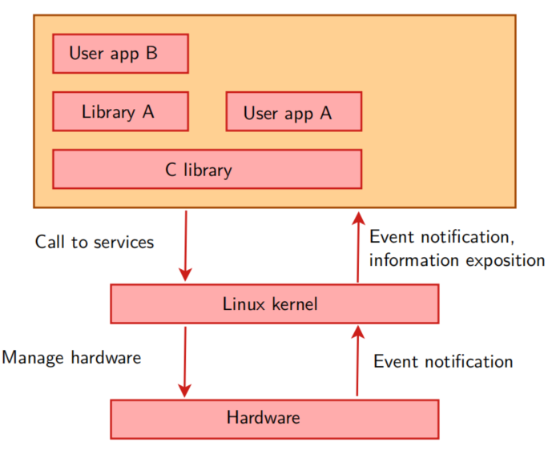
- Linux kernel đóng vai trò cầu nối giữa tầng app và phần cứng
## 2. Linux kernel main roles
- Linux kernel quản lý tất cả phần cứng (CPU, memory, I/O)
- cung cấp API để cho phép user space và libraries truy cập vào phần cứng
- quản lý truy cập đồng thời và sử dụng tài nguyên từ các ứng dụng
## 3. System calls
- Interface giữa kernel space và user space là các lệnh system calls
- có khoảng 400 lệnh system call: lệnh với file, network, process management, ...
- Các lệnh system call này được đóng gói trong C library và user space thường dùng các API trong trong C library để giao tiếp với kernel
## 4. Pseudo filesystems
- Linux thể hiện thông tin system và kernel ở userspace thông qua pseudo filesystems, hay còn gọi là virtual filesystems
- Pseudo filesystems cho phép app thấy được thư mục, file mà không tồn tại trong bộ nhớ thực
- Pseudo filesystems quan trọng nhất là:
    + /proc: chứa các process
    + /sys: mô tả hệ thống dạng device tree được kết nối bằng các bus
## 5. Linux kernel sources
- `https://git.kernel.org/pub/scm/linux/kernel/git/torvalds/linux.git/`
- Stable: `https://git.kernel.org/pub/scm/linux/kernel/git/stable/linux.git`
- Linux kernel size and structure
    + Source code Linux tầm 80k file, 35M dồng, nặng 1.3Gb, nhưng Linux kernel chỉ nặng vài MB -> Lý do là bởi Linux source chứa nhiều device drivers, network protocol, filesystems, ..., còn phần lõi thì rất nhỏ
## 6. Kernel configuration
- Kernel chứa hàng ngàn device drivers, filesystem drivers, ...
- Có hàng ngàn tùy chọn cho kernel, được lựa chọn để build kernel
- Kernel configuration là quá trình set các tùy chọn mà user muốn kernel được build ra sao
- Tùy chọn phụ thuộc vào:
    + Kiến trúc của target, hardware
    + Khả năng mà mình muốn cấp cho kernel
- Kernel configuration và build system dựa vào nhiều Makefiles
    + người dùng chỉ tương tác với Makefile ở thư mục gốc của kernel source
    + `make <target>`
- Cấu hình và build: 
    + Initial configuration:
        - `make name_defconfig`: cấu hình linux kernel theo thiết lập sẵn của từng file defconfig, lệnh này sẽ tạo ra file `.config`
        - `make menuconfig`: cấu hình thêm tùy chỉnh
        - có thể dùng `make savedefconfig` để lưu lại tùy chỉnh dạng file `name_defconfig`
    + `make ARCH=arm CROSS_COMPILE=arm-linux-...` hoặc `export ARCH=arm, export CROSS_COMPILE=arm-linux-..., make`
    + Cần chỉ rõ kiến trúc cần build cho kernel: `ARCH=arm`, nếu không thì mặc định kernel build system sẽ build cho máy host
    + Lựa chọn compile: native compiler (gcc) hoặc cross compiler (arm-linux-)
        - Nếu build với Clang thì set LLVM thành 1
- Built-in or Module?
    + kernel image là 1 file đơn, là output của việc link tất cả object file liên quan tới tính năng được enable trong việc cấu hình. Đây là file được load vào RAM bởi bootloader. Tất cả các tính năng khả dụng ngay lập tức khi kernel start, tại thời điểm không có filesystem tồn tại 
    + 1 vài tính năng có thể được compile dạng module
        - load/unload lúc runtime
        - mỗi module được thể hiện qua device file
        - Không thể boot sớm module vì thời điểm boot không có filesystem nào
- Kernel option types - các kiểu dữ liệu trong Kconfig
    + có nhiều kiểu cấu hình kernel, được define trong file Kconfig, rất hữu ích để phân biệt giữa kernel build từ nhiều options
    + `bool` option: 
        - true: thêm tính năng vào kernel
        - false: loại bỏ tính năng khỏi kernel
    + `tristate` options:
        - true: thêm tính năng vào kernel image
        - module: thêm tính năng như 1 kernel module
        - false: loại bỏ tính năng
    + `int` options: chỉ định các giá trị số nguyên
    + `hex` options: chỉ định các giá trị số hex, ví dụ CONFIG_PAGE_OFFSET=0xC0000000
    + `string` options: chỉ định giá trị string, ví dụ CONFIG_LOCALVERSION=-no-network
- Kernel option dependencies
    + Giả sử việc bật driver network yêu cầu network stack phải được bật, vì vậy có 2 cách cấu hình trong file Kconfig
        ```
        B sẽ không hiện cho đến khi A được enable
        config B
            depends on A
        ```
        ```
        Khi A được enable, B sẽ enable theo
        config A
            select B
        ```
- xconfig
    + `make xconfig`
    + là 1 giao diện đồ họa để cấu hình kernel
    + yêu cầu phải có gói `qtbase5-dev`
- menuconfig
    + `make menuconfig`
- make oldconfig
    + `make oldconfig`
    + hữu ích khi nâng cấp .config từ bản kernel trước đó
    + Nếu bạn chỉnh sửa tệp .config bằng tay, việc chạy lệnh `make oldconfig` sau đó sẽ rất hữu ích, để thiết lập giá trị cho các tham số mới có thể xuất hiện do thay đổi phụ thuộc.
- Nếu muốn trở về bản .config cũ, dùng file `.config.old`

## 7. Compiling and installing the kernel
- make -jX (X là số nhân của CPU)
- recompile nhanh hơn -> dùng `export CROSS_COMPILE="ccache arm-linux"`
- Kernel compilation results - output của compile kernel
    + `arch/<arch>/boot/Image`: file kernel có thể boot
    + `arch/<arch>/boot/*Image`: file kernel nén có thể boot
        - bzImage: cho x86
        - zImage: cho arm
        - Image.gz: cho RISC-V
    + `arch/<arch>/boot/dts/<vendor>/*.dtb`: file device tree blob (file binary của device tree)
    + Các file .ko của kernel module, nằm rải rác trong source kernel
    + `vmlinux`: file raw kernel image, định dnagj ELF, hữu ích để debug
- Lệnh build riêng zImage: `make zImage`
- Kernel installation: native case - máy host
    + `sudo make install`: install kernel cho máy host
    + Sau khi chạy lệnh trên, hệ thống sẽ: 
        - tạo file /boot/vmlinuz-<version>: file nén kernel image, giống với arch/<arch>/boot
        - tạo file /boot/System.map-<version>: chứa địa chỉ cho mục đích debug
        - tạo file /boot/config-<version>: cấu hình của kernel này
    + Ở GNU/Linux thường sẽ chạy 1 công cụ cấu hình bootloader để kernel mới có thể được load ở lần boot tiếp theo
- Kernel installation: embedded case
    + Không có quy chuẩn chung cho việc deploy kernel ở hệ thống nhúng
    + Vì vậy việc đưa kernel vào target thường được cấu hình qua các hệ thống build (yocto, buildroot,...)
- Module installation: native case
    + `sudo make modules_install`
    + Cài tất cả kernel module vào /lib/modules/<version>/
        - `kernel`: module .ko file
        - `modules.alias`,`modules.alias.bin`: file chứa bí danh 
        - `modules.dep`, `modules.dep.bin`: file quản lý mức độ phụ thuộc giữa các module
        - `modules.symbols`, `modules.symbols.bin`: file khai báo ký hiệu thuộc module nào
        - `modules.builtin`: danh sách modules được build thẳng vào cùng kernel
- Module installation: embedded case
    + `make modules`: build các kernel modules
    + `make INSTALL_MOD_PATH=<dir>/ modules_install`: dir: đường dẫn chứa root file system trong target
- Kernel cleanup targets
    + make clean: xóa hết trừ .config và các file build hỗ trợ build externel modules
    + mrproper: xóa hết
    + distclean: xóa nhiều hơn mrproper
- Kernel building overview
    + 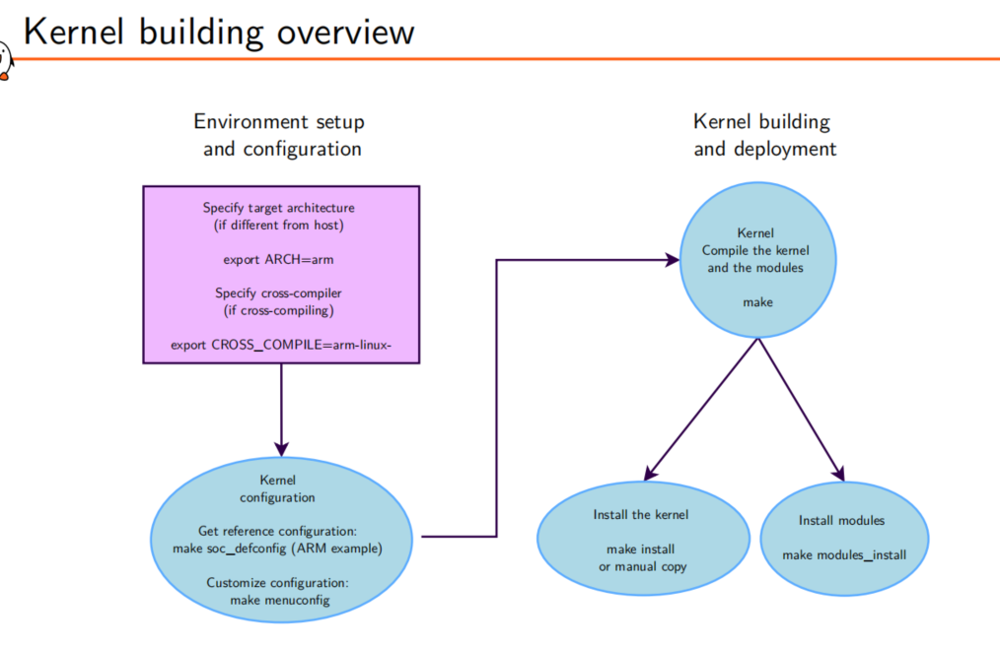
## 8. Booting the kernel
- Nhiều hệ thống nhúng có nhiều phần cứng non-discoverable (serial ethernet, I2C, USB controller, ...)
- Những phần cứng này cần được khai báo và pass vào Linux kernel, nếu không thì hardware đó coi như vô hình
- Bootloader sẽ cung cấp khai báo này khi start kernel thông qua dạng Device tree
- Customize your board device tree
    + Mỗi board/architecture có device tree riêng biệt , có sẵn tại `arch/<arch>/boot/dts/<vendor>/<board>.dtb`
    + Cần cấu hình device tree để:
        - mô tả ngoại vi được kết nối vào bus và cấu hình chúng
        - cấu hình pin muxing 
        - cấu hình vài thông số hệ thống: flash partitions, kernel command line
- Booting with U-boot
    + Load zImage tại địa chỉ X trong memory
    + Load .dtb tại địa chỉ Y trong memory
    + Start kernel: boot[z|i] X - Y (dấu `-` thể hiện không có `initramfs`)
- Kernel command line
    + kernel có thể thay đổi hành vi mà không cần recompile bằng cách dùng các kernel command line
    + kernel command line là 1 string mà định nghĩa nhiều tham số cho kernel
        - rất quan trọng để cấu hình hệ thống
        - `root=` cho root file system
        - `console=` hiển thị log kernel
        - ví dụ: `console=ttyS0 root=/dev/mmcblk0p2 rootwait`
        - xem thêm command line tại `https://www.kernel.org/doc/html/latest/admin-guide/kernel-parameters.html`
- Passing the kernel command line
    + U-boot chứa Linux kernel command line string trong biến môi trường `bootargs`
    + Ngay trước khi start kernel, Uboot sẽ chứa nội dung của `bootargs` vào `chosen` section của Device tree
    + Kernel sẽ hoạt động khác nhau dựa vào cấu hình
        - If CONFIG_CMDLINE_FROM_BOOTLOADER is set: The kernel will use only the string from the bootloader
        - If CONFIG_CMDLINE_FORCE is set: The kernel will only use the string received at configuration time in CONFIG_CMDLINE
        - If CONFIG_CMDLINE_EXTEND is set: The kernel will concatenate both strings

# Linux root filesystem
## 1. Filesystems
- filesystems được dùng để tổ chức dữ liệu và file trong bô nhớ hoặc network
- filesystems được mount vào địa chỉ đặc biệt trong cấu trúc thư mục phân cấp này
- điều này cho phép ứng dụng truy cập vào file và đường dẫn dễ dàng
- Tạo 1 mountpoint: `sudo mkdir /mnt/dung`
- `mount -t type device mountpoint`
    + type: kiểu của filesystem
    + device: bộ nhớ của device,network
    + mountpoint: vùng được mount
## 2. Root filesystem
- là filesystem được mount vào đường dẫn root (/) -> gọi là root filesystem
- 1 rootfs cơ bản nhất cần có:
    + Cấu trúc thư mục: /dev, /lib, /etc, ...
    + Thư viện hệ thống: /lib/.so
    + Các lệnh điều khiển: lệnh để tương tác với file, process, thường được cung cấp vởi Busybox
- root filesystem không được mount bằng lệnh `mount` mà nó được mount bởi kernel: `root=`
- nếu `root=` không được chỉ định, kernel bị panic
- root filesystem có thể được mount từ:
    + hard disk 
    + USB: `root=/dev/sdXY`
    + SD card: `root=/dev/mmcblkXpY`
    + NAND flash
    + ...
- Mounting rootfs over the network:
    + Khi hoạt động qua network, root filesystem có thể là 2 thư mục ở máy host, export bởi NFC (Network file system) -> chia sẻ thư mục chứa rootfs từ máy tính sang cho board
    + Thuận tiện cho cập nhật files trong root filesystem mà không cần khởi động lại
    + Có thể có hệ thống root filesystem lớn
    + Ở máy host:
        + Thêm cấu hình sau vào file /etc/exports:
            - `/home/tux/rootfs 192.168.1.111(rw,no_root_squash,no_subtree_check)`
                + /home/tux/rootfs: đường dẫn chứa rootfs ở máy host
                + 192.168.1.111: địa chỉ ip của board
                + (rw,no_root_squash,no_subtree_check): cho phép đọc/ghi, có quyền như root, tắt kiểm tra cây thư mục con để tăng tốc truyền file
            - sau đó chạy: `sudo exportfs -r`
    + Ở board:
        - kernel phải được compile với:
            + CONFIG_NFS_FS=y
            + CONFIG_ROOT_NFS=y
            + CONFIG_IP_PNP=y
        - cấu hình `root=/dev/nfs`
        - `ip=192.168.x.y`: IP của target
        - `nfsroot=192.168.a.b:/home/tux/rootfs/` (có thể cần thêm `,nfsvers=3,tcp` vì NFS ver 2 client và UDP có thể từ chối NFS server)
- Root filesystem in memory: initramfs
    + initramfs là phân vùng file system thu nhỏ được được nạp thẳng vào RAM khi boot. Kernel sẽ dùng nó để chạy các cấu hình cơ bản, nạp driver trước khi mount rootfs vào hệ thống
    + cũng có thể boot system với filesystem trong memory initramfs
    + Hoặc từ một kho lưu trữ CPIO được nén tích hợp vào kernel image
    + Lợi ích:
        - khởi động nhanh các root filesystems nhỏ. Bởi vì filesystem đươc load hoàn tất tại thời điểm boot nên ứng dụng khởi động rất nhanh
        - toàn bộ rootfs sẽ nằm 100% ở RAM, nên khi mất điện thì vùng này mất hết
        - việc đưa rootfs (ở đây thường là hệ thống minimal filesystem được tạo ra từ Busybox) vào initramfs tạo tiền đề cho việc chuẩn bị môi trường cho rootfs thật
    + Để tạo 1 initramfs,
        - Đóng gói rootfs thành định dạng `cpio`, sau đó nén lại bằng gzip
            ```
            cd rootfs/
            find . | cpio -H newc -o > ../initramfs.cpio
            cd ..
            gzip initramfs.cpio
            ```
        - Tiếp tục đóng gói để U-boot đọc được:
            ```
            mkimage -n 'Ramdisk Image' -A arm -O linux -T ramdisk -C gzip -d initramfs.cpio.gz uInitramfs
            ```
            -> rồi load uInitramfs vào địa chỉ trong RAM như 0x81000000 của zImage
        - Sau đó: `bootz kernel-addr initramfs-addr dtb-addr`
        - Log `Freeing unused kernel image (initmem) memory: 1024K` xuất hiện thì đã thành công
    + Để đóng gói initramfs cùng với kernel thì cần cấu hình
        - CONFIG_INITRAMFS_SOURCE= đường dẫn tới thư mục rootfs hoặc file cpio
## Root filesystem organization
- /bin: Basic programs
- /boot: Kernel images, configurations and initramfs (only when the kernel is loaded from a filesystem, not common on non-x86 architectures)
- /dev: Device files (covered later)
- /etc: System-wide configuration
- /home: Directory for the users home directories
- /lib: Basic libraries
- /media: Mount points for removable media
- /mnt: Mount point for a temporarily mounted filesystem
- /proc: Mount point for the proc virtual filesystem
- /root: Home directory of the root user
- /run: Run-time variable data (previously /var/run)
- /sbin: Basic system programs
- /sys: Mount point of the sysfs virtual filesystem
- /tmp: Temporary files
- /usr/bin: Non-basic programs
- /usr/lib: Non-basic libraries
- /usr/sbin: Non-basic system programs
- /var: Variable data files, for system services. This includes spool directories and files, administrative and logging data, and transient and temporary files

## Pseudo filesystems
- proc virtual filesystem
    + tồn tại từ thời điểm bắt đầu của Linux
    + Nó cho phép:
        - kernel hiển thị phân tích về process đang chạy trong system
        - user điều chỉnh thông số system lúc runtime về quản lý process, quản lý memory,...
    + được dùng bởi nhiều app user space, và được mount vào /proc
    + Lệnh để mount proc: `mount -t proc nodev /proc`
    + Sau khi mount proc, có thể dùng lệnh `halt` để dừng mọi tiến trình 1 cách an toàn, dữ liệu ở RAM chưa được lưu vào ổ cứng sẽ được lưu hết, xong rồi mới dừng hệ thống
- proc contents:
    + đường dẫn cho mỗi process đang chạy là /proc/<pid>, `cat /proc/3840/cmdline` thể hiện thông tin về process đó
    + /proc/interrups, /proc/iomem, /proc/cpuinfo chứa thông tin chung về thiết bị
    + /proc/cmdline chứa kernel command line
    + /proc/sys chứa file có thể được ghi để điều chỉnh thông số kernel -> được gọi là `sysctl`
- sysfs filesystem - hệ thống tệp tin sysfs
    + quản lý thông tin về phần cứng
    + sysfs giúp user space có thể nhìn thấy được phần cứng 
    + tất cả ứng dụng sử dụng sysfs đều được mount vào /sys: `mount -t sysfs nodev /sys` - lệnh này mount tập tin sysfs vào thư mục /sys
- devtmpfs filesystem
    + chứa các device file trong /dev

## Minimal filesystem
- Basic applications:
    + để có thể làm việc, hệ thống Linux cần 1 số ứng dụng để làm việc
    + init application: chương trình user space đầu tiên chạy bởi kernel sau khi mount root filesystem 
        - kernel cố gắng chạy lệnh trong tham số `init=` của kernel 
        - nếu điều trên không được, nó sẽ cố gắng chạy /sbin/init, /etc/init, /bin/init và /bin/sh
        - trong trường hợp của initramfs, kernel sẽ chỉ tìm kiếm /init. Đường dẫn khác có thể được cung cấp bởi `rdinit=`
        - nếu tất cả điều trên không được, kernel sẽ bị panic và quá trình boot bị hỏng
        - init application chịu trách nhiệm cho việc start tất cả ứng dụng user space và services, và init application sẽ là process cha cho các process sau đó
    + các phần mềm cơ bản phải có để tạo lên 1 hệ thống Linux
        - shell: để chạy lệnh
        - basic UNIX executables: các lệnh mv, cp, mkdir, cat, ...
        -> các thành phần này cần được tích hợp vào root filesystem
- Overall booting process
    + bootloader: load DTB và kernel vào RAM, start kernel
    + kernel: 
        - khởi tạo thiết bị phần cứng và kernel subsystems
        - mount root filesystems được chỉ thị bởi `root=`
        - start init application, mặc định /sbin/init
    + /sbin/init: start các app user space khác và service
- Overall booting process with initramfs
    + bootloader: load initramfs, DTB, kernel vào ram, start kernel
    + kernel:
        - khởi tạo thiết bị phần cứng và kernel subsystems
        - giải nén initramfs vào cache
        - start /init nếu tìm thấy 
    + /init: trong initramfs
        - start sớm các lệnh user space
        - load driver cần truy cập final root filesystem
        - mount root filesystem và switch qua nó
    + /sbin/init: trong root filesystem 
        - regular system startup

# BusyBox
## Vì sao cần busybox
- 1 hệ thống Linux cần 1 bộ chương trình cơ bản để hoạt động: init program, shell, công cụ cơ bản để quản lý file
- Hệ thống Linux thông thường, các chương trình này được cấp bởi những project khác nhau
- Busybox là 1 giải pháp thay thế, phổ biến với hệ thống nhúng để xây dựng 1 minimal filesystem, nó gom tất cả công cụ UNIX thành 1 file binary cực nhẹ

## General purpose toolbox: BusyBox - bộ công cụ đa năng
- viết lại nhiều lệnh UNIX 
- chứa trong disk 1.44MB
- tích hợp vào 1 dự án duy nhất, dễ dàng làm việc
- Cung cấp giải pháp thực thi cho init application

## BusyBox in the root filesystem
- tất cả công cụ được compile vào 1 file executable là /bin/busybox
- Liên kết tới /bin/busybox được tạo cho mỗi app mà tích hợp vào busybox
- Với cấu hình đầy đủ tính năng, busybox nặng khoảng 500KB khi build với uClibc và 1MB khi build với glibc
## Configuring BusyBox
- make defconfig hoặc make allnoconfig
- make menuconfig: chọn các command muốn compile
## Compiling BusyBox
- Set the cross-compiler prefix in the configuration interface:
`Settings → Build Options → Cross Compiler prefix`
Example: arm-linux-
- Set the installation directory in the configuration interface:
`Settings → Installation Options → Destination path for 'make install'`
- Add the cross-compiler path to the PATH environment variable:
`export PATH=$HOME/x-tools/arm-unknown-linux-uclibcgnueabi/bin:$PATH`
- Compile BusyBox:
`make`
- Install it (this creates a UNIX directory structure with symbolic links to the busybox executable):
`make install`
## Applet highlight: busybox init - điểm nổi bật của busybox init
- Đơn giản hơn nhiều cho với các trình khởi tạo trên máy tính bàn
- chỉ sử dụng file cấu hình duy nhất là `/etc/inittab` (Initialization Table), mỗi dòng trong file có định dạng `<id>::<action>::<process>`, dùng để chỉ định script/lệnh nào chạy đầu tiên, 
- Cho phép start system service tại thời điểm startup, đảm bảo các service luôn chạy trong hệ thống
- Tệp `/etc/init.d/rcS`:
    + script đầu tiên chạy để mount các hệ thống tệp ảo
    + Có thể tạo nếu chưa có, nếu có rồi thì thêm script mount các hệ thống tệp ảo (pseudo system) nếu cần
## Applet highlight: BusyBox vi - trình soạn thảo vi
- thêm `vi` vào busybox chỉ tốn thêm 20KB
## Folder /lib
- Khi biên dịch dynamic-linked (biên dich động), để các hàm ls, ps, cp, ... có thể thực hiện được thì cần lib `ld-linux-armhf.so.3`(đây là lib.so khi dùng glibc, tùy dùng C library gì mà add cho hợp lý) để có thể chạy được
- Khi biên dịch static, thì không cần lib gì, các thư viện đã được build cùng busybox

# Accessing hardware devices
## Kernel drivers
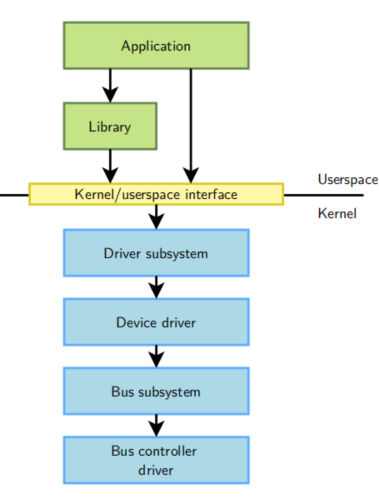
- Cách mà ứng dụng tương tác với phần cứng 
    + Application: truy cập device thông qua kernel/user-space interface hoặc qua C/C++ library
    + Driver subsystem: cung cấp các tính năng nhóm thiết bị ra ngoài thông qua kernel/user-space interface tiêu chuẩn
    + Device driver: trình điều khiển, quản lý thiết bị cụ thể trong kernel
    + Bus subsystem: cung cấp API cho driver để truy cập vào bus cụ thể: i2c, spi, ...
    + Bus controller driver: trình điều khiển bus
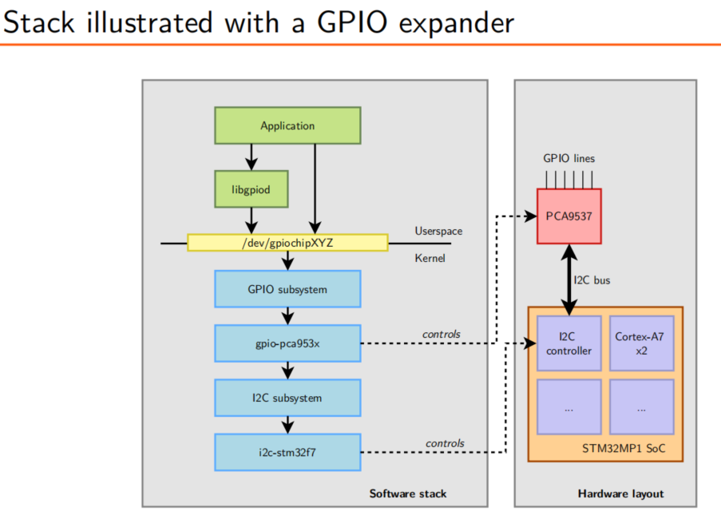
- Standardized user-space interface:    
    + Kernel drivers cung cấp interface chuẩn cho user-space
    + tất cả device ở cùng class (ví dụ: cùng GPIO controller) đều thể hiện chung 1 tiêu chuẩn cho user-space
    + App không cần biết thông tin về GPIO controller, chúng chỉ cần biết interface là gì
    + App có thể dùng các library có sẵn để tận dụng các interface 
- Có nhiều kernel subsystem cho các class device:
    + Network: ethernet, wifi, can, 
    + GPIO
    + PWM
    + Watchdog
    + ...
- Accessing devices directly from user-space
    + Dù device drivers chủ yếu dùng trong kernel, nó cũng có thể được truy cập trực tiếp từ user-space
    + Đặc biệt có ích cho các device kém tương thích với hệ thống kernel subsystem đã có
    + Kernel cung cấp cơ chế đi kèm, dựa vào các bus của nó nên user-space có thể sử dụng để truy cập phần cứng
        - i2c: i2c-dev
        - spi: spidev
        - memory-mapped: UIO
        - USB: /dev/bus/usb, qua libusb
- Điều gì có thể xảy đến với 1 user-space driver?
    + Làm mất đi khả năng tích hợp và chia sẻ tài nguyên hệ thống
    + Nếu viết 1 GPIO ở tầng user-space, các kernel driver khác không thể dùng GPIO từ GPIO controller đó nữa. Device khác dùng GPIO signal từ GPIO controller đó không thể điều khiển, cấu hình những signal đó. App sẽ hạn chế ở việc portable, cần thay đổi nhiều để hỗ trợ các loại GPIO controller
    + Nếu viểt driver touch screen ở tầng user-space, Linux graphics stack component không thể dùng touchscreen
    + Nếu viết driver network ở tầng user-space, vẫn có thể gửi nhận packet, nhưng không tận dụng được Linux kernel networking stack, và không có ứng dụng nào khác có thể dùng được network drvice đó
- Upstream drivers và out-of-tree drivers
    + Upstream drivers: 
        - chứa hàng ngàn driver
        - được kiểm duyệt bởi cộng đồng
        - tuân theo các interface tiêu chuẩn 
        - các vendor kernel thường được chứa trong kernel tree
    + Out-of-tree drivers:
        - các vender thường cung cấp out-of-tree driver
        - có thể gặp lỗi khi có kernel mới
        - thường không dùng các tiêu chuẩn interface
        - là các driver tự tạo, giống như kernel driver .ko mình thường build
- Finding linux kernel drivers
    + dùng lệnh `git grep -i driver_name`
## User-space interfaces to drivers
- 3 interfaces chính để truy cập phần cứng được exposed bởi Linux kernel
    + Device nodes in /dev
    + Entries in the sysfs filesystem
    + Network sockets and related APIs
- Device in /dev
    + cho phép app truy cập thiết bị phần ucnwgs
    + Có 2 loại device trong linux kernel:
        - Character device:
            + Hầu hết các device không phải là block device thì được Linux coi là character device
            + được dùng cho serial port, terminal, sound card, frame buffer
        - Block device:
            + là device được tạo từ các khối có kích thước cố định, có thể đọc, ghi data
            + được dùng cho ổ cứng, usb, sdcard, ...

    + Kernel nhận diện device bởi bộ 3 thông tin
        - Type: character hay block
        - Major: loại device
        - Minor: device cụ thể trong loại device đó
        - Đọc `/kernel/linux/Documentation/admin-guide/devices.txt` nếu muốn cấu hình major, minor thủ công
- Devices: everything is a file
    + trong UNIX, tất cả đều là file, gọi là device file
    + device file được chứa trong /dev
- Creating device file:
    + Trước Linux 2.6.32, dùng `mknod /dev/<device> [c|b] major minor`
    + devtmpfs virtual filesystem có thể được mount vào /dev, kernel tự động tạo/xóa device files trong /dev
    + Ngoài devtmpfs, có thể dùng:
        - udev: 
            + nhận event từ kernel về việc xuất hiện/biến mất của device
            + tạo/xóa device files, thay đổi quyền, load kernel tự động
        - mdev: phiên bản nhẹ của udev, là 1 phần của busybox
- sysfs filesystem - trong sysfs gồm có:
    + block/ liên kết tượng trưng cho block device trong /sys/devices
    + bus/ folder cho các loại bus, /drivers: tất cả driver cho device kết nối qua bus đó, /devices: tất cả device kết nối tới bus dó
    + class/ folder cho device class: input, led, pwm, ...
    + dev/ liên kết tượng trưng cho mỗi block/character device
    + devices/ tất cả device trong hệ thống
    + firmware/ đại diện cho firmware data, có devicetree/ và fdt/ (device tree binary)
    + fs/ liên quan tới filesystem driver
    + kernel/ liên quan tới kernel subsystem
    + module/ liên quan tơi kernel modules
    + power/ quản lý power
- Tất cả device đều hiển thị trong sysfs, liệu chúng có interface trong /dev không?
    + thường /dev sẽ có interface để truy cập device
    + /sys chứa thông tin chi tiết hơn về devices
    + tuy nhiên, vài device chỉ có sysfs interface: /sys/class/leds, /sys/class/pwm, ...
- Accessing GPIOs - ví dụ cho GPIO
    + Cách cũ: GPIO có thể được truy cập qua interface của /sys/class/gpios
    + Cách mới: dùng interface `libgpiod`
        - truy cập qua `/dev/gpiochipx`
        - dùng C library
        - cung cấp các công cụ dòng lệnh: `gpiodetect`, `gpioset`, ...
- Other virtual filesystems
    + `debugfs`: mount vào `/sys/kernel/debug`, chứa thông tin debug của kernel
        - /sys/kernel/debug/pinctrl - cho pin mux debug
        - /sys/kernel/debug/gpio - cho GPIO debug
        - /sys/kernel/debug/pwm - cho PWM debug
    + `configs`: mount vào `/sys/kernel/config`
        - cho phép quản lý cấu của cơ chế kernel nâng cao
## Using kernel modules
- Tại sao lại là kernel module?
    + Giữ cho kernel image nhỏ nhất
    + Load driver theo nhu cầu của hardware, hỗ trợ nhiều loại device
    + Cho phép test, debug mà không cần reboot
    + Giảm thời gian boot, cho phép driver khởi tạo sau khi user-space đã start các app cần thiết
- Module installation and metadata
    + các module được đặt ở `/lib/modules/<kernel-version>`
    + kernel module được compile thành file /ko
    + metadata file trong `/lib/modules/<kernel-version>`:
        - modules.dep
        - modules.alias
        - modules.symbols
        - modules.builtin
        - mỗi file có 1 file .bin đi kèm, ghi thông tin về version
- Module dependencies: `modules.dep`
    + Vài kernel module có thể phụ thuộc vào module khác, dựa vào kí hiệu (function hoặc data tructures) mà chúng dùng
    + Ví dụ: module `ubifs` dựa vào `ubi` và `mtd` -> vì vậy `ubi` và `mtd` cần phải load trước `ubifs`
    + dependencies được mô tả trong `/lib/modules/<kernel-version>/modules.dep` và `/lib/modules/<kernel-version>/modules.dep.bin`
- Module alias: `module.alias`
    + Mã định danh của module dùng để nhận diện thiết bị 
    + Mã này được đối chiếu với MODALIAS được gửi từ bus của device
- Module utilities: 
    + `modinfo`: xem các thông tin của kernel module
    + `lsmod`: liệt kê các kernel modules đã được load
    + `insmod`, `rmmod`
    + `modprobe`: modprobe <module-name>
        - lệnh load/unload nâng cao hơn insmod, rmmod
        - tự động giải quyết các dependencies bằng cách dùng `modules.dep`
        - gỡ bằng lệnh `modprober -r <module-name>`, và tự giải quyết các dependencies
- Passing parameters to modules
    + 1 số module cho phép truyền param để điều chỉnh hành vi
    + chủ yếu mục đích cho debug/tweaking
    + `insmod dung.ko delay_use=0`
    + modprobe hỗ trợ file /etc/modprobe.conf hoặc các file trong /etc/modprobe.d/: `options usb-storage delay_use=0`
    + thông qua kernel command, khi module được build static vào kernel, `usb-storage.delay_use=0` được thực hiện
- Modules in sysfs
    + tất cả module đều hiển thị trong sysif, ở /sys/module/<name>
    + Chứa nhiều thông tin về module
## Describing non-discoverable hardware - Device tree
- các cách để mô tả phần cứng
    + trực tiếp trong code của bootloader
    + dùng bảng ACPI
    + dùng device tree
- Device tree: from source to blob
    + `.dts`: device tree source
    + `dtc`: device tree compiler
    + `.dtb`: device tree blob - cũng được gọi là FDT - flattened device tree
- Device tree: using the blob
    + device tree có thể được link trực tiếp trong bootloader binary (uboot, barebox)
    + có thể được gắn vào OS bằng bootloader, bootloader có thể điều chỉnh DTB trước khi pass vào kernel
- Device tree source nằm ở đâu?
    + `arch/<ARCH>/boot/dts/<vendor>` trong source code Linux
    + các device tree source này được copy vào các dự án như U-boot, barebox, ... nên có thể lấy được từ đó luôn
- Device tree base syntax: 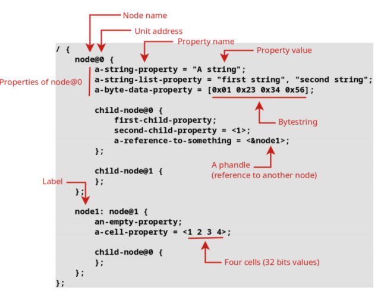
- Device tree inheriance:
    + device tree có thể chia thành nhiều file và có thể include nhau, có tính kế thừa
    + file được include có đuôi là `.dtsi`, thông thường `.dtsi` chứa thông tin về Soc, định nghĩa phần cứng chung cho nhiều board
    + `.dts`: chứa thông tin cụ thể về board đó
    + Overlaying - cơ chế ghi đè: khai báo sau sẽ ghi đè lên khai báo trước, việc xếp chồng tuân theo thứ tự include các file `dtsi`, giống như ghi thêm giá trị hoặc ghi đè thuộc tính đã có của node device qua các file, file sau sẽ ghi đè hoặc thêm thuộc tính từ node ở file trước
- Device tree design principles:
    + Device tree mô tả phần cứng như nào, chứ không phải là cách config phần cứng như nào
    + độc lập với hệ điều hành: đối với phần cứng cụ thể, device tree phải giống nhau khi dùng cho uboot, linux. Không cần thiết phải thay đổi device tree khi cập nhật OS
    + device tree mô tả sự tích hợp của các thành phần phần cứng, cách mà chúng tích hợp với phần còn lại của hệ thống, không mô tả cơ chế hoạt động nội bộ của chúng
- Device tree specifications: - cần 2 tài liệu để viết device tree
    + `BBB_docs/device_tree/devicetree-specification-v0.4.pdf` - các cú pháp
    + `linux/Documentation/devicetree/bindings` - chi tiết cho từng linh kiện, file `.yaml` sẽ được dùng để kiểm tra việc biên dịch và khai báo phần cứng. Trước đây, dùng file .txt để mô tả nên không có việc kiểm tra này
- Validating device tree in linux
    + dtc compiler chỉ kiểm tra cú pháp
    + YAML kiểm tra ngữ nghĩa - semantic validation
    + make dt_binding_check: kiểm tra YAML binding valid
    + make dtbs_check: kiểm tra các file device tree đang được kích hoạt trong hệ thống
    + make DT_SCHEMA_FILES=path/to/specific/yaml dtbs_check: đối chiếu device tree với tệp YAML cụ thể
- The compatible property
    + xác định mô hình lập trình của device 
    + định nghĩa cấu hình phần cứng của node
    + dùng để OS tìm được driver phù hợp cho device
    + ví dụ: <vendor>,<model>
        ```
        compatible = "arm,armv7-timer"
        ```
    + compatible = "simple-bus": khi node có thuộc tính này, có nghĩa là OS hiểu đây là bus đơn giản, tất cả các sub-nodes là memory-mapped devices, và hệ thống cần quét các node device con trong node simple-bus này
- compatible property and Linux kernel drivers
    + Linux xác định các platform devices như sau:
        - Các top-level node: nằm ngay sau root node và có compatible
        - Các sub-node của simple bus: các node nằm trong node compatible = simple-bus
        - Mỗi linux driver có bảng compatible chứa các device mà nó hỗ trợ `struct of_device_id[]`
        - Khi chuỗi compatible của DT node match với của driver, device sẽ được liên kết với driver đó
- reg property
    + chứa địa chỉ base physical addr và size của memory-mapped của device 
    + reg = <base-addr size>
    + unit-addr phải là addr đầu tiên của reg
        - sai4: sai@50011100 -> 50011100 là unit-addr
- status property
    + chỉ định device đó được dùng hay không
    + `okay` hoặc `ok`: device được dùng
    + `disabled`: device không được dùng
    + trong linux, thuộc tính này quyết định linux có tạo cấu trúc thiết bị cho node đó hay không, nếu là `disabled`, linux sẽ bỏ qua và không cấp driver cho nó
    + Trong `dtsi`, có nhiều device có status là disabled vì Soc có nhiều khối ngoại vi và không phải bo mạch nào cũng có phần cứng đó. Ta cần override status là ok cho các node mà ta muốn trong `dts`
- pin muxing description
    + hầu hết các Soc có nhiều tính năng ở 1 pin
    + chức năng cụ thể ở pin được cấu hình bởi pinmux controller
    + device tree mô tả cấu hình nào của pin là cho phép và cấu hình nào được dùng bởi các device khác nhau
- Cells concept
    + Là đơn vị dữ liệu cơ bản để mô tả đặc tính của phần cứng
    + Cells là các giá trị số nguyên được biểu diễn dạng số nguyên 32bit. Nếu là số lớn hơn 32bit, ví dụ là 64bit thì sẽ dùng 2 cells
    ```
    soc {
        foo32 = <0x324abcds>;
        foo64 = <0xdeadbeef 0xbadcafe>;
    }
    ```
    + Các thuộc tính có tiền tố `#` như #address-cells, #size-celss dùng để thông báo cho hệ thống biết cần bao nhiêu cell để biểu diễn 1 thông tin cụ thể trong node con
        - #address-cells, #size-celss xác định số lượng cell được dùng trong các node con để mã hóa phần addr và size trong thuộc tính reg
        - #interrupt-cells: Xác định số lượng cells cần thiết để mô tả một bộ định danh ngắt (interrupt specifier) cho bộ điều khiển ngắt đó
        - ngoài ra còn có #clock-cells, #gpio-cells, #phy-cells, #pwm-cells, #dma-cells, etc
## Discoverable hardware: USB and PCI
- Có 1 số bus có cơ chế tự phát hiện, trong số đó là USB và PCI
- Các thiết bị này có thể được liệt kê, và đặc tính của chúng được lấy với chỉ 1 driver hoặc bus controller
- Lệnh:
    + lsusb: list tất cả USB device
    + lspci: list tất cả PCI device
- Chúng kết hợp với kernel driver bằng product ID, vendor ID hoặc kí tự của device: device class, device sub-class

# Block filesystems
## 1. Block devices
- Block vs raw flash
    + Storage device được chia thành 2 loại và được quản lý bởi subsystems khác nhau, filesystem khác nhau
        - block device: có thể đọc/ghi theo từng khối riêng lẻ, theo thứ tự ngẫu nhiên mà không cần xóa: Hard disk, RAM disk, USB key, SSD, sdcard, emmc
        - raw flash device: được điều khiển bởi 1 controller có trên SoC, chúng có thể đọc, nhưng ghi thì cần xóa dữ liệu trước đó, và việc xóa thường diễn ra ở vùng size lớn hơn block size: NOR flash, NAND flash
- Block device list
    + danh sách tất cả block device khả dụng trong system có thể tìm thấy ở `/proc/partitions`
    + /sys/block cũng chứa thông tin về mỗi block device 
- Partitioning
    + block device có thể được phân vùng để chứa nhiều phần khác nhau của hệ thống
    + partition table được chứa trong bản thân device, và được đọc và phân tích tự động bởi Linux kernel
    + 2 loại bảng partition:
        - MBR: legacy format
        - GPT: new format, hỗ trợ disk lớn hơn 2TB
- Transferring data to a block device
    + việc truyền dữ liệu đến hoặc từ 1 block device theo các raw là cần thiết, đặc biệt là khi ghi filesystem image vào block device. Việc này ghi trực tiếp vào block device, bỏ qua các lớp filesystem
    + các block device trong /dev cho phép truyền dữ liệu theo cách thô (raw)
    + `dd` là tool để truyền dữ liệu thô, thường để truyền các file image lớn
        - `dd if=/dev/mmcblk0p1 of=testfile bs=1M count=16`: truyền 16 khối dữ liệu, mỗi khối 1MB từ mmcblk0p1 vào testfile, tức là lấy 16 * 1MB dữ liệu đầu tiên trong mmcblk0p1 ra và lưu vào testfile 
        - `dd if=testfile of=/dev/sda2 bs=1M seek=4`: truyền toàn bộ testfile vào sda2theo từng khối 1MB, bắt đầu từ offset 4MB trong sda2, tức là bỏ qua 4MB đầu tiên
    + khi copy data thì nếu copy thông thường, file đó sẽ được đẩy vào RAM, nếu file quá lớn, có thể làm tràn ram. Vì vậy dd sẽ chia nhỏ file đó ra, mỗi lần copy thì nó đẩy 1 data có kích thước là 1MB vào RAM. Khi copy xong thì xóa trong RAM rồi lấy 1 MB tiếp. Điều này giúp RAM không bị tràn khi copy dữ liệu
## 2. Available block filesystems (dưới đây là các hệ thống file system dùng để tổ chức, phân chia, quản lý dữ liệu)
+ ext2:
    - 1 trong những hệ thống tập tin (filesystem) Linux đầu tiên
    - chi phí quản lý metadata thấp, dung lượng sử dụng RAM ít
    - Có nguy cơ hỏng metadata nếu shutdown không đúng cách
    - hỗ trợ tất cả tính năng là Linux cần trong 1 root filesystem: permessions, ownership, device files, ...
    - không khuyến khích cho embedded
+ ext3: không khuyến khích dùng
+ journaled filesystems:
    - được thiết kế để giữ hệ thống nhất quán sau khi system bị crash hoặc shutdown đột ngột
    - việc ghi được mô tả đầu tiên trong nhật ký trước khi thực sự ghi vao file
    - nhờ vào nhật ký, việc khôi phục tại thời điểm boot nhanh hơn vì các thao tác tại thời điểm shutdown không đúng các được ghi lại rõ ràng, không cần kiểm tra toàn bộ hệ thống. Nhưng không có nghĩa rằng thao tác ghi cuối cùng sẽ được ghi vào bộ nhớ
+ ext4:
    - hệ thống filesystem kết hợp với journaling (nhật ký)
    - là hệ thống filesystem cho nhiều bản GNU/Linux 
    - ext4 driver hỗ trợ tốt cho ext2, ext3
    - tính năng đáng chú ý: mã hóa trong suốt (transparent encryption) nhưng không hỗ trợ tính năng nén
    - kích thước phân vùng tối thiểu để kích hoạt journal là 2MB (256 inodes)
    - kích thước phân vùng tối thiểu khi không dùng journal là 64KB (16 inodes)
+ XFS: hiệu năng tốt với file dung lượng lớn
+ Btrfs: 
+ F2FS 
+ SquashFS
+ EROFS
+ Benchmarks của các loại filesystem trên: 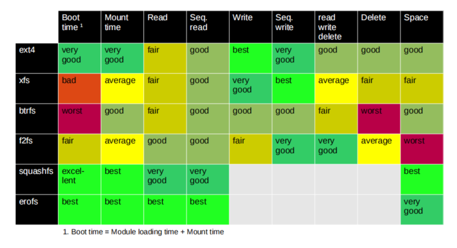
- Compatibility filesystems - khả năng tương thích với các filesystem của các OS khác
    + Linux hỗ trợ nhiều format filesystem khác:
        - vfat - CONFIG_VFAT_FS: phù hợp để chứa bootloader binary. Filesystem này không hỗ trợ permission, ownership, ... và không thể dùng cho Linux rootfs
        - exFAT - CONFIG_EXFAT_FS
        - ntfs - CONFIG_NTFS_FS: để tương thích với filesystem của Win
        - hfs - CONFIG_HFS_FS: để tương thích với filesystem của MAC
- tmpfs: filesystem trong RAM - Temporary File System
    + CONFIG_TMPFS
    + không phải là 1 block filesystem -> không ghi data xuống ổ cứng 
    + dùng để chứa data tạm thời trong RAM: system log file, connection data, temporary files, ...
    + tối ưu dung lượng hơn ramdisks: dung lượng của tmpfs tự động thu nhỏ, phình to theo kích thước các file
    + khi mount phân vùng tmpfs, cần chọn tên riêng để phân biệt với các phân vùng tmpfs khác
        - mount -t tmpfs run /run
        - mount -t tmpfs shm /dev/shm
## 3. Using block filesystems
- Creating filesystems
    + block device ban đầu chỉ là khối dữ liệu thô, việc tạo fielsystem sẽ giúp Linux hiểu được các tổ chức thư mục, tệp tin, quản lý file trong ổ đĩa
    + để tạo 1 empty ext4 filesystem ở 1 block device hoặc trong 1 image file:
        - `mkfs.ext4 /dev/sda3`
        - `mkfs.ext4 disk.img`
    + để tạo 1 filesystem image từ thư mục chứa tất cả file và thư mục
        - với vài hệ thống filesystems cụ thể có nhiều công cụ để tạo 1 filesystem image từ đường dẫn đã tồn tại
            + ext2: `genext2fs -d rootfs/ rootfs.img`
            + squashfs: `mksquashfs rootfs/ rootfs.sqfs
            + erof: `mkfs.erofs rootfs.erofs rootfs/`
        - với hệ thống filesystem khác:
            + tạo 1 disk image
            + format nó
            + mount nó
            + copy dữ liệu
            + umount
        - image đã tạo đó sẵn sàng để flash vào block device
- Mounting filesystem images
    + df -h: kiểm tra trạng thái các phân vùng đang được mount
    + Khi filesystem image đã được tạo, nó có thể truy cập và chỉnh sửa nội dung từ môi trường develop, sử dụng chơ chế loop:
        - ví dụ: `mkdir /mnt/test mount -t ext4 -o loop rootfs.img /mnt/test`
        - trong folder /mnt/test, có thể truy cập và chỉnh sửa được nội dung của rootfs.img
        - điều này nhờ vào cơ chế loop - là 1 kernel driver mô phỏng lại 1 block device với nội dung của file
        - lưu ý: cần `umount` trước khi sử dụng filesystem image ở nơi khác
- How to access partition in a disk image
    - Ta có thể sao chép nguyên si cấu trúc của 1 block device thành 1 disk image (block có bao nhiêu phân vùng thì sẽ được đưa vào 1 file disk image)
    - Vậy, để chỉnh sửa được file disk image đó, cần dùng lệnh `losetup` để kết hợp 1 loop device với 1 file. Lệnh này chứa `partscan` cho phép tạo các khối đại diện cho các phân vùng bên trong disk image
        + `sudo losetup -f --show -partscan disk.img`
        + lệnh này nói với Linux rằng hãy biến disk.img thành 1 loop device (ổ đĩa ảo) để thao tác
        + kết quả trả về của lệnh này là `/dev/loopX`
        + dùng `ls -la /dev/loopX*` để check các phân vùng
        + có thể dùng lệnh mount để mount phân vùng đó
- creating squashs filesystems
    + cài package `squashfs-tools`
    + squashfs chỉ có phép đọc nên chỉ có thể tạo ra image hoàn chỉnh từ thư mục có dữ liệu sẵn. Việc tạo filesystem squashfs rỗng rồi đưa dữ liệu vào là không thể
    + lệnh tạo squashfs image:
        - `mksquashfs data/ data.sqfs -noappend` - lệnh này gom thư mục data và nén lại thành file data.sqfs. Tham số -noappend bắt phải tạo image từ đầu, thay vì nối đuôi vào file image cũ
    + lệnh mount squashfs filesystems
        - mount -o loop data.sqfs /mnt (ở máy host)
        - mount /dev/<device> /mnt (ở target)
- Mixing read-only and read-write filesystems
    + Việc kết hợp filesystem chỉ đọc và đọc-ghi là tốt. Trong block storage sẽ gồm
        - 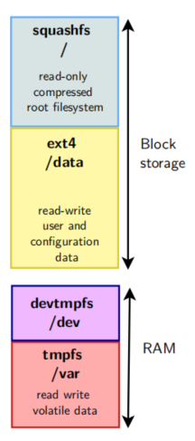
        - 1 phân vùng chi đọc (squashfs), dùng cho root filesystem (binaries, kernels, ...), tiết kiệm bộ nhớ, bảo vệ hệ thống khỏi lỗi
        - 1 phân vùng read-write với journaled filesystem (nhật ký - như ext4), dùng để chứa user data hoặc config data, giúp hệ thống phục hồi được dữ liệu sau khi sập nguồn, reboot do crash
        - tmpfs: bộ nhớ ram cho file tạm
- Issues with flash-based block storage - vấn đề với block storage dựa trên bộ nhớ flash
    + các bộ nhớ flash chỉ cho phép giao tiếp theo dạng khối qua các block interface
    + vì vậy, linux không có cách nào truy cập vào phần cứng và thực hiện quá trình `wear leveling` (quá trình phân phối đều các lượt ghi lên toàn bộ ô nhớ, tránh 1 vị trị bị ghi quá nhiều lần)
    + vì thuật toán quản lý bộ nhớ được các hãng giấu đi, nên cách tốt nhất là giảm thiểu số lần ghi/xóa vào storage. Nên dùng các thiết bị công nghiệp để có tuổi thọ bền hơn (SD, USB)
    + 1 vài sd card hiển thị erase block size ở `/sys/bus/mmc/devices/<dev>/preferred_erase_size`

# Flash storage and filesystems
## 1. Block devices vs raw flash devices: reminder
- Block devices:
    + cho phép truy cập dữ liệu ngẫu nhiên bằng các dùng block có size cố định
    + không yêu cầu xử lý đặc biệt khi ghi dữ liệu lên media
    + block size khá nhỏ (tối thiểu là 512 bytes, có thể tăng lên để tối ưu hiệu năng)
    + đáng tin cậy
- Raw flash devices:
    + các flash chíp được trực tiếp điều khiển bởi flash controller trên Soc. Ta có toàn quyền kiểm soát cách quản lý chúng
    + cho phép truy cập dữ liệu ngãu nhiên, nhưng yêu cầu xóa trước khi ghi
    + khối đọc-ghi không cùng kích thước với khối xóa
    + Nhiều công nghệ flash: NOR, NAND
## 2. NAND flash storage: constraints
+ Độ tin cậy:
    - phụ thuộc vào công nghệ flash  (SLC, MLC)
    - yêu cầu cơ chế khôi phục khi bị lỗi đảo bit: ECC (Error correcting code), được lưu trong OOB (Out-of-band area)
+ Tuổi thọ:
    - tương đối ngắn: chịu được 1000000 (SLC) và 1000 (MLC) chu kỳ xóa trên mỗi block
    - yêu cầu phải có wear leveling để kiểm soát số lần xóa trên khối
    - yêu cầu cơ thế phát hiện và xử lý khối lỗi - bad block detection/handling
## 3. The MTD subsystem
+ 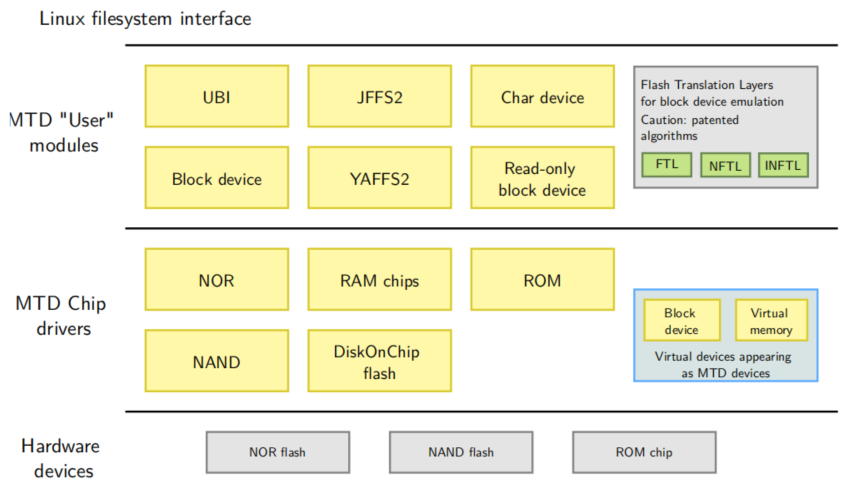
+ Memory Technology Devices
+ chịu trách nhiệm xử lý tất cả loại bộ nhớ mà không thuộc về block subsystem
+ hỗ trợ: RAM, ROM, NOR flash, NAND flash ,... 
+ hoạt động độc lập với giáo tiêp truyền thông vật lý
+ trừu tượng hóa đặc tính và cung cấp interface đơn giản để truy cập vào các MTD devices
+ MTD devices là các chip nhớ flash được hàn chết trên bo mạch
## 4. MTD partitioning
+ MTD devices thường phải phân vùng, cho phép dùng các phân vùng khác nhau cho các mục đích khác nhau: read-only filesystem, read-write filesystem, backup areas, bootloader area, kernel area, ...
+ các MTD devices cần được cấu hình phân vùng từ bên ngoài (trong device tree hoặc kernel command)
+ MTD partitions được định nghĩa bằng tham số `mtdparts` trong kernel command line (bootargs)
+ U-boot hiểu cú pháp linux qua biến `mtdparts` và `mtdids` 
## 5. MTD partitions on Linux
+ mỗi partitions trở thành 1 MTD device riêng biệt
+ cách đặt tên khác hoàn toàn với block devices
+ `/dev/mtd0`: phân vùng đầu tiên được liệt kê trong hệ thống
+ `/dev/mtd1`: phân vùng tiếp theo được liệt kê trong hệ thống
+ `/dev/mtdX`: ...
+ Master MTD deivce `/dev/mtd` không hiển thị trong `/dev`như `/dev/sdb`
## 6. Commands to manage NAND devices
+ Trong u-boot:
    - `help nand`: check all subcommand
    - `nand info`, `nand read`, `nand write`, `nand erase`
+ Trong Linux:  
    - `ioctl()`: xóa và flash bộ nhớ
    - `flash_eraseall`, `nandwrite`
    - ...
## 7. Flash wear leveling - cân bằng độ hao mòn flash
+ phân phối đều các lần xóa trên flash device, tránh việc đạt chu kì xóa tối đa quá nhanh trên các khối dữ liệu thường xuyên được ghi
+ có thể thực hiện ở filesystem layer: JFFS2, YAFFS2 hoặc tầng trung gian UBI
+ triển khai wear leveling quyết định tuổi thọ của bộ nhớ flash
- Flash file-systems
    + filesystem tiêu chuẩn (ext2, ext4, ...) được thiết kế để hoạt động trên block devices
    + các filesystem đặc thù được thiết kế để xử lý hạn chế của bộ nhớ flash
    + các filesystem này phụ thuộc vào MTD layer để truy cập vào flash chips
    + ngày nay UBI/UBIFS là tiêu chuẩn cho các bộ nhớ NAND vừa và lớn
## 8. UBI
+ Unsorted block images - tầng quản lý trung gian dành cho bộ nhớ flash
    - 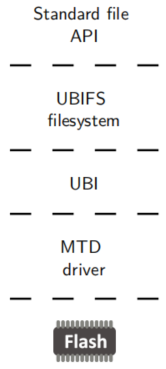
    - Cách thiết kế:
        + tách biệt wear leveling layer và filesystem layer
        + thêm tính linh hoạt
        + tập trung vào khả năng mở rộng, hiệu năng, độ tin cậy
    - Nhược điểm:
        + chiếm dụng đáng kể bộ nhớ, đặc biệt khi dùng với thiết bị nhỏ hoặc phân vùng nhỏ.
        + JFFS2 vẫn là lựa chọn hợp lý trên các MTD partition nhỏ
    - CHo phép wear leveling hoạt động trên toàn bộ phân vùng bộ nhớ
+ 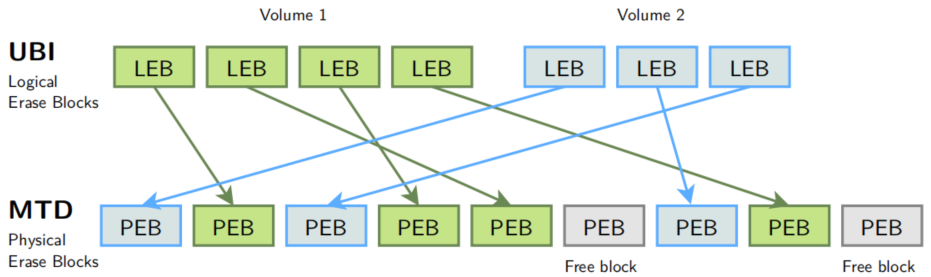
    - Khi có quá nhiều hoạt động trên 1 LEB, UBI có thể quyết định di chuyển nó tới 1 PEB khác với số lần xóa đang ít
    - Ngay cả các partition read-only cũng tham gia vào quá trình wear leveling
+ Good practice
    - UBI phân phối các lượt xóa ở toàn bộ flash devices: càng cấp nhiều dung lượng cho phân vùng gắn với UBI layer, hiệu quả của wear leveling càng cao
    - Nếu cần phân vùng, hãy sử dụng phân vùng logic của UBI, không phải của MTD
    - Một vài partition vẫn bắt buộc phải có MTD partitions (ví dụ như bootloader)
    - U-boot hiện tại hỗ trợ chứa cấu hình môi trường vào phân vùng UBI
    - Nếu cần nhiều MTD partition hơn, hãy gom chúng lại vào phần đầu của flash device
+ So sánh bad và goot practice
    - 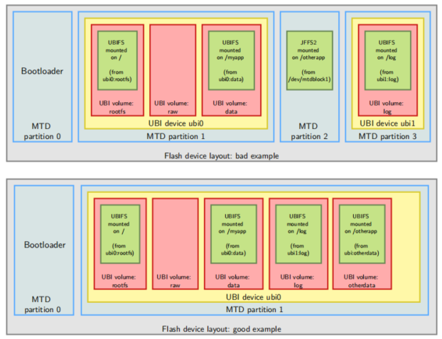
    - Bad practice là khi để các phân vùng MTD tách xa nhau, không gom lại đầu của flash device
## 9. UBIFS - Unsorted Block Images file system
+ Là filesystem nhật ký mang lại hiệu suất tốt hơn so với bản tiền nhiệm (JFFS2) và giải quyết được khả năng mở rộng
+ có thể được mount làm root filesystem
+ tạo image bằng cách `mkfs.ubifs` từ mtd-utils
+ image này sau đó có thể flash vào vùng nhớ hoặc gộp vào UBI image khác (ubinize command)
- ubinize for UBI image creation
    + 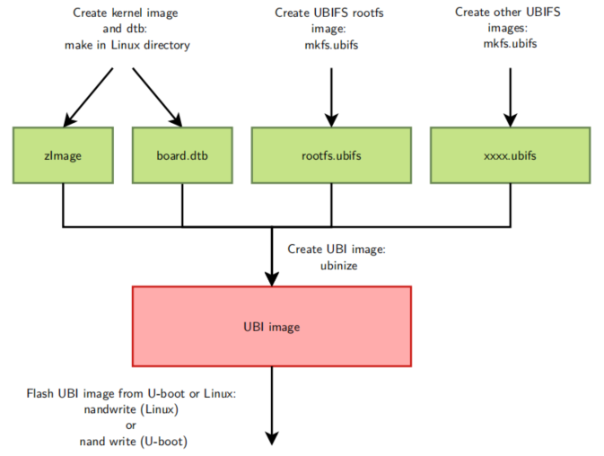
    + image UBIFS có thể được gộp cùng với zImage và .dtb thành 1 image để flash vào board
## 10. Linux: Block emulation layer - lớp giả lập block
+ Squashfs hay EROFS đòi hỏi phải chạy trên 1 block device, nhưng bộ nhớ flash ở các board mạch thường được quản lý dưới dạng MTD device. Vì vậy lớp giả lập đóng vai trò như bộ chuyển đổi, biến các phân vùng MTD/UBI thành các emulation block để OS có thể đọc được các read-only filesystem
+ Linux cung cấp 2 emulation layers:
    - `mtdblock` - CONFIG_MTB_BLOCK: giả lập các block device ở đâu của MTD devices
        + được đặt tên là `/dev/mtdblockX`
        + không nên ghi vào `mtdblock device` vì bad block không được xử lý
    - `ubiblock` - CONFIG_MTD_UBI_BLOCK: giả lập read-only block device ở đầu của phân vùng UBI
        + chỉ dùng cho phân vùng read-only
        + được đặt tên là `/dev/ubiblockX_Y`, X là UBI device id, Y là phân vùng của UBI

# Cross-compiling user-space libraries and applications
## 1. Intergrating user-space libraries and applications
- embedded Linux có rất nhiêu ứng dụng và thư viện bên thứ 3
## 2. Concept of build system
- Mỗi phần mềm mã nguồn mở đi kèm với bộ scripts/file để cấu hình/biên dịch -> build system
    + phát hiện yêu cầu hệ thống, dependencies 
    + biên dịch các source file để tạo ra app/libraries, cũng như tài liệu
    + cài đặt build product
- Các hệ thống build phổ biến:
    + Makefiles
    + Autoconf, automake, libtool
    + CMake
    + meson
## 3. Target and staging spaces - không gian đệm
- khi biên dịch cross compile thủ công, ta sẽ phân biệt 2 bản root filesystem
    + target root filesystem: cài lên board, chỉ chứa những thứ cần thiết cho runtime
    + staging space: có cấu trúc tương tự, chứa nhiều file hơn target root filesystem: header, lib, doc, ... cần cho việc build
    + root filesystem ở board phải luôn nhỏ nhất có thể
## 4. Autotools
- 1 nhóm các phần mềm kết hợp lại với nhau để tạo ra 1 build system hoàn chỉnh, quản lý và điều phối các thành phần trong project
    + autoconf: cấu hình software package
    + automake: tạo các Makefiles cần cho việc compile
    + libtool: tao ra các shared library độc lập với hệ thống
- Hầu hết các công cụ này đã cũ và phức tạp. Ngày nay meson đang dần thay thế
## 5. CMake
- CMakeLists.txt
- cmake .
- make
- make install
- CMake toolchain file
    + khi cross_compile với CMake, số lượng tham số truyền vào có thể dài
    + chúng sẽ được gom vào toolchain file 
    + `cmake -DCMAKE_TOOLCHAIN_FILE=/path/to/toolchain-file.txt`
    + tệp toolchain này thường được cung cấp bởi các build system: Buildroot, Yocto
## 6. Meson
- xử lý `meson.build` và `meson_options.txt` và tạo ra Ninja files
- Ninja là công cụ thay thế cho make
- thự mục build phải tách biệt khỏi thư mục project
    + mkdir build
    + cd build
    + meson ..
    + ninja
    + ninja install
- Meson cross file
    + là tệp chứa định nghĩa các biến nhằm cung cấp cho Meson thông tin cần cho cross compile
    + có thể tạo thủ công hoặc được cung cấp bởi Linux build system (Buildroot, Yocto)
    + dùng bằng option `--cross-file`
## 7. pkg-config
- là tool cho phép truy vấn database để lấy thông tin về cách biên dịch các chương trình mà phụ thuộc vào các libraries
- Database này được cấu thành từ các .pc files, được cài lại đường dẫn `<prefix>/lib/pkgconfig/`
- pkb-config thường được dùng bởi CMake, Meson để tìm kiếm libraries
- mặc định, pkg-config tìm kiếm .pc file trong `/usr/lib/pkgconfig`
- `PKG_CONFIG_LIBDIR`: cho phép thiết lập vị trí khác cho .pc files
- `PKG_CONFIG_SYSROOT_DIR`: cho phép thêm 1 thư mục tiền tố vào trước các đường dẫn được đề cập trong .pc files

## 8. Thực hành
- Với app/project dùng configure script:
    + ./configure --host=arm-linux --disable-topology --prefix=/usr (topology dùng cho alsa lib)
    + CC=arm-linux-gcc ./configure
    + make
    + make DESTDIR=$HOME/embedded-linux-bbb-labs/thirdparty/staging install
    + dùng arm-linux-strip để giảm dung lượng file và thư viện (bỏ Debugging symbols) trước khi đưa vào board
- libgpiod: thư viện để quản lý gpio
    + gpioinfo: kiểm tra pin thuộc gpiochip nào

# Embedded system building tools
## 1. Approaches
- có 3 cách để build 1 embedded linux system
    + cross-compile mọi thứ thủ công
    + dùng bản phân phối có sẵn: Ubuntu,...
    + dùng embedded linux build system để tự động hóa quá trinh cross-compilation (yocto, buildroot)
## 2. Embedded Linux build systems
- Là công cụ điều phối quá trình biên dịch của tất cả thành phần theo thứ tự.
- Lợi ích khi dùng embedded Linux build system
    + linh hoạt hơn
    + tận dụng được tốc độ của pc
    + dễ dàng quản lý, build các components
## 3. Builtroot
- Buildroot: introduction
    + cho phép build toolchain, rootfs image, bootloader, kernel image
    + hỗ trợ uClibc, glibc và musl toolchain
    + tốt cho hệ thống embedded nhỏ và vừa với dải tính năng cố định
        - không hỗ trợ tạo packages
        - cần rebuild toàn bộ khi có thay đổi
- Buildroot: configuration and build
    + file cấu hình được nằm ở file *config tương tự như `make menuconfig` của Linux
    + cho phép setup:
        - kiến trúc, dòng CPU cụ thể
        - cấu hình toolchain
        - tích hợp app và libraries
        - tạo fielsystem images
        - cấu hình kernel và bootloader
    - `make`
    - output nằm ở : `output/images/`
- Buildroot: adding a new package
    + package cho phép tích hợp user app hoặc lib vào Buildroot
    + có thể được dùng để tích hợp:
        - open-source lib hoặc app
        - lib hoặc app của mình
    + mỗi package có đường dẫn riêng của nó, đường dẫn này chứa:
        - `Config.in`: mô tả cấu hình của pkg, cần ít nhất 1 file này để kích hoạt pkg. File này phải được lấy từ `package/Config.in`
        - `jose.mk`: mô tả pkg được build như nào
        - `jose.hash`: chứa commit hash
        - `*.patch`: áp dụng file này như bản vá
- Buildroot: adding a new package, Config.in
    + 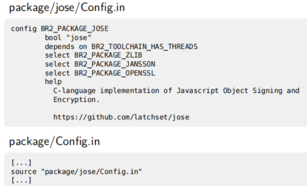
- Buildroot: adding new package, .mk file
    + 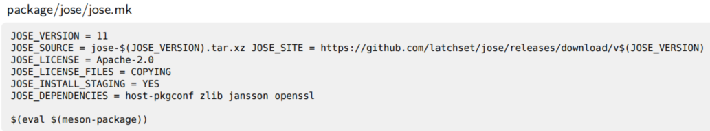
    + đường dẫn của pkg và prefix của các biến phải khớp với hậu tố (suffix) của BR2_PACKAGE_JOSE trong cấu hình Builtroot
    + meson-package biết cách làm thế nào để build Meson package
## 4. Yocto Project / OpenEmbedded
- Các thuật ngữ:
    + Layer: là git repo chứa tập hợp các recipes, machines, ...
    + Recipe: là metadata mô tả cách build 1 thành phần software hoặc mô tả nội dung của 1 image
    + Machine: nền tảng phần cứng
    + bitbake: công cụ điều phối và xử lý các công thức để tạo ra output
- Với mỗi recipe, hệ thống sẽ tọa ra 1 hoặc nhiều binary pkg (deb, rpm, ipk)
- Các binary pkg được cài đặt để tạo ra rootfs image để flash vào board
- Các pkg khác có thể được cài đặt lúc runtime sử dụng các hệ thống quản lý gói như apt, opkg
- **Public layers**:
    + core layers:
        - bitbake 
        - openembedded-core: chứa các recipe nền tảng để build các gói phần mềm phổ biến: Linux, Busybox, toolchain, systemd, ...Layer này chỉ hỗ trợ QEMU
        - poky: 1 layer từ Yocto project định nghĩa bản phân phối Poky, không hữu ích cho các hệ thống thực tế
        - meta-openembedded: duy trì từ dự án OpenEmbedded
    + BSP layer: là layer cung cấp bởi vendor, hỗ trợ thêm nền tảng phần cứng gồm: recipe cho build Linux kernel, bootloader, các thành phần software liên quan hardware: meta-intel, meta-arm, meta-ti, ...
    + Các layer bổ sung: chứa recipe để build các component, không có sẵn trong openembedded core
    + Tra cứu layer: `https://layers.openembedded.org/`
    + Mỗi layer thường có 1 brach trùng với Yocto đang dùng
- Combine layer:
    + Đối với các project, thường cần kết hợp nhiều layers
        - ít nhất là openembedded-core layer
        - có thể 1 hoặc vài BSP layer
        - có thể 1 hoặc vài software layer
    + và mình có thể tạo layer, chứa recipe cho
        - nền tảng phần cứng tùy chỉnh
        - image cho custom system
        - recipe cho custom software
    + `google repo` hoặc `Kas utility`: tool để tự động hóa việc tải các layer cần thiết, đúng phiên bản 
## 5. So sánh Buildroot và Yocto
- Yocto: 
    + build bản phân phối với binary pkg và hệ thống quản lý pkg
    + cấu hình linh hoạt, mạnh nhưng phức tạp
    + logic phức tạp và nặng, nhưng cache hiệu quả và hỗ trợ chỉ build những thứ cần thiết
    + hệ sinh thái: hỗ trợ nhiều tính năng cho các layer bên thứ 3, nhưng chất lượng k đồng đều
- Buildroot: 
    + build rootfs, không có binary pkg
    + cấu hình đơn giản, đôi khi có giới hạn
    + đơn giảm nhưng vài logic hơi ngu, không caching build, phải build lại toàn bộ khi thay đổi
    + hệ sinh thái: mọi thứ nằm trong 1 cây thư mục, chất lượng đồng đều hơn
- Các binary pkg không hẳn là tốt với embedded
## 6. Thực hành 
- git clone https://gitlab.com/buildroot.org/buildroot.git
- boot: chứa Makefiles và cấu hình liên quan tới biên dịch bootloader 
- board: chứa cấu hình cho từng board và rootfs overlays
- configs: chứa các cấu hình defconfig
- docs: chứa documention
- fs: chứa code để tạo ra root filesystem image
- linux: chứa Makefile và cấu hình item liên quan tới biên dịch Linux kernel
- Makefile
- package: chứa tất cả Makefile, patches và cấu hình để biên dịch user-space app và libirary của embedded linux system
- system: chứa cấu trúc rootfs trong `/skeleton` và device table dùng khi /dev được sử dụng
- toolchain: chứa Makefiles, patch, cấu hình cho việc cross-compile toolchain
- Trong output của buildroot chứa:
    + build: folder build
    + host: thư mục mà buildroot cài các component cho máy host, gồm các tool để thực hiện quá trình build
    + images: output thực sự: kernel, dtb, rootfs.tar
    + staging: chứa system header, rootfs, target lib
    + target: là rootfs, tất cả app, lib đã được strip. Tuy nhiên không thể trực tiếp dùng như rootfs vì các device file đã bị mất
- Có thể custom thêm file rồi add đường dẫn vào `Root filesystem overlay directories` trong menuconfig
- Sơ đồ phụ thuộc của các thành phần trong buildroot
    + sudo apt install graphviz
    + make graph-depends
- Add kernel module custom
    + tạo folder driver-name cho kernel đó trong buildroot/package
    + tạo file Config.in cho folder đó
    + add file Config.in đó vào Config.in của buildroot/package
    + tạo file .mk trong buildroot/package/driver-name để mô tả cách build pkg
    + mở menuconfig buildroot lên rồi tìm tên driver mới này
    + Config.in
        ```
            config BR2_PACKAGE_NUNCHUK_DRIVER // tên biến config
            bool "nunchuk driver" // giá trị bool để chon Y/N trong menuconfig
            depends on BR2_LINUX_KERNEL // phụ thuộc vào Linux kernel
            help
            Linux Kernel module for the I2C Nunchuk.
        ```
    + .mk:
        ```
        NUNCHUK_DRIVER_VERSION = 1.0 // phiên bản
        NUNCHUK_DRIVER_SITE = $(HOME)/embedded-linux-bbb-labs/hardware/data/nunchuk // đường dẫn chứa kernel module
        NUNCHUK_DRIVER_SITE_METHOD = local // cách lấy mã nguồn là từ local
        NUNCHUK_DRIVER_LICENSE = GPL-2.0 // giấy phép
        $(eval $(kernel-module))
        $(eval $(generic-package))
        ``` 
# Overview of major embedded Linux software stacks - Các khối kiến trúc phần mềm Linux nhúng
## D-Bus
- là cơ chế trung gian sử dụng message, cho phép giao tiếp giữa nhiều process trong 1 thiết bị
- Nó dựa vào 1 tiến trình nền để chuyển message qua lại giữa các ứng dụng
- Chủ yếu được dùng bởi các tiến trình hệ thống, cung cấp service cho client
- Ví dụ: 1 process cấu hình mạng, chạy ở quyền root, cung cấp API D-bus cho client để có thể cấu hình mạng 
- Có 1 số loại bus:
    + 1 system bus: truy cập bởi all users, dành cho system service
    + 1 session bus: truy cập bởi mỗi người dùng khi đăng nhập system
- Mô hình đối tượng: interfaces, objects, methods, signals
## systemd
- Modern init system, được dùng rất nhiều, tương tự Busybox
- Phức tạp hơn Busybox nhưng mạnh mẽ hơn, có thể boot lâu hơn vì có cần chuẩn bị sẵn sàng cho các service và app phức tạp
- chỉ hỗ trợ glibc
- Cung cấp các tính năng cho user-space như:
    + Khởi động song song các service giúp boot nhanh hơn, có tính đến dependencies giữa chúng
    + giám sát các service
    + khởi động dịch vụ theo nhu cầu, thông qua cơ chế socket activation
    + quản lý tài nguyên của service: CPU limit, memory limit
- cấu hình dựa theo unit files
    + sử dụng ngôn ngữ khai báo (Declarative language) thay vì các shell script trong các init system khác
- systemd cũng cung cấp:
    + journald, logging deamon
    + networkd: quản lý cấu hình mạng
    + udevd: quản lý /dev và hotplugging
    + logind: quản lý đăng nhập
    + systemctl: tool để control systemd
        - systemctl status: status của tất cả service
        - systemctl status <service>: status của 1 service
        - systemctl [start|strop] <service>: start/stop 1 service
        - systemctl [enable|disable] <service>: enable/disable 1 service
        - systemctl list-units: list all available units
        - journalctl -a: all logs
        - journalctl -f: show the last entries, and keep printing new entries as they arrive
        - journalctl -u: logs from a particular service
    + ...
## Linux graphics stack overview
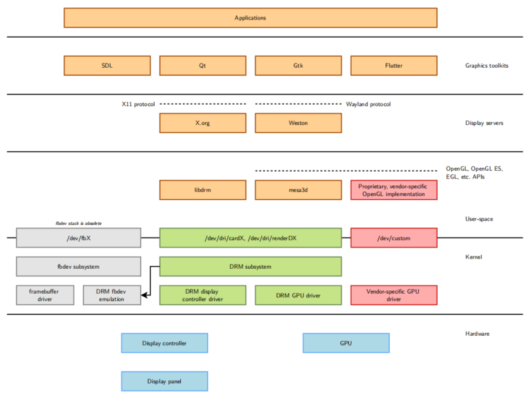
## Display controller support - trình điều khiển đồ họa
- Linux dùng các công nghệ dưới đây để xuất hình ảnh ra màn hình, chúng nằm ở tầng sát phần cứng, chúng nói chuyện với phần cứng
- fbdev
    + công nghệ cũ, hỗ trợ hiển thị đồ họa trên Linux
    + không nên dùng nữa
- DRM
    + Direct rendering Manager 
    + tiêu chuẩn quản lý card đồ họa và màn hình của Linux
    + hỗ trợ các trình điều khiển màn hình của Soc hoặc card màn hình và nhiều chuẩn kết nối: HDMI, Displayport, ...
    + hỗ trợ các màn hình I2C, SPI
    + Device được xuất hiện ở `/dev/dri/cardX`
    + thư viện hỗ trợ: `libdrm` và công cụ test `modetest`
## GPU support: OpenGL acceleration
- Có 2 cách tiếp cận để viết driver cho GPU
    + Open-source
        - 1 kernel driver nằm trong DRM subsystem sẽ gửi lệnh tới GPU và quản lý memory
        - thư viện user-space `mesa3d` xử lý các OpenGL API, chứa các logic của GPU
    + Proprietary (độc quyền)
        - GPU được cung cấp driver bởi vendor
        - chỉ có vendor mới bảo trì được 
## Concept of display servers
- Đặt vấn đề: Linux chỉ cho phép 1 ứng dụng chiếm màn hình, chuột, bàn phím tại 1 thời điểm. Nếu không có ai quản lý, các ứng dụng sẽ tranh nhau để hiển thị -> Vì vậy, Display servers ra đời để quản lý việc này
- Display servers là 1 user space app đặc biệt
    + Chia sẻ sân khấu (dồn kênh - Multiplexing): cho phép nhiều client app hiển gửi window của chúng tới
    + Sắp xếp các window của các app theo layer, như việc mở nhiều cửa sổ đề lên nhau
    + Phân phát các sự kiện tới client phù hợp, dựa vào đang focus window nào
## X11 and X.org
- Dipslay server đời đầu là X.org
- Chúng nằm ở tầng sát user-space
- Thực hiện giao thức X11 để giao tiếp giữa client và server, hỗ trợ local qua UNIX socket và qua mạng với giao thức TCP
- Trong LInux ngày nay, nó chạy với tầng dưới là `DRM` hoặc `fbdev`
- X.org đã lỗi thời
## Wayland
- Là giao thức truyền thông quy định các giao tiếp giữa display server và client của nó
- Nó cũng là bộ thư viện viết bằng C để implement giao thức đó
- Wayland compositor: là 1 máy chủ dùng Wayland protocol
- Chúng nằm ở tầng sát user-space, quản lý và sắp xếp cửa sổ ứng dụng
- Đây là giải pháp hiện đại để thay thế cho X11, dựa nhiều vào các công nghệ OpenGL
- Wayland compositor: có nhiều compositor để thực hiện Wayland protocol
    + Weston: phiên bản chính chủ do Wayland viết ra, gọn nhẹ, đơn giản, tạo giao diện đơn giản cho hệ thống nhúng
    + Mutter: được dùng với Ubuntu, Fedora
    + wlroots: thư viện wayland compositor
        - Cage: bộ compositor thiết kế để hiển thị ứng dụng tràn màn hình, không có tabbar hay thanh tiêu đề cửa sổ
        - swayWM: bộ compositor sắp xếp cửa sổ theo dạng lưới
## Concept of graphics toolkits
- X11 và Wayland là giao thức low-level
- Việc thiết kế ứng dụng bằng cách dùng trực tiếp các giao thức này sẽ rất khó
- Vì vậy, các toolkits đồ họa ra đời để hỗ trơ:
    + 1 số hoat động trên tầng 1 display server: X11, Wayland
    + 1 số khác hoạt động trực tiếp ngay trên tầng DRM + input
- Widget-oriented toolkits: công cụ tạo button, window, ...
- Game-oriented toolkits
- 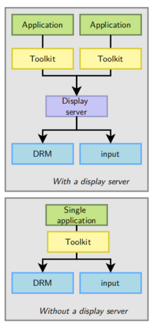
- Các toolkits phổ biến:
    + Qt
        - thuộc toolkits graphics
        - framework graphics
    + Gtk
        - toolkits dành cho môi trường pc
        - ít dùng trong embedded
        - được cấu thành từ: glib, pango (text handling), cairo (vector graphics), gtk (widget library)
        - yêu cầu display server là X11 hoặc wayland
    + Flutter
        - cũng là 1 toolkits
    + SDL
        - thư viện phát triển đa nền tảng, cung cấp truy cập low level vào audio, keyboard, graphics
        - code bởi C
        - không có sẵn widget (button, ...)
        - thường ứng dụng cho game, media player, custom UI
    + LVGL
        - nhẹ, hướng tới micro-controller
## Linux multimedia stack overview
- 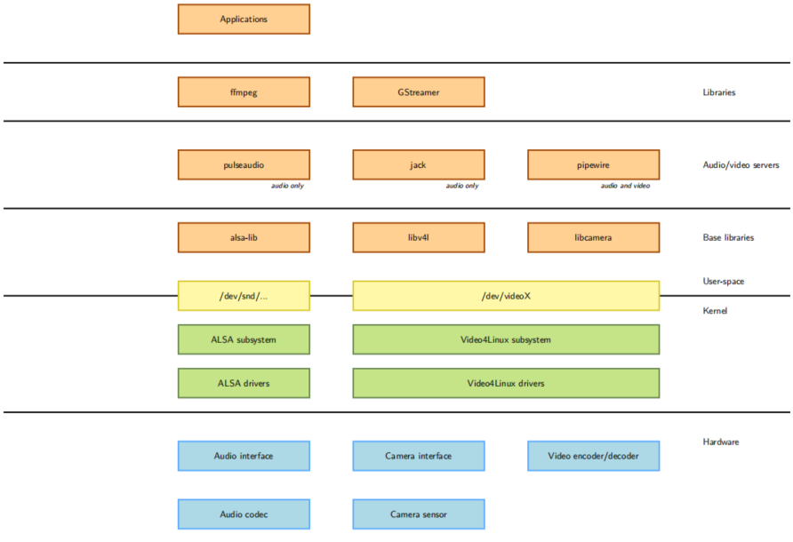
- các hệ thống xử lý multimedia trong Linux
    + Audio stack - hệ thống xử lý âm thanh
        - kernel side: gồm có ALSA subsystem: chứa driver cho audio interface và audio codec, thể hiện qua `/dev/snd/`, dùng thư viện `alsa-lib`
            + Audio server:
                - cần thiết khi có nhiều nguồn phát âm thanh, nó sẽ phân phối âm thanh ra loa
    + Video stack - hệ thống xử lý video
        - kernel side: gồm có Video4Linux subsystem (V4L)
            + hỗ trợ camera như webcam
            + hỗ trợ tăng tốc phần cứng HW accelerator: H264, H265
            + thể hiện qua `/dev/videoX`
        - Thư viện:
            + libv4l (cũ)
            + libcamera (mới)
    + GStreamer
        - là thư viện để xây dựng media component
        - cho phép tạo pipeline để chuyển đổi, conver, hiển thị cho audio và video
        - được cấu thành từ số lượng lớn plugins
## Linux network stack
- 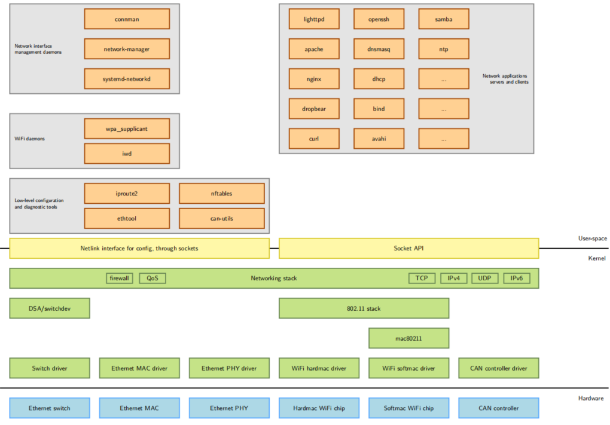
## Thực hành
- /lib/systemd: chứa các file cấu hình cho các target và service ở tầng userspace
- /lib/udev/rules.d: các quy tắc chuẩn dành cho udev
    + 80-drivers.rules: cho phép udev load kernel modules cho detected devices nhờ vào modules.alias trong /lib/modules/<version>
        - khi 1 device mới được phát hiện, kernek pass biến MODALIAS vào cho udev.BIến này chứa thông tin về loại bus mà thiết bị đó cắm vào
        - nhờ vào module aliases, module chính xác sẽ được load
    + debug command cho udev: `udevadm monitor`
        - xem thêm giá trị MODALIAS: `udevadm monitor --env`
    + modalias của nunchuk: `of:NjoystickT(null)Cnintendo,nunchuk`
        - of: Open Firmware
        - khi 1 phần cứng đươc phát hiện, nunchuk được udev nạp nhờ alias trùng khớp

# Embedded Linux application development
## Developing applications on embedded Linux
- Application development
    + Việc phát triển ứng dụng embedded tương tự như phát triển trong môi trường Linux
- Meson
    + meson.build
        ```
        project('example', 'c')
        executable('demo', 'main.c')
        ```
    + meson.build cho nhiều program và source files
        ```
        project('example', 'c')
        src_demo1 = ['demo1.c', 'foo1.c']
        executable('demo1', src_demo1)
        src_demo2 = ['demo2.c', 'foo2.c']
        executable('demo2', src_demo2)
        ```
    + meson_options.txt
        ```
        option('demo-debug', type : 'feature', value : 'disabled')
        ```
    + meson.build
        ```
        project('tutorial', 'c')
        demo_c_args = []
        if get_option('demo-debug').enabled()
        demo_c_args += '-DDEBUG'
        endif executable('demo', 'main.c', c_args: demo_c_args)
        ```
    + Library dependencies with meson
        - meson.build
            ```
            project('tutorial', 'c')
            gtkdep = dependency('gtk+-3.0')
            executable('demo', 'main.c', dependencies : gtkdep)
            ```
        - meson tìm thư viện gtk+-3.0 bằng pkg-config rồi gắn đường dẫn cho gtkdep
        - khi compile, gắn gtkdep vào dependencies 
- Debugging
    + GDB: GNU Project Debugger
        - hỗ trợ c/c++, ...
        - giao diện command line
        - có thể dùng để control chương trình đang chạy, đặt breakpoint, xem chương trình làm gì khi bị crash, ...
        - `gdb <program>`: debug chương trình 
        - `gdb -p <pid>`: gắn gdb vào tiến trình đang chạy
        - `run prog_arg1`: lệnh để run program khi dùng GDB để start program
        - `break foobar`: đặt breakpoint tại entry của function foobar
        - `break foobar.c:42`: đặt breakpoint vào file foobar.c, dòng 42
        - `print var`, `print $reg`: in giá trị
        - `info registers`: hiển thị kiến trúc thanh ghi
        - `continue` hoặc `c`: tiếp tục câu lệnh sau breakpoint
        - `next` hoặc `n`: lệnh tiếp theo
        - `step` hoặc `s`: lệnh tiếp, đi vào subfunction
        - `stepi` hoặc `si`: chỉ chạy tiếp 1 lệnh của ngôn ngữ máy chứ không phải 1 dòng code
        - `finish`: chạy hết hàm hiện tại cho đến khi hàm đó kết thúc
        - `backtrace` hoặc `bt`: hiển thị program stack
    + Remote debugging
        - hệ thống embedded thông thường bị strip để bỏ phần thừa, bao gồm cả log debug nên rất khó trace thông tin
        - việc cài gdb lên các hệ thống embedded là không khuyến khích vì nó gây tốn tài nguyên
        - Phương pháp remote debugging
            + `ARCH-linux-gbd` được dùng để chạy ở máy host
            + `gbdserver`: chạy ở targer (chỉ khoảng 400KB ở arm)
        - Remote debugging architecture:
            + 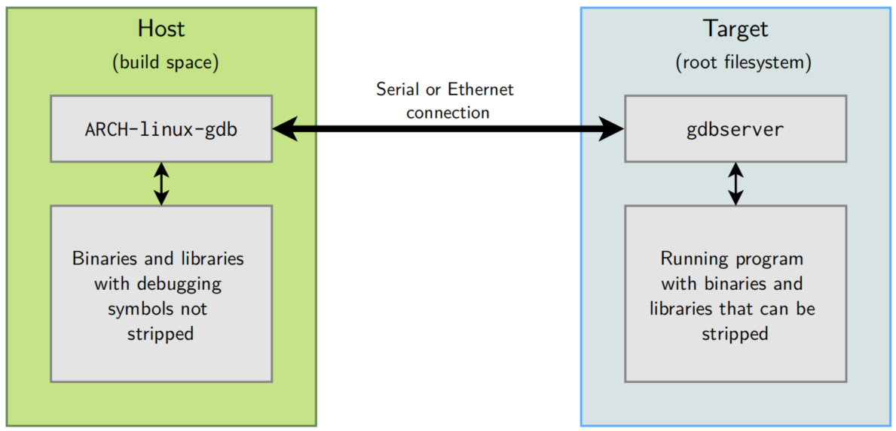
        - target setup: có 3 cách sau
            + chạy 1 program bằng lệnh `gdbserver`, chương trình không chạy ngay mà chờ lệnh từ host
                - `gdbserver /dev/ttyS0 <executable> <args>`
                - hoặc `gdbserver :1234 app`
            + gắn `gdbserver` vào 1 chương trình đang chạy
                - `gdbserver --attach <port> <pid>`
            +  khởi động gdbserver ở chế độ chờ
                - `gdbserver --multi <port>`
        - host setup
            + chạy `ARCH-linux-gdb <executable>` rồi dùng các lệnh sau:
                - `gdb> set sysroot <library-path>`: chỉ ra nơi chứa shared libraries
                - để kết nối target:    
                    + `target remote <ip-addr>:<port>`: nếu qua network
                    + `target remote /dev/ttyUSB0`: nếu qua usb serial
                    + nếu chạy gdbserver ở target với --multi, thì thay `remote` bằng `extended remote`
                    + nếu không set executable, cần khai báo executable nằm ở đâu bằng lệnh `set remote exec-file <part on target>`
    + Coredumps for port mortem analysis
        - Đôi khi việc gắn gdb là không thể khi đang có crash
        - May mắn, linux tạo 1 core file ghi lại toàn bộ process memory tại thời điểm crash với format ELF. GDB có thể dùng file này để phân tích crash
        - ở target:
            - dùng `ulimit -c unlimited` để enable chức năng tạo core file khi crash
            - output name và đường dẫn của file coredump có thể được thay đổi sử dụng `/proc/sys/kernel/core_pattern`, để đổi name và đường dẫn, dùng lệnh `echo /tmp/mycore /proc/sys/kernel/core_pattern` (đặt tên coredumpt là mycore và lưu vào /tmp)
            - tùy vào từng hệ thống, `core_pattern` có thể bị ghe đè tự động bởi 1 số software để xử lý core file hoặc bị disable việc tạo core file (ví dụ như systemd)
        - ở host:
            + sau khi crash, lấy core file từ target về và chạy: `ARCH-linux-gdb application-binary core-file`
    + minicoredumper - chương trình 
        - vấn đề: các file coredump có thể có dung lượng rất lớn đối với các app phức tạp vì nó chứa toàn bộ thông tin, và coredump yêu cầu tool để phân tích, và core dump không có thông tin về các process khác trong hệ thống
        - minicoredump là userspace tool được tạo dựa vào các tính năng core dump tiêu chuẩn:   
            + nó hoạt động dựa trên khả năng chuyển dữ liệu core dump tới 1 user space program thông qua 1 pipe
            + có ít dependencies 
            + tính năng nén bộ nhớ
            + có file cấu hình để quyết định data nào muốn ghi ra output: recept 
            + mỗi app có file cấu hình riêng
        - goals:
            + file core dump nhỏ nhất
            + tùy chỉnh coredump: chỉ lưu những thông tin mình muốn chứ không phải ghi toàn bộ như gdb
            + state snapshot: khi 1 process bị crash, có theo dõi được các process khác để lây thêm thông tin
        - dựa vào 1 file cấu hình JSON, nó có thể:
            + chỉ lưu các section liên quan (stack, heap, ...)
            + nén file output
            + lưu thêm thông tin từ /proc
        - ví dụ về file cấu hình:
            + 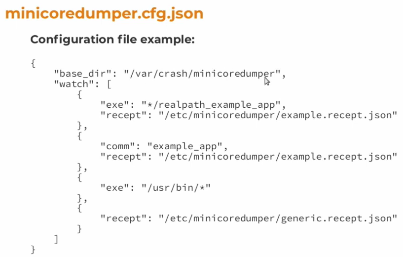
        - ví dụ về recept: file cấu hình cho từng app
            + 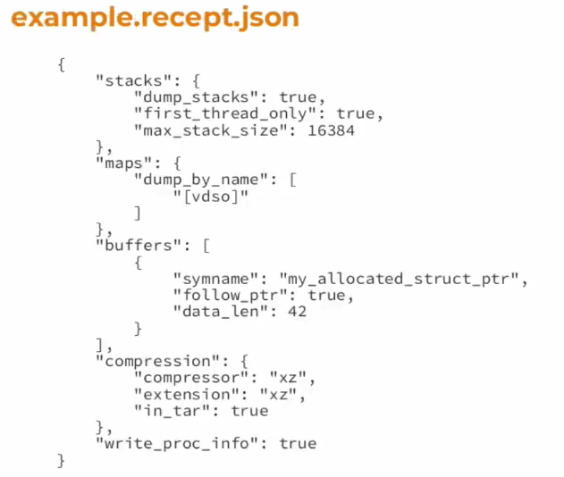
    + libminicoredumper - thư viện để nhúng vào app 
        - chiếm ít bộ nhớ
        - không ảnh hưởng runtime
        - API đơn giản
        - 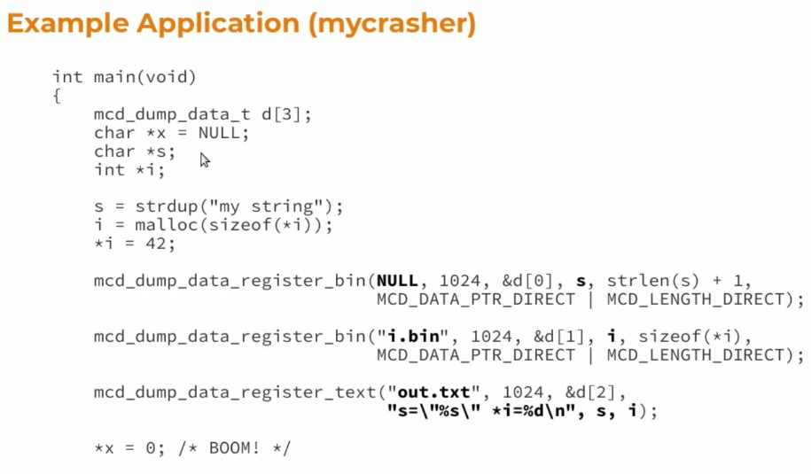
        - 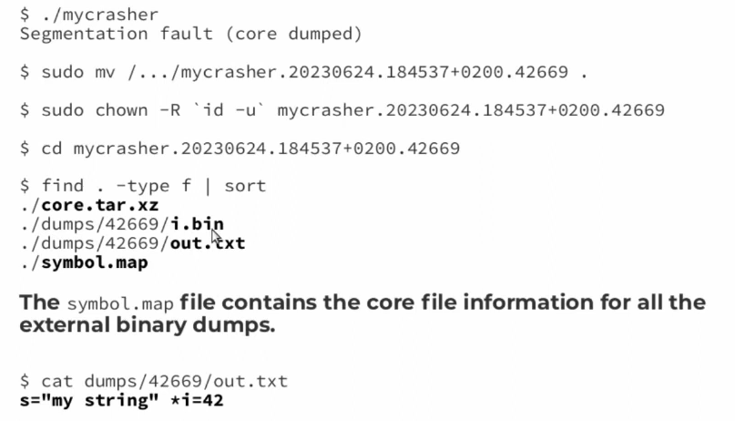
        - 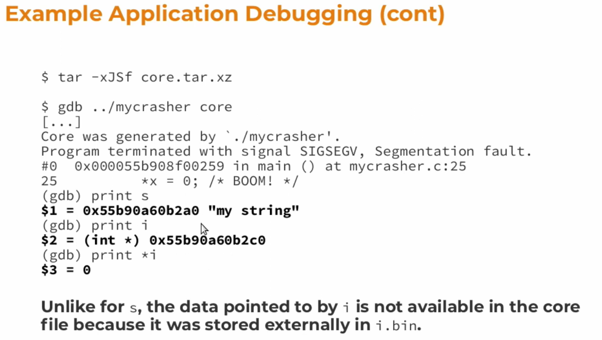
        - 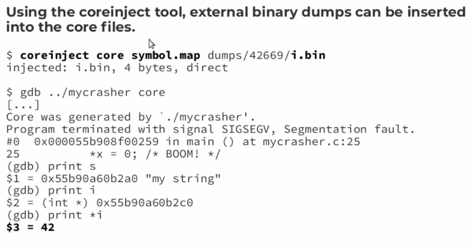
    + live dump
        - dùng để quan sát các running process khác khi 1 process bị crash
        - 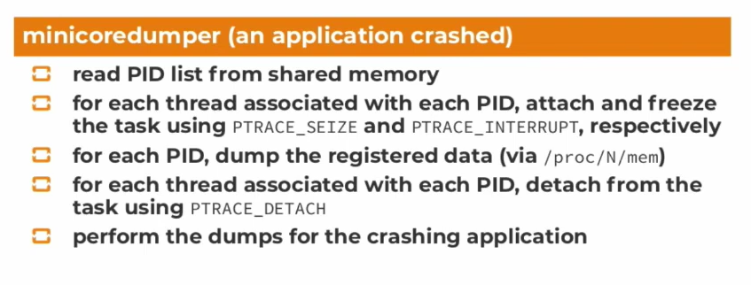
        - 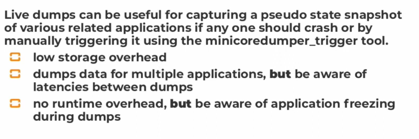
- Tracing and profiling
    + strace - system call tracer
        - tích hợp vào hệ thống bằng cách build cross với các build system
        - cho phép xem bất kỳ process nào đang làm gì: access file, allocate memory
        - hiệu quả trong phân tích bug nhỏ
        - Usage:    
            + strace <command>: start 1 process mới
            + stace -f <command>: theo dõi thêm process con
            + strace -p <pid>: theo dõi process đang chạy
            + strace -c <command>: thống kê các system call
            + strace -e <expr> <command>: dùng biểu thức để lọc
        + strace filtering
            - `strace -e 'openat,write' cat Makefile` chỉ hiển thị lệnh cụ thể của systemcall
            - `strace -e '!poll' cat Makefile`: giám sát tất cả trừ lệnh poll
            - `strace -e 'status=failed' cat Makefile`: chỉ show các system call mà return status cụ thể
            - `strace -P '/etc/ld.so.cache cat Makefile`: trace cách mà 1 file được truy cập và sử dụng bởi các system call
            - `starce --tips`: help command
    + Itrace
        - là 1 tool để trace shared library calls được dùng bởi 1 chương trình và theo dõi tất cả signal mà nó nhận
        - là công cụ bổ sung hữu ích cho stace vì strace chỉ theo dõi system call
        - `-S`: theo dõi luôn system call
        - `-c`: summary output
        - làm việc tốt với glibc, kém với uClibc và không hỗ trợ musl
    + ftrace
        - chức năng tracing của kernel 
        - có thể trace được các vị trí được định nghia sẵn trong kernel, xác định được các event quan trọng trong kernel
        - theo dõi bất kì hàm nào trong kernel
        - theo dõi được user-space app
        - hiệu năng cao
        - có thể được theo dõi qua tracefs filesystem
        - `trace-cmd`: CLI tool để sử dụng ftrace
        - có thể dùng để hiểu hoạt động chung của system cũng như các vấn đề về hiệu năng
    + kernelshark
        - tool visualization cho ftrace
    + perf
        - công cụ đo đạc, kiểm tra CPU counter, tracepoints, kprobes, uprobes
        - có sẵn trong linux kernel
        - hỗ trợ các sự kiện: hardware event, software event
        - perf examples:
            + 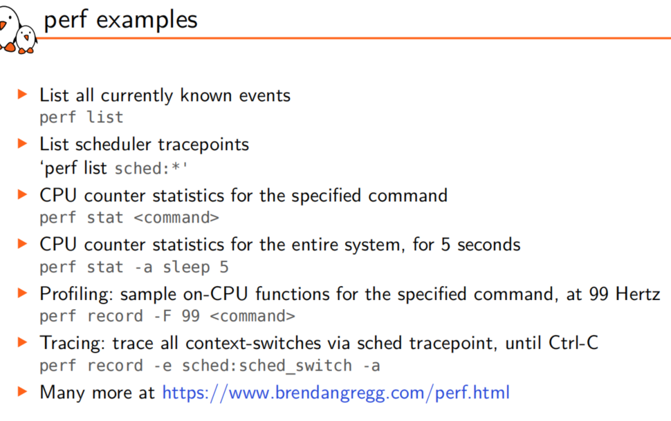
    + gprof
        - là công cụ đo application-level
        - là 1 phần của binutils
        - cần có `-pg` option tại thời điểm build
        - chạy chương trình của bạn bình thường, chương trình sẽ tạo ra gmon.out 
        - dùng gprof để phân tích gmon.out
- Memory debugging
    + Valgrind
        - tool để phân tích động, phát hiện vấn đề quản lý bộ nhớ và threading
        - là tool phổ biến để phân tích lỗi về memory
        - chạy ở target, dễ tích hợp bằng Yocto hoặc Buildroot
        - Valgrind tools:
            + Memcheck: phát hiện vấn đề quản lý bộ nhớ
            + Cachegrind: phân tích cache, giả lập bộ nhớ đệm L1, D1 và L2 trong CPU để chỉ ra chính xác nguồn gốc gây cache misses
            + Callgrind: extension của Cachegrind, cung cấp thêm thông tin về call graphs
            + Massif: đo đạ thông tin heap của 1 chương trình
            + Helgrind: debug cho thread để tìm date race trong multithread, tìm memory nào được truy cập bởi nhiều thread mà không lock
            + Kcachegrind - Visualizing Valgrind profiling data
## Thực hành
- cấu hình perf trong Kernel tool của buildroot
- cấu hình ltrace, strace trong Debugging, profiling and benchmark
