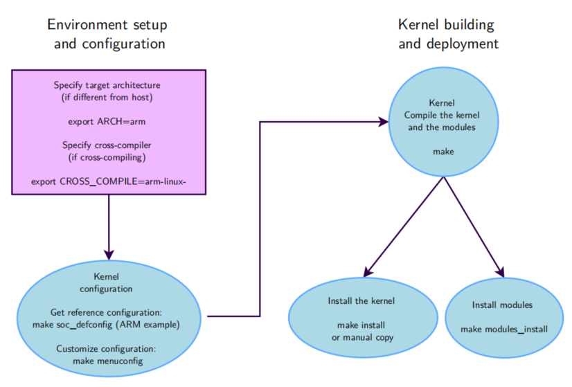

# Menu

# Linux Kernel Introduction
## Linux kernel in the system
- 
- Linux kernel nằm có vai trò cầu nối giữa user-space và hardware
- Chức năng chính:
    + quản lý tất cả phần cứng
    + cung cấp các API cho phép user-space app và lib sử dụng
    + quản lý truy cập phần cứng đồng thời của các app
## System calls
- là interface giữa kernel và userspace
- userspace thường không gọi systemcall trực tiếp và thông qua library
## Pseudo system
- Linux expose thông tin system và kernel tới userspace thông qua `pseudo filesystems`, hay còn gọi là `virtual filesystems`
- cho phép app quan sát được thư mục và file mà không tồn tại trong ổ cứng
- quan trọng nhất là: 
    + proc: thông tin hệ thống (process, memory, ...)
    + sysfs: thông tin phần cứng kết nói bởi các bus
## Linux kernel source code
- Kernel momery constraints
    + Kernel không có cơ chế bảo vệ momery
    + Kernel không có cơ chế phục hồi khi truy cập bộ nhớ trái phép

# Linux kernel usage
## Kernel configuration
- Kernel chứa hàng ngàn device driver, filesystem driver, network, ...
- có hàng ngàn option để chọn để compile cùng với kernel
- cấu hình kernel là quá trình thêm bớt option để compile cùng kernel
- việc cấu hình dựa vào target, khả năng mà developer muốn kernel có
- Kernel module:
    + mỗi module sẽ có 1 file đại diện trong hệ thống
    + không thể load lúc hệ thống đang boot vì lúc đang boot thì filesystem chưa available -> dẫn tới không thể tạo file cho module đó
- Kernel option dependencies:
    + B available nếu A available
        ```
        config B
            depends on A
        ```
    + B được enable thì A cũng bị enable theo, không thể off A thủ công
        ```
        config B
            select A
        ```
- xconfig:
    + make xconfig
    + giao diện GUI để cấu hình khi có màn hình
- menuconfig:
    + make menuconfig
- .config.old
    + lưu config trước đó 1 nhịp
    + dùng để restore nếu thiết lập kernel lỗi
## Compiling and installing the kernel
- cài kernel module cho hệ thống nhúng
    + make modules hoặc make -j4 (nếu build cùng kernel)
    + make INSTALL_MOD_PATH=<dir>/ modules_install
- tổng quan việc compile và install kernel
    + 
## Booting the kernel
- Hardware description
    + nhiều hệ thống embedded có nhiều non-discoverable hardware
    + những hardware này cần được mô tả trong device tree và pass vào Linux kernel
    + bằng cách này, kernel hỗ trợ nhiều SoC có thể biết được SoC nào tương thích với device tree nào
- Kernel command line - bootargs
    + hành vi của kernel được điều chỉnh mà không cần recompile bằng việc dùng bootargs
    + root=: đường dẫn rootfs
    + console=: nơi mà kernel in log ra
    + ví dụ: bootargs=console=ttyS0 root=/dev/mmc rootwait
    + ngay sau khi kernel start, nó sẽ chứa nội dung của bootargs
    + nội dung của bootargs được chứa trong `/proc/cmdline`
- Kernel log
    + kernel giữ message của nó trong 1 buffer, size của buffer được cấu hình bằng `CONFIG_LOG_BUF_SHIFT`
## Using kernel modules
- Advantage of modules:
    + dễ dàng develop mà không cần reboot hệ thống
    + giữ được size của kernel image nhỏ
    + giảm thời gian boot
    + kernel chỉ cho phép load signed modules
- Module utilities
    + extracing information
        - `modinfor <module>`: lây thông tin của module
    + loading
        - `insmod`: chỉ load 1 module
        - `modprobe`: load module và các dependencies của nó
        - `lsmod`
    + removals
        - `rmmod`
        - `modprobe -r`
- Passing parameters to modules
    + xem thông tin parameter của module: `modinfo <module>`
    + truyền value với insmod: `insmod name.ko param=0`
    + truyền value với modprove: set param trong /etc/modprobe.conf hoặc các file trong /etc/modprobe.d/
        - `option usb-storage delay_usb=0`
    + truyền value qua kernel command line, khi mà module được build static với kernel
        `usb-storage.delay_use=0`
- Check module parameter values
    + check trong `/sys/module/<name>/parameter`
    + mỗi param là 1 file
    + có thể dùng echo để ghi giá trị vào file chứa param đó

# Developing kernel modules
- Hello module
```c
// SPDX-License-Identifier: GPL-2.0
/* hello.c */
#include <linux/init.h>
#include <linux/module.h>
#include <linux/kernel.h>
static int __init hello_init(void)
{
 pr_alert("Good morrow to this fair assembly.\n");
 return 0;
}
static void __exit hello_exit(void)
{
 pr_alert("Alas, poor world, what treasure hast thou lost!\n");
}
module_init(hello_init);
module_exit(hello_exit);
MODULE_LICENSE("GPL");
MODULE_DESCRIPTION("Greeting module");
MODULE_AUTHOR("William Shakespeare");
```
- `__init`: remove sau quá trình khởi tạo, memory sẽ được lấy lại sau khi kernel init xong
- `__exit`: bị loại bỏ nếu module được build static vào kernel hoặc khi tính năng unload không enable
- Hello module explanations:
    + header là của Linux, không dùng thư viện C thông thường
    + Hàm init khởi tạo:    
        - được gọi khi module được load
        - khai báo cùng macro `module_init()`
    + Hàm exit:
        - được gọi khi module được unload
        - khai báo cùng macro `module_exit()`
    + Metadata information: `MODULE_LICENSE()`, `MODULE_DESCRIPTION()`, `MODULE_AUTHOR()`
- Symbols exported to modules
    + kernel module chỉ có thể gọi 1 số function của kernel
    + function và biến phải được export rõ ràng bởi kernel thì kernel module mới gọi được
    + Macro được dùng để kernel export function và biến:
        - `EXPORT_SYSBOL(name)`: export tới tất cả modules
        - `EXPORT_SYMBOL_GPL(name)`: export tới những module có GPL licenses
    + 1 driver thông thường không nên dùng các function chưa được export
    + 
- Module license
    + Được dùng để giới hạn kernel function mà module có thể dùng nếu module không phải là license GPL
    + Nếu nạp 1 kernel mã nguồn đóng, Linux kernel sẽ đánh dấu là tainted (bị bẩn)
    + check `/proc/sys/kernel/tainted`, nếu 100% là k bị tainted, k có module độc quyền nào được nạp
    + hoặc chạy `vrms` để check có tainted không
    + Nhóm license mã nguồn mở: GPL, GPL v2, ...
- Compiling a module
    + out-of-tree:
        - code nằm ngoài kernel source tree
        - k tích hợp vào kernel
        - build riêng
        - chỉ có thể build thành module
    + inside the kernel tree
        - tích hợp vào kernel
        - có thể build cùng kernel hoặc the module
- Compiling an out-of-tree module
    ```c
    ifneq ($(KERNELRELEASE),)
    obj-m := hello.o
    else
    KDIR := /path/to/kernel/sources
    all:
    <tab>$(MAKE) -C $(KDIR) M=$$PWD
    endif
    ```
    + KERNELRELEASE chưa được định nghĩa nên Makefile của module sẽ tìm tới Makefile của kernel, pass đường dẫn chứa module trong biến `M`
    + kernel Makefile biết cách để build module, và nhờ vào biến `M`, nó biết nơi chứa Makefile của module. Makefile của module này sau đó tích hợp cùng KERNELRELEASE được định nghĩa, vì vậy kernel có thể biết được cần biên dịch `hello.o`
- Modules and kernel version
    + để biên dịch, kernel module cần truy cập được đường dẫn của kernel header, nơi chứa định nghĩa hàm, type, ....
    + có 2 giải pháp để lấy được kernel header:
        - full kernel source
        - only kernel headers
    + source hoặc header cần phải được cấu hình (.config file)
    + kernel module được compile với ver X của kernel header không thể load được trong máy chạy ver Y của kernel header
- New driver in kernel sources
    + để add thêm driver vào kernel source, cần:
        - add source code vào thư mục phù hợp
        - driver code thường chỉ là 1 file, dù file lớn thì cũng 1 file. Chỉ khi code thực sự lớn mới tách
        - mô tả cấu hình interface cho driver mới bằng cách add thêm lệnh sau vào Kconfig (cách này thủ công k dùng Builtroot)
            ```
            config USB_SERIAL_NAVMAN
                tristate "USB Navman GPS device"
                depends on USB_SERIAL
                help
                    To compile this driver as a module, choose M
                    here: the module will be called navman.
            ```
        - add thêm dòng trong Makefile dựa theo Kconfig
            + `obj-$(CONFIG_xxx) += hello.o`
            + lệnh này nói với kernel build system rằng hãy build hello.c khi CONFIG_xxx được bật (cho cả build static hoặc module)
                - run `make xconfig` để thấy optione vừa được thêm
                - run `make` để build
- Hello module với parameter
    ```c
    // SPDX-License-Identifier: GPL-2.0
    /* hello_param.c */
    #include <linux/init.h>
    #include <linux/module.h>
    MODULE_LICENSE("GPL");
    static char *whom = "world";
    module_param(whom, charp, 0644);
    MODULE_PARM_DESC(whom, "Recipient of the hello message");
    static int howmany = 1;
    module_param(howmany, int, 0644);
    MODULE_PARM_DESC(howmany, "Number of greetings");
    static int __init hello_init(void)
    {
        int i;
        for (i = 0; i < howmany; i++)
        pr_alert("(%d) Hello, %s\n", i, whom);
        return 0;
    }
    static void __exit hello_exit(void)
    {
        pr_alert("Goodbye, cruel %s\n", whom);
    }
    module_init(hello_init);
    module_exit(hello_exit);
    ```
- Declaring a module parameter
    ```c
    module_param(
    name, /* name of an already defined variable */
    type, /* standard types (different from C types) are:
    * byte, short, ushort, int, uint, long, ulong
    * charp: a character pointer
    * bool: a bool, values 0/1, y/n, Y/N.
    * invbool: the above, only sense-reversed (N = true). */
    perm /* for /sys/module/<module_name>/parameters/<param>,
    * 0: no such module parameter value file */
    );
    /* Example: drivers/block/loop.c */
    static int max_loop;
    module_param(max_loop, int, 0444);
    MODULE_PARM_DESC(max_loop, "Maximum number of loop devices");
    ```
- Thực hành:
    + dùng utsname.h để in ra version kernel được build
    + Khai báo param truyền vào module lúc load:
        ```c
        static char *who = "";
        module_param(who, charp, 0644); //owner: read write, others: read
        MODULE_PARM_DESC(who, "Name of who"); // mô tả param
        ```