# Menu

- [Linux Kernel Introduction](#linux-kernel-introduction)
  - [Linux kernel in the system](#linux-kernel-in-the-system)
  - [System calls](#system-calls)
  - [Pseudo system](#pseudo-system)
  - [Linux kernel source code](#linux-kernel-source-code)
- [Linux kernel usage](#linux-kernel-usage)
  - [Kernel configuration](#kernel-configuration)
  - [Compiling and installing the kernel](#compiling-and-installing-the-kernel)
  - [Booting the kernel](#booting-the-kernel)
  - [Using kernel modules](#using-kernel-modules)
- [Developing kernel modules](#developing-kernel-modules)
- [Describing hardware devices](#describing-hardware-devices)
  - [Discoverable hardware: USB and PCI](#discoverable-hardware-usb-and-pci)
  - [Describing non-discoverable hardware](#describing-non-discoverable-hardware)
  - [Device tree](#device-tree)
  - [Thực hành](#thực-hành)
- [Introduction to pin muxing](#introduction-to-pin-muxing)
  - [What is pin muxing](#what-is-pin-muxing)
  - [Pin muxing in the Linux kernel](#pin-muxing-in-the-linux-kernel)
  - [Thực hành](#thực-hành-1)
- [Linux device and driver model](#linux-device-and-driver-model)
  - [Introduction](#introduction)
  - [Example of the USB bus](#example-of-the-usb-bus)
  - [Platform drivers](#platform-drivers)
- [Introduction to the I2C subsystem](#introduction-to-the-i2c-subsystem)
  - [What is I2C?](#what-is-i2c)
  - [An I2C bus example](#an-i2c-bus-example)
  - [The I2C bus driver](#the-i2c-bus-driver)
  - [Registering an I2C device driver](#registering-an-i2c-device-driver)
  - [Registering an I2C device driver: example](#registering-an-i2c-device-driver-example)
  - [Registering an I2C device: non-DT](#registering-an-i2c-device-non-dt)
  - [Registering an I2C device, non-DT example](#registering-an-i2c-device-non-dt-example)
  - [Registering an I2C device, in the DT](#registering-an-i2c-device-in-the-dt)
  - [probe() and remove()](#probe-and-remove)
  - [Communicating with the I2C device: raw API](#communicating-with-the-i2c-device-raw-api)
  - [Communicating with the I2C device: message transfer](#communicating-with-the-i2c-device-message-transfer)
  - [I2C: message transfer example](#i2c-message-transfer-example)
  - [I2C functionality](#i2c-functionality)
  - [Thực hành](#thực-hành-2)
- [Kernel framework for device drivers](#kernel-framework-for-device-drivers)
  - [Kernel and Device drivers](#kernel-and-device-drivers)
  - [User space vision of devices](#user-space-vision-of-devices)
  - [Devices: everything is a file](#devices-everything-is-a-file)
  - [Creating device files](#creating-device-files)
  - [Character drivers](#character-drivers)
  - [The concept of kernel frameworks](#the-concept-of-kernel-frameworks)
  - [Example: the input subsystem](#example-the-input-subsystem)
  - [Device-managed allocations](#device-managed-allocations)
  - [Driver data structures and links](#driver-data-structures-and-links)
  - [Thực hành](#thực-hành-3)
- [Memory Management](#memory-management)
  - [Physical and virtual memory](#physical-and-virtual-memory)
  - [Virtual memory organization](#virtual-memory-organization)
  - [Physical/virtual memory mapping on 32-bit systems](#physicalvirtual-memory-mapping-on-32-bit-systems)
  - [Physical/virtual memory mapping on 64-bit systems (4kiB-pages)](#physicalvirtual-memory-mapping-on-64-bit-systems-4kib-pages)
  - [User space virtual address space](#user-space-virtual-address-space)
  - [Userspace memory allocations](#userspace-memory-allocations)
  - [Kernel memory allocators](#kernel-memory-allocators)
  - [Page allocator](#page-allocator)
  - [Page allocator API](#page-allocator-api)
  - [Page allocator flags - gfp_t](#page-allocator-flags---gfp_t)
  - [SLAB allocator - bộ cấp phát SLAB](#slab-allocator---bộ-cấp-phát-slab)
  - [Different SLAB allocators](#different-slab-allocators)
  - [kmalloc allocator](#kmalloc-allocator)
  - [kmalloc API](#kmalloc-api)
  - [devm_kmalloc functions](#devm_kmalloc-functions)
  - [vmalloc allocator](#vmalloc-allocator)
  - [Kernel memory debugging](#kernel-memory-debugging)
- [I/O memory](#io-memory)
  - [Memory-mapped I/O - MMIO](#memory-mapped-io---mmio)
  - [Requesting I/O memory](#requesting-io-memory)
  - [Mapping I/O memory in virtual memory](#mapping-io-memory-in-virtual-memory)
  - [ioremap()](#ioremap)
  - [Managed API](#managed-api)
  - [Accessing MMIO devices: using accessor functions](#accessing-mmio-devices-using-accessor-functions)
  - [Ordering](#ordering)
  - [MMIO access functions](#mmio-access-functions)
  - [MMIO access functions summary](#mmio-access-functions-summary)
  - [/dev/mem](#devmem)
  - [Clocking and power management](#clocking-and-power-management)
    - [Enabling hardware](#enabling-hardware)
    - [Power handling](#power-handling)
    - [Clocks handling](#clocks-handling)
    - [Diagram overview of the common clock framework](#diagram-overview-of-the-common-clock-framework)
    - [Reset handling](#reset-handling)
    - [Runtime power management](#runtime-power-management)
  - [Thực hành](#thực-hành-4)
- [The misc subsystem](#the-misc-subsystem)
  - [Why a misc subsystem](#why-a-misc-subsystem)
  - [Misc subsystem diagram](#misc-subsystem-diagram)
  - [Misc subsystem API](#misc-subsystem-api)
  - [Thực hành](#thực-hành-5)
- [Processes, scheduling and interrupts](#processes-scheduling-and-interrupts)
  - [Processes and scheduling](#processes-and-scheduling)
    - [Process, thread?](#process-thread)
    - [Process, thread: kernel point of view](#process-thread-kernel-point-of-view)
    - [Relation between execution mode, address space and context](#relation-between-execution-mode-address-space-and-context)
    - [A thread life](#a-thread-life)
    - [Execution of system calls](#execution-of-system-calls)
  - [Sleeping](#sleeping)
    - [Sleeping](#sleeping-1)
    - [How to sleep with a wait queue](#how-to-sleep-with-a-wait-queue)
    - [Waking up](#waking-up)
    - [Exclusive vs non-exclusive thread](#exclusive-vs-non-exclusive-thread-độc-quyên-vs-không-độc-quyền)
    - [Sleeping and waking up - Implementation](#sleeping-and-waking-up---implementation)
    - [How to sleep with completions](#how-to-sleep-with-completions---làm-thế-nào-để-sleep-sau-khi-đã-hoàn-thành-công-việc)
    - [Blocking](#blocking)
    - [Waiting when hardware is involved](#waiting-when-hardware-is-involved)
  - [Interrupt Management](#interrupt-management)
    - [Registering an interrupt handler](#registering-an-interrupt-handler)
    - [Interrupt handler constraints](#interrupt-handler-constraints---ràng-buộc-của-hàm-xử-lý-ngắt)
    - [Ví dụ về cat /proc/interrupts trên Raspi 2](#ví-dụ-về-cat-procinterrupts-trên-raspi-2)
    - [Interrupt handler prototype](#interrupt-handler-prototype)
    - [Typical interrupt handler's job](#typical-interrupt-handlers-job---công-việc-thông-thường-của-các-trình-xử-lý-ngắt)
    - [Top half and bottom half processing](#top-half-and-bottom-half-processing)
    - [Softirqs](#softirqs)
    - [Softirq execution flow](#softirq-execution-flow)
    - [Threaded interrupts](#threaded-interrupts)
    - [Workqueues](#workqueues)
    - [Interrupt and deferred mechanisms execution constraints summary](#interrupt-and-deferred-mechanisms-execution-constraints-summary)
    - [Interrupt management summary](#interrupt-management-summary)
    - [Thực hành](#thực-hành-6)
- [Concurrent Access to Resources: Locking](#concurrent-access-to-resources-locking)
  - [Sources of concurrency issues](#sources-of-concurrency-issues)
  - [Concurrency protection with locks](#concurrency-protection-with-locks)
  - [Linux mutexes mutex = mutual exclusion](#linux-mutexes-mutex--mutual-exclusion)
  - [Locking and unlocking mutexes](#locking-and-unlocking-mutexes)
  - [Spinlocks - 1 loại lock đặc biệt](#spinlocks---1-loại-lock-đặc-biệt)
  - [The spinlock API](#the-spinlock-api)
  - [Spinlocks vs. preemption/migration](#spinlocks-vs-preemptionmigration)
  - [Spinlocks vs. interrupts](#spinlocks-vs-interrupts)
  - [Spinlock API](#spinlock-api)
  - [Spinlock example](#spinlock-example)
  - [More deadlock situations](#more-deadlock-situations)
  - [Debugging locking](#debugging-locking)
  - [Concurrency issues](#concurrency-issues)
  - [Alternatives to locking - các giải pháp khác thay thế cơ chế lock](#alternatives-to-locking---các-giải-pháp-khác-thay-thế-cơ-chế-lock)
  - [RCU API](#rcu-api)
  - [RCU example: ensuring consistent accesses](#rcu-example-ensuring-consistent-accesses)
  - [Atomic variables](#atomic-variables)
  - [Atomic bit operations](#atomic-bit-operations)
  - [Kernel locking: summary and references](#kernel-locking-summary-and-references)
  - [Thực hành](#thực-hành-7)
- [Direct memory access](#direct-memory-access)
  - [DMA main principles](#dma-main-principles)
    - [DMA integration](#dma-integration)
    - [Peripheral DMA](#peripheral-dma)
    - [DMA controller](#dma-controller)
    - [DMA descriptors](#dma-descriptors)
    - [Cache constrains](#cache-constrains)
    - [DMA addressing constraints](#dma-addressing-constraints)
    - [DMA memory allocation constraints](#dma-memory-allocation-constraints)
  - [Kernel APIs for DMA](#kernel-apis-for-dma)
    - [dma-mapping: Coherent or streaming DMA mappings](#dma-mapping-coherent-or-streaming-dma-mappings)
    - [dma-mapping: memory addressing constraints](#dma-mapping-memory-addressing-constraints)
    - [dma-mapping: Allocating coherent memory mappings](#dma-mapping-allocating-coherent-memory-mappings)
    - [dma-mapping: Setting up streaming memory mappings (single)](#dma-mapping-setting-up-streaming-memory-mappings-single)
    - [dma-mapping: Setting up streaming memory mappings (multiples)](#dma-mapping-setting-up-streaming-memory-mappings-multiples)
    - [dma-mapping: Setting up streaming I/O mappings](#dma-mapping-setting-up-streaming-io-mappings)
    - [dma-mapping: Verifying DMA memory mappings](#dma-mapping-verifying-dma-memory-mappings)
    - [dma-mapping: Syncing streaming DMA mappings](#dma-mapping-syncing-streaming-dma-mappings)
    - [Starting DMA transfers](#starting-dma-transfers)
    - [The dmaengine framework](#the-dmaengine-framework)
    - [Ví dụ](#ví-dụ)
    - [Thực hành](#thực-hành-8)
- [Kernel resources](#kernel-resources)

# Linux Kernel Introduction
## Linux kernel in the system
- 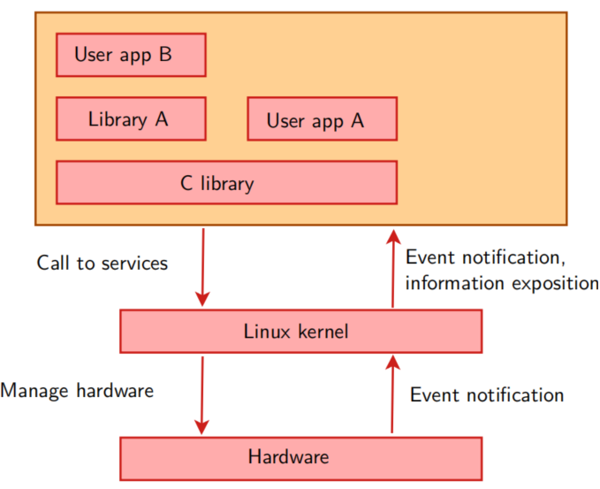
- Linux kernel nằm có vai trò cầu nối giữa user-space và hardware
- Chức năng chính:
    + quản lý tất cả phần cứng
    + cung cấp các API cho phép user-space app và lib sử dụng
    + quản lý truy cập phần cứng đồng thời của các app
## System calls
- là interface giữa kernel và userspace
- userspace thường không gọi systemcall trực tiếp và thông qua library
## Pseudo system
- Linux expose thông tin system và kernel tới userspace thông qua `pseudo filesystems`, hay còn gọi là `virtual filesystems`
- cho phép app quan sát được thư mục và file mà không tồn tại trong ổ cứng
- quan trọng nhất là: 
    + proc: thông tin hệ thống (process, memory, ...)
    + sysfs: thông tin phần cứng kết nói bởi các bus
## Linux kernel source code
- Kernel momery constraints
    + Kernel không có cơ chế bảo vệ momery
    + Kernel không có cơ chế phục hồi khi truy cập bộ nhớ trái phép

# Linux kernel usage
## Kernel configuration
- Kernel chứa hàng ngàn device driver, filesystem driver, network, ...
- có hàng ngàn option để chọn để compile cùng với kernel
- cấu hình kernel là quá trình thêm bớt option để compile cùng kernel
- việc cấu hình dựa vào target, khả năng mà developer muốn kernel có
- Kernel module:
    + mỗi module sẽ có 1 file đại diện trong hệ thống
    + không thể load lúc hệ thống đang boot vì lúc đang boot thì filesystem chưa available -> dẫn tới không thể tạo file cho module đó
- Kernel option dependencies:
    + B available nếu A available
        ```
        config B
            depends on A
        ```
    + B được enable thì A cũng bị enable theo, không thể off A thủ công
        ```
        config B
            select A
        ```
- xconfig:
    + make xconfig
    + giao diện GUI để cấu hình khi có màn hình
- menuconfig:
    + make menuconfig
- .config.old
    + lưu config trước đó 1 nhịp
    + dùng để restore nếu thiết lập kernel lỗi
## Compiling and installing the kernel
- cài kernel module cho hệ thống nhúng
    + `make modules` hoặc `make -j4` (nếu build cùng kernel)
    + `make INSTALL_MOD_PATH=<dir>/ modules_install`
- tổng quan việc compile và install kernel
    + 
## Booting the kernel
- Hardware description
    + nhiều hệ thống embedded có nhiều non-discoverable hardware
    + những hardware này cần được mô tả trong device tree và pass vào Linux kernel
    + bằng cách này, kernel hỗ trợ nhiều SoC có thể biết được SoC nào tương thích với device tree nào
- Kernel command line - bootargs
    + hành vi của kernel được điều chỉnh mà không cần recompile bằng việc dùng bootargs
    + root=: đường dẫn rootfs
    + console=: nơi mà kernel in log ra
    + ví dụ: bootargs=console=ttyS0 root=/dev/mmc rootwait
    + ngay sau khi kernel start, nó sẽ chứa nội dung của bootargs
    + nội dung của bootargs được chứa trong `/proc/cmdline`
- Kernel log
    + kernel giữ message của nó trong 1 buffer, size của buffer được cấu hình bằng `CONFIG_LOG_BUF_SHIFT`
## Using kernel modules
- Advantage of modules:
    + dễ dàng develop mà không cần reboot hệ thống
    + giữ được size của kernel image nhỏ
    + giảm thời gian boot
    + kernel chỉ cho phép load signed modules
- Module utilities
    + extracing information
        - `modinfor <module>`: lây thông tin của module
    + loading
        - `insmod`: chỉ load 1 module
        - `modprobe`: load module và các dependencies của nó
        - `lsmod`
    + removals
        - `rmmod`
        - `modprobe -r`
- Passing parameters to modules
    + xem thông tin parameter của module: `modinfo <module>`
    + truyền value với insmod: `insmod name.ko param=0`
    + truyền value với modprove: set param trong /etc/modprobe.conf hoặc các file trong /etc/modprobe.d/
        - `option usb-storage delay_usb=0`
    + truyền value qua kernel command line, khi mà module được build static với kernel
        `usb-storage.delay_use=0`
- Check module parameter values
    + check trong `/sys/module/<name>/parameter`
    + mỗi param là 1 file
    + có thể dùng echo để ghi giá trị vào file chứa param đó

# Developing kernel modules
- Hello module
```c
// SPDX-License-Identifier: GPL-2.0
/* hello.c */
#include <linux/init.h>
#include <linux/module.h>
#include <linux/kernel.h>
static int __init hello_init(void)
{
 pr_alert("Good morrow to this fair assembly.\n");
 return 0;
}
static void __exit hello_exit(void)
{
 pr_alert("Alas, poor world, what treasure hast thou lost!\n");
}
module_init(hello_init);
module_exit(hello_exit);
MODULE_LICENSE("GPL");
MODULE_DESCRIPTION("Greeting module");
MODULE_AUTHOR("William Shakespeare");
```
- `__init`: remove sau quá trình khởi tạo, memory sẽ được lấy lại sau khi kernel init xong
- `__exit`: bị loại bỏ nếu module được build static vào kernel hoặc khi tính năng unload không enable
- Hello module explanations:
    + header là của Linux, không dùng thư viện C thông thường
    + Hàm init khởi tạo:    
        - được gọi khi module được load
        - khai báo cùng macro `module_init()`
    + Hàm exit:
        - được gọi khi module được unload
        - khai báo cùng macro `module_exit()`
    + Metadata information: `MODULE_LICENSE()`, `MODULE_DESCRIPTION()`, `MODULE_AUTHOR()`
- Symbols exported to modules
    + kernel module chỉ có thể gọi 1 số function của kernel
    + function và biến phải được export rõ ràng bởi kernel thì kernel module mới gọi được
    + Macro được dùng để kernel export function và biến:
        - `EXPORT_SYSBOL(name)`: export tới tất cả modules
        - `EXPORT_SYMBOL_GPL(name)`: export tới những module có GPL licenses
    + 1 driver thông thường không nên dùng các function chưa được export
    + 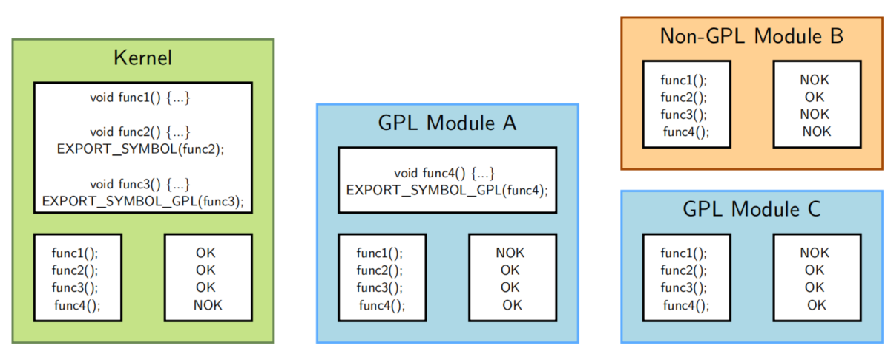
- Module license
    + Được dùng để giới hạn kernel function mà module có thể dùng nếu module không phải là license GPL
    + Nếu nạp 1 kernel mã nguồn đóng, Linux kernel sẽ đánh dấu là tainted (bị bẩn)
    + check `/proc/sys/kernel/tainted`, nếu 100% là k bị tainted, k có module độc quyền nào được nạp
    + hoặc chạy `vrms` để check có tainted không
    + Nhóm license mã nguồn mở: GPL, GPL v2, ...
- Compiling a module
    + out-of-tree:
        - code nằm ngoài kernel source tree
        - k tích hợp vào kernel
        - build riêng
        - chỉ có thể build thành module
    + inside the kernel tree
        - tích hợp vào kernel
        - có thể build cùng kernel hoặc the module
- Compiling an out-of-tree module
    ```c
    ifneq ($(KERNELRELEASE),)
    obj-m := hello.o
    else
    KDIR := /path/to/kernel/sources
    all:
    <tab>$(MAKE) -C $(KDIR) M=$$PWD
    endif
    ```
    + KERNELRELEASE chưa được định nghĩa nên Makefile của module sẽ tìm tới Makefile của kernel, pass đường dẫn chứa module trong biến `M`
    + kernel Makefile biết cách để build module, và nhờ vào biến `M`, nó biết nơi chứa Makefile của module. Makefile của module này sau đó tích hợp cùng KERNELRELEASE được định nghĩa, vì vậy kernel có thể biết được cần biên dịch `hello.o`
- Modules and kernel version
    + để biên dịch, kernel module cần truy cập được đường dẫn của kernel header, nơi chứa định nghĩa hàm, type, ....
    + có 2 giải pháp để lấy được kernel header:
        - full kernel source
        - only kernel headers
    + source hoặc header cần phải được cấu hình (.config file)
    + kernel module được compile với ver X của kernel header không thể load được trong máy chạy ver Y của kernel header
- New driver in kernel sources
    + để add thêm driver vào kernel source, cần:
        - add source code vào thư mục phù hợp
        - driver code thường chỉ là 1 file, dù file lớn thì cũng 1 file. Chỉ khi code thực sự lớn mới tách
        - mô tả cấu hình interface cho driver mới bằng cách add thêm lệnh sau vào Kconfig (cách này thủ công k dùng Builtroot)
            ```
            config USB_SERIAL_NAVMAN
                tristate "USB Navman GPS device"
                depends on USB_SERIAL
                help
                    To compile this driver as a module, choose M
                    here: the module will be called navman.
            ```
        - add thêm dòng trong Makefile dựa theo Kconfig
            + `obj-$(CONFIG_xxx) += hello.o`
            + lệnh này nói với kernel build system rằng hãy build hello.c khi CONFIG_xxx được bật (cho cả build static hoặc module)
                - run `make xconfig` để thấy optione vừa được thêm
                - run `make` để build
        - sau khi build xong, module sẽ được khởi động cùng hệ thống, check lại /proc/version
- Hello module với parameter
    ```c
    // SPDX-License-Identifier: GPL-2.0
    /* hello_param.c */
    #include <linux/init.h>
    #include <linux/module.h>
    MODULE_LICENSE("GPL");
    static char *whom = "world";
    module_param(whom, charp, 0644);
    MODULE_PARM_DESC(whom, "Recipient of the hello message");
    static int howmany = 1;
    module_param(howmany, int, 0644);
    MODULE_PARM_DESC(howmany, "Number of greetings");
    static int __init hello_init(void)
    {
        int i;
        for (i = 0; i < howmany; i++)
        pr_alert("(%d) Hello, %s\n", i, whom);
        return 0;
    }
    static void __exit hello_exit(void)
    {
        pr_alert("Goodbye, cruel %s\n", whom);
    }
    module_init(hello_init);
    module_exit(hello_exit);
    ```
- Declaring a module parameter
    ```c
    module_param(
    name, /* name of an already defined variable */
    type, /* standard types (different from C types) are:
    * byte, short, ushort, int, uint, long, ulong
    * charp: a character pointer
    * bool: a bool, values 0/1, y/n, Y/N.
    * invbool: the above, only sense-reversed (N = true). */
    perm /* for /sys/module/<module_name>/parameters/<param>,
    * 0: no such module parameter value file */
    );
    /* Example: drivers/block/loop.c */
    static int max_loop;
    module_param(max_loop, int, 0444);
    MODULE_PARM_DESC(max_loop, "Maximum number of loop devices");
    ```
- Thực hành:
    + dùng utsname.h để in ra version kernel được build
    + Khai báo param truyền vào module lúc load:
        ```c
        static char *who = "";
        module_param(who, charp, 0644); //owner: read write, others: read
        MODULE_PARM_DESC(who, "Name of who"); // mô tả param
        ```
    + Linux cung cấp công cụ để kiểm tra coding standard: 
        - `~/linux-kernel-bbb-labs/src/linux/scripts/checkpatch.pl --file --no-tree hello_version.c`
    + truyền tham số do kernel module nếu được build static bằng cách thêm vào bootargs chuỗi: `hello.who=dung`

# Describing hardware devices
## Discoverable hardware: USB and PCI
- Discoverable hardware:
    + 1 số bus có cơ chế phát hiện phần cứng, phổ biến đó là USB và PCI
    + Hardware device được đánh số, và đặc tính của chúng được lấy ra bởi 1 driver hoặc bus controller
    + Lệnh:
        - `lsusb`: liệt kê các USB device
        - `lspci`: liệt kê các PCI device
    + 1 device được detect không có nghĩa rằng có 1 kernel driver gắn với nó
    + Việc gắn với kernel driver cần dựa vào product ID/vendor ID hoặc các đặc tính như: device class, device sub-class, ...
## Describing non-discoverable hardware
- Có 3 cách mô tả phần cứng non-discoverable
    + trực tiếp trong OS/Bootloader code
    + dùng ACPI table
    + dùng device tree
## Device tree
- Device tree: from source to blob (từ source tới file nhị phân)
    + `.dts`: device tree source
    + `dtc`: device tree compiler 
        - Lệnh build: `dtc -I dts -O dtb -o foo.dtb foo.dts`
        - Lệnh đọc: `dtc -I dtb -0 dts foo.dtb`
    + `.dtb`: device tree blob (device tree binary)
    + DTB còn gọi là FDT - Flattened device tree
- Where are Device tree sources located?    
    + `arch/<ARCH>/boot/dts/<vendor>`
    + trong U-boot, TF-A cũng có sẵn folder chứa device tree được copy từ Linux kernel source
- Device tree base syntax
    + 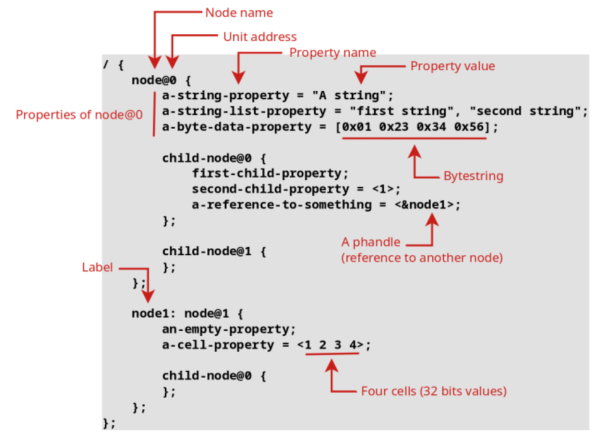
- DT overall structure: simplified example
    + 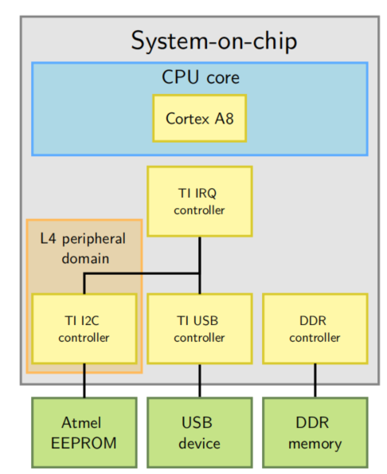
    + 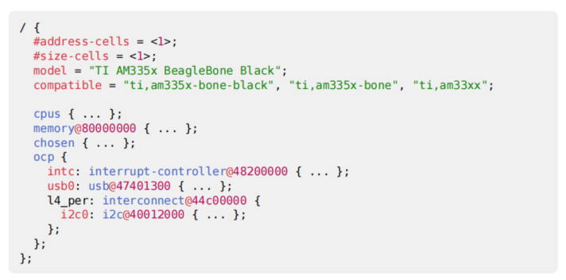
    + 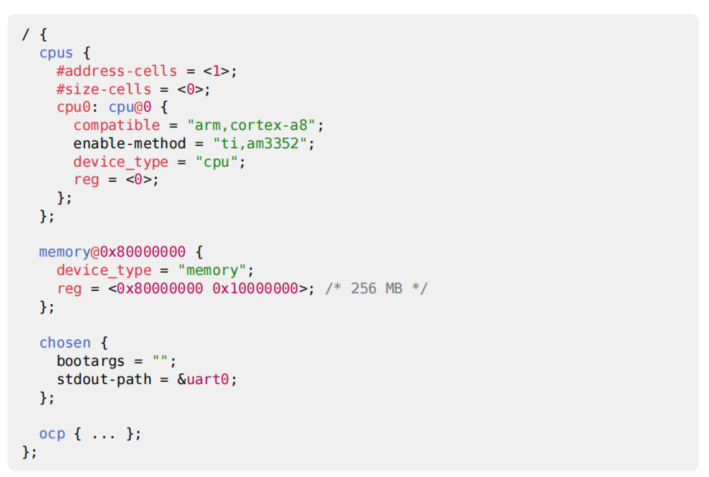
    + 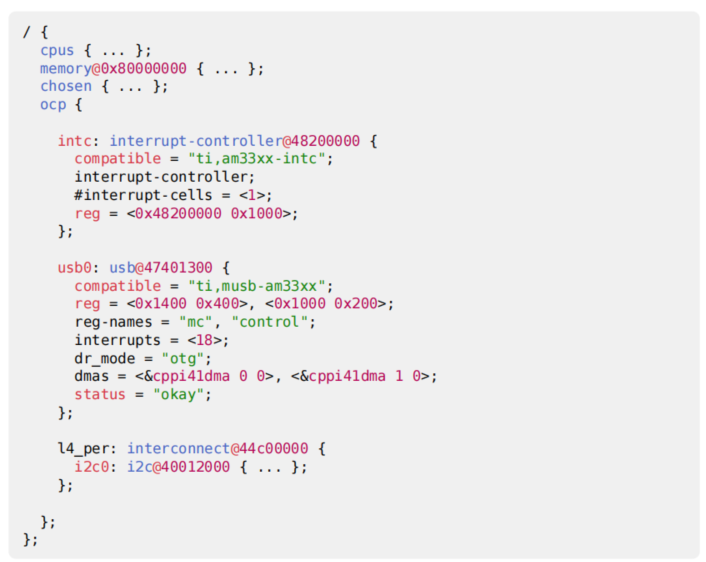
    + 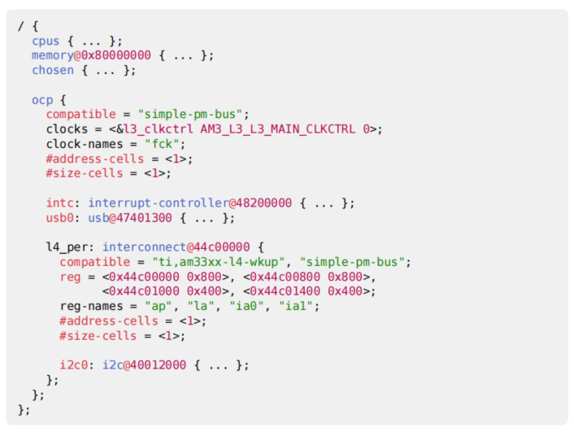
    + 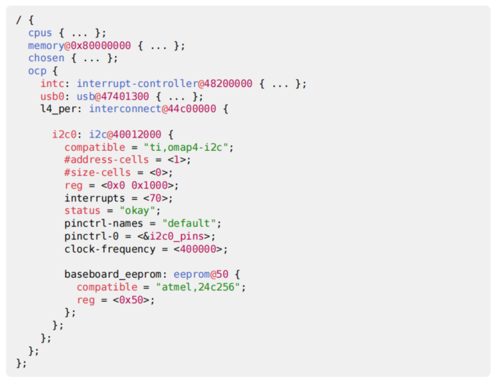
- Device tree inheritance
    + device tree có thể được chia thành nhiều file
    + `.dtsi`: là file dùng để include vào file khác
        - chứa định nghĩa Soc-level
        - định nghĩa chung cho 1 số lượng board
    + `.dts`: là file device tree cuối cùng
    + việc ghi đè (overlay) device tree được tuân theo thứ tự include, cho phép file sau ghi đè giá trị của file trước
- DT inheritance in Bone Black support
    + 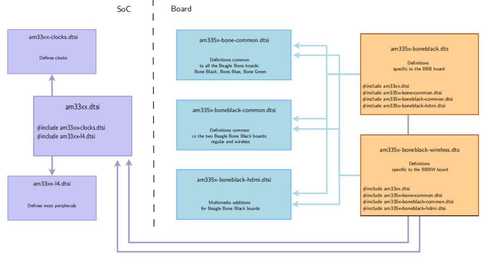
- Device tree design principles
    + device tree mô tả phần cứng chứ không phải cách cấu hình phần cứng
    + device tree đọc lập với OS, khi OS thay đổi thì device tree không cần đổi
    + device tree còn mô tả các hardware component mà tích hợp với hệ thống, không phải cách chúng hoạt động
- The properties
    + có thể dùng chung và áp dụng cho phần lớn các nodes: compatible, reg, ...
    + bao hàm mối quan hệ consumer-provider
    + đặc thù theo từng subsystem: tất cả device của cùng 1 class có thể dùng chúng, bắt đầu bằng class name
    + node cha (i2c controller, spi controller, ...) rồi đến node con (các device nối vào bus i2c, spi, ... đó)
    + đặc thù theo vendor, device: mô tả đặc tính cho riêng vendor/device, bắt đầu bằng tiền tố <vendor>
    + 1 số thuộc tính đã lỗi thời
- The compatible property
    + mô tả specific binding mà node đó tuân theo
    + định danh programming model của device
    + OS dùng thuộc tính này để tìm driver phù hợp cho device
    + thường mô tả kèm tên vendor, model: `arm,armv7-timer`, `gpio-keys`
    + giá trị đặc biệt `simple-bus`: là bus nơi mà các node con là memory-mapped device
- compatible property and Linux kernel drivers
    + Linux nhận diện các platform device thông qua:
        - các node ở cao nhất chứa `compatible`
        - các sub-note của `simple-bus`
    + sub-node của I2C controller là I2C device
    + sub-node của SPI controller là SPI device
    + mỗi Linux driver có bảng compatible hỗ trợ `struct of_device_id[]`
    + khi 1 device tree node match compatible với driver, device đó được liên kết với driver đó
- reg property
    + mô tả địa chỉ base physical address và size của memory-mapped register, có thể chứa nhiều entries cho nhiều cùng register
        ```c
        sai4: sai@5007 {
            reg = <0x5007 0x4>, <0x5100 0x4>;
        }
        ```
    + i2c device trên i2c bus
        ```c
        &i2c {
            hdmi-transmitter@39 {
                reg = <0x39>;
            };
            cs42l51: cs42l51@4a {
                reg = <0x4a>;
            };
        }
        ```
    + spi device: chip select number
        ```c
        &qspi {
            flash0: mx66l51235l@0 {
            reg = <0>;
            };
            flash1: mx66l51235l@1 {
            reg = <1>;
            };
        };
        ```
    + địa chỉ của node sau dấu @ phải là địa chỉ của vùng nhớ đầu tiên được khai báo trong `reg`
        ```c
        sai4: sai@50027000 {
            reg = <0x50027000 0x4>, <0x500273f0 0x10>;
        };
        ```
- cell property
    + giá trị của các thuộc tính phải vừa vặn trong vùng 32bit, được gọi là các cell
    + khi khai báo `reg = <0x50027000 0x4>, <0x500273f0 0x10>;`, OS không hiểu đang muốn nói tới trường hợp nào trong 4 trường hợp sau
        ```c
            reg = <0x50027000>, <0x4>, <0x500273f0 0x10>;
            reg = <0x50027000 0x4 0x500273f0>, <0x10>;
            reg = <0x50027000>, <0x4 0x500273f0 0x10>;
            reg = <0x50027000 0x4 0x500273f0 0x10>;
        ```
    + Vì vậy cần thuộc tính để định nghĩa đúng format mình muốn
        - `#address-cells = <x>`: chỉ thị số lượng cell để chứa địa chỉ, tức là địa chỉ sẽ rộng 1 cell (32bit)
        - `#size-cells = <y>`: chỉ thị số lượng cell để chứa kích thước của vùng, tức là kích thước vùng nhớ của node con là 1 cell
        - node cha sẽ khai báo 2 thuộc tính này, và node con sẽ tuân theo
        - Ví dụ: 
            ```
            #address-cells = <1>
            #size-cells = <1>
            reg = <0x15 0x4>
            ```
            + address-cells là 1 thì chỉ lấy 1 cell đầu tiên là 0x15
            + size-calls là 1 thì chỉ lấy 1 cell tiếp theo là 0x4
            ```
            #address-cells = <2>
            #size-cells = <1>
            reg = <0x15 0x34 0x4>
            ```
            + address-cells là 2 thì lấy 2 cell đầu tiên là 0x15 0x34
            + size-calls là 1 thì chỉ lấy 1 cell tiếp theo là 0x4
            ```
            spi@300000 {
                #address-cells = <1>;
                #size-cells = <0>;
                flash@1 {
                    reg = <1>;
                };
            };
            ```
- status property
    + chỉ định device có được dùng hay không
    + "okay", "ok", "disabled"
- Resource: interrupts, clocks, DMA, reset lines, ...
    + device tree mô tả bộ điều khiển như 1 node
    + node đó sẽ được dùng trong các node khác
    + 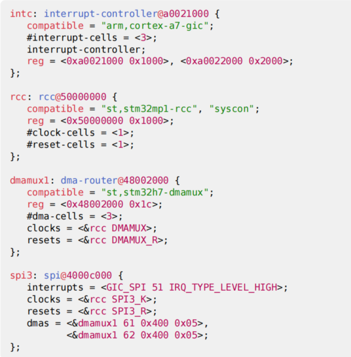
        - khi 1 node dùng node khác, cấu hình trong dấu `<>` phải tuân theo cell của node khác
        - ví dụ node khác yêu cầu cell là 3 thì trong `<>` cần có 3 tham số
- generic suffixes - các hậu tố chung
    + `xxx-gpios`   
        - dùng để phân biệt các chân của gpio
        - xxx là tên ví dụ: `power-gpios`, `reset-gpios`, ...
    + `xxx-names`:
        - đặt tên cho các item liên quan
        - cho phép driver tìm kiếm bằng tên thay vì ID
        - thứ tự của `xxx-names` khớp với item
        ```c
        uart0@4000c000 {
            dmas = <&edma 26 0>, <&edma 27 0>;
            dma-names = "tx", "rx";
        };
        ```
            - <&edma 26 0> là "tx"
            - <&edma 27 0> là "rx"
- how to validate Device tree content
    + Dựa vào spec của device tree: `https://www.devicetree.org/specifications/`
    + Dựa vào device tree binding - file mô tả phần cứng: `https://github.com/devicetree-org/dt-schema/tree/main/dtschema/schemas`
- device tree binding
    + các quy tắc về thông số kỹ thuật được viết dạng yaml, dễ dàng đọc, tool dễ phân tích
    + yaml quy định các viết phần cứng trong device tree
    + tức là khi viết device tree, thì file yaml định nghĩa các thuộc tính và format để khai báo
    + bootlin/linux-kernel/linux-kernel-bbb-labs/src/linux/Documentation/devicetree/bindings
- validate device trees
    + `dtc` chỉ verify syntax
    + yaml sẽ validate tính đúng đắn
    + Linux kernel cung cấp lệnh: 
        - `make dt_binding_check`: kiểm tra xem viết đúng cú pháp không
        - `make dtbs_check`: kiểm tra tính đúng đắn
    + 2 lệnh trên chạy cho toàn bộ hệ thống Linux sẽ mất thời gian, thay vào đó giới hạn phạm vi kiểm tra với file yaml cụ thể bằng lệnh: 
        - `make DT_SCHEMA_FILES=Documentation/devicetree/bindings/trivial-devices.yaml dt_binding_check`
        - `make DT_SCHEMA_FILES=Documentation/devicetree/bindings/trivial-devices.yaml dtbs_check`
- Binding syntax: base structure
    + Mỗi file YAML định nghĩa 1 cấp độ phân cấp device tree, tối đa là 2 cấp khi có node con
        - 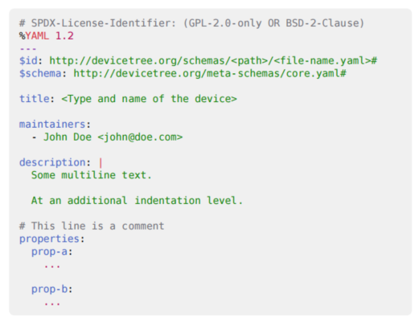
        - `%YAML`: định nghĩa language version
        - `$id`: có thể không phải là URL thực, nhưng là mã định danh duy nhất
        - `$schema`: tham chiếu tới meta-schema mà file này cần được xác thực
        - `property`: nơi bắt đầu định nghĩa, tất cả thuộc tính cần được liệt kê, tên biến viết thường, theo sau là dấu `:`, có 1 dòng trống giữa các property
- Binding syntax: types
    + 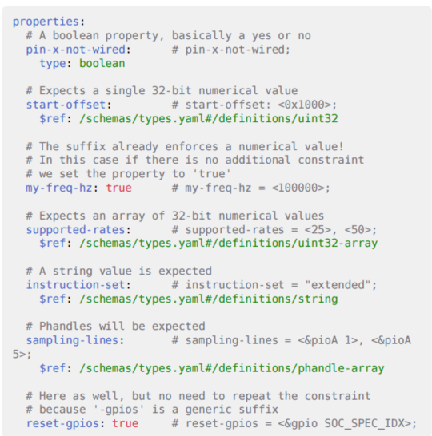
    + các property cần phải xác định kiểu dữ liệu thông qua `type:` hoặc `ref:`
        - thuộc tính boolean không yêu cầu giá trị
        - giá trị số có thể có dấu hoặc không dấu, và luôn là số 32bit
        - String nên được define
        - Mảng và matric cũng cần thiết
    + Các binding chung đã set type cho nhiều property
        - giá trị/số lượng phần tử của chúng có thể bị giới hạn
        - type không cần phải lặp lại
    + `dt-schema` sẽ áp dụng 1 kiểu dữ liệu bựa vào hậu tố, ví dụ -hz, -ohms, -us
- Binding syntax: child nodes
    + 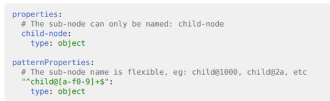
    + child node đơn giản là 1 property
    + type phải set là `type: object`
    + Nếu node con có tên cố định thì khai báo node con trong 1 node child-node
    + Nếu node con có tên không cố định thì khai báo 1 node là `patternProperties`
- Binding syntax: expressing constrains
    + bên cạnh việc định nghĩa chính xác các thuôc tính và type của chúng, giá trị của property cần được giới hạn:
        - tất cả property đều có thể có thêm tham số `description`, để con người đọc
        - tăng ràng buộc để giảm thiểu rủi ro
        - mỗi ràng buộc nằm ở 1 dòng
- Binding syntax: numerical constrains
    + 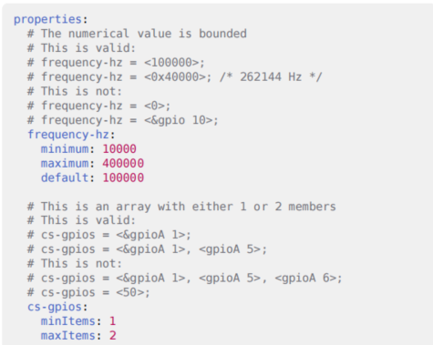
    + giới hạn bằng việc đặt minimum/maximum của giá trị
    + đặt giá trị default cho property
    + đặt minItems/maxItems cho mảng
- Binding syntax: lists and dictionaries
    + 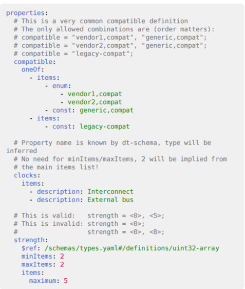
    + biểu diễn các giá trị có thể xảy ra, giới hạn giá trị mà property có thể nhận
        - bắt buộc giá trị duy nhất: `const`
        - lấy giá trị từ list: `enum`
    + `const`/`item` có thể được nhóm lại trong 1 `items` list
    + có thể xây dựng điều kiện từ 
        - `oneOf`: biểu thị XOR
        - `anyOf`: biểu thị OR
        - `allOf`: biển thị AND
- Bindings syntax: referencing other bindings
    + 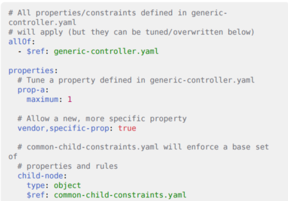
    + có thể viết constrains common rồi refer tới nó
    + file common 
        ```
        # File: xe-co-ban.yaml (Đây là file "common" - chứa ràng buộc chung)
        properties:
            so-banh-xe:
                maximum: 4  # Xe thông thường tối đa chỉ có 4 bánh
            co-dong-co:
                type: boolean # Giá trị bắt buộc là Đúng (True) hoặc Sai (False)
            bien-so-xe:
                type: string  # Phải là một chuỗi ký tự chữ và số
        ```
    + file refer tới common 
        ```
        # File: xe-may.yaml (File cấu hình cho một phần cứng cụ thể)
        allOf:
            - $ref: xe-co-ban.yaml  # <--- THAM CHIẾU: Lấy toàn bộ quy tắc của xe cơ bản vào đây

        properties:
            # 1. Ghi đè (Tune/Overwrite) lại thuộc tính chung cho đúng với thực tế của xe máy:
            so-banh-xe:
                const: 2              # Thiết bị chung bảo tối đa 4 bánh, nhưng xe máy bắt buộc phải là 2 bánh!

        # 2. Thêm thuộc tính đặc thù (Specific property) chỉ xe máy mới có:
        dung-tich-xi-nhan:
            type: integer
            maximum: 150          # Ví dụ xe máy thông thường tối đa 150cc
        ```
- Bindings syntax: altering on presence of properties
    + 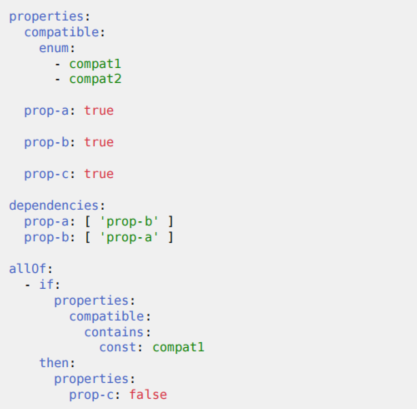
    + đôi khi ta cần các mô tả linh hoạt hơn
        - phụ thuộc giữa các property
            + 1 property có thể cần có property khác
            + nếu cả 2 thuộc tính cùng xuất hiện hoặc cùng không xuất hiện, dependency cần biểu diễn 2 chiều
        - thay đổi constrain dựa theo property
            + biểu diễn bằng if/else dưới `allOf`
            + điển hình là mỗi compatible đi kèm với constrain khác nhau
- Bindings syntax: enforcing correct properties only
    + 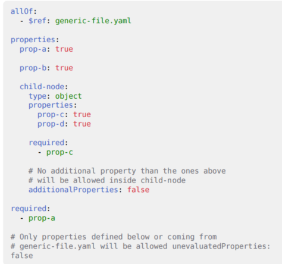
    + các file YAML liệt kê các property và thêm constrai cho chúng
        - việc thêm các thuộc tính chưa định nghĩa có thể xảy ra
        - việc quên thuộc tính bắt buộc có thể xảy ra
    + cần thêm constrain để phát hiện lỗi chính tả và các property ngoài ý muốn
        - `required`: bắt buộc xuất hiện
        - `additionalProperties: false`: ngăn thuộc tính chưa được define trong file này xuất hiện
        - `unevaluatedProperties`: ngăn thuộc tính chưa được define trong file này xuất hiện hoặc không được refer đến thông qua `allOf`
- Bindings syntax: validating your own bindings
    + 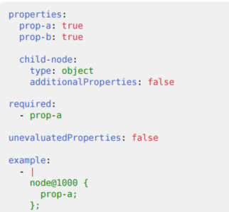
    + để test YAML thì thêm `examples` ở cuối file
## Thực hành
- khi thêm file dts thì cần thêm vào Makefile
- build device tree: `make dtbs`
- `model`: đổi tên board
- `make DT_SCHEMA_FILES=misc/nintendo,nunchuk.yaml dt_binding_check`: kiểm tra các examples trong YAML
- Lệnh check cấu trúc device tree trong board
    ```
    dtc -I fs /sys/firmware/devicetree/base/ > /tmp/dts
    grep -C10 nunchuk /tmp/dts
    ```

# Introduction to pin muxing
## What is pin muxing
- Các SoC ngày càng tích hợp nhiều khối hardware, trong số đó có nhiều cái cần giao tiếp với ngoại vi
- Tuy nhiên, kích thước vật lý của chip nhỏ, vì vậy số lượng pin cũng bị giới hạn
- Vì vậy, không phải khối internal hardware nào cũng được đưa ra pin cùng lúc
- các pin được dồn kênh (multiplexed): chúng hiển thị chức năng của khối A hoặc B
- việc multiplexed được xử lý bằng phần mềm
## Pin muxing in the Linux kernel
- `pinctrl` subsystem đã được thêm vào source Linux từ Linux 3.2
- Subsystem này ở `drivers/pinctrl/` cung cấp hệ thống chung để xử lý pin muxing
    + 1 pin muxing driver interface dùng để triển khai driver cho từng loại SoC nhằm cấu hình pin muxing
    + 1 pin muxing consumer interface cho device drivers
- Phần lớn các pinctrl driver cung cấp 1 device tree binding và pin mux phải được mô tả trong device tree: `Documentation/devicetree/bindings/pinctrl`
- pinctrl subsystem diagram
    + 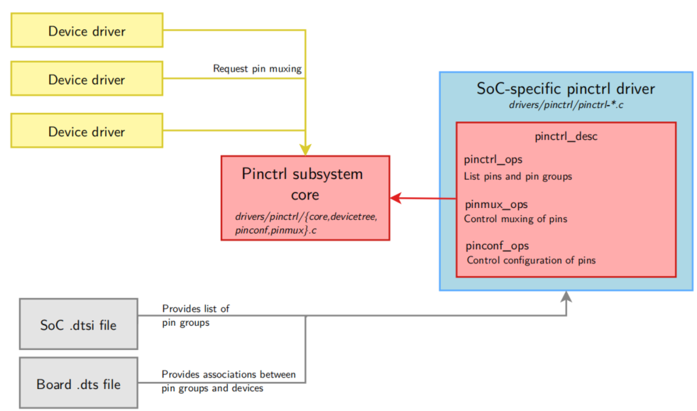
- Device Tree properties for consumer devices
    + device cần pin để mux thì dùng thuộc tính `pinctrl-<x>` và `pinctrl-names` trong device tree
        - `pinctrl-<x>`: link tới 1 cấu hình pin cụ thể ứng với state nhất định. `x` được đánh số theo thứ tự trái qua phải nếu `pinctrl-names` có nhiều tên
        - `pinctrl-names`: gán tên gọi cho mỗi trạng thái. Nếu để `default` thì pin mux được thiết lập bởi device driver
        - check `Documentation/devicetree/bindings/pinctrl/pinctrl-bindings.txt` để có thêm chi tiết
- Device Tree properties for consumer devices - Examples
    + 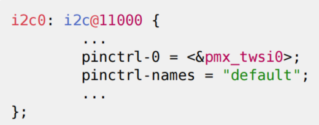
    + 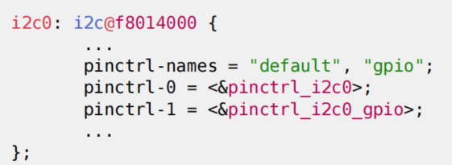
        - `pinctrl-names` có 2 tên thì `pinctrl-<x>` cũng có 2 cái tương ứng cho từng name
- Defining pinctrl configurations
    + các cấu hình pinctrl khác nhau cần được định nghĩa như node con trong pinctrl device
    + cấu hình có thể được define ở 
        - `.dtsi`: cho cấu hình mà thường dùng chung trong nhiều board
        - `.dts`: dùng cho board cụ thể
    + `pinctrl-<x>` của device trỏ tới cấu hình pin mà nó cần thông qua 1 device tree phandle
    + Ví dụ
        - 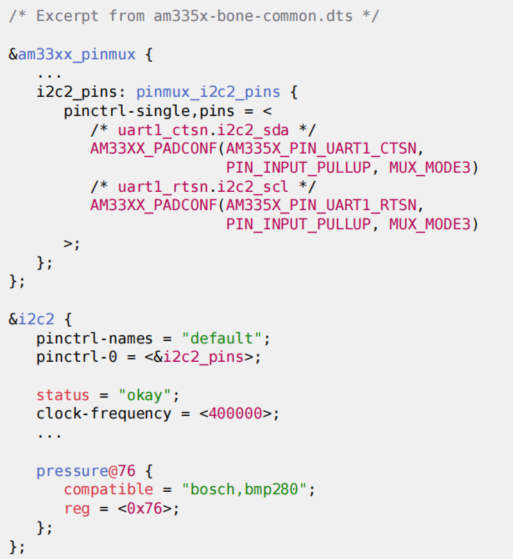
            + trong AM33xx, driver `pinctrl-single` được sử dụng để cấu hình pin trong DT.
            + trong mỗi cấu hình pin, giá trị của `pinctrl-single,pins` cần đưa ra list của thanh ghi, value
        - để biết giá trị cấu hình chính xác, cần xem datasheet của board và SoC
## Thực hành
- i2c không có khả năng tự dò tìm
- i2cdetect sẽ bypass bằng cách đóng vai là master và gửi tín hiệu tới các device. i2cdetect quét từ 0x3 tới 0x77 rồi xem device nào phản hồi. Tuy nhiên i2cdetect có thể làm nhiễu loạn
- output của i2cdetect: 
    + UU: device đã được điều khiển bởi 1 driver
    + hiện số: device chưa có driver
- trong bảng P8, P9, cột Pin ở gần cuối, ký hiệu đó được dùng để kiểm tra pin assignment
- FIle check enum tương ứng với các mode, pin name, ...: `/home/as/Desktop/linuxEmbeddedBBB/BBB_docs/hw-docs/am33xx.h`

# Linux device and driver model
## Introduction
- The need for a device model
    + Linux kernel chay trên nhiều kiến trúc phần cứng, vì vậy cần tối ưu việc tái sử dụng code giữa các nền tảng
    + Ví dụ, ta muốn 1 USB device driver có thể dùng đươc ở x86, arm, ...
    + Điều này yêu cầu code được tổ chức rõ ràng, với device driver tách biệt khỏi controller driver, mô tả phần cứng tách biệt khỏi driver của chúng, ...
    + Đây là điều mà linux kernel device model cho phép.
- Kernel and device drivers
    + trong Linux, 1 driver luôn giao tiếp với
        - 1 framework mà cho phép driver đó expose tính năng phần cứng theo cách chung nhất
        - 1 kiến trúc bus để giao tiếp, phát hiện phần cứng
- Device model data structures
    + device model được tổ chức quanh 3 struct chính
        - `struct bus_type`: thể hiện loại bus (SPI, I2C, USB, ...)
        - `struct device_driver`: thể hiện 1 driver có khả năng điều khiển các device cụ thể trong 1 bus cụ thể
        - `struct device`: thể hiện 1 device kết nối tới 1 bus
    + kernel dùng tính chất kế thừa để tạo nhiều phiên bản khác nhau của `struct device_driver` và `struct device` cho mỗi bus subsystem
- Bus drivers
    + Component đầu tiên của device model là bus driver
        - mỗi bus driver đại diện cho 1 loại bus: USB, SPI, I2C, ...
    + Bus driver chịu trách nhiệm
        - đăng ký loại bus (`struct bus_type`)
        - cho phép đăng ký adapter driver (USB controller, I2C adapter, ...) tương thích để phát hiện được device đã kết nối và cung cấp cơ chế giao tiếp với các device
        - cho phép đăng kí device drivers (USB drivers, I2C devices, ...)
        - matching device driver với device bằng adapter driver
        - cung cấp API để implement adapter drivers và device driver
        - định nghĩa driver và struct của device thông qua `struct usb_driver` và `struct usb_interface`
- sysfs
    + bus, device, driver, ... là các struct nội bộ của kernel
    + sysfs virtual filesystem cung cấp cơ chế để export nhiều thông tin tới user space 
    + thường được mount vào `/sysfs`
        - `/sys/bus`: chứa danh sách các loại bus
        - `/sys/devices`: chứa danh sách các device
        - `/sys/class`: liệt kê các thiết bị theo framework mà chúng được kết nối vào
## Example of the USB bus
- Kiến trúc USB bus driver nằm ở 
    - chứa code cho kiến trúc bus USB
    - `drivers/usb/core`
    - `struct bus_type` được định nghĩa trong `drivers/usb/core/driver.c` và đăng ký trong `driver/usb/core/usb.c`
- Adapter drives
    - chứa các driver điều khiển phần cứng gắn vào bus USB
    - `drivers/usb/core`
- Device drivers
    - đặt nhiều nơi trong kernel source 
- Quan sát ví dụ về `drivers/net/usb/rtl8150.c`
- Device identifiers
    + Việc định nghĩa danh sách device mà driver này có thể quản lý, giúp cho USB core biết được với device nào thì driver nào nên được dùng
    + macro `MODULE_DEVICE_TABLE()` cho phép `depmod` (run bởi `make_modules_install`) trích xuất mối quan hệ giữa device identifiers và drivers, vì vậy driver có thể được load tự động bởi `udev`
- Instantiation of usb_driver
    + `struct usb_driver` là struct được định nghĩa bởi USB core. Mỗi USB device driver phải khởi tạo nó, và đăng kí nó với USB core sử dụng struct này
    + struct này kế thừa từ `struct device_driver`, cái mà được định nghĩa bởi device model
- Driver registration and unregistration 
    + khi driver được load/unload, nó phải được đăng ký/ hủy đăng ký nó khởi USB core
    + dùng `usb_register()`, `usb_deregister()` trong USB core `drivers/net/usb/rtl8150.c`
    + với code driver của drivers/net/usb/rtl8150.c, chỉ cần gọi `module_usb_driver()` là hàm init với exit được gọi
- Tại thời điểm khởi tạo, USB adapter driver liên quan tới USB controller đăng ký chính nó tới USB core
- `rtl8150` usb device driver đăng ký nó tới USB core
    + 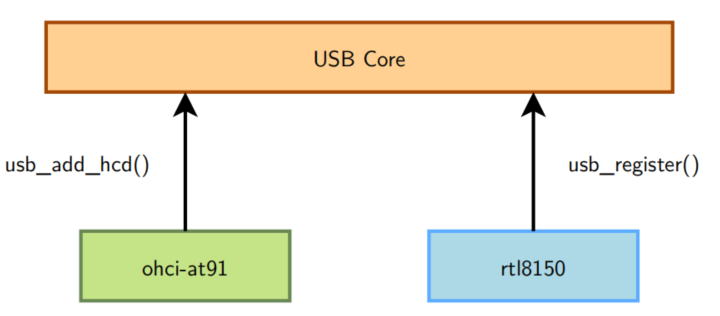
    + USB core bây giờ biết sự kết hợp giữa vendor/productID của `rtl8150` và `struct usb_driver` của driver này
- Khi 1 device được phát hiện
    + USB core sẽ tìm kiếm IDs đã đăng ký và tìm driver tương ứng
    + sau đó USB core gọi hàm probe() để đăng ký driver `rtl8150`
- Probe method
    + được phát đi cho mỗi device kết nối với 1 driver
    + hàm `probe()` nhận tham số là 1 struct mô tả device, thường cụ thể bởi bus infrastructure (`struct pci_dev, struct usb_interface`, ...)
    + function này chịu trách nhiêm cho
        - khởi tạo device, mapping I/O memory, đăng ký interrupt. Bus infrasstructure cung cấp phương thức để lấy địa chỉ, số ngắt và thông tin khác của device
        - đăng ký device tới chính xác kernel framework (example: network infrastructure)
- Mô hình thiết bị của Linux mang tính đệ quy
    + bus này có thể kết nối và quản lý các bus khác, tạo thành cấu trúc phân tầng phức tạp 
    + 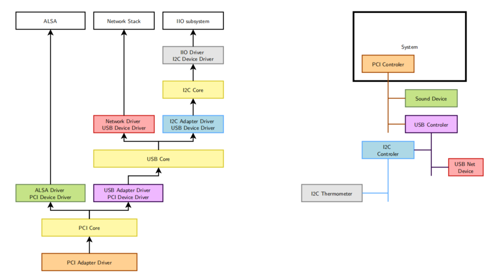

## Platform drivers
- trong số các device non-discoverable, có nhiều họ device là 1 phần trong SoC: UART controller, Ethernet controller, SPI hoặc I2C controller, graphic, ...
- Trong linux kernel, 1 bus cụ thể được gọi là `platform bus`, được tạo ra để handle những device này. Chúng được control qua `memory-mapped registers`, vì các device này không thể tự phát hiện được
- Platform bus hỗ trợ platform drivers mà handle platform devices
    + là trung gian kết nối platform driver và platform device
    + làm việc như các bus khác, ngoại trừ các device được liệt kê 1 cách cố định thay vì được phát hiện
- Implement of a platform driver
    + driver này cần implement 1 `struct platform_driver`
        - 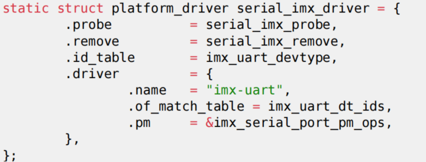
    + và sau đó đăng ký struct đó trong hàm init, exit
        - 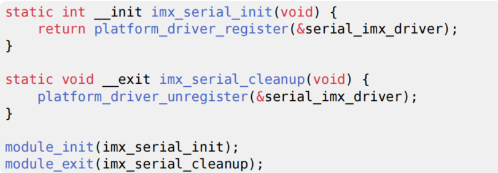
    + phần lớn các driver dùng hàm `module_platform_driver()` khi không cần làm gì đặc biệt trong hàm init và exit
        - 
- Platform device instantiation
    + vì platform devices không thể được phát hiện tự động, chúng được định nghĩa cố định
        - cách cũ: khởi tạo trực tiếp từ `struct platform_device`
        - cách mới: mô tả qua device tree, từ đó các `struct platform_device` sẽ được tạo
- Using additional hardware resources - cách mà kernel sử dụng tài nguyên phần cứng bổ sung
    + Device tree thường chứa nhiều thông tin. Nó chứa các con trỏ trỏ tới các khối phần cứng không thể discoverable được   
    + Cách mà driver lấy thông tin phần cứng
        - Địa chỉ các thanh ghi I/O (để ghi/đọc dữ liệu phần cứng) và các đường tín hiệu ngắt (IRQ - interrupt request) được tự động chuyển đổi thành một mảng các `struct resource` gắn liền với `struct platform_device` đó. Driver chỉ cần gọi hàm chuẩn để lấy chúng ra.
        - Thông tin liên qua tới subsystem nào sẽ được phân tích bởi subsystem đó
        - Các thuộc tính được lấy trực tiếp bởi device driver, thông qua các hàm lookup của device tree
    + tất cả cách này cho phép cùng 1 driver được sử dụng với nhiều devices có chức năng tương đương, nhưng khác address
- Using resources
    + platform driver truy cập vào các tài nguyên được cung cấp bởi platform bus cũng như các thành phần khác do subsysmtem cung cấp thông qua API: `clk_get()`, `gpio_request()`, `dma_request_channel()`
        ```c
        res = platform_get_resource(pdev, IORESOURCE_MEM, 0);
        sport->rxirq = platform_get_irq(pdev, 0);
        ```
- Driver data
    + Ngoài thông tin và tài nguyên của device, driver có thể cần thêm các thông tin cụ thể khác của device để thay đổi hành vi khi driver điều khiển nhiều device cùng lúc
    + 1 con trỏ `const void *data` dùng để chứa thông tin đặc biệt này
        ```c
        static const struct of_device_id marvell_nfc_of_ids[] = {
            {
                .compatible = "marvell,armada-8k-nand-controller",
                .data = &marvell_armada_8k_nfc_caps,
            },
        };
        ```
    + Data này có thể lấy được trong hàm `probe` bằng cách
        ```c
            nfc->caps = of_device_get_match_data(&pdev->dev);
        ```

# Introduction to the I2C subsystem
## What is I2C?
+ Là bus tốc độ thấp sử dụng phổ biến để kết nối device onboard và ngoại vi tới vi xử lý
+ Sử dụng 2 dây: SDA cho data và SCL cho clock
+ I2C là 1 master/slave bus: chỉ master có thể khởi tạo việc truyền dữ liệu, và các slave chỉ có thể reply tới việc truyển dữ liệu của master
+ Ở linux system, I2C controller trong vi xử lý là master, điều khiển bus
+ Mỗi slave device được xác định bởi 1 I2C address (không thể có 2 device có cùng address trên cùng 1 bus). Mỗi giao tiếp được khởi tạo bởi master chứa địa chỉ này, cho phép các slave liên quan nhận biết rằng nó có nên rep lại giao tiếp này không
## An I2C bus example
+ 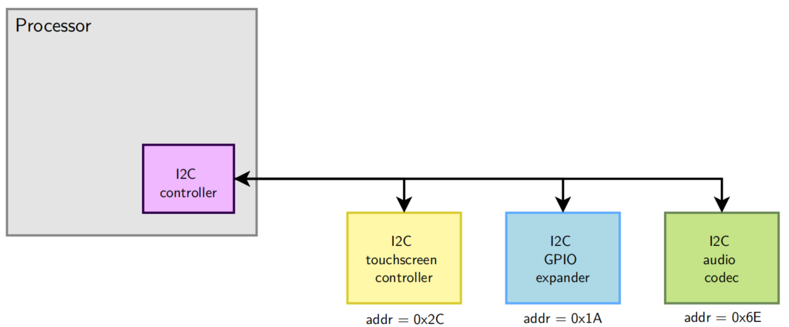
## The I2C bus driver
+ Như các bus subsystem khác, I2C bus driver chịu trách nhiệm
    - cung cấp API để implement I2C controller drivers
    - cung cấp API để implement I2C device driver trong kernel space
    - cung cấp API để implement I2C device driver trong user space
+ Code của I2C bus driver nằm ở `drivers/i2c/`
+ Code của I2C controller driver nằm ở `driver/i2c/busses/`
+ Code của I2C device driver nằm rải rác trong `drivers/`, phụ thuộc vào framework được dùng để expose devices
## Registering an I2C device driver
+ Như các bus subsystem khác, I2C subsystem định nghĩa `struct i2c_driver` kế thừa từ `struct device_driver` và cần phải khởi tạo và đăng ký bởi mỗi I2C device driver
    - thông thường, struct này trỏ tới hàm probe() và remove()
    - nó cũng chứa `id_table`, dùng cho việc phát hiện I2C devices mà không dựa vào device tree
+ `i2c_add_driver()` và `i2c_del_driver()` được dùng để register/inregister driver
+ nếu driver không làm gì trong init()/exit() thì có thể dùng `module_i2c_driver()` thay thế
## Registering an I2C device driver: example
+ 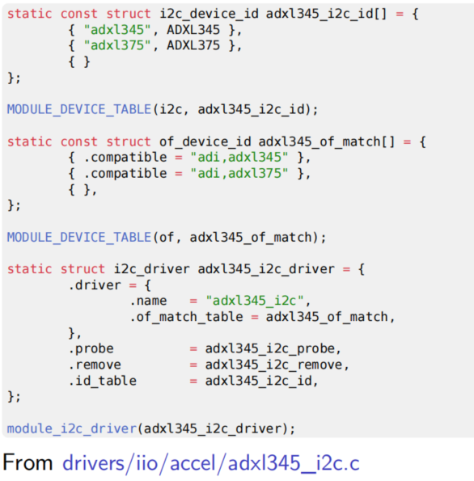
## Registering an I2C device: non-DT
+ Ở platform không dùng device tree, `struct i2c_board_info` cho phép mô tả cách mà I2C device kết nối tới board
+ Các struct này được định nghĩa với macro `I2C_BOARD_INFO()`, có param là device name và địa chỉ của slave device
+ mảng các struct này được đăng ký vào cho mỗi bus bằng việc dùng `i2c_register_board_info()`
## Registering an I2C device, non-DT example
+ 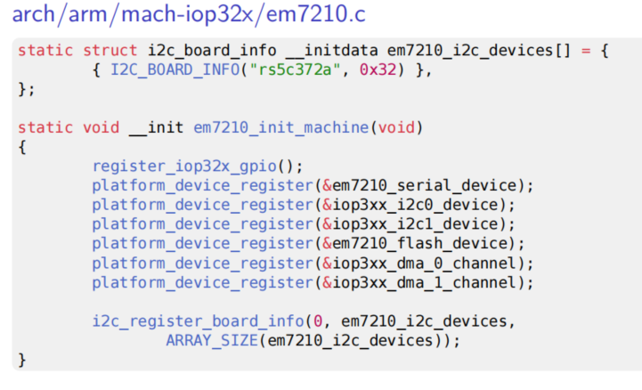
## Registering an I2C device, in the DT
+ trong device tree, I2C controller device được định nghĩa ở file .dtsi, và thường status = "disabled"
+ tại device tree của board:
    - I2C controller device được enabled
    - tần số bus I2C được khai báo, dùng `clock-frequency`
    - I2C device được mô tả là node con trong I2C controller bus, nơi mà `reg` được đăng ký là địa chỉ của slave trên bus
+ example
    - khai báo I2C controller
        + 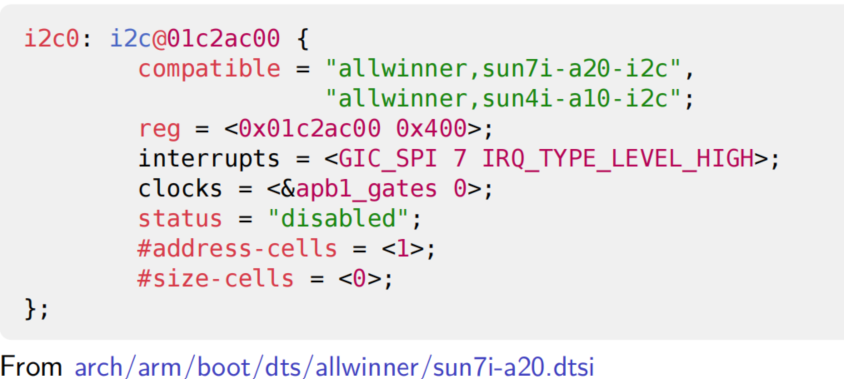
        + mô tả các thông tin cần thiết cho bus I2C
    - khai báo I2C device
        + 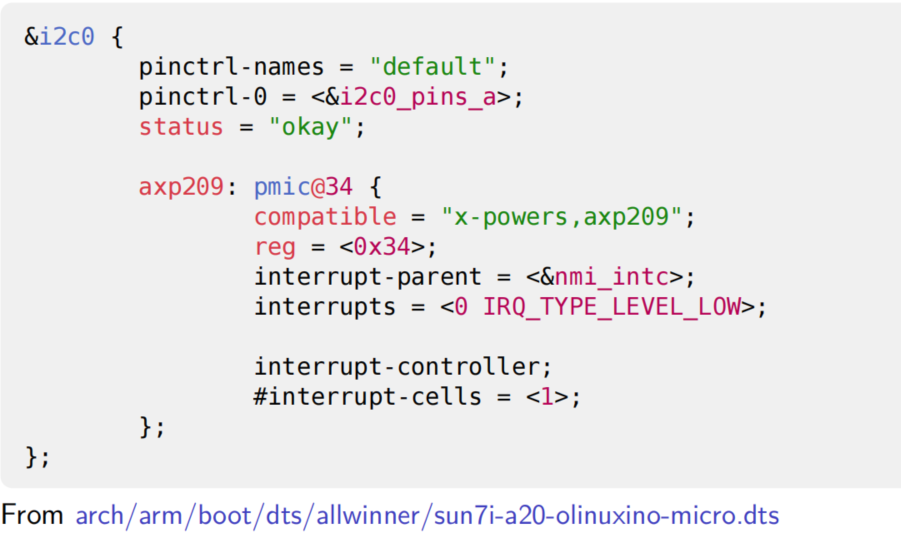
        + mô tả các thông tin của device gắn vào bus I2C
## probe() and remove()
+ probe() có nhiệm vụ khởi tạo device và đăng ký nó vào kernel phù hợp, nó nhận các tham số
    - `struct i2c_client` pointer, cái mà đại diện cho chính I2C device mà device tree truyền vào, kế thừa từ `struct device`
    - với Linux kernel < 6.4, probe() có tham số thứ 2 không được sử dụng
    - 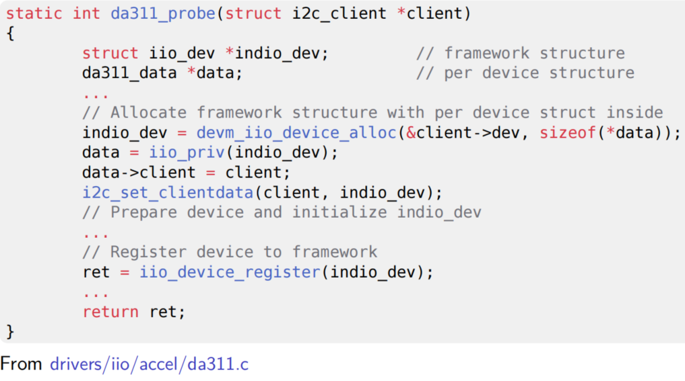
+ remove() có nhiệm vụ hủy đăng ký device khroi kernel và shut it down
    - 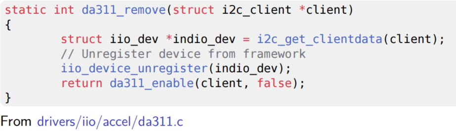
## Communicating with the I2C device: raw API
+ Gửi 1 `buf` tới I2C device
    - `int i2c_master_send(const struct i2c_client *client, const char *buf, int count);`
+ Nhận 1 `count` bytes từ I2C device và lưu vào `buf`
    - `int i2c_master_recv(const struct i2c_client *client, char *buf, int count);`
+ cả 2 function trên trả về số âm báo lỗi, hoặc là số byte truyền được
+ giữa quá trình ghi và đọc cần có khoảng delay để dữ liệu kịp ghi được vào
## Communicating with the I2C device: message transfer
+ API gửi message cho phép mô tả thông tin truyền đi bao gồm vài messages, với mỗi message được tryền đi theo 1 hướng
    - `int i2c_transfer(struct i2c_adapter *adap, struct i2c_msg *msgs, int num);`
        + `struct i2c_adapter` pointer được lấy thông qua `client->adapter`
        + `struct i2c_msg` định nghĩa length, location và direction của message
## I2C: message transfer example
+ 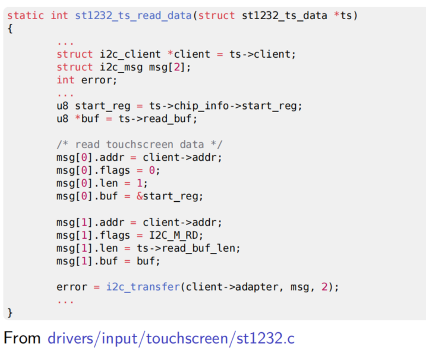
## I2C functionality
+ không phải tất cả I2C đều hỗ trợ tất cả tính năng 
+ I2C controller driver bảo với I2C core rằng chức năng nào chúng hỗ trợ
+ 1 I2C device driver phải kiểm tra chức năng nào chúng được cấp vởi I2C controller
+ `i2c_check_functionality()` dùng để check việc này
+ `include/uapi/linux/i2c.h` chứa define các chức năng tồn tại trong I2C
+ Tài liệu Linux support for I2C: https://www.kernel.org/doc/html/latest/i2c/
## Thực hành
- Trong folder /dev chứa 
    + terminal device ttyX: giao diện người dùng nhận input và xuất output 
    + mmcblk: bộ nhớ mmc và các phân vùng
    + sdX: device như usb
- Trong folder /sys chứa
    + /sys/class: expose các device được phân loại bởi kernel quản lý chúng. 
        - /sys/class/net chứa các network interface của hệ thống
        - /sys/class/thermal: chứa thông tin về nhiệt độ của system
    + /sys/bus: chứa tất cả bus của hệ thống
- COde với i2c thì #include <linux/i2c.h>
- `MODULE_DEVICE_TABLE`: 
    + export thông tin của device id ra user space để tự động load kernel module mỗi khi thiết bị cắm vào, k cần gọi modprobe hay insmod
    + Nếu k dùng macro này thì phải insmod module thủ công dù device đã được cắm vào, macro này sinh ra modalias trong .ko để udev nhận event rồi load module tương ứng (check bằng modinfo)
- sau khi probe() được gọi, driver nunchuk sẽ nằm trong `/sys/bus/i2c/driver/nunchuk`
- `device_property_read_bool`: kiểm tra giá trị 1 property trong device tree
- để khởi tạo được nunchuk, cần gửi `(các mã sau chỉ dành riêng cho nunchuk)`
    + lần đầu 0xf0 và 0x55 để tắt tính năng mã hóa của nunchuk, ghi 0x55 vào thanh ghi 0xf0 để tắt mã hóa
    + tiếp theo gửi 0xfb và 0x00 để reset dữ liệu của nunchuk về raw data
    + ghi 0x00 để yêu cầu nunchuk cập nhật giá trị hiện tại của các nút nhấn
- không được include các header trong asm/

# Kernel framework for device drivers
## Kernel and Device drivers
- Trong linux, 1 driver luôn giao tiếp với: 
    + 1 framework: cho phép driver expose tính năng phần cứng tới user space app
    + 1 bus: 1 phần của device model, để phát hiện và giao tiếp với hardware
- 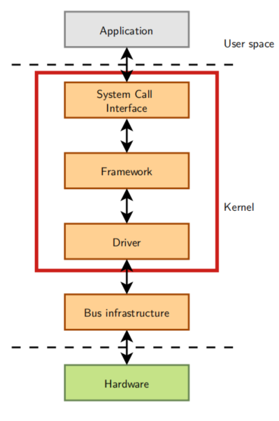
- Section này cover về kernel framwork
## User space vision of devices
- Types of devices
    + Trong linux, có 4 loại device:    
        - Network devices: truy cập trong user space bằng `ip a`
        - Block devices: cung cấp cho user space khả năng truy cập vào bộ nhớ USB, hard disk, chúng được truy cập qua `/dev`
        - Character devices: cung cấp cho user space khả năng truy cập vào các device (input, sound, graphic, ...), chúng được truy cập qua `/dev`
        - Sysfs devices: nằm trong `/sys`
## Devices: everything is a file
- phần lớn các system objects đều là files
- cho phép app open, read, write, close, ...
- vì vậy device cần phải thể hiện qua file để app có thể truy cập -> device file
- tất cả device file được chứa trong `/dev`
- mỗi device file có 3 thông só:
    + type: char or block
    + major: class of device
    + minor: identifier in class
## Creating device files
- Trước Linux 2.6.32, device file cần được tạo thủ công bằng `mknod`
- `devtmpfs` virtual filesystem có thể mount vào `/dev` và chứa tất cả device đã đăng ký với kernel. Thuộc tính `CONFIG_DEVTMPFS_MOUNT` trong Kernel dùng để mount tự động vùng này lúc boot, ngoại trừ boot với `initramfs`
- `devtmpfs` có thể được hỗ trợ thêm bởi `udev` hoặc `mdev` để điều chỉnh permisssion/ownership, load kernel modules tự động và tạo symbol link tới devices
## Character drivers
- A character driver in the kernel
    + từ góc nhìn của app, character device là 1 file
    + Vì vậy character device implement các operations để khiến cho app nghĩ rằng device đó là 1 file
    + Để làm được vậy, character driver cần implement các hàm read, write, ... của `struct file_operations`
    + Linux filesystem layer sẽ đảm bảo operation của driver được gọi bởi user space app 
- From user space to the kernel: character devices
    + 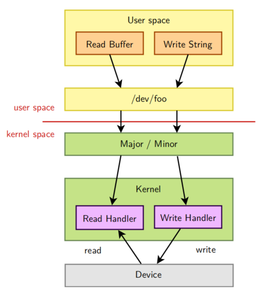
- open() and release()
    + `int open(struct inode *i, struct file *f)`
        - gọi khi user space mở file
        - `struct inode`: đại diện cho 1 file trong filesystem (có thể là 1 file bình thường, 1 đường dẫn, symbol link, character device hoặc block device)
        - `struct file`: là struct được tạo mỗi lần mở file, nhiều struct file có thể cùng trỏ tới cùng inode structure
            + chứa thông tin như position, opening mode, ...
            + `void *private_data`
            + pointer trỏ vào file structure được pass vào tất cả operations
    + `int release(struct inode *i, struct file *f)`
        - gọi khi user space đóng file
- read() and write()
    + `ssize_t read(struct file *f, char __user *buf, size_t sz, loff_t *off)`
        - đọc data từ device, ghi tối đa `sz` bytes vào `buf` và cập nhật current position trong `off`
        - return về số bytes đọc được. Return 0 thường được user space hiểu là kết thúc file
        - trong UNIX, read() thường bị block khi không có đủ data để đọc từ device
    + `ssize_t write(struct file *f, const char __user *buf, size_t sz, loff_t *off)`
        - đọc `sz` bytes từ `buf` rồi ghi data đó vào file, cần cập nhật lại position `off`
- Exchanging data with user space 
    + Kernel không cho phép truy cập trực tiếp vào user space memory, không cho phép memcpy() hay trỏ trực tiếp vào
        - Việc trỏ vào user space bị vô hiệu quá để khiến việc khai thác lỗ hổng khó hơn
        - Nếu địa chỉ truyền vào bởi app không hợp lệ, kernel có thể bị lỗi segfault
        - Không bao giờ tin tưởng user space, user space app có thể truyển 1 kernel address mà kernel space đang muốn đọc hoặc ghi data
    + Để giữ code kernel có tính linh động (portable), bảo mật và xử lý lỗi chính xác, driver cần dùng function đặc biệt để trao đổi data với user space
    + A single value:
        - `get_user(v, p)`: biến `v` của kernel lấy value của user space pointer `p`
        - `put_user(v, p)`: giá trị của user space pointer `p` được set bằng giá trị của `v`
    + A buffer
        - `unsigned long copy_to_user(void __user *to, const void *from, unsigned long n);`
        - `unsigned long copy_from_user(void *to, const void __user *from, unsigned long n);`
        - return 0: success
        - return khác 0: error, thường `return -EFAULT`
    + 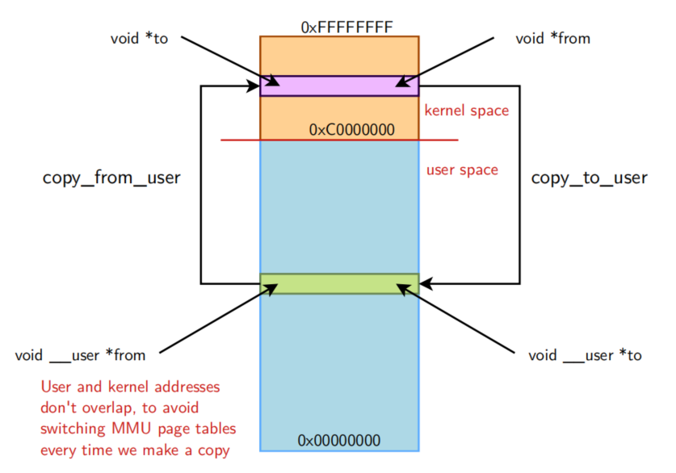
- Zero copy access to user memory
    + việc phải copy data tới hoặc từ 1 bộ đệm kernel trung gian có thể trở nên khó khăn nếu data quá lớn (như video chẳng hạn)
    + Zero copy là cơ chế giúp hệ thống truyền tải dữ liệu thẳng từ nơi này qua nơi khác mà không cần tốn thời gian copy qua lại bộ đệm trung gian của hệ điều hành
    + Các tùy chọn `zero copy`
        - `mmap()`: là system call cho phép user space truy cập trực tiếp vào memory mapped I/O space
        - `get_user_pages()` và các function liên quan khác để lấy mapping tới user pages mà không cần copy chúng
- unlocked_ioctl()
    + `long unlocked_ioctl(struct file *f, unsigned int cmd, unsigned long arg)`
    + đây là hàm để gửi lệnh điều khiển từ user space xuống kernel space thông qua device file rồi tới phần cứng 
    + liên quan tới `ioctl()` nhưng `ioctl()` có nhược điểm là block các tiến trình khác
    + mở rộng khả năng của driver ngoài các API đọc ghi
    + Ví dụ như: thay đổi tốc độ của serial port, cài đặt output format video, querying device serial number, ... được dùng rộng rãi trong các framework driver như ALSA(sound), V4L2(video)
    + `cmd` là 1 số định danh cho biết thao tác nào cần được thực hiện
    + `arg` là tùy chọn pass vào tham số thứ 3 của `ioctl(), có thể là số nguyên, địa chỉ, ...
    + `cmd` và `arg` tùy theo định nghĩa của từng driver
- `ioctl()` example
    + kernel space
        - 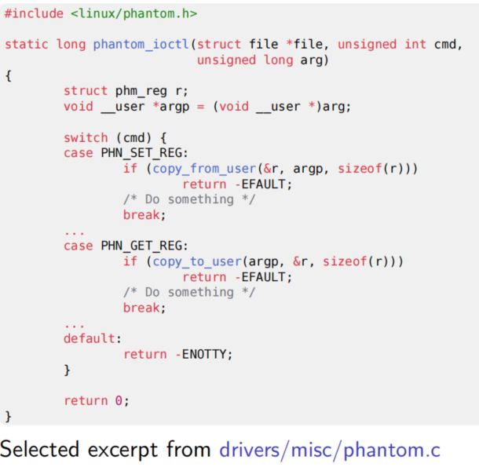
    + user space 
        - 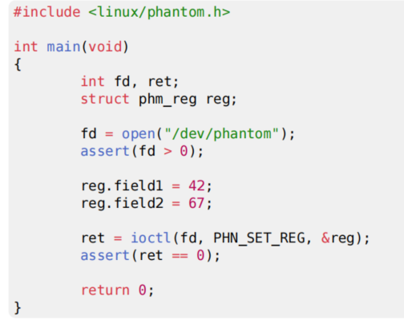
## The concept of kernel frameworks
- Beyond character drivers: kernel framework - hơn cả character driver chính là kernel framework
    + nhiều device driver không được implement trực tiếp như character drivers
    + Thay vào đó chúng triển khai `struct file_operations` 1 lần và các driver cho cùng loại device truy cập vào để thực hiện tương tác với file
    + chúng được implement dưới dạng 1 framework, dành cho 1 loại device cụ thể (framwbuffer, V4L, ....)
        - driver kết nối vào 1 framework API hay vì vào `struct file_operations`
        - framework triển khai `struct file_operations` 1 lần để expose character devices tới user space
        - Việc triển khai này được chia sẻ cho tất cả device trong framework, tránh lặp lại code và nhất quán về user interface bất kể driver nào đang được dùng
- Example: Some kernel frameworks
    + 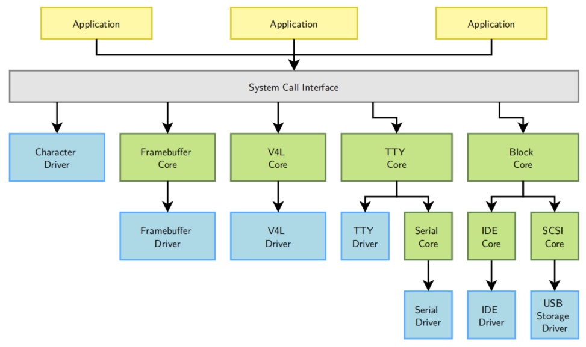
    + `struct file_operations` được implement trong các phần core
## Example: the input subsystem
- What is the input subsystem?
    + Có nhiệm vụ quản lý tất cả sự kiện input tới từ user
    + được chia thành 2 phần:
        - device drivers: trao đổi với hardware, cung cấp events tới các input
        - Event handlers: lấy events từ driver và pass vào nới cần qua các interface (hầu hết là qua `evdev`)
    + Trong user space, nó thường được dùng bởi graphic stack như X.Org, Wayland, ...
- Input subsystem diagram
    + 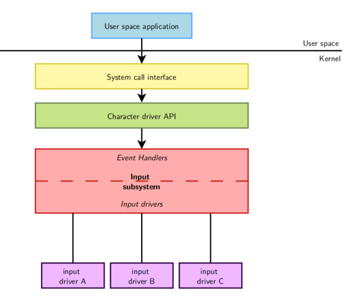
- Input subsystem overview
    + Kernel option `CONFIG_INPUT`
        - `menuconfig INPUT`
            + `tristate "Generic input layer (needed for keyboard, mouse, ...)"`
    + Implemented in `drivers/input`
        - input.c
        - input-poller.c
        - evdev.c
    + Defines the user/kernel API
        - `include/uapi/linux/input.h`
    + Danh sách các operation của 1 input driver cần được implement và các helper function cần cho driver
        - `struct input_dev` cho device driver part
        - `struct input_handler` cho event handler part
        - `include/linux/input.h`
- Input subsystem API
    + 1 input device được mô tả bởi `struct input_dev`
    + trước khi sử dụng, struct này cần được cấp phát và khởi tạo
        - `struct input_dev *devm_input_allocate_device(struct device *dev);`
        - return -ENOMEM nếu không cấp phát được bộ nhớ cho device
        - gọi hàm này để đăng ký device với system, nếu không thì system không thể tạo ra device file trong /dev/input
    + dựa vào loại event được tạo ra, input bit field `evbit` và `keybit` cần được cấu hình
        + `evbit`: loại sự kiện của nút nhấn (nhấn/thả/cảm ứng)
        + `keybit`: tên của nút bấm 
        ```c
        set_bit(EV_KEY, myinput_dev.evbit);
        set_bit(BTN_0, myinput_dev.keybit);
        ```
    + Khi input device đã được cấu hình, hãy đăng ký nó
        - `int input_register_device(struct input_dev *);`
        - đưa device vào danh sách quản lý của system
    + Những event này được gửi bởi driver tới event handler bằng 
        - `void input_event(struct input_dev *dev, unsigned int type, unsigned int code, int value)`
        - các hàm này dùng để trả data từ input lên 
        - document của event types: `input/event-codes`
        - 1 event được hình thành từ sự thay đổi data đầu vào như trạng thái nút bấm, axis, ...
        - Input subsystem cung cấp các wrapper của `void input_event` như
            + `input_report_key()`
            + `input_report_abs()`
    + Sau khi đã submit các event, cần thông báo cho input core để sync data bằng cách gọi: 
        - `void input_sync(struct input_dev *dev)`
    + Example from drivers/hid/usbhid/usbmouse.c
        - 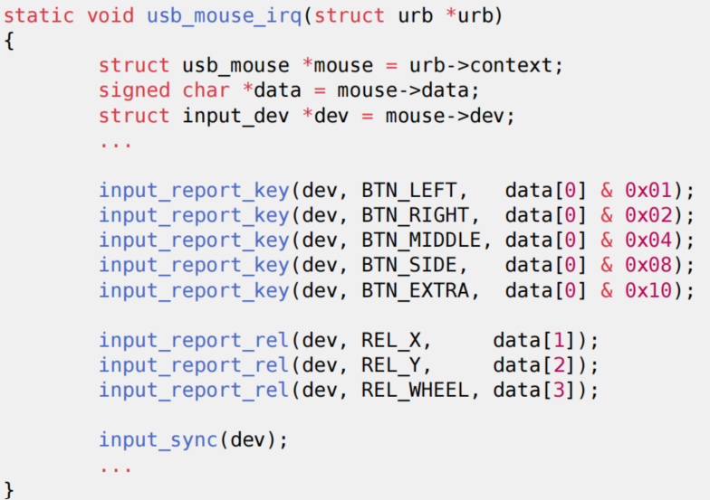
- Polling input devices
    + Input subsystem cung cấp 1 API để hỗ trợ các input devices không tự raise ngắt mà cần phải scan định kỳ để phát hiện thay đổi state. Tức là các input device này khi thay đổi state thì không tự tạo ngắt để thông báo mà ta cần phải tự cập nhật lại nó
    + `int input_setup_polling(struct input_dev *dev, void (*poll_fn)(struct input_dev *dev))`
        - `poll_fn`: là function mà sẽ được gọi định kì để check
    + chu kỳ polling được set bằng `input_set_poll_interval()` hoặc `input_set_min_poll_interval()` và `input_set_max_poll_interval()`
- evdev user space interface
    + main user space interface kết nối tới input devices là event interface
    + mỗi input devices được đại diện bằng 1 character device `/dev/input/event<X>`
    + 1 user space app có thể blocking read hoặc non-blocking read, cũng có thể dùng `select()` để nhận event sau khi mở device
    + Mỗi lần đọc sẽ return về `struct input_event` theo format sau:
        ```c
        struct input_event {
            struct timeval time;
            unsigned short type;
            unsigned short code;
            unsigned int value;
        };
        ```
    + Công cụ để test input device là `evtest`: `https://cgit.freedesktop.org/evtest/`
## Device-managed allocations
- Device managed allocations
    + hàm `probe()` chịu trách nhiệm cấp phát 1 số tài nguyên đặc biệt: memory, mapping I/O registers, registering interrupt handlers, ...
    + Những resource này cần được giải phóng chính xác trong `probe()` khi gặp lỗi và `remove()`
    + Việc giải phóng tài nguyên này cần nhiều code để xử lý lỗi, vì vậy `device managed allocations` ra đời
    + Ý tưởng là kết hợp việc cấp phát tài nguyên với `struct device` và tự động giải phóng khi device biến mất hoặc khi device hủy liên kết với driver
    + những function để tự động giải phóng tài nguyên có prefix là `devm_`: `devm_kmalloc()`, `devm_ioremap()`, xem thêm các hàm tại `https://www.kernel.org/doc/html/latest/driver-api/driver-model/devres.html`
- Device managed allocations: memory allocation example
    + 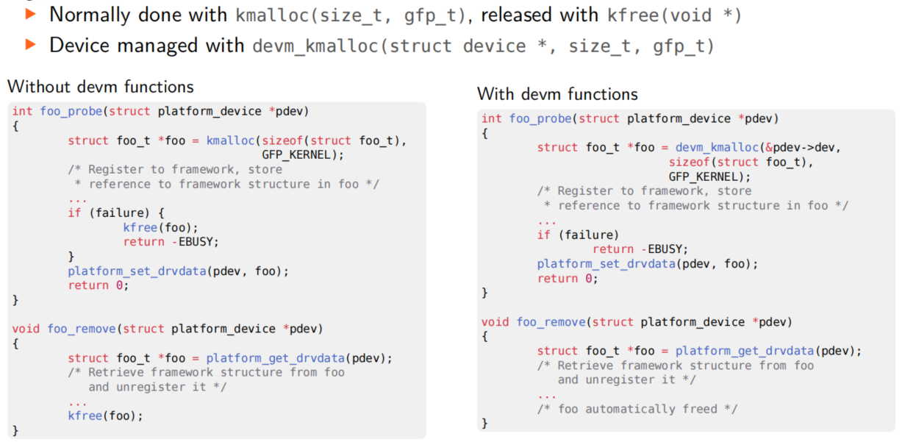
- Device managed allocations caveats
    + Việc dọn dẹp hoàn tất khi `struct device` được dọn xong, không còn reference gì cả
    + Không dùng các hàm `devm_` cho các vùng bộ nhớ nào mà các thành phần ngoài driver có thể chạm tới. Ví dụ, nếu user space vẫn đang mờ file mà device bị rút ra, remove() sẽ chạy và devm sẽ giải phóng vùng nhớ. User space không kịp đóng file và sẽ gây crash vì truy cập vùng bộ nhớ đã mất
    + Nếu dùng A reference B và B cũng nắm 1 reference của A và dùng `devm` thì hệ thống không biết cần giải phóng cái nào trước và tài nguyên sẽ bị kẹt lại, không bao giờ được xóa
    + Vì vậy khi dùng các hàm quản lý memory `devm_` thì cần chú ý vòng đời của object
## Driver data structures and links
- Driver data layout Three main data structures
    + Khi viết driver, cần tổ chức và quản lý dữ liệu của 1 device hợp lý. VÌ vây cần thiết kế mô hình gồm 3 tầng cấu trúc để giải quyết 3 bài toán: 
    + Bus-specific device structure (`struct i2c_client`, `struct usb_dev`, ...) - quản lý cách thiết bị giao tiếp với bus nào
        - struct đại diện cho device theo loại bus
        - những struct luôn có `struct device` bên trong
        - khi probe() chạy, con trỏ trỏ tới những struct này sẽ được truyền vào probe()
    + Framework-specific device struct (`struct input_dev`, `struct rtc_device`, ...) - để biết device này dùng để làm gì
        - có thể có `struct device` bên trong nếu framework muốn tạo ra device trong sysfs
        - với 1 device, có thể có đồng thời 1 `struct device` và 1 `struct device`
    + Driver **private data** - trạng thái riêng của device, driver
        - là struct tự mình định nghĩa, chứa các thông tin cần thiết
        - phụ thuộc vào driver cụ thể
        - nó chứa reference tới bus và framwork device 
        - lưu data riêng của driver
- Driver data allocation strategies
    + các chiến lược để tổ chức bộ nhớ RAM cho data của driver khi viết driver
    + Private data được nhúng vào framwork device vì vậy 1 quá trình cấp phát sẽ cấp phát cho cả framework device và private data
        - 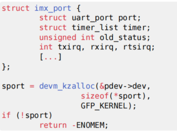
        - framework device là các struct như `struct input_dev`, ... tức là nó đại diện chung cho 1 tập hợp các thiết bị có cùng kiểu chức năng input
    + framework cung cấp các hàm để cấp phát framework device, với 1 khoảng trống ở cuối để đặt private data vào đó
        - 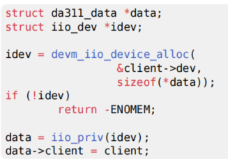
    + framework device và private data được cấp phát riêng biệt
        - 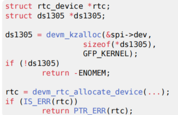
- Phân biệt bus device và framework device
    + bus device: là thiết bị đứng ở góc độ giao tiếp phần cứng, được kết nối vào board bằng bus: i2c bus, usb bus, ...
    + framework device: là đại diện cho device ở góc độ chức năng đối với hệ điều hành. Tức là sau khi kết nối qua bus rồi thì device này làm được nhiệm vụ gì
    + 1 device khi cắm vào thì hệ điều hành sẽ tạo ra 1 bus device và 1 framework device cho nó
- Links between data structures
    + trong các hàm callback của bus, ta sẽ pass bus device
        - trong `struct device`, 1 trường có kích thước của con trỏ là `dev->driver_data` được dành cho driver sử dụng
        - dùng `dev_set_drvdata()` trong `probe()` để đưa 1 tham chiếu tới private data
        - từ các hàm callback của bus, ta lấy private data bằng `dev_get_drvdata()`
    + trong các hàm callback của framework, ta sẽ pass framework device
        - nếu framework device nhúng trong private data thì dùng `container_of()`, hoạt động dựa trên lệnh `offsetof()`
        - ngược lại, dùng framework device `dev->driver_data` và lấy private data reference
    + 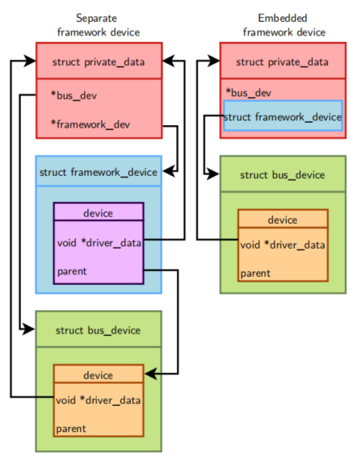
## Thực hành
- `CONFIG_INPUT_EVDEV`: option kernel để tích hợp evdev vào kernel
- đầu tiên cần add 1 input device vào system trong nunchuk.c
    + thêm con trỏ `struct input_dev` trong probe(). Không để struct này global vì driver cần được dùng cho nhiều device nên mỗi khi probe được gọi, 1 input_dev mới dành cho 1 device mới được tạo
    + gọi `devm_input_allocate_device`
    + khi dùng `devm_input_allocate_device` thì không cần xử lý unregister device trong remove vi devm_ đã tự làm, thậm chí cũng không cần unregister cho `struct input_dev`
    + interval cần set sau khi đăng ký polling
    + `input_set_drvdata`: gắn con trỏ i2c dev cho input_dev (tạo struct trung gian chứa con trỏ để polling đoc được)
    + `input_register_device` cần được gọi cuối cùng sau khi đã thiết lập các thứ liên quan input
    + dùng evtest để test input

# Memory Management
## Physical and virtual memory
- 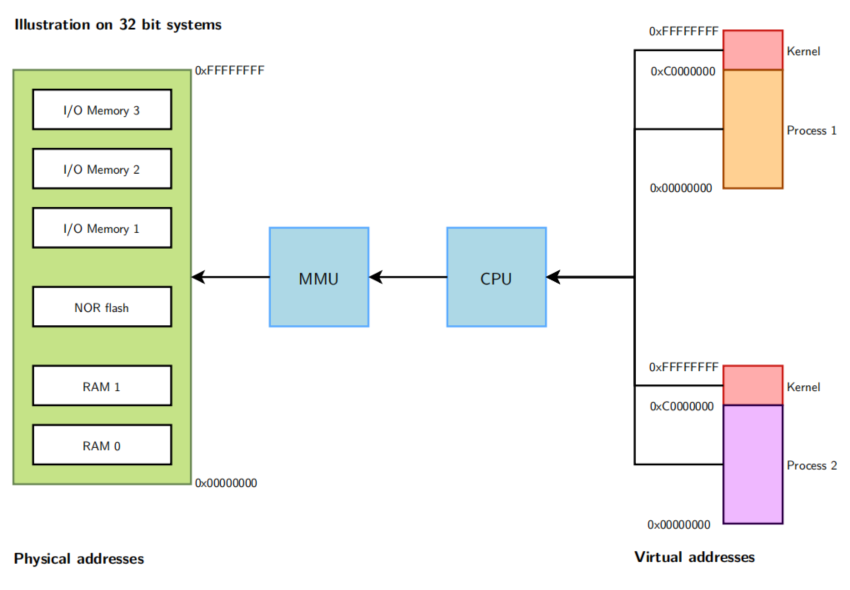
- trong không gian địa chỉ ảo, mỗi process luôn có 1 không gian ảo riêng
- Nhờ có địa chỉ ảo mà các process có thể dùng chung các dải địa chỉ ảo giống nhau mà không sợ bị ghi đè
- CPU luôn thấy địa chỉ ảo 
- MMU mapping địa chỉ ảo và địa chỉ thật
## Virtual memory organization
- 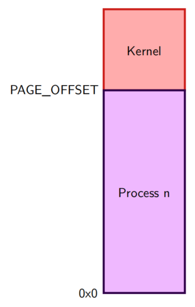
- `PAGE_OFFSET`: là mốc phân chia giữa kernel space và user space 
- Vùng kernel:
    + chứa kernel code
    + cấp phát vùng nhớ cho các kernel module
    + ánh xạ vật lý toàn bộ kernel
    + giống nhau ở mọi process: vùng kernel này của các process luôn trỏ về cùng 1 vị trí vật lý duy nhất của kernel để đảm bảo nhất quán
- Vùng Process n
    + chứa code và data của process
    + memory-mapped files
    + mỗi process có không gian địa chỉ riêng biệt
- Log của virtual mapping này được in ra từ đầu khi khởi động
## Physical/virtual memory mapping on 32-bit systems
- 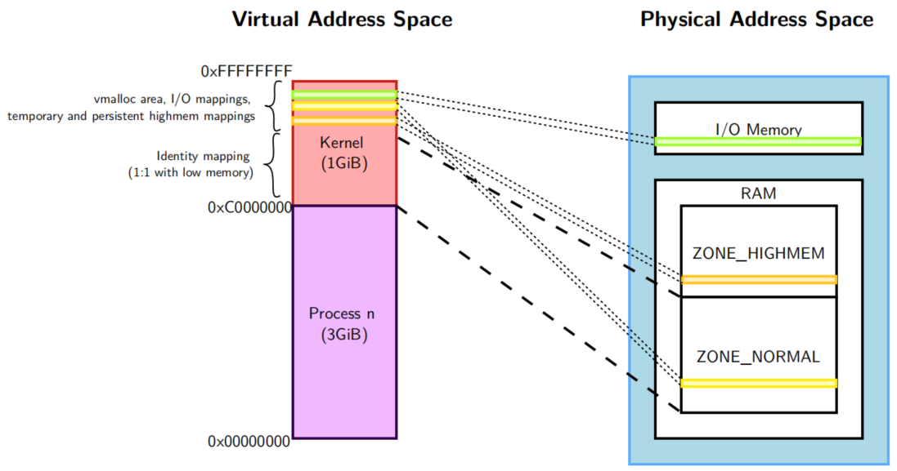
- trong hệ thống 32bit, 1 process chỉ nhìn thấy 2^32=4GB không gian địa chỉ. Hệ điều hành chia 1Gb cho kernel space và 3Gb cho user space. Vì vậy kernel space bị giới hạn 1GB memory địa chỉ ảo để ánh xạ vào Ram vật lý. Nếu có nhiều bộ nhớ vật lý hơn, phần còn lại của memory sẽ không được truy cập bởi kernel space, chỉ có thể dùng trong user space
- Dù nhiều process nhưng chúng đều chỉ truy cập vào 1GB bộ nhớ kernel này
- Để cho phép kernel truy cập được nhiều hơn:
    + cấu hình `CONFIG_VMSPLIT_2G` hoặc `CONFIG_VMSPLIT_1G` -> giảm user space memory của mỗi process
    + bật `highmem` support nếu kiến trúc hỗ trợ
- Nhược điểm là kernel nếu mapping 1:1 địa chỉ ảo và vật lý thì chỉ map được khoảng 1GB trong RAM, phần còn lại kernel không thể đụng tới được, không có địa chỉ ảo nào map vào được vùng bộ nhớ còn lại
## Physical/virtual memory mapping on 64-bit systems (4kiB-pages)
- 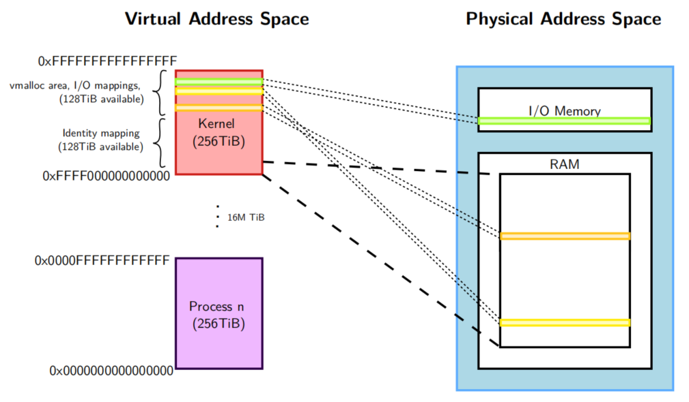
- trong hệ thống 64bit, kernel có tới 256TiB memory để map địa chỉ, lớn hơn RAM thực tế dùng trên thiết bị nên kernel có thể nhìn thấy toàn bộ vùng nhớ RAM
- giữa kernel và process có 16M TiB trống để tách biệt 2 vùng này
## User space virtual address space
- Khi 1 process start, executable code được load vòa ram và được map vào không gian địa chỉ ảo
- Trong quá trình thực thi, việc mapping memory có thể được thực hiện thêm như:
    + memory allocations
    + memory mapped files
    + mmap areas
    + ...
## Userspace memory allocations
- Userspace mapping có thể nhắm tới toàn bộ memory, có nghĩa là userspace được cấp bộ nhớ từ bất kỳ vùng nào còn trống trong memory
- Khi cấp phát bộ nhớ, memory có thể chưa được cấp phát trên phần cứng thật
    + Kernel dùng tín hiệu Fault paging để cấp phát physical page. Physical page được cấp phát khi truy cập vào virtual address tạo ra page fault
    + hoặc có thể memory bị swap (cất đi tạm thời)
    + `mlock/mlockall` ra lệnh cho kernel cấp bộ nhớ RAM thực ngay lập tức 
- Việc cấp phát memory cho user space được cho phép cấp quá mức (lớn hơn RAM vật lý) -> có thể dẫn tới tràn memory
    + có thể cấu hình `/proc/sys/vm/overcommit_*` để quản lý việc cấp bộ nhớ này
- Khi tràn bộ nhớ, OOM killer sẽ kill 1 số process
## Kernel memory allocators
- 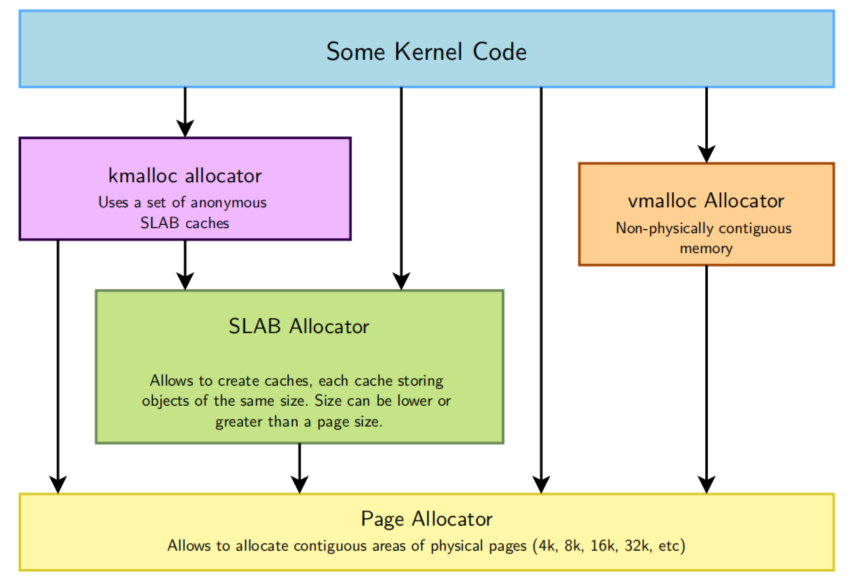
## Page allocator
- phù hợp cho cấp phát medium size
- Kernel thường quản lý bộ nhớ theo page, 1 page thường là 4K, nhưng có thể lớn hơn ở kiến trúc khác nhau
- Để giảm việc quản lý phúc tạp, kernel dùng thuật toán Buddy, ép việc cấp phát phải là lũy thừ của 2 (1 page, 2 page, 4 page, 8 page, ....)
- kích thước tối đa thường là 8192KB, nhưng có thể dựa vào cấu hình kernel
- việc cấp phát bộ nhớ này liên tục nhau về mặt vật lý
## Page allocator API
- dùng ở kernel space
- `unsigned long get_zeroed_page(gfp_t gfp_mask)`
    + return về địa chỉ ảo của free page (vùng nhớ đang trống), khởi tạo giá trị 0 cho vùng nhớ
- `unsigned long __get_free_page(gfp_t gfp_mask)`
    + tương tự nhưng không khởi tạo giá trị 0 
- `unsigned long __get_free_pages(gfp_t gfp_mask, unsigned int order)`
    + return về địa chỉ áo bắt đầu của vùng chứa các page có địa chỉ vật lý nối tiếp nhau -> cấp phát các page địa chỉ ảo liên tiếp nhau
    + `order`: là số page muốn cấp, lũy thừa của 2
- `void free_page(unsigned long addr)`
    + giải phóng 1 page
- `void free_pages(unsigned long addr, unsigned int order)`
    + giải phóng nhiều page, `order` là lũy thừa 2 page cần giải phóng
## Page allocator flags - gfp_t
- `GFP_KERNEL`: cấp bộ nhớ tiêu chuẩn, việc cấp phát có thể block tiến trình để tìm memory khả dụng. Trong các trường hợp thì đều ổn ngoại trừ interrupt
- `GFP_ATOMIC`: ram được cấp từ code sẽ không được phép chặn, cho phép truy cập khẩn cấp nhưng vẫn có thể fail nếu không có memory sẵn sàng. Flag này dùng cho ngắt hoặc các nhiệm vụ khẩn cấp
- các flag khác: `include/linux/gfp_types.h`
## SLAB allocator - bộ cấp phát SLAB
- cấp phát bộ nhớ nhỏ hơn 1 page size cho các driver cần ít memory hơn page size (4KB)
- cho phép tạo caches chứa các object có cùng kích thước
- size của object có thể nhỏ hoặc lớn hơn page size
- bộ cấp pháp SLAB đảm nhận nhiệm vụ tăng hoặc giảm size cache nếu cần dựa vào số lượng object được cấp phát. SLAB dùng page allocator để cấp phát và giải phóng pages
- SLAB cache được dùng cho cấu trúc dữ liệu mà xuất hiện nhiều trong kernel như: file object, process description, ...
- SLAB allocator hiếm khi dùng cho các driver
- 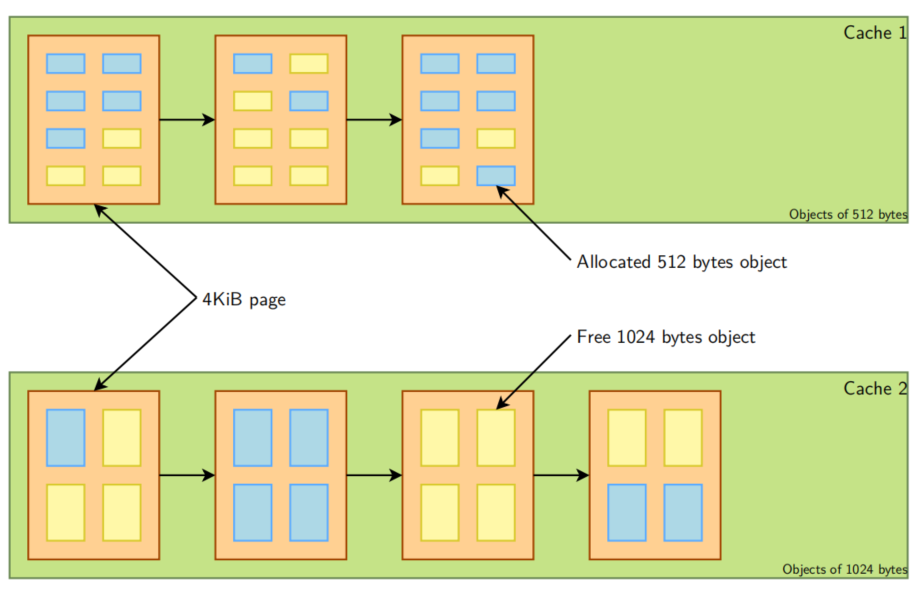
- Dễ hiểu thì SLAB như là người lấy 4KB đó đi chia nhỏ ra rồi bán lại cho các process, driver cần đúng như chúng muốn, chứ không cần thiết phải lấy cả 4KB hoặc 8KB, ... Giống như là muốn bao nhiêu thì lấy bấy nhiêu
- SLAB allocator giảm thời gian cấp phát thô từ RAM vật lý và chi phí khởi tạo lại các biến nội bộ của hệ điều hành
## Different SLAB allocators
- có nhiều phiên bản SLAB allocator khác nhau, nhưng đều tương thích về mặt API
- chọn phiên bản SLAB lúc cấu hình kernel
    + `CONFIG_SLUB`: allocator mặc định, lựa chọn tốt, ít phân mảnh
    + `CONFIG_SLUB_TINY`: chiếm dụng bộ nhớ tối thiểu, hi sinh khả năng mở rộng, debug. Chỉ dùng cho các hệ thống dưới 16MB ram 
## kmalloc allocator
- cấp phát bộ nhớ đa mục đích trong linux kernel
- với size nhỏ, nó dựa vào SLAB cache, đặt lên là `kmalloc-xxx` trong `/proc/slabinfo`
- với size lớn, nó dựa vào page allocator
- **vùng bộ nhớ được cấp là vùng vật lý liên tục**
- size của vùng được cấp được làm tròn lên bằng kích thước nhỏ nhất của SLAB cache mà nó có thể chứa vừa 
- dùng các flag như page allocator (GFP_KERNEL, GFP_ATOMIC, ...)
- Mỗi lần cấp phát tối đa 4MB
- Tổng dung lượng cấp phát tối đa 128MB
- Nên dùng để cấp phát trừ khi có lý do nào khác để dùng allocator khác
## kmalloc API
- include <linux/slab.h>
- `void *kmalloc(size_t size, gfp_t flags)`
    + cấp phát size bytes, trả về con trỏ virtual address trỏ tới vùng đó
    + flags: flags allocator
- `void kfree(const void *objp)`
    + giải phóng 1 vùng cấp phát từ `kmalloc`
- `void *kzalloc(size_t size, gfp_t flags)`
    + cấp phát vùng nhớ với khởi tạo là 0
- `void *kcalloc(size_t n, size_t size, gfp_t flags);`
    + cấp phát bộ nhớ cho mảng n phần tử với 1 phần tử có kích thước size byte, và set data vùng nhớ là 0 
- `void *krealloc(const void *p, size_t new_size, gfp_t flags)`
    + thay đổi kích thước của vùng nhớ là con trỏ p đang nắm, đổi thành new_size bằng việc cấp phát lại vùng mới rồi copy data qua nếu data mới không vừa với page alignment của vùng cũ. Còn nếu vẫn vừa với vùng cũ thì giữ nguyên vùng cũ và đổi size
## devm_kmalloc functions
- tự động giải phóng vùng nhớ khi device hoặc module bị gỡ bỏ
- `void *devm_kmalloc(struct device *dev, size_t size, gfp_t gfp);`
- `void *devm_kzalloc(struct device *dev, size_t size, gfp_t gfp);`
- `void *devm_kcalloc(struct device *dev, size_t n, size_t size, gfp_t flags);`
- `void *devm_kfree(struct device *dev, void *p);`
- trong probe() thì devm này dùng khi cấp phát bộ nhớ cho các struct device (i2c_client, spi_device, ...)
## vmalloc allocator
- có thể cấp phát bộ nhớ mà không cần chúng liên tục, tức là gom các mảnh bộ nhớ thành 1 cục rồi cấp phát
- size của bộ nhớ được yêu cầu được làm tròn lên page tiếp theo (không hiệu quả cho cấp phát nhỏ)
- có khả năng cấp phát được bộ nhớ khá lớn, vì phân mảnh bộ nhớ không phải là vấn đề. vmalloc sẽ đi gom các mảnh bộ nhớ rồi ghép lại cho đủ bộ nhớ yêu cầu
- không phù hợp cho DMA (Direct memory access)
- API trong `include/linux/vmalloc.h`
    + `void *vmalloc(unsigned long size);`
    + `void vfree(void *addr);`
## Kernel memory debugging
- KASAN: detect lỗi bộ nhớ động, tốn tài nguyên
- KFENCE: ít tốn tài nguyên hơn KASAN
- Kmemleak: check cho memory leak, tốn tài nguyên

# I/O memory
- Mục đích của việc truy cập I/O memory là để
    + điều khiển ngoại vi: ghi dữ liệu vào các thanh ghi trong vùng I/O memory của device để ra lệnh
    + truyền dữ liệu ra ngoại vi: gửi chuỗi, data, ...
    + đọc dữ liệu từ ngoại vi: 
- Việc truy cập I/O memory là cách viết driver ở tầng thấp, truy cập trực tiếp thanh ghi, cần đọc spec của device -> dùng khi 1 device chưa có thư viện hay driver hỗ trợ
- Còn việc dùng các hàm của i2c.h hoặc spi.h là driver ở tầng cao, không cần quan tâm I/O memory, cần quan tâm device tree kèm theo -> cách hiện đại
## Memory-mapped I/O - MMIO
- **Memory-mapped I/O**: là cơ chế ánh xạ địa chỉ vật lý của thanh ghi phần cứng vào chung 1 memory-mapped (bản đồ địa chỉ) với RAM
- **I/O memory** là tập hợp tất cả các thanh ghi điều khiển bên trong các thiết bị ngoại vi nhưng được CPU tiếp cận và quản lý như một vùng bộ nhớ RAM thông thường.
- Cả địa chỉ bộ nhớ và thanh ghi I/O đều giao tiếp với CPU qua chung địa chỉ bus
- vì hệ thống coi các thiết bị ngoại vi đều như RAM nên có thể dùng các lệnh đọc/ghi thông thường để điều khiển phần cứng
- Phần lớn sử dụng phương pháp I/O 
## Requesting I/O memory
- **I/O memory** là vùng không gian lưu trữ bên trong các con chip của ngoại vi
- cách này nói cho kernel biết driver nào đang dùng thanh ghi I/O nào
- `struct resource *request_mem_region(unsigned long start, unsigned long len, char *name)`
- `void release_mem_region(unsigned long start, unsigned long len)`
- việc đăng ký này cho phép chặn driver khác khỏi việc request cùng 1 thanh ghi I/O, tuy nhiên nếu cố tình viết code thì các driver vẫn có thể truy cập địa chỉ phần cứng lẫn nhau
- kiểm tra địa chỉ vật lý của driver hoặc device đã dùng `request_mem_region` để đăng ký độc quyền vùng nhớ đó
    + `/proc/iomem`
## Mapping I/O memory in virtual memory
- các lệnh load/store hoạt động OK với virtual address
- để truy cập I/O memory, driver cần có 1 địa chỉ ảo để cpu có thể xử lý, vì I/O memory mặc định không được ánh xạ trong không gian virtual memory
- hàm `ioremap` phù hợp để map địa chỉ thật với địa chỉ ảo
    ```c
    #include <linux/io.h>
    void __iomem *ioremap(phys_addr_t phys_addr, unsigned long size);
    void iounmap(void __iomem *addr);
    ```
    + cần kiểm tra `ioremap()` có return địa chỉ NULL không
## ioremap()
- 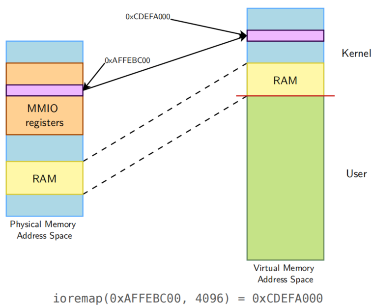
- **MMIO registers**: các thanh ghi điều khiển thiết bị ngoại vi, nằm bên trong I/O memory
## Managed API
- thay vì gọi 3 hàm sau và handle các error
    + `platform_get_resource()`: lấy offset vật lý
    + `request_mem_region()`: giữ chỗ 1 vùng nhớ
    + `ioremap()`: tạo virtual mapping cho vùng nhớ đó
- thì ta nên dùng `devm_ioremap_resoure()` hoặc `devm_platform_ioremap_resource()`
## Accessing MMIO devices: using accessor functions
- phải cẩn thận khi truy cập các thanh ghi MMIO
    + MMIO có thể sắp xếp lỏng lẻo, ta cần bắt buộc thực thi đúng thứ tự
    + định dạng sắp xếp byte (Endianness) của device có thể khác với định dạng sắp xếp byte của CPU, có thể cần chuyển đổi định dạng
    + trực tiếp đọc ghi vào địa chỉ được return từ `ioremap()` có thể không hoạt động với vài kiến trúc CPU
## Ordering
- đọc ghi vào thanh ghi MMIO-mapped của device được thực hiện theo thứ tự của chương trình
- các lệnh đọc ghi trên RAM có thể bị CPU xáo trộn thứ tự gọi
- Vì vậy có 1 số hàm truy cập (access functions) có sẵn rào cản bộ nhớ để giải quyết vấn đề xáo trộn thứ tự này:   
    + Việc ghi sẽ bắt đầu với 1 write memory barrier khiến các lệnh ghi trước đó không vượt qua được
    + Việc đọc kết thúc với 1 read memory barrier để đảm bảo thứ tự các lệnh đọc tiếp theo
- Đôi khi việc CPU hoặc compiler thay đổi thứ tự thực thi không phải là vấn đề
## MMIO access functions
- `read[b/w/l/q]` và `write[b/w/l/q]` để truy cập vào các little-endian devices, bao gồm memory barriers
- `ioread[8/16/32/64]` và `iowrite[8/16/32/64]` đơn giản để đọc ghi nhưng cũng làm việc với cổng I/O, bao gồm memory barrier
- `ioread[8/16/32/64]be` và `iowrite[8/16/32/64]` dùng để truy cập big-endian devices, bao gồm memory barrier
- `__raw_read[b/w/l/q]` và `__raw_write[b/w/l/q]` để truy cập raw, không có chuyển đổi định dạng sắp xếp byte, không có memory barrier
- `read[b/w/l/q]_relaxed` và `write[b/w/l/q]_relaxed` để truy cập little-endian device, không bao gồm memory barrier
- khi dùng các hàm trên, phải truyền vào con trỏ được gắn nhãn `__iomem`
- khi thấy con trỏ kèm từ khóa `__iomem` thì con trỏ đó đang trỏ tới vùng nhớ phần cứng I/O memory, không phải là địa chỉ RAM thông thường
## MMIO access functions summary
- 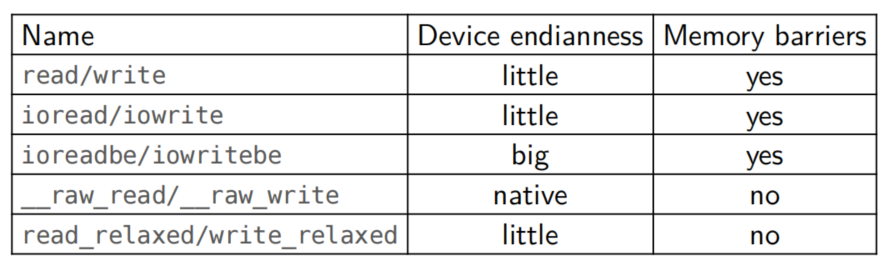
## /dev/mem
- được dùng để cung cấp cho userspace app quyền có thể truy cập vào địa chỉ vật lý
- open `/dev/mem` rồi đọc/ghi tại các offset, giá trị đọc được là giá trị ở địa chỉ vật lý
- có thể đọc ghi từ terminal với `devmem2`
- để bảo mật, cần cấu hình kernel với 
    + `CONFIG_STRICT_DEVMEM`: giới hạn `/dev/mem` chỉ truy cập được vào các địa chỉ không phải của RAM, tức là chỉ có thể truy cập vào địa chỉ của I/O memory
    + `CONFIG_IO_STRICT_DEVMEM`: chỉ cho phép truy cập vào các vùng I/O memory đang rảnh, tức là vùng chưa có trong `/proc/iomem`

## Clocking and power management
### Enabling hardware
- Để có thể hoạt động, các khối hardware cần
    + được cấp điện
    + clock hoạt động
        - các khối phần cứng được kết nối qua các hardware bus (AHB, APB, AXI,...), chúng yêu cầu input clock để phản hổi, nếu không thì 1 thao tác truy cập vào bus sẽ làm treo hệ thống
        - khi 1 deivce expose 1 bus, thường sẽ có 1 clock thứ 2 mà tần số có thể được thay đổi
    + các tín hiệu reset phải được release
### Power handling
- device trong và ngoài có thể được cấp nguồn bởi 1 bộ ổn áp
    + `Shared refcounted resources`: đây là tài nguyên dùng chung, được quản lý bằng cơ thế tham chiếu, 1 đường nguồn ổn áp có thể cấp điện cho nhiều thiết bị, hệ điều hành đếm số lượng thiết bị đang dùng đường nguồn này
    + `devm_regulator_get_enable()`
- Internal device có thể là 1 phần của 1 power management
    + Shared refcounted resources
    + ví dụ như tất cả controller liên quan hiển thị, màn hình (LCD controller, HDMI phy, ...) được gom vào 1 power domain. Toàn bộ vùng này được cấp điện, ngắt điện cùng lúc
### Clocks handling
- 1 clock tree thường bắt đầu từ 1 thạch anh chính, cấp nguồn cho các bộ PLLs, cổng logic, bộ chia, và đi tới mọi device trong system
    + `Shared refcounted resources`
    + được quản lý bởi Common Clock Framework (CCF)
    + API được mô tả trong `include/linux/clk.h`
        - `devm_clk_get()`: lây tham chiếu tới nơi cung cấp clock
        - `clk_prepare_enable()`: thông báo hệ thống khi nguồn clock cần phải chạy
        - `clk_disable_unprepare()`: thông báo tới hệ thống khi nguồn clock không cần nữa
        - `clk_get_rate()`: lấy tần số clock hiện tại (Hz)
        - `clk_set_rate()`: set tần số hiện tại (Hz)
+ Cho phép khai báo các clock có sẵn và mối liên kết tới các devices trong DTB
+ Cung cấp biểu hiễn của clock tree bởi debugfs
+ được triển khai trong `drivers/clk/`
### Diagram overview of the common clock framework
- 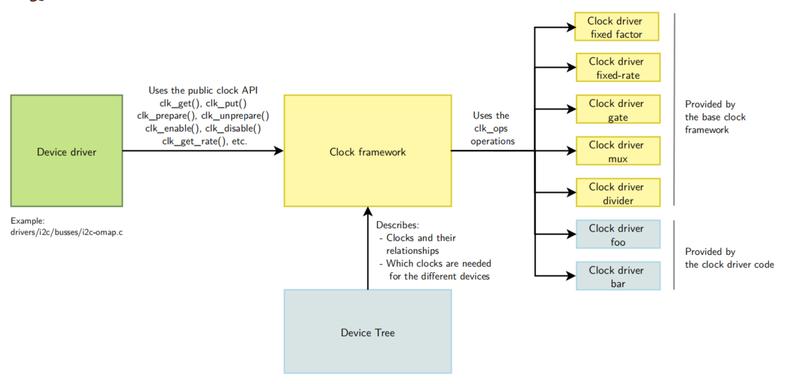
### Reset handling
- mục đích là để đưa 1 device về trạng thái default
- thường được thực hiện trong hàm `probe()`
- việc reset đơn giản có thể là reset GPIOS
- việc reset phức tạp cần được đăng ký trong reset control framework
    + được chỉ định bởi thuộc tính `resets` trong DTB
    + API:  
        - `devm_reset_control_get()`
        - `reset_control_assert()`
        - `reset_control_deassert()`
### Runtime power management
- là 1 chức năng cấu hình trong menuconfig của Linux kernel
- nó là subsystem có nhiệm vụ quản lý power trong hệ thống
- trạng thái của device có thể thay đổi lúc runtime
- khi được cấu hình, nó cho phép device rơi vào trạng thái nghỉ lúc runtime sau thời gian không hoạt động và thức dậy khi có phản hồi từ sự kiện hoặc được request
- các hàm callback có thể được thêm vào driver: `runtime_suspend()`, `runtime_resume()`, `runtime_idle()` trong `struct dev_pm_ops` của `struct device_driver`
- API trong `power/runtime_pm`:
    + `pm_runtime_enable()`: enable runtime power management của device
    + `pm_runtime_get_sync()`: tăng bộ đếm usage_count lên 1 và đánh thức clock thiết bị
    + `pm_runtime_put()`: 
    + `pm_runtime_disable()`
- Runtime PM có thể dùng các cơ chế resets, clocks, power,...
## Thực hành
- UART
    + xem uapi/linux/serial_reg.h để biết enum của các thanh ghi trong UART
    + trạng thái nghỉ của chân RX là pullup
    + devm_platform_ioremap_resource(pdev, 0): 0 là item đầu tiên của thuộc tính reg
    + dùng `readl` `writel` trong <linux/io.h> để truy cập I/O memory 32bit
    + cấu hình baudrate
        - đọc thuộc tính từ device tree: `of_property_read_u32()`
        - ghi 0x07 vào thanh ghi MDR1 để disable uart trước 
        - cấu hình các thanh ghi khác -> xem bootlin/linux-kernel/linux-kernel-bbb-labs/modules/nfsroot/root/serial/serial.c

# The misc subsystem
## Why a misc subsystem
- Kernel cung cấp rất nhiều loại framework bao phủ nhiều loại device: input, network, video, audio, ...
    + Những framework này cho phép các chức năng common giữa các driver và cung cấp API đồng bộ cho user space app
- Tuy nhiên, có thể có device không tương thích với bất kỳ framework nào, đặc biệt là các device trong FPGA hoặc deivce lạ
- Driver cho những device này có thể được implement bằng việc tạo 1 raw character driver (`cdev_init()` và `cdev_add()`)
- Nhưng misc subsystem làm việc tạo driver này dễ hơn
    + misc subsystem là lớp phía trên APi của character driver
    + device được xuất hiện trong `devtmpfs`, cái mà raw character driver không làm được
- Nhiệm vụ của miscdevice là tạo device file trong `/dev`
## Misc subsystem diagram
- 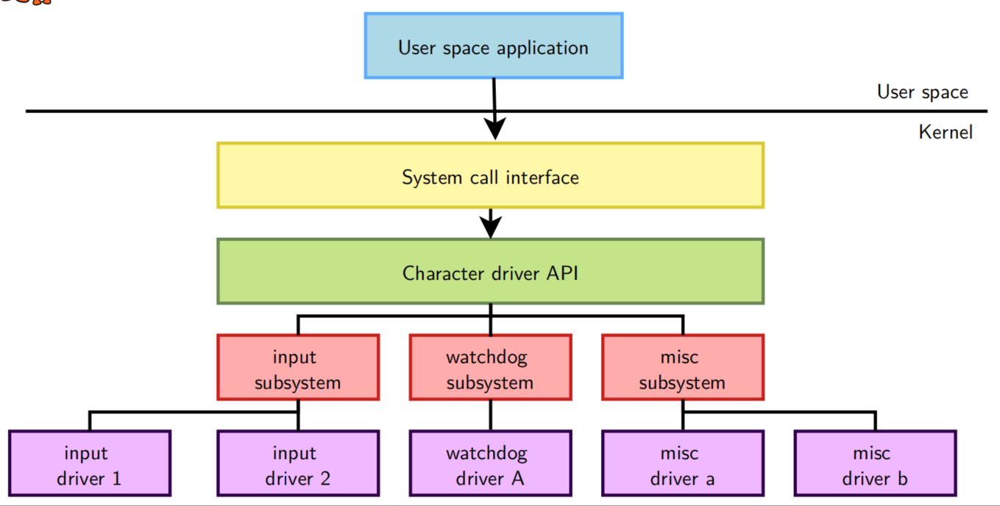
- misc là 1 subsystem trong số các subsystem của linux
## Misc subsystem API
- misc subsystem cung cấp 2 API chính để đăng ký và hủy đăng ký 1 misc device
    + `int misc_register(struct miscdevice *misc)`
    + `void misc_deregister(struct miscdevice *misc)`
- Misc device được mô tả bởi `struct miscdevice`
    ```c
    struct miscdevice {
        int minor;
        const char *name;
        const struct file_operations *fops;
        struct list_head list;
        struct device *parent;
        struct device *this_device;
        const char *nodename;
        umode_t mode; 
    };
    ```
    + minor: số minor cho device, hoặc dùng `MISC_DYNAMIC_MINOR` để linux tự cấp số cho, khỏi phải chọn
    + name: tên của device mà được dùng để tạo device node trong `devtmpfs`
    + fops: pointer tới `struct file_operations`
    + parent: pointer tới `struct device` vật lý (platform device, i2c device)
- Misc device thường là character device, và các operation hỗ trợ cho user space phụ thuộc vào kernel driver hỗ trợ các hàm: open, close, write, read, ioctl
## Thực hành
- `platform_get_resource`: lấy địa chỉ vật lý trong `reg` từ device tree
    +  IORESOURCE_MEM: vùng bộ nhớ ánh xạ MMIO
- `platform_set_drvdata`(struct platform_device, void *data)`: ký gửi data cho pdev nắm giữ hộ, không phải gán giá trị
    + các subsystem khác cũng có hàm tương tư
        - i2c_set_clientdata
        - spi_set_drvdata
        - usb_set_intfdata
- số minor/major nằm ở `/sys/class/misc/serial-xxx/dev`
- trong các hàm của struct file_operations, struct miscdevice có thể được lấy bằng file->private_data
- `container_of(..)`: từ địa chỉ của 1 object con có thể tìm ra địa chỉ của struct cha
    + hàm này chỉ thực hiện được nếu object con và struct cha có địa chỉ là liên tục trên RAM, nếu không thì sẽ crash
    + để là liên tục trên bộ nhớ RAM, object của struct cần là biến thường, không phải con trỏ vì nếu object con là con trỏ, ta cần cấp phát thông qua demv_kzalloc nên hàm này sẽ cấp 1 vùng RAM bất kì cho object con, khiến con và cha không còn liên tục
- nếu không dùng `container_of(..)`, có cách là 
    + trong hàm probe() đã gọi platform_set_drvdata(pdev, serial)
    + miscdevice sau đó có thể get bằng file->private_data
    + get được dev từ miscdevice->parent
    + dùng dev_get_drvdata(dev) để get ra được serial_dev
    + đọc thêm các hàm platform_set_drvdata, platform_get_drvdata, dev_set_drvdata, dev_get_drvdata để hiểu luồng chạy
- khi ký tự cuối của chuỗi là '\n' thì gọi lệnh write thêm 1 ký tự '\r' về đầu dòng
- `cat > /dev/serial-<...> &`: dấu & chỉ định app này chạy ở nền
- `owner` trong file_operations: quản lý tham chiếu của app mà đang mở device file này. Khi nào refernce count về 0, nghĩa là không còn app nào mở device file nữa thì mới gỡ được module. Reference count thể hiện qua `Used by` trong `lsmod`

# Processes, scheduling and interrupts
## Processes and scheduling
### Process, thread?
- không gian địa chỉ: vùng virtual memory được hệ điều hành cấp cho process
- trong UNIX, 1 process được tạo bằng hàm `fork()` và bao gồm
    + 1 không gian địa chỉ: chứa mã nguồn, data, stack, shared lib, ...
    + 1 thread: là thực thể duy nhất mà bộ lập lịch biết
- Các threads khác có thể được tạo trong 1 process đã tồn tại từ trước, sử dụng `pthread_create()`
    + chúng chạy trong cùng 1 không gian địa chỉ như thread ban đầu của process 
    + chúng thực thi các function được gán vào hàm `pthread_create()`
### Process, thread: kernel point of view
- trong kernel space, mỗi thread đang chạy được thể hiện trong qua `struct task_struct`
- Từ góc nhìn của bộ lập lịch, thread đầu tiên và các thread được tạo thêm từ `pthread_create()` là như nhau
- 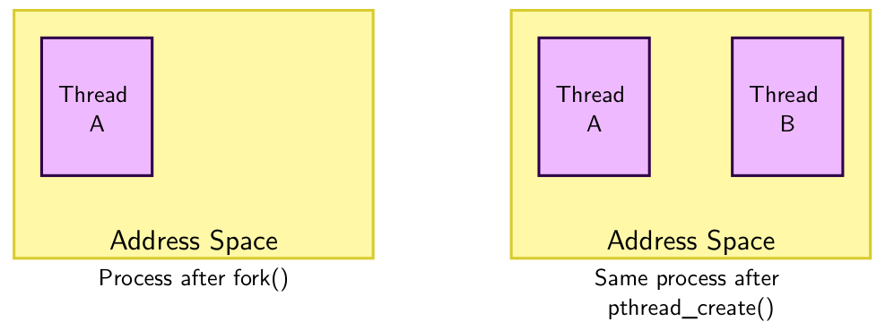
### Relation between execution mode, address space and context
- operations: là các hoat động, thao tác xử lý
- Khi nói về process và thread, những định nghĩa sau cần được phân biệt rõ:
    + Mode: là mức độ đặc quyền cho phép thực hiện các operations
        - Kernel mode: CPU có thể thực hiện bất kì lệnh nào mà được cho phép bởi kiến trúc chip, tập lệnh, truy cập memory 
        - User mode: 1 số lệnh không được cho phép, 1 số vùng memory không được quyền truy cập
    + Address space: Linux chia thành:
        - Kernel space: chứa code cho kernel mode
        - User space: chứa app thực thi
    + Context: quyết định operations nào được cho phép, thường liên quan tới các hoạt động sleepability (ngủ/pending ...)
        + với process context, hầu hết các operations được cho phép, đây là context cao nhất
        + với Atomic context, là trạng thái mà CPU đang xử lý tác vụ quan trọng, không được ngắt quãng, nó bao gồm nhiều môi trường thực thi (interrupt context, softirq context, spinlock proteced regions, ...) nới mà việc sleep không được phép
### A thread life 
- thread tồn tại trong process, 1 process có thể có nhiều thread
- 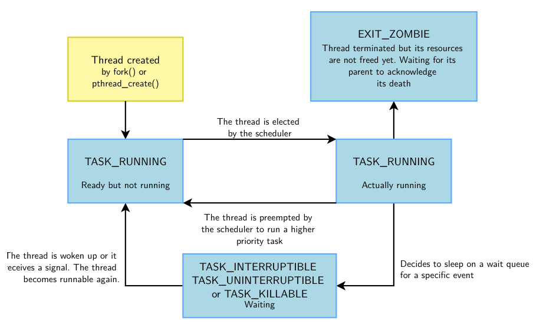
- Thread được tạo bởi fork() hoặc pthread_create() rồi chuyển vào danh sách chờ
- Thread đã khởi tạo xong tài nguyên, đang chờ bộ lập lịch cấp CPU để chạy
- Nếu bộ lập lịch cấp CPU, thread đó sẽ thực sự chạy
- Nếu thread bị tranh bởi task có độ ưu tiên cao hơn, nó sẽ về trạng thái chờ (Ready)
- Thread có thể vào trạng thái ngủ để chờ event:
    + TASK_INTERRUPTIBLE: ngủ và có thể bị đánh thức bởi event
    + TASK_UNINTERRUPTIBLE: ngủ và không bị thể đánh thức bởi event
    + TASK_KILLABLE: ngủ nhưng có thể bị ép chết bởi SIGKILL
    + nếu thread được đánh thức thì nó về trạng thái Ready
- EXIT_ZOMBIE:
    + thread đã bị hủy nhưng tài nguyên vẫn còn
    + có chờ cho process cha xác nhận kết thúc thì tài nguyên mới được giải phóng
### Execution of system calls
- 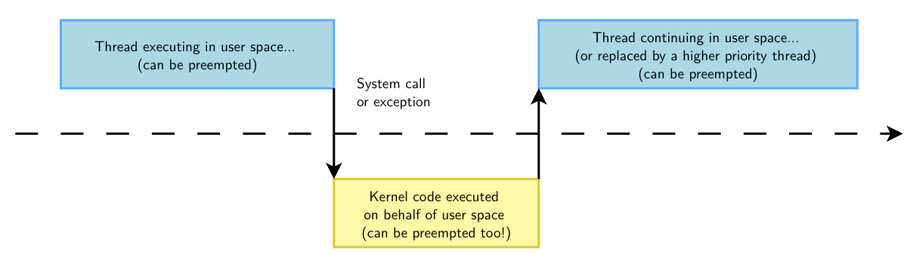
- 1 luồng xuất phát từ user space có thể gọi các system call với kernel
    + sau đó luồng chuyển mode về kernel mode và tiếp tục thực hiện
    + kernel mode làm xong thì thread chuyển về user mode và tiếp tục
- trong quá trình thực hiện, thread có thể bị thread khác ưu tiên hơn tranh chấp
## Sleeping
### Sleeping
- 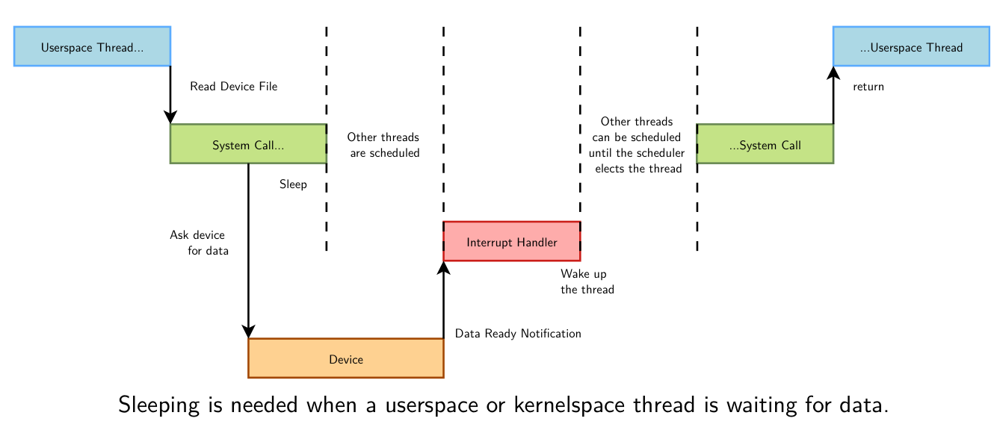
- Việc sleep là cần thiết khi 1 thread ở user space hoặc kernelspace đang chờ data
### How to sleep with a wait queue
- ta cần tạo 1 wait queue để chứa các thread đang chờ event
- Cấp bộ nhớ động cho queue
    + Thông thường, mỗi device có 1 queue riêng do driver quản lý
    + Nhúng queue đó vào trong data structure của device
    + Ví dụ:
        ```c
        struct orion_mdio_dev {
            ...
            wait_queue_head_t smi_busy_wait;
        };
        struct orion_mdio_dev *dev;
            ...
            init_waitqueue_head(&dev->smi_busy_wait);
        ```
- Cấp bộ nhớ tĩnh cho queue
    + dùng biến global khi driver đó chỉ điều khiển duy nhất 1 device
    + `DECLARE_WAIT_QUEUE_HEAD(module_queue);`
- Các cách để sleep 1 thread:
    + `void wait_event(queue, condition);`: ngủ cho đến khi queue được đánh thức và tham số `condition` là true. Chú ý rằng 1 khi đã ngủ, thread đang ngủ không thể bị đánh thức bởi các signal hệ thống (SIGKILL, SIGTERM, ...)
    + `int wait_event_killable(queue, condition);`: Có thể bị ngắt, nhưng chỉ ngắt bởi fatal signal (SIGKILL). 
        - Return về `-ERESTARTSYS` nếu bị ngắt. 
        - Return 0 nếu thức dậy bình thường
    + `int wait_event_interruptible(queue, condition);`: phổ biến nhất
        - có thể bị ngắt bởi bất kỳ signal hệ thống nào
        - Return `-ERESTARTSYS` nếu bị ngắt
    + `int wait_event_timeout(queue, condition, timeout);`
        - ngừng sleep khi thread bị đánh thức hoặc timeout
        - Return 0 nếu timer kết thúc
        - Return khác 0 nếu tham số `condition` là true
    + `int wait_event_interruptible_timeout(queue, condition, timeout);`
        - tương tư như trên và có thể bị đánh thức bởi các signal hệ thống
        - Return 0 nếu timeout
        - Return `-ERESTARTSYS` nếu bị ngắt
        - Return > 0 nếu `condition` thỏa mãn
    + Example
        ```c
        sig = wait_event_interruptible(ibmvtpm->wq, !ibmvtpm->tpm_processing_cmd);
        if (sig)
            return -EINTR;
        ```
### Waking up
- Thường thread được wakeup bởi interrupt khi data của thread đang ngủ trở nên khả dụng
- `wake_up(&queue)`: đánh thức tất cả thread trong wait queue, bao gồm các thread có trạng thái là TASK_INTERRUPTIBLE và TASK_UNINTERRUPTIBLE
- `wake_up_interruptible(&queue)`: chỉ đánh thức các thread có trạng thái TASK_INTERRUPTIBLE đang chờ ở trạng thái ngủ trong queue được chỉ định
### Exclusive vs non-exclusive thread (độc quyên vs không độc quyền)
- Là cơ chế quản lý hàng đợi của kernel để tối ưu hóa hiệu năng.
- Exclusive sleep: đánh thức 1 luồng duy nhất, hữu ích để tránh đánh thức nhiều thread khi chỉ có 1 thread có thể xử lý event, và thead đó không ảnh hưởng đến thread khác
    + `wait_event_interruptible_exclusive()`: đưa 1 thread vào hàng chờ exclusive
    + `wake_up()`/`wake_up_interruptible()`: đánh thức tất cả non-exclusive thread và chỉ 1 exclusive thread
    + `wake_up_all()`/`wake_up_interruptible_all()`: đánh thức tất cả non-exclusive và tất cả exclusive thread
- Non-exclusive sleep: có ích khi thread đó ảnh hưởng tới/có tác dụng nhiều thread khác 
    + `wait_event_interruptible()`: đưa 1 thread vào hàng chờ wait queue non-exclusive
### Sleeping and waking up - Implementation
- 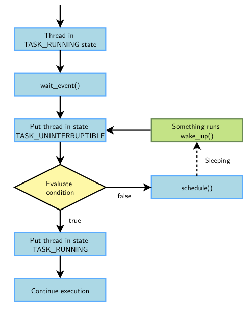
- Khi 1 thread vào trạng thái ngủ, bộ lập lịch (schedule) sẽ bỏ qua việc kiểm tra điều kiện thỏa mãn hay chưa để tiết kiệm cpu nhờ vào 2 hàm sau:
    - `wait_event(queue, condition)`: đưa thread vào trạng thái `TASK_UNINTERRUPTIBLE`
    - `wake_up(&queue)`: tất cả thread trong queue được đánh thức, sau đó bộ lập lịch kiểm lại condition xem có thỏa mãn không, nếu không thỏa thì thread ngủ trở lại
- Nếu không implement để bỏ qua việc kiểm tra condition liên tục của thead, có thể process sẽ hết tài nguyên vì phải check condition liên tục
### How to sleep with completions - Làm thế nào để sleep sau khi đã hoàn thành công việc
- Cơ chế completion này là 1 cơ chế đánh thức/sleep luồng, nó khác với wake_up() trước đó
- `wait_for_completion(struct completion *completion)`: đưa thread vào trạng thái wait state, dùng khi không có điều kiện cụ thể nào cần được thực hiện khi wake-up
    + tận dụng được năng lượng trong lúc chờ
    + đơn giản hóa việc sử dụng
    + Hiệu quả cao khi dùng các bộ lập lịch cấp thấp
- Sau khi hoàn thành công việc, thread cần báo cho các thread khác biết, vì vậy cần khai báo 1 completion struct cho việc hoàn thành này:
    ```c
    struct completion {
        unsigned int done;
        struct swait_queue_head wait;
    };
    ```
    + `DECLARE_COMPLETION(completion)`: khai báo và khởi tạo struct completion này
    + `init_completion(&object->completion)`: kháo cấp phát động
    + struct này sau khi khai báo thì sẵn sàng để consumer và provider sử dụng ngay
- Full list API: `include/linux/completion.h`
- Tài liệu: `https://www.kernel.org/doc/html/latest/scheduler/completion.html`
- Đưa 1 thread vào trạng thái wait state
    + `void wait_for_completion(struct completion *done)`
    + `wait_for_completion_timeout(),`
    + `wait_for_completion_interruptible() / _timeout()`,
    + `wait_for_completion_killable() / _timeout()`, etc
- Đánh thức consumer (thread cần kết quả từ provider) với
    + `void complete(struct completion *done)`
    + 1 lần gọi complete() thì đánh thức 1 thread đang chờ completion object này
    + có thể gọi complete() nhiều lần
    + `void complete_all(struct completion *done)`: đánh thức tất cả thread đang chờ completion object này
- Reset counter
    + `void reinit_completion(struct completion *done)`
    + reset số lượng tín hiệu hoàn thành đang chờ hoặc chưa xử lý, tức là reset biến `done` trong struct completion
    + tái sử dụng completion trong chu kỳ mới
    + Chỉ gọi `reinit_completion` 1 lần, nếu gọi 2 lần có thể làm rối loạn các thread đang chờ xử lý
- Mô tả
    + 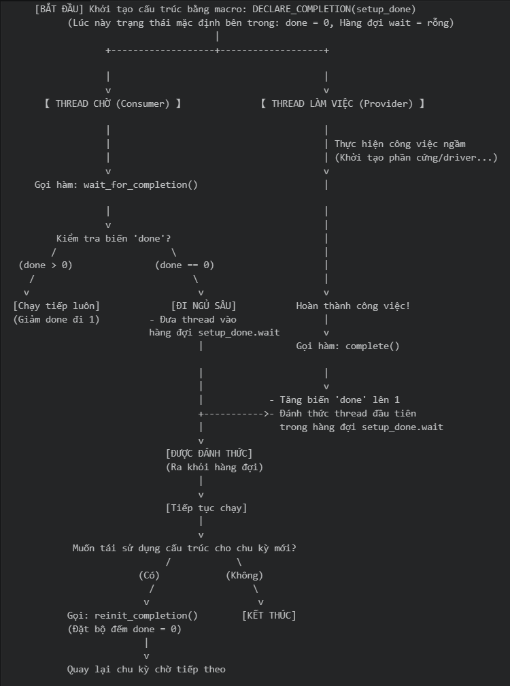
### Blocking
- Là quá trình block thread
- có thể dùng vòng loop hoặc hardware timer
    + `udelay()`: tiêu tốn vào cycle CPU để tiết kiệm 1 số lần switch context giữa các thread, phù hợp cho thời gian <= 10us hoặc tình huống atomic (là tình huống mà thread đang thực thi không được phép ngắt hoặc ngủ)
    + `usleep()/usleep_range()/msleep()`: đưa thread vào ngủ trong 1 khoảng thời gian micro giây hoặc mili giây, không dùng cho tình huống atomic ở trên
    + `fsleep()`: tự chọn chức năng delay phù hợp dựa vào thời gian delay mà developer yêu cầu
### Waiting when hardware is involved
- chờ đợi phần cứng phản hồi
- Khi phần cứng tham gia vào quá trình chờ đợi nhưng không có ngắt hoặc chuyển đổi context quá tốn thời gian
- Các hàm polling I/O có thể được dùng để theo dõi phần cứng
    + list hàm `include/linux/iopoll.h`
    + `int read[bwlq]_poll_timeout_[atomic](addr, val, cond, delay_us, timeout_us)` - đây là cấu trúc tổng quát, bwlq có thể được chuyển đổi theo tên hàm
        - b (byte): Đọc thanh ghi 8-bit (readb_poll_timeout)
        - w (word): Đọc thanh ghi 16-bit (readw_poll_timeout)
        - l (long): Đọc thanh ghi 32-bit (readl_poll_timeout)
        - q (quad): Đọc thanh ghi 64-bit (readq_poll_timeout)
        - addr: địa chỉ thanh ghi phần cứng cần kiểm tra
        - val: biến để lưu dữ liệu từ addr
        - cond: điều kiện để dừng polling
        - delay_us: chu kỳ polling
        - timeout_us: nếu quá thời gian này mà `cond` vẫn không thỏa mãn thì kết thúc polling, `return -ETIMEDOUT`
- Tránh viết hàm lặp như while để tránh treo

## Interrupt Management
- **process context**: ngữ cảnh tiến trình, hệ điều hành quản lý chung process và thread trong context này. Trong context này, thread/process có thể sleep, bị ngắt
- **Atomic context**: là bối cảnh mà tại đó CPU không được chuyển qua làm việc khác. Bộ lập lịch, sleep bị vô hiệu hóa. Atomic context thường dùng khi xử lý phần cứng khẩn cấp như ngắt, hoặc bảo vệ tài nguyên dùng chung
- Ngắt được bật: là khi CPU đang xử lý các app như thường, tức là trong process context, các đường ngắt đang chờ ngắt
- Ngắt bị tắt/vô hiệu hóa: là khi CPU đang xử lý ngắt, tất cả các process đều bị dừng
- **Chỉ có process context thì thread, process, các handler, ... mới được sleep**
### Registering an interrupt handler
- API được khuyến nghị:
    + `int devm_request_irq(struct device *dev, unsigned int irq, irq_handler_t handler, unsigned long irq_flags, const char *devname void *dev_id);`
    + `dev`: tự động giải phóng tại thời điểm release device hoặc module
    + `irq`: kênh IRQ được yêu cầu. Với platform device, dùng `platform_get_irq()` để lấy interrupt number
    + `handler`: con trỏ trỏ tới IRQ handler function
    + `irq_flags`: option masks, dưới đây là các giá trị thường dùng, có thể kết hợp các giá trị bằng toán tử or
        - `IRQF_SHARED`: interrupt channel có thể được chia sẻ giữa các device
            + khi 1 interrupt được nhận, tất cả interrupt handler được đăng ký trong cùng 1 đường ngắt sẽ được gọi
            + điều này yêu cầu 1 thanh ghi status báo trạng thái IRQ - interrupt request được phát đi hay không
        - `IRQF_ONESHOT`: được dùng bởi threaded interrupt, giữ đường ngắt disable cho tới khi thread function được chạy
    + `devname`: tên được đăng ký (trong /proc/interrupts). Với platform device, dùng `pdev->name` để phân biệt các device được quản lý bởi cùng 1 driver 
    + `dev_id`: là con trỏ mở, thường trỏ tới struct data của từng device. Con trỏ này không thể NULL vì nó được dùng làm định danh cho việc giải phóng ngắt. Khi giải phóng ngắt, struct này được ngắt trả lại cho các xử lý khác
### Interrupt handler constraints - ràng buộc của hàm xử lý ngắt
- Không có gì đảm bảo rằng hệ thống sẽ ở trong không gian địa chỉ nào khi ngắt xảy ra, vì vậy không thể truyền nhận data từ user space, không dùng các hàm copy_to_user, copy_from_user trong hàm xử lý ngắt
    + Tức là khi ngắt xảy ra, hệ thống có thể đang xử lý tác vụ khác, do đó hệ thống không thể biết mình đang đứng ở không gian bộ nhớ của tiến trình nào
    + Vì không biết ở tiến trình nào nên việc copy data giữa kernel space và user space trong hàm xử lý ngắt là nguy hiểm, gây panic
- Việc thực hiện hàm xử lý ngắt được quản lý bởi CPU, không phải bộ lập lịch. Các hàm xử lý ngắt không thể thực hiện các hành động mà đưa thread vào sleep, vì sẽ không có cơ chế nào có thể khôi phục việc thực thi của chúng. CỤ thể, ta cần cấp phát bộ nhớ với `GFP_ATOMIC` để kernel cấp ngay lập tức vùng ram, nếu hết ram thì báo lỗi luôn chứ không bắt hệ thống chờ
    + vì hàm xử lý ngắt được thực thi bởi CPU, nên nếu cho nó đi ngủ, CPU sẽ không có cơ chế đánh thức hàm đó như bộ lập lịch làm, dẫn đến treo hệ thống
    + các hàm gây ngủ là: msleep, fsleep, mutex_lock, down_semaphore, ...
- Hàm xử lý ngắt chạy trong điều kiện tất cả các ngắt khác bị disable trên local CPU. Vì vậy, chúng phải hoàn thành công việc thật nhanh để tránh block ngắt khác quá lâu
    + Tức là khi có 1 ngắt thực hiện, CPU sẽ khóa các ngắt khác, đưa các ngắt khác vào queue
### Ví dụ về cat /proc/interrupts trên Raspi 2
- Cột đầu tiên là số ngắt nhưng nó là virtual number khi dùng với Device tree
- 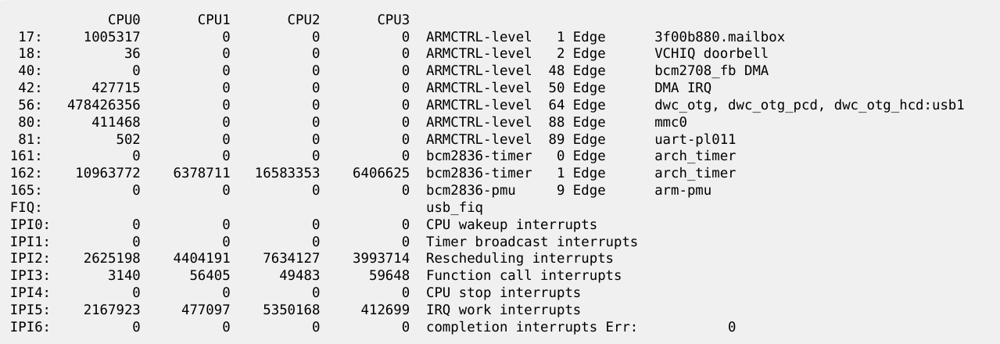
- Để nó hiện được số physical trong `/sys/kernel/debug/irq/irqs/<nr>`, set thuộc tính `CONFIG_GENERIC_IRQ_DEBUGFS=y`
### Interrupt handler prototype
- `irqreturn_t foo_interrupt(int irq, void *dev_id)`
    + `irq`: số ngắt
    + `dev_id`: con trỏ trỏ tới device mà được pass vào `devm_request_irq()`
    + `Return IRQ_HANDLED`: ngắt đã được nhận diện và xử lý
    + `Return IRQ_NONE`: được kernel dùng để phát hiện các ngắt giả mạo, và vô hiệu hóa đường ngắt nếu không có interrupt handler nào xử lý ngắt đó
    + `Return IRQ_WAKE_THREAD`: các handler request (các yêu cầu xử lý) đánh thức các handler thread (các luồng xử lý)
### Typical interrupt handler's job - công việc thông thường của các trình xử lý ngắt
- Các công việc của trình xử lý ngắt là:
    + xác nhận ngắt tới device mỗi trình xử lý ngắt chạy xong, nếu không thì sẽ không có ngắt nào được tạo ra nữa, ngắt sẽ bị lặp đi lặp lại
    + đọc ghi dữ liệu từ device
    + đánh thức bất kì process nào đang chờ những data này, thường là trên 1 danh sách chờ của từng device: `wake_up_interruptible(&device_queue)`
### Top half and bottom half processing
- Việc chia quá trình xử lý của interrupt handle thành 2 phần có thể cần thiết: top half và bottom half
    + Vì sao cần chia thành 2 phần:
        - Các trình xử lý Hard IRQ (ngắt phần cứng) thực thi trong điều kiện tất cả ngắt trên CPU cục bộ bị disabled
            + Không có cơ chế lồng ngắt (ngắt trong ngắt), các IRQ có độ ưu tiên cao hơn sẽ bị trì hoãn
        - Cần block/sleep
- Top half:
    + đây là trình xử lý ngắt thực sự, nó nên được hoàn thành nhanh nhất có thể vì tất cả ngắt khác bị disable để chờ nó. Nó lấy data từ device và nếu quá trình hậu xử lý (post-processing) tốn thời gian, bộ lập lịch sẽ chuyển tới bottom half để xử lý
- Bottom half:
    + là cơ chế cho phép trì hoãn việc xử lý của ngắt
        + trong Linux, nó được implement như là softirq, thread handle và workqueue
        + viết tắt "bh" nghĩa là "softirq" trong 1 số tài liệu cũ
### Softirqs
- Softirq handler là các callback xử lý khi tất cả interrupt handler đã hoàn thành, trước khi kernel tiếp tục quá trình lập lịch
    + chúng xử lý trong điều kiện tất cả các ngắt đều được bật (là lúc mà CPU sẵn sàng nhận ngắt, không bị block bởi quá trình xử lý ngắt Top half nào cả)
    + chúng chạy trước khi bộ lập lịch giành lại quyển kiểm soát (tức là sau khi Top half vừa mới xong), **nên không được sleep**
    + Trình xử lý softirq có thể chạy đồng thời trên nhiều CPU
- Số lượng softirq là cố định, softirq không được dùng bởi driver nhưng có thể được dùng bởi các kernel subsystem (network, ...). Danh sách của softirq ở `include/linux/interrupt.h`
- Để tránh làm cạn kiệt hệ thống, softirq sẽ bị giới hạn:
    + softirq được thực thi liên tiếp 10 lần trong tối đa 2ms
    + sau thời gian này, các callback của softirq sẽ được chạy trong process context, nghĩa là chạy như xử lý logic bình thường được phân phối bởi bộ lập lịch. Các callback đang dang dở này được chuyển vào luồng kernel `ksoftirqd/N` (N là số thứ tự của cpu). Luồng `ksoftirqd/N` được điều phối bởi bộ lập lịch và cũng cần xếp hàng thực thi như các thread khác
### Softirq execution flow
- 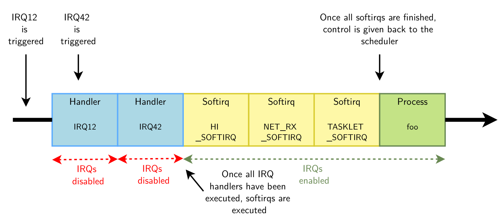
- Độ ưu tiên: IRQ > Softirq > Process
### Threaded interrupts
- Biến hàm xử lý ngắt thành 1 luồng kthread thông thường để tránh làm block CPU khi ngắt tới quá nhiều. Lúc này, hàm xử lý ngắt được điều chỉnh lại độ ưu tiên để cpu có thể xử lý các việc khác
- Ta có thể kết hợp 1 threaded handler với 1 hard IRQ handler
    + Hard IRQ handler sẽ kích hoạt nó bằng việc trả về `IRQ_WAKE_THREAD`
    + Threaded handler sẽ được xử lý trong 1 thread nằm trong process context
- Đường ngắt có thể bị vô hiệu hóa nếu việc đăng ký handler dùng cờ `IRQF_ONESHOT`
- Sleep/block được cho phép trong threaded handler
    + Độ ưu tiên của luồng `irq/<nb>-<name>` có thể được điều chỉnh
- Được dùng nhiều bởi cơ chế `PREEMPT_RT`
    ```c
    int devm_request_threaded_irq(struct device *dev, unsigned int irq,
                                irq_handler_t handler, irq_handler_t thread_fn,
                                unsigned long flags, const char *name,
                                void *dev);
    ```
    + `handler`: hard IRQ handler, CPU gọi để thực thi ngay, nằm ở Top half
    + `thread_fn`: function bottom half, được xử lý sau top half
### Workqueues
- Workqueues là cơ chế chung dùng để trì hoãn công việc, không chỉ giới hạn trong việc xử lý ngắt
- Workqueue thường dùng cho các công việc chạy nền, để CPU không bị block
- Các function được đăng ký để chạy trong workqueue được gọi là `works`:
    + Chúng được tạo bằng macro `INIT_WORK()`
    + Khi được lên lịch, chúng trở thành các thread chạy trong process context, tức là các ngắt được bật, cho phép sleep
    + Works có thể bị đưa vào 2 loại hàng đợi:
        - hàng đợi default workqueue: `schedule_work()`
        - hàng đợi được cấp phát bởi subsystem hoặc driver: `alloc_workqueue()`
- API workqueue: `include/linux/workqueue.h`
- Example:
    ```c
    INIT_WORK(&work_data->work, atmel_i2c_work_handler);
    schedule_work(&work_data->work);
    ```
### Interrupt and deferred mechanisms execution constraints summary
- 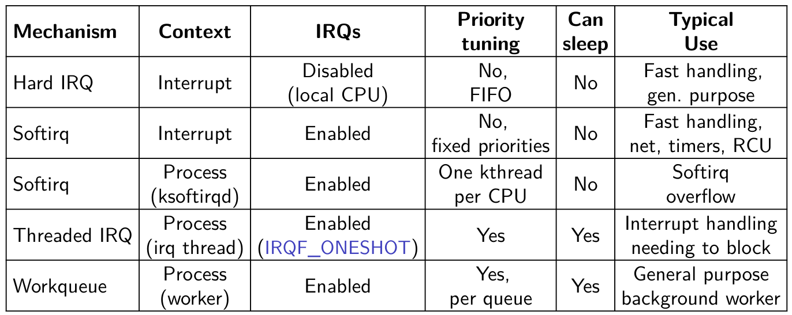
### Interrupt management summary
- Device driver
    + trong probe(), mỗi device cần dùng `devm_request_irq()` để đăng ký 1 interrupt handler cho kênh ngắt của device
- Interrupt handler
    + được gọi khi ngắt được phát đi
    + Phản hồi ngắt
    + trigger bottom half nếu cần xử lý data nhiều
    + đánh thức các process đang chờ data trên hàng đợi của mỗi device
- Device driver
    + trong hàm remove(), với mỗi device, interrupt handler được tự động hủy đăng ký
### Thực hành
- `irq = platform_get_irq(pdev, 0);`: lấy số ngắt physical ở index 0
- `devm_request_irq(..)`: đăng ký 1 interurpt handler với irq trên
- trong hàm interrupt handlder đã đăng ký cần kiểm tra đúng device mình cần xử lý ngắt không
- Phần cứng liên tục lặp lại ngắt cho tới khi mình xác nhận ngắt. Nếu không xác nhận ngắt thì interrupt handler sẽ lặp liên tục, việc lặp lại ngắt liên tục này gọi là `interrupt flood`
- Linux sẽ chỉ gửi sự kiện ngắt tới đúng handler, và mong rằng handler sẽ phản hổi lại để xác nhận ngắt
- Đối với UART controller, việc xác nhận ngắt bằng cách đọc giá trị thanh ghi `UART_RX` mà nó đang giữ ký tự tiếp theo được nhận.
- Các cách để xác nhận ngắt:
    + ghi vào thanh ghi tương thích
    + đọc data từ 1 thanh ghi
- Để sleep process trong khi chờ đúng condition, trong struct device tạo thêm wait_queue_head_t wait. 
    + cấp phát wait trong probe(): `init_waitqueue_head(&serial->wait)`
    + khi nhận được ngắt, gọi `wake_up(&serial->wait);` trong interrupt handler
    + hàm `wait_event_interruptible` như 1 chốt chặn bắt process phải ngủ tới khi thỏa mãn điều kiện, nó sẽ đưa process mà gọi hàm chứa `wait_event_interruptible` vào danh sách chờ wait queue

# Concurrent Access to Resources: Locking
## Sources of concurrency issues
- Về xử lý đồng thời nhiều tác vụ, kernel cũng chịu các ràng buộc như 1 chương trình bình thường
- Việc cần phải xử lý đồng thời nhiều tác vụ có thể do:
    + Interrupt: gián đoạn luồng hiện tại để xử lý interrupt handler. Các trình xử lý có thể dùng chung nhiều tài nguyên
    + Sự chiếm quyền điều khiển của kernel: kernel có thể chuyển việc thực thi từ thread này qua thread khác, chúng có thể dùng chung tài nguyên
    + Multiprocessing: code được thực thi trên nhiều bộ xử lý, chúng có thể dùng chung tài nguyên
- Giải pháp:
    + Không dùng chung dữ liệu giữa các thread, process để tránh dữ liệu bị sửa đổi lung tung
    + Dùng cơ chế lock để bảo vệ tài nguyên dùng chung
## Concurrency protection with locks
- 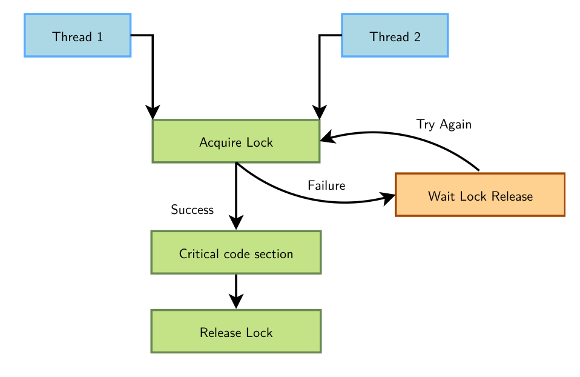
## Linux mutexes mutex = mutual exclusion
- Cơ chế lock đơn giản của kernel là binary lock (lock nhị phân). Ngoài ra còn có semaphore nhưng rất ít được dùng
- 1 process yêu cầu lock sẽ bị block lại nếu như lock đã được nắm giữ. Vì vậy mutex chỉ có thể được dùng trong bối cảnh mà việc sleep của process/thread được cho phép. Vì nếu không sleep được thì process yêu cầu lock sẽ không thể bị block được khi yêu cầu khóa
- `#include <linux/mutex.h>`
- Khởi tạo mutex static
    + `DEFINE_MUTEX(name)`
- Khởi tạo mutex động (thường dùng hơn)
    + `void mutex_init(struct mutex *lock)`
## Locking and unlocking mutexes
- **Khi tới đoạn code lấy lock, nếu dùng lock và lấy không được thì thread/process sẽ sleep**
- `void mutex_lock(struct mutex *lock)`
    + cố gắng lock mutext, nếu không lock được thì sleep
    + khi process bị đưa vào sleep, nó không thể bị ngắt vì nó được đặt ở trạng thái `TASK_UNINTERRUPTIBLE`. Vì vậy nếu xảy ra deadlock, process sẽ bị treo và không thể kill được
- `int mutex_lock_killable(struct mutex *lock)`
    + tương tự nhưng có thể bị ngắt bởi lệnh SIGKILL, process được đặt ở trạng thái `TASK_INTERRUPTIBLE`
    + Nếu bị ngắt, return về số khác 0 và gỡ bỏ lock
- `int mutex_lock_interruptible(struct mutex *lock)`
    + tương tự nhưng có thể bị ngắt bởi bất kì signal hệ thống nào (SIGKILL, SIGTERM, ...) nào
- `void mutex_unlock(struct mutex *lock)`
    + release lock, cần release ngay khi thoát khỏi section
## Spinlocks - 1 loại lock đặc biệt
- Là lock dùng cho đoạn code không được sleep (ví dụ interrupt handler) hoặc đoạn code không muốn sleep (ví dụ critical section). Không được gọi các hàm gây sleep trong này
- 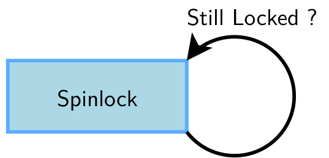
- Ban đầu được thiết kế cho hệ thống đa xử lý
- Spinlock không bao giờ sleep và tiếp tục quay vòng kiểm tra cho tới khi lock khả dụng. 
- **Khi tới đoạn code lấy lock, nếu dùng spinlock và lấy không được thì thread/process vẫn tốn cpu để chờ lấy lock**
- *Để spinlock hoạt động thì cần cấu hình kernel: CONFIG_SMP, CONFIG_PREEMPT . Nếu không thì các API spinlock sẽ được compile thành hàm rỗng, không có chức năng nữa*
- các critical section mà được bảo vệ bởi 1 spinlock thì không được sleep
- Ưu thế so với lock mutex:
    + có thể dùng trong trường hợp có interrupt
    + nhanh hơn vì không mất thời gian cho quá trình context switch như lock mutex
## The spinlock API
- Khởi tạo spinlock
    + static: `DEFINE_SPINLOCL(lock)
    + dynamic (cho mỗi device): `void spin_lock_init(spintlock_t *lock)`
- Lấy lock: 
    + `void spin_lock(spinlock_t *lock)`
- Release lock:
    + `void spin_unlock(spinlock_t *lock)`
- Try lock
    + `int spin_trylock(spinlock_t *lock)`
## Spinlocks vs. preemption/migration
- **kernel preemption**: cơ chế chiếm quyền điều khiển
    + khi thread 1 đang thực hiện, nếu có thread 2 ưu tiên cao hơn thì cơ chế này sẽ đưa thread 1 vào sleep và đẩy thread 2 lên thực hiện
- **kernel migration**: cơ chê đưa thread/process đang chạy sang 1 cpu khác
- 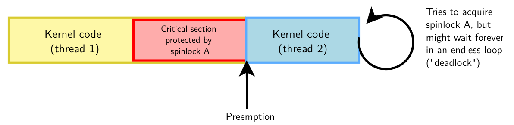
    + Khi 1 critical section đang nắm spinlock, nếu có thread khác cố gắng lấy lock, do cơ chế preemption, thread 2 sẽ được đẩy lên thực hiện (vì spinlock không làm thread/process sleep), nhưng có thể sẽ loop trong vòng lặp vì lock đang được nắm bởi critial section, critical section không có cách nào nhả lock vì đã nhường CPU để xử lý thread 2 -> gọi là deadlock
- Nếu đã vào deadlock thì cơ chế kernel preemption bị vô hiệu hóa
- Khi 1 thread/process đang chiếm spinlock trên CPU 0 thì nó không được chuyển qua CPU X nào khác, phải xử lý xong thật nhanh. Vì vậy kernel sẽ vô hiệu quá cơ chế preemption và migration, Preemption bị vô hiệu hóa thì cũng vô hiệu hóa luôn migration
## Spinlocks vs. interrupts
- 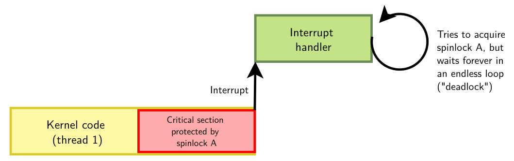
- ta cũng cần tránh deadlock khi nếu có 1 interrupt thì interrupt cũng có thể muốn lấy lock, nếu gặp critical section đang khóa lock bằng spinlock thì interrupt handler sẽ loop mãi để cố gắng lấy. Nhưng do interrupt có độ ưu tiên cao hơn nên critical section phải nhường, dẫn tới spinlock không được critial section release
- Để bảo vệ khỏi deadlock khi dùng chung spinlock và interrupt trong process context và interrupt context, cần dùng API:
    + `void spin_lock_irqsave(spinlock_t *lock, unsigned long flags)`
        - lưu lại trạng thái ngắt, vô hiệu hóa ngắt IRQs để không nhận được ngắt nào trong quá trình đang xử lý critial section đang nắm spinlock. 
    + `void spin_unlock_irqrestore(spinlock_t *lock, unsigned long flags)`
        - giải phóng spinlock
        - enable lại IRQs trong CPU
## Spinlock API
- `void spin_lock_bh(spinlock_t *lock)`: chiếm lock và vô hiệu hóa softirq
- `void spin_unlock_bh(spinlock_t *lock)`: nhả lock và bật lại softirq
- Ý nghĩa
    + vô hiệu hóa ngắt mềm, không vô hiệu hóa ngắt phần cứng. Do đó các ngắt từ phần cứng vẫn có thể được kích hoạt
    + hiệu quả khi muốn bảo vệ data khi process context và trong bottom half (softirq) cùng truy cập vào được
    + không cần vô hiệu quá ngắt phần cứng
- Linux kernel còn cung cấp reader/writer spinlock để cho phép nhiều thread/process cùng đọc dữ liệu đồng thời mà không cần chờ nhau, vì chỉ đọc thì không làm thay đổi dữ liệu
## Spinlock example
- 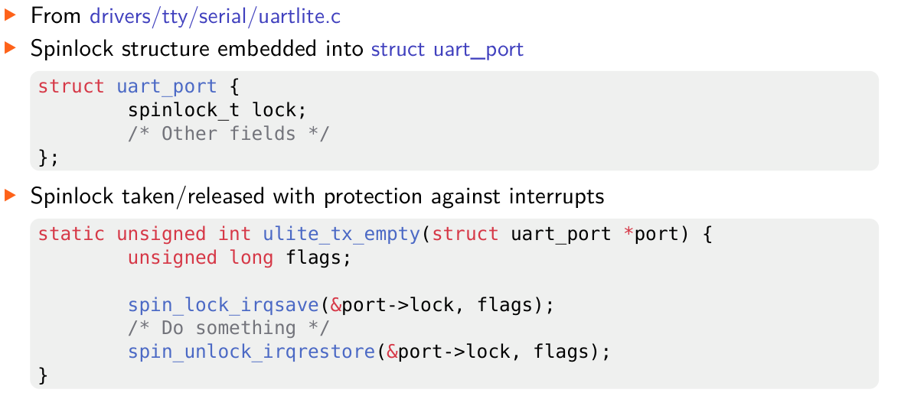
```c
static unsigned int ulite_tx_empty(struct uart_port *port) {
    unsigned long flags;
    spin_lock_irqsave(&port->lock, flags);
    /* Do something */
    spin_unlock_irqrestore(&port->lock, flags);
}
```
## More deadlock situations
- Gọi 1 function mà cố lấy cùng 1 lock trong function khác
    + function 1 -> get lock 1 -> call function 2 -> wait lock 1 ->deadlock
- Get lock sai thứ tự
    + function 1 -> get lock 1 -> get lock 2
    + function 2 -> get lock 2 -> get lock 1
- Giải pháp:
    + không gọi function mà get cùng 1 lock
    + nếu dùng nhiều lock thì luôn get lock theo cùng 1 thứ tự
## Debugging locking
- `CONFIG_PROVE_LOCKING`:
    + chứng minh tính đúng đắn của locking
    + hoạt động bằng cách thêm các mã kiểm tra vào kernel locking code
    + phát hiện các vi phạm về rule locking trong vòng đời hệ thống như:
        - lock bị yêu cầu sai thứ tự (theo dõi locking sequence và so sánh chúng)
        - spinlock bị yêu cầu lock trong interrup handler và cả trong process context khi interrupt được bật
- `CONFIG_DEBUG_ATOMIC_SLEEP`:
    + phát hiện code mà sleep bị sai khi ở trong atomic section 
    + cảnh báo thông qua `dmesg` khi gặp vi phạm
## Concurrency issues
- Kernel Concurrency SANitizer framework - KCSAN: công cụ phát hiện các lỗi khi xử lý đồng thời nhiều tác vụ trong linux kernel
- `CONFIG_KCSAN`
- KCSAN chèn các đoạn mã vào trong lúc đang compile và sau đó kiểm tra được lỗi trong quá trình run time
- KCSAN có thể giúp tìm các lỗi tiềm ẩn, khó tái hiện trong quá trình xử lý đồng thời nhiều tác vụ 
- Xem thêm tại `https://www.kernel.org/doc/html/latest/dev-tools/kcsan.html`
## Alternatives to locking - các giải pháp khác thay thế cơ chế lock
- Việc dùng cơ chế lock (mutex, spinlock) có thể gây ảnh hưởng xấu tới hiệu năng hệ thống
- Vì vậy trong 1 số tình huống, có thể không cần dùng lock bằng các cơ chế sau:
    + thuật toán lock-free như Read Copy Update (RCU): copy data ra sửa, rồi chờ các process đọc data cũ xong mới thay thế vào data gốc
    + atomic operation
## RCU API
- RCU chỉ có ích khi
    + chương trình đọc nhiều nhưng ghi ít
    + chương trình tập trung vào việc lấy data nhất quán thay vì lấy data mới nhất
- RCU ép buộc đồng bộ hóa về không gian và thời gian:
    + Về không gian, luồng ghi không bao giờ ghi vào ô nhớ mà các luồng đọc đang đọc. Luồng ghi sẽ sao chép data từ ô nhớ đó để chỉnh sửa riêng, tránh ảnh hưởng tới ô nhớ mà các luồng đang đọc
    + Về thời gian, vùng dữ liệu cũ chỉ được giải phóng khi không còn luồng đọc nào đọc nó
- Vì vậy RCU quản lý quyền sở hữu mà không cần lock. Nó đảm bảo luồng đọc đọc data an toàn và luồng ghi sửa data mà không ảnh hưởng đến các luồng đọc khác
- RCU API: `Documentation/RCU/whatisRCU.rst`
    + `rcu_read_lock()` và `rcu_read_unlock()`: reclaim/release quyền đọc
    + `synchronize_rcu()`, `call_rcu()`, hoặc `kfree_rcu()`: chờ các luồng đọc đang tồn tại
    + `rcu_assign_pointer()`: cập nhật con trỏ RCU-protected
    + `rcu_dereference()`: load con trỏ RCU-protected
## RCU example: ensuring consistent accesses
- Đọc/ghi không an toàn 
    + 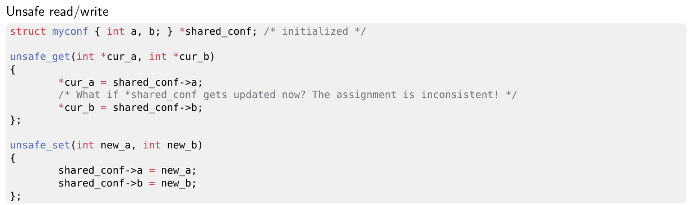
    + Giữa lúc đọc a và b có thể thread/process khác cướp quyền thực thi và thay đổi dữ liệu, khiến việc đọc b không còn đồng nhất với a nữa
- Đọc/ghi an toàn 
    + 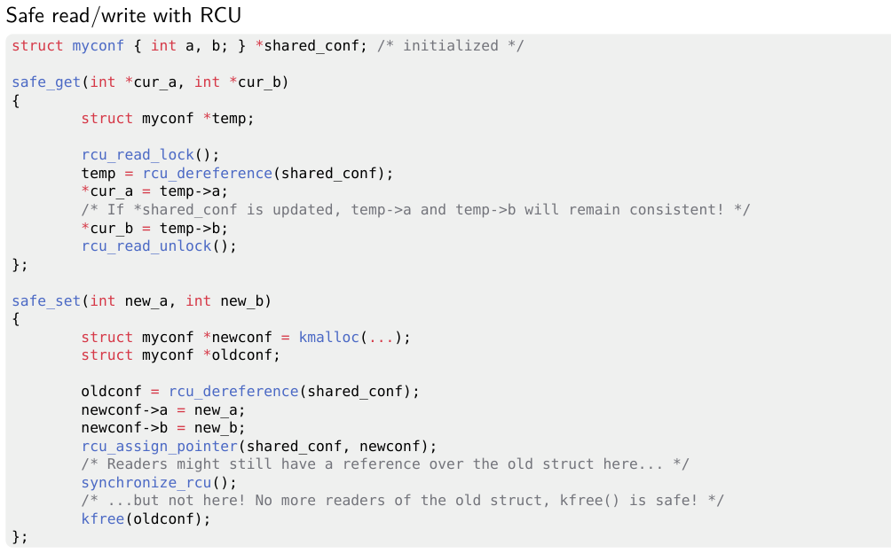
    + oldconf: giữ lại địa chỉ vùng nhớ cũ, để cho các luồng đọc xong hết rồi thì giải phóng oldconf. Nếu không giữ lại vùng nhớ của shared_conf thông qua oldconf thì khi chuyển shared_conf qua vùng nhớ mới, ta sẽ mất dấu vùng nhớ cũ và gây memory leak
## Atomic variables
- #include <linux/atomic.h>
- Atomic hữu ích khi tài nguyên dùng chung là 1 biến số nguyên
- 1 lệnh như n++ cũng chưa chắc đảm bảo là atomic trên tất cả process
- Ý tưởng cho atomic là RMW operation (Read-Modify-Write)
- Các hàm chính để thao tác với biến atomic
    + Set hoặc read counter
        - `void atomic_set(atomic_t *v, int i)`
        - `int atomic_read(atomic_t *v)`
    + Các hàm không có return
        - `void atomic_inc(atomic_t *v)`
        - `void atomic_dec(atomic_t *v)`
        - `void atomic_add(int i, atomic_t *v)`
        - `void atomic_sub(int i, atomic_t *v)`
    + Các hàm kiểm tra kết quả
        - `int atomic_inc_and_test(...)`: tăng biến lên 1 và check xem biến đó = 0 hay không
        - `int atomic_dec_and_test(...)`
        - `int atomic_sub_and_test(...)`
    + Các hàm trả về giá trị mới
        - `int atomic_inc_return(...)`
        - `int atomic_dec_return(...)`
        - `int atomic_add_return(...)`
        - `int atomic_sub_return(...)`
## Atomic bit operations
- Cung cấp các xử lý nhanh và đảm bảo tính nguyên tử (atomic)
- Trên hầu hết các kiến trúc, các phép toán này áp dụng cho kiểu `unsigned long *`. Một số ít khác áp dụng cho kiểu `void *`
- Cực kì phù hợp khi thao tác với bitmaps
- Các hàm set, clear, đảo bit (0 thành 1, 1 thành 0)
    + `void set_bit(int nr, unsigned long *addr)`
    + `void clear_bit(int nr, unsigned long *addr)`
    + `void change_bit(int nr, unsigned long *addr)`
- Hàm test bit
    + `int test_bit(int nr, unsigned long *addr)`
- Hàm test và modify (trả về giá trị trước khi modify)  
    + `int test_and_set_bit(...)`
    + `int test_and_clear_bit(...)`
    + `int test_and_change_bit(...)`
## Kernel locking: summary and references
- Chỉ dùng mutex trong context cho phép sleep
- Dùng spinlocks trong context không cho phép sleep (như interrupt) hoặc trong tình huống mà sleep quá tốn kém (như critical section)
- Dùng atomic operations để bảo vệ giá trị nguyên hoặc địa chỉ
- Bảng khuyến nghị dùng hàm lock nào cho các trường hợp cụ thể
    + 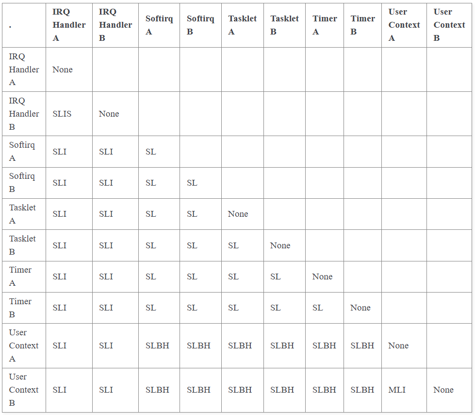
        - Hàng là cái đang chạy
        - Cột là cái tới
    + 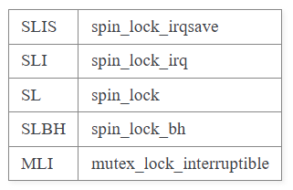
    + Độ ưu tiên thì trái qua phải
    + Thằng nào có độ ưu tiên thấp hơn khi gặp thằng ưu tiên cao thì phải dùng lock để chặn thằng cao, tránh việc data bị đổi bất ngờ. Việc này làm cho các thằng cao cần chờ các thằng thấp làm xong, gây chậm các thằng cao, tuy nhiên cần đánh đổi để bảo toàn data
    + Tuy nhiên vẫn có thể dùng SLIS cho irq handler để đảm bảo truy cập đồng bộ khi có nhiều CPU cùng gửi ngắt tới khiến irq handler bị gọi nhiều lần
- Đọc thêm về Lock: `https://www.kernel.org/doc/html/latest/kernel-hacking/locking.html`
- **Hãy lock data chứ không phải lock đoạn code**
## Thực hành
- `CONFIG_DEBUG_ATOMIC_SLEEP`: cảnh báo 1 function có thể sleep trong atomic context (sleep không được phép trong atomic context)

# Direct memory access
## DMA main principles
### DMA integration
- DMA là việc mà copy data trực tiếp từ device vào RAM mà không cần thông qua CPU
- Thực hiện nhanh, ít tốn CPU hơn
- Dùng khi cần truyền 1 lượng data lớn, xử lý data liên tục, giao tiếp ngoại vi tốc độ cao, ... mà có thể gây nghẽn CPU
- 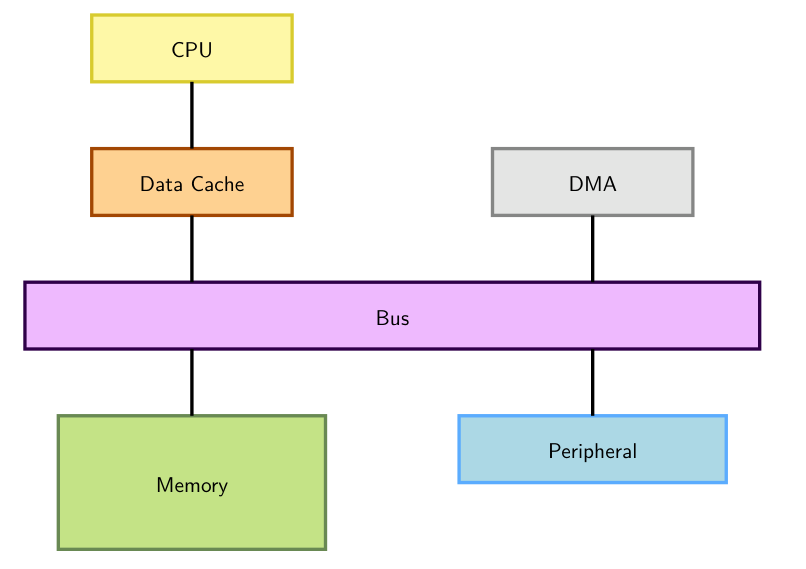
### Peripheral DMA
- Một vài device controller được nhúng bộ DMA controller vào, vì vậy chúng có thể tự thực hiện DMA
- 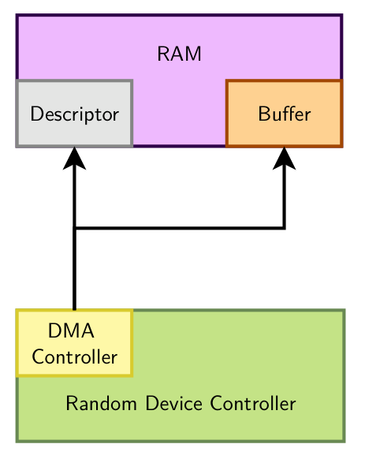
### DMA controller
- Các device controller khác dựa vào 1 DMA controller nằm trên SoC
- Những device này cần truyền các mô tả DMA (DMA descriptor) tới bộ controller này
- 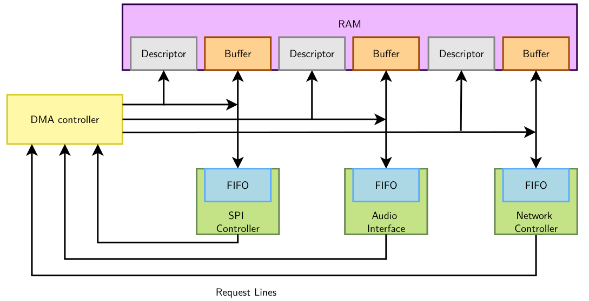
### DMA descriptors
- Các bộ mô tả DMA mô tả những thuộc tính khác nhau của quá trình truyền dữ liệu DMA và được liên kết với nhau theo dạng chuỗi.
- 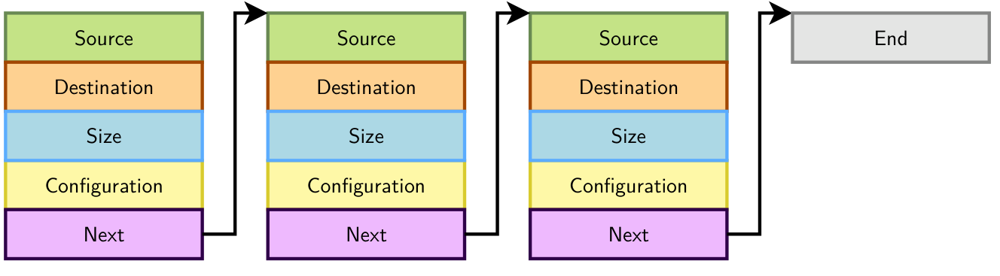
### Cache constrains
- CPU có thể truy cập memory thông qua 1 data cache. Việc dùng data cache này rất hiệu quả vì data cache có thể được truy cập nhanh hơn cache trên bus
- Nhưng DMA không truy cập CPU cache nên vì vậy cần chú ý tính nhất quán của cache (cache content vs memory content)
    + Khi CPU đọc từ bộ nhớ được truy cập bởi DMA, các đường cache liên quan phải được vô hiệu hóa để ngăn việc đọc lại dữ liệu cũ từ bộ nhớ 
        - Vì DMA ghi thẳng dữ liệu vào RAM nên data trong cache của CPU vẫn là data cũ, nếu CPU đọc thì sẽ đọc dữ liệu cũ. Vì vậy cần vô hiệu hóa các cache lines
    + Khi CPU ghi vào bộ nhớ trước bắt đầu truyền dữ liệu DMA, đường cache phải được đẩy hết dữ liệu hoặc dọn sạch để đảm bảo data được thực sự ghi vào bộ nhớ
        - khi CPU ghi data, data đó chỉ mới được đưa vào cache mà chưa kịp đưa vào RAM. Nếu lúc này DMA chuyển data từ RAM vào device, dữ liệu từ RAM đó là dữ liệu cũ. Vì vậy, trước khi DMA gửi, cần đẩy hết data trong cache của CPU vào RAM
    + 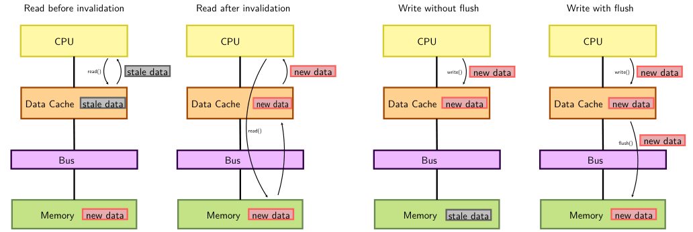
### DMA addressing constraints
- Memory và device đều có physical address: `phys_addr_t`
- CPU truy cập memory thông qua MMU bằng con trỏ ảo `void *`
- DMA controller không thể truy cập memory qua MMU, vì vậy nó không truy cập virtual address được. - Thay vào đó nó truy cập `dma_addr_t` qua 1 trong 2 cách:
    + trực tiếp physical address
    + thông qua IOMMU để tạo mapping memory
- 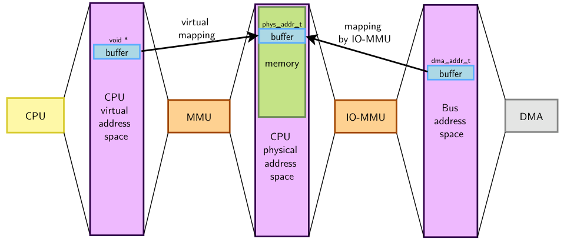
### DMA memory allocation constraints
- Mỗi phần memory được truy cập bởi DMA phải là các vùng nhớ liên tục, có nghĩa rằng nó có thể dùng
    + bất kì memory nào được cấp phát bởi `kmalloc()` (up to 128KB)
    + bất kì memory nào được cấp phát bởi `__get_free_pages()` (up to 8MB)
    + các khối I/O và network buffer được thiết kế để hỗ trợ DMA
- Nếu buffer nhỏ hơn 1 page, **không thể dùng**:
    + kernel memory được tạo bởi`vmalloc()`
    + user memory được tạo bởi `malloc()`

## Kernel APIs for DMA
- dma-mapping API
    + cấp phát và quản lý DMA buffer
    + cung cấp các interface để xử lý nhất quán
    + quản lý IOMMU DMA mappings
    + `https://www.kernel.org/doc/html/latest/core-api/dma-api.html`
    + `https://www.kernel.org/doc/html/latest/core-api/dma-api-howto.html`
- dmaengine API
    + trừu tượng hóa bộ DMA controller
    + cung cấp các function để cấu hình, queue, trigger, strop quá trình truyền data
    + không dùng khi xử lý DMA của ngoại vi
    + `https://www.kernel.org/doc/html/latest/driver-api/dmaengine/client.html`
- dma-buf API
    + cho phép chia sẻ DMA buffer giữa các device trong kernel
### dma-mapping: Coherent or streaming DMA mappings
- Mục này nói về 2 cơ chế ánh xạ bộ nhớ khác nhau mà Linux kernel cung cấp để ngoại vi có thể trao đổi data trực tiếp với RAM thông qua DMA controller
- Coherent mappings - ánh xạ nhất quán:
    + khi có yêu cầu mapping, kernel cấp phát 1 buffer phù hợp và thiết lập ánh xạ (mapping) cho driver
    + CPU và driver có thể truy cập đồng thời vào buffer này mà không sợ sai lệch data
    + Buffer này phải nằm trong vùng nhớ nhất quán với bộ đệm cache
    + Buffer thường được tạo ra khi module load và bị hủy đi khi module bị gỡ
        - việc thiết lập có thể tốn kém tài nguyên trên 1 số platform
        - thường được triển khai bằng cách vô hiệu hóa cache trên kiến trúc arm
- Streaming mappings
    + dùng 1 buffer đã được cấp phát trước đó, tức là đã có sẵn vùng nhớ RAM rồi, kernel không cần cấp phát nữa
    + driver cung cấp sẵn 1 buffer, kernel chỉ việc thiết lập mapping
    + việc ánh xạ được thiết lập mỗi lần truyền dữ liệu, giúp các thanh ghi DMA được giải phóng trên phần cứng, giúp tiết kiệm tài nguyên và các thanh ghi được giải phóng
### dma-mapping: memory addressing constraints
- Nói về việc kiểm soát giới hạn RAM mà 1 ngoại vi có thể truy cập được thông qua DMA
- Bất kì thiết bị nào có khả năng là master trên 1 bus đều cần phải báo cho hệ điều hành biết dải địa chỉ của nó
- Nếu không báo gì, Linux kernel mặc định coi thiết bị đó có giải địa chỉ 32-bit, tức là chỉ có thể truy cập được tối đa 4GB RAM
- Nếu platform hỗ trợ, dải địa chỉ của DMA có thể:
    + tăng
    + giảm
    + Linux lưu trữ khả năng này cho mỗi device
- DMA mapping có thể thất bại vì buffer nằm ngoại phạm vi tiếp cận, ví dụ như driver muốn device truyền 8GB RAM trong khi device đó chỉ có khả năng đọc 4GB RAM
    + `swiotlb` có thể giải quyết 1 vài tình huống bằng việc tận dụng các bộ đệm nhảy (bounce buffer) nội bộ
- Trong tất cả trường hợp, DMA mask phải nhất quán trước khi cấp phát, mapping buffer
    + `int dma_set_mask_and_coherent(struct device *dev, u64 mask)`
### dma-mapping: Allocating coherent memory mappings
- kernel đảm nhận nhiệm vụ cấp phát buffer và mapping
```c
#include <linux/dma-mapping.h>
void * /* Output: buffer address */
dma_alloc_coherent(
    struct device *dev, /* device structure */
    size_t size, /* Needed buffer size in bytes */
    dma_addr_t *handle, /* Output: DMA bus address */
    gfp_t gfp /* Standard GFP flags */
);
void dma_free_coherent(struct device *dev,
    size_t size, void *cpu_addr, dma_addr_t handle);
```
### dma-mapping: Setting up streaming memory mappings (single)
- Thiết lập ánh xạ bộ nhớ streaming (đơn lẻ), dữ liệu nằm trên 1 vùng nhớ và liên tục trên RAM
- Hoạt động trên các bộ nhớ đệm đã được cấp phát sẵn
    ```c
    #include <linux/dma-mapping.h>
    dma_addr_t dma_map_single(
        struct device *,        /* device structure */
        void *,                 /* input: buffer to use */
        size_t,                 /* buffer size */
        enum dma_data_direction /* Either DMA_BIDIRECTIONAL,
                                * DMA_TO_DEVICE or
                                * DMA_FROM_DEVICE */
    );
    void dma_unmap_single(struct device *dev, dma_addr_t handle,
                            size_t size, enum dma_data_direction dir);
    ```
### dma-mapping: Setting up streaming memory mappings (multiples)
- Thiết lập ánh xạ bộ nhớ streaming (nhiều bộ đệm), data bị chia nhỏ nằm rải rác ở nhiều vị trí khác nhau trong RAM, không liên tục
- 1 scatterlist (danh sách phân tán) sử dụng thư viện scatter-gather có thể được dùng để map nhiều bộ đệm buffer và liên kết chúng lại với nhau
    ```c
    #include <linux/dma-mapping.h>
    #include <linux/scatterlist.h>
    struct scatterlist sglist[NENTS], *sg;
    int i, count;
    sg_init_table(sglist, NENTS);
    sg_set_buf(&sglist[0], buf0, len0);
    sg_set_buf(&sglist[1], buf1, len1);
    count = dma_map_sg(dev, sglist, NENTS, DMA_TO_DEVICE);
    for_each_sg(sglist, sg, count, i) {
            dma_address[i] = sg_dma_address(sg);
            dma_len[i] = sg_dma_len(sg);
    }
    ...
    dma_unmap_sg(dev sglist, count, DMA_TO_DEVICE);
    ```
### dma-mapping: Setting up streaming I/O mappings
- địa chỉ vật lý của thanh ghi MMIO có  thể cần phải remap để có thể được truy cập bằng IOMMU
    ```c
    #include <linux/dma-mapping.h>
    dma_addr_t dma_map_resource(
            struct device *,         /* device structure */
            phys_addr_t,             /* input: resource to use */
            size_t,                  /* buffer size */
            enum dma_data_direction, /* Either DMA_BIDIRECTIONAL,
                                      * DMA_TO_DEVICE or
                                      * DMA_FROM_DEVICE */
            unsigned long attrs,     /* optional attributes */
    );
    void dma_unmap_resource(struct device *dev, dma_addr_t handle,
                size_t size, enum dma_data_direction dir, unsigned long attrs);
    ```
### dma-mapping: Verifying DMA memory mappings
- Đây là việc kiểm tra xem linux đã thiết lập ánh xạ giữa RAM và device thành công hay chưa
- tất cả các hàm mapping helper có thể thất bại và trả về lỗi
- Cách đúng nhất để kiểm tra tính hợp lệ của giá trị `dma_addr_t` là gọi hàm: `int dma_mapping_error(struct device *dev, dma_addr_t dma_addr)`
    + Các gợi ý có thể được thêm nếu cấu hình `CONFIG_DMA_API_DEBUG`
### dma-mapping: Syncing streaming DMA mappings
- Nhìn chung, các ánh xạ dạng luông (streaming mapping) sẽ được:
    + ánh xạ ngay trước khi sử dụng với DMA
        - `MEM_TO_DEV`: cache được đẩy dữ liệu xuống RAM
    + sau đó hủy ánh xạ ngay
        - `DEV_TO_MEM`: các cache line bị vô hiệu hóa
- CPU chỉ được phép truy cập vào buffer sau khi đã hủy ánh xạ
- Nếu cùng 1 vùng memory được dùng trong nhiều lần DMA transfer liên tiếp, việc ánh xạ có thể được giữ nguyên. Trong trường hợp này data cần được đồng bộ hóa trước khi truy cập
    + Khi CPU cần truy cập data
        ```c
        dma_sync_single_for_cpu(dev, dma_handle, size, direction);
        dma_sync_sg_for_cpu(dev, sglist, nents, direction);
        ```
    + Khi device cần truy cập data
        ```c
        dma_sync_single_for_device(dev, dma_handle, size, direction);
        dma_sync_sg_for_device(dev, sglist, nents, direction);
        ```
### Starting DMA transfers
- Nếu device mà mình đang viết driver thực hiện DMA ngoại vi, thì không có API bên ngoài nào liên quan vì device đó có bộ DMA controller riêng rồi nên nó tự cấu hình, quản lý, truyền data mà không cần CPU can thiệp
- Nếu device phụ thuộc vào bộ DMA bên ngoài, không có DMA riêng, ta cần:
    + yêu cầu device sử dụng DMA để nó kích hoạt đường truyền của mình 
    + dùng framework `dmaengine`, đặc biệt là slave API của nó
### The dmaengine framework
- 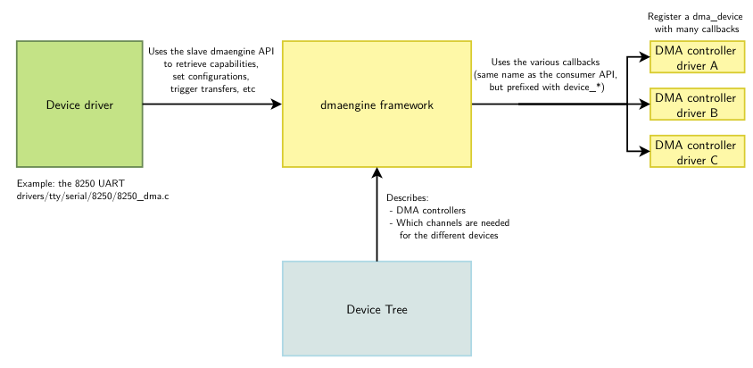
- Slave API: initial configuration
    + Các bước để truyền DMA với `dmaengine`:
        1. yêu cầu 1 channel để dùng độc quyền bằng `dma_request_chan()` hoặc các biến thể của hàm này
            + con trỏ trỏ vào channel này sẽ được dùng xuyên suốt quá trình
            + trả về con trỏ kiểu `struct dma_chan`, con trỏ này cũng có thể là 1 con trỏ báo lỗi
        2. Cấu hình engine bằng cách thêm thông tin cho `struct dma_slave_config` và gán struct này vào `dmaengine_slave_config`
            ```c
            struct dma_slave_config txconf = {};
            /* Tell the engine what configuration we want on a given channel:
            * direction, access size, burst length, source and destination).
            * Source being memory, there is no buswidth or maxburst limitation
            * and each buffer will be different. */
            txconf.direction = DMA_MEM_TO_DEV;
            txconf.dst_addr_width = DMA_SLAVE_BUSWIDTH_1_BYTE;
            txconf.dst_maxburst = TX_TRIGGER;
            txconf.dst_addr = fifo_dma_addr;
            ret = dmaengine_slave_config(dma->txchan, &txconf);
            ```
- Slave API: Per-transfer configuration
    + Cách cấu hình theo từng lần truyền data
        1. Tạo 1 bộ mô tả chứa tất cả cấu hình yêu cầu cho lần truyền tiếp theo bằng các hàm sau:
            ```c
            struct dma_async_tx_descriptor *
                dmaengine_prep_slave_single(struct dma_chan *chan, dma_addr_t buf,
                        size_t len, enum dma_transfer_direction dir,
                        unsigned long flags);
            struct dma_async_tx_descriptor *
                dmaengine_prep_slave_sg(struct dma_chan *chan, struct scatterlist *sgl,
                        unsigned int sg_len, enum dma_transfer_direction dir,
                        unsigned long flags);
            struct dma_async_tx_descriptor *
                dmaengine_prep_dma_cyclic(struct dma_chan *chan, dma_addr_t buf, size_t buf_len,
                        size_t period_len, enum dma_data_direction dir);
            ```
            - flag thường dùng: `DMA_PREP_INTERRUPT` tạo 1 interrupt khi hoàn thành
            - bộ mô tả được trả về có thể dùng để điền thông tin vào 1 callback:
                ```c
                desc->callback = foo_dma_complete;
                desc->callback_param = foo_dev;
                ```
                + `desc` là con trỏ trỏ tới `struct dma_async_tx_descriptor`
        2. Đưa thao tác tiếp theo vào hàng đợi queue để chuẩn bị kích hoạt truyền 
            ```c
            dma_cookie_t cookie;
            cookie = dmaengine_submit(desc);
            ret = dma_submit_error(cookie);
            if (ret)
                ...
            ```
        3. 
            + trigger lệnh truyền trong queue
                - `dma_async_issue_pending(chan)`
            + trong trường hợp có lỗi hoặc device bị dừng trong khi đang dùng, ta có thể hủy tất cả các lệnh truyền đang diễn ra bằng hàm `dmaengine_terminate_sync(chan)`
### Ví dụ
- ví dụ về 2 cơ chế ánh xạ streaming và coherent
    + `https://bootlin.com/pub/drivers/r6040-network-driver-with-comments.c`
- Ví dụ về slave API
    + `https://elixir.bootlin.com/linux/v7.1.7/C/ident/stm32_i2c_prep_dma_xfer`
### Thực hành
- Trong struct platform_device, biến `resource` chứa thông tin vùng nhớ thanh ghi (MMIO), IRQ number (nếu phần cứng có ngắt), 
- khởi tạo và dọn dep DMA
    + Khởi tạo:
        - yêu cầu channel cho con trỏ txchan bằng hàm `dma_request_chan`
        - remap lại địa chỉ MMIO để có thể truy cập bằng IOMMU bằng hàm dma_map_resource để truyền vào txconf.dst_addr
        - cấu hình các thuộc tính của struct dma_slave_config txconf 
        - đưa struct txchan và txconf vào dmaengine bằng `dmaengine_slave_config`
- Nếu hàm trong linux trả về ERR_PTR(Mã lỗi) thì trong hàm gọi hàm đó cần kiểm tra IS_ERR(con trỏ chứa mã lỗi)
- QUy trình:
    + [BƯỚC 1: KHỞI TẠO] ──► Yêu cầu cấp kênh DMA từ hệ thống (dma_request_chan)
    + [BƯỚC 2: CẤU HÌNH KÊNH] ──► Thiết lập địa chỉ phần cứng ngoại vi (dmaengine_slave_config)
    + [BƯỚC 3: ÁNH XẠ BỘ NHỚ] ──► Chuyển địa chỉ RAM (Virtual) thành địa chỉ DMA Bus (dma_map_single)
    + [BƯỚC 4: CHUẨN BỊ DESCRIPTOR] ──► Tạo bộ mô tả, đính kèm hàm Callback (dmaengine_prep_slave_single)
    + [BƯỚC 5: NỘP HỢP ĐỒNG] ──► Đẩy bộ mô tả vào hàng đợi (dmaengine_submit)
    + [BƯỚC 6: KÍCH HOẠT PHẦN CỨNG] ──► Phát lệnh chạy & đưa CPU đi ngủ (dma_async_issue_pending) (Phần cứng tự động truyền bất đồng bộ ──► Phát ngắt Interrupt khi xong)
    + [BƯỚC 7: THU DỌN & ĐỒNG BỘ] ──► Hủy ánh xạ bộ nhớ (dma_unmap_single) & Dọn dẹp tài nguyên
### File code chuẩn cho toàn project của serial: 
- `https://bootlin.com/doc/training/sessions/online.linux-kernel.sep2023/solutions/3f-serial-debugging/serial.c`

# Kernel debugging
## Debug/tracing using logs
- printk():
    + dùng tốt trong mọi context
    + range log từ 0 (emergency) tới 7 (debug)
    + Có thể có độ trễ khi in ra ở serial console có baudrate 115200
    + không nên đưa vào source release
- pr_*() family:
    + có nhiều hàm theo từng level log: pr_emerg(), pr_alert(), pr_crit(), pr_err(), pr_warn(), pr_notice(), pc_info(), pr_cont(), pr_debug()
    + có thể dùng define để custom thêm ký tự mỗi khi dùng các lệnh pr_*()
        - `#define pr_fmt(fmt) "foo: " fmt` sau đó gọi `pr_info("Dung")` chẳng hạn thì in ra `foo: Dung`
- dev_*() family:
    + có thể chèn thêm prefix là tên device mỗi khi dùng lệnh để in
    + dev_emerg(), dev_alert(), dev_crit(), dev_err(), dev_warn(), dev_notice(), dev_info(), dev_dbg()
    + `dev_info(&pdev->dev, "dung"\n);` -> `serial 48024000.serial: dung`
- format của % trong lệnh in:
    + %p: in ra giá trị đã được mã hóa của con trỏ (gọi là hashed value) để tránh bị khai thác lỗ hổng
    + %px: luôn hiển thị địa chỉ thật của con trỏ
    + %pK: hiển thị giá trị hashed value của con trỏ hoặc giá trị 0 hoặc địa chỉ thật của con trỏ dựa vào cấu hình `kprt_restrict sysctl`
    + %p0F: in ra thông tin của 1 device-tree node, chuyển cấu trúc node thành dạng văn bản dễ đọc
    + %pr: in dải địa chỉ bắt đầu và kết thúc của tài nguyên phần cứng
    + %pa: hiển thị địa chỉ vật lý
    + %pe: in ra mã lỗi
    + xem thêm tại: `https://www.kernel.org/doc/html/latest/core-api/printk-formats.html`
    + ngoài ra, in ra dữ liệu dưới dạng giống hexdump (mã hex): `print_hex_dump()` 
## pr_debug() and dev_debug()
    + Khi driver được compile với DEBUG, tất cả message đều được compile và đều được in. DEBUG được định nghĩa ở đầu driver hoặc dùng `ccflags-$(CONFIG_DRIVER) += -DDEBUG` trong Makefile
    + Dynamic debug: Khi kernel được build với `CONFIG_DYNAMIC_DEBUG`, các message có thể được bật/tắt linh hoạt theo từng file, từng module, từng message bằng việc ghi lệnh vào `/proc/dynamic_debug/control`. Mặc định chúng được tắt để tránh hệ thống in log quá nhiều
        - xem thêm tại `https://www.kernel.org/doc/html/latest/admin-guide/dynamic-debug-howto.html`
        - rất hữu ích khi muốn chỉ xem những log mình muốn
    + Khi DEBUG hoặc `CONFIG_DYNAMIC_DEBUG` không được cấu hình, các message debug không được biên dịch vào mã nguồn
## Configuring the priority
- Mỗi message đều có độ ưu tiên, được chỉ định trong `include/linux/kern_levels.h`
- Tất cả message không tính đến độ ưu tiên đều chứa trong kernel log ring buffer, được check bằng lệnh `dmesg`
- Các message có độ ưu tiên thấp hơn `loglevel` được in ra ngay console
- loglevel có thể được thay đổi:
    + trong cấu hình kernel: `CONFIG_CONSOLE_LOGLEVEL_DEFAULT`
    + trong `bootargs` với `loglevel=`
    + trong run time thông qua `/proc/sys/kernel/printk`
- Ví dụ:
    + loglevel=0: không có message nào được in
    + loglevel=8: tất cả message đều được in
## DebugFS
- DebugFS là 1 virtual filesystem dùng để export thông tin debug tới user space
- Cần cấu hình trong kernel: `CONFIG_DEBUG_FS`
- Debug interface sẽ mất khi DebugFS bị tắt
- Có thể mount DebugFS vào file system của kernel
    + `sudo mount -t debugfs none /sys/kernel/debug`
- API được mô tả ở `https://www.kernel.org/doc/html/latest/filesystems/debugfs.html` nhằm tạo các file và thư mục ảo trong /sys/kernel/debug để đọc ghi dữ liệu để check log
## DebugFS API
- Tạo sub-folder cho driver
    + `struct dentry *debugfs_create_dir(const char *name, struct dentry *parent);`
- Expose 1 số nguyên vào 1 file trong DebugFS, tức là số đó thay đổi thì giá trị trong file tự cập nhật theo
    + `struct dentry *debugfs_create_u8(const char *name, mode_t mode, struct dentry *parent, u8 *value);`
    + _u8 có thể thay bằng: u16, u32, u64 hoặc x8, x16, x32, x64
- Expose 1 vùng chứa nhị phân ra file trong DebugFS
    ```c
    `struct dentry *debugfs_create_blob(const char *name, mode_t mode,
                                        struct dentry *parent,
                                        struct debugfs_blob_wrapper *blob);
    ```
- DebugFS cũng có hàm hỗ trợ các file có thể ghi hoặc custom output bằng hàm `debugfs_create_file()`, `debugfs_create_atomic_t()`
## Using Magic SysRq
- Đây là chức năng do serial driver cung cấp
- Cho phép chạy các lệnh debug/rescue ngay cả khi kernel đang bị lỗi, bị treo
    + Trong terminal của target, picocom chẳng hạn, gõ Ctrl + a -> Ctrl + \ -> gõ 1 trong các ký tự sau:
        - h: show command
        - s: sync tất cả mounted filesystems
        - b: reboot system
        - n: make Realtime process nice-able
        - w: show kernel stack của tất cả sleeping processes
        - t: show kernel stack của tất cả running processes
        - có thể tạo thêm ký tự của riêng mình
- Đọc thêm: `https://www.kernel.org/doc/html/latest/admin-guide/sysrq.html`
## kgdb - A kernel debugger
- Bật `CONFIG_KGDB` trong kernel
- Khi dùng kgdb, việc thực thi của kernel sẽ hoàn toàn được điều khiển bởi gdb từ 1 máy tính khác, kết nối qua đường truyền serial
- Có thể làm được nhiều thứ, bao gồm đặt breakpoint trong interrupt handler
- Hỗ trợ nhiều kiến trúc CPU
- `CONFIG_GDB_SCRIPTS` cho phép build GDB python script mà được cung cấp bởi kernel
- Đọc thêm `https://www.kernel.org/doc/html/latest/process/debugging/kgdb.html`
## Using kgdb
- Cần phải có 1 kdbg I/O driver để máy tính bên ngoài debug được. 
- 1 trong số các driver là kdbg qua cổng serial nối tiếp (kgdboc: kgdb over console, kích hoạt bằng `CONFIG_KGDB_SERIAL_CONSOLE`)
- Cấu hình `kgdboc` tại thời điểm boot bằng cách thêm vào `bootargs`:
    + `kgdboc=<tty-device>,<bauds>`
    + `kgdboc=ttyS0,115200`
- Hoặc cấu hình `kgdboc` lúc runtime bằng các dùng sysfs:
    + `echo ttyS0 > /sys/module/kgdboc/parameters/kgdboc`
    + nếu consile không có cơ chế polling, lệnh này sẽ trả lỗi
- Sau đó, truyền tham số `kgdbwait` vào kernel để `kgdb` chờ kết nối của debugger
- Boot kernel, và khi console được khởi tạo, ngắt kernel bằng 1 ký tự break (có thể là nhấn Enter như UBoot) rồi gửi `g` tới serial
- Ở máy host
    + start gdb: `arm-linux-gdb ./vmlinux`
    + `(gdb) set serial baud 115200`
    + `(gdb) target remote /dev/ttyS0`
- Khi đã connect, có thể debug kernel theo như cách debug 1 app
- Ở GDB, thread đầu tiên đại diện cho CPU context (ShadowCPU<X>), các thread sau đó đại diện cho 1 task
## Debugging with a JTAG interface
- Có 2 loại JTAG dongles
    + Loại cung cấp giao diện tương thích với gdb thông qua cổng serial port hoặc Ethernet. gdb có thể kết nối trực tiếp đến chúng
    + Loại không cung cấp giao diện tương thích với gdb thường được hỗ trợ bởi OpenOCD
        - OpenOCD là cầu nối giữa ngôn ngữ debug gdb và JTAG interface của target CPU
        - Tài liệu OpenOCD: `https://openocd.org/pages/documentation.html`
        - Với mỗi board, cần 1 file cấu hình OpenOCD
            + 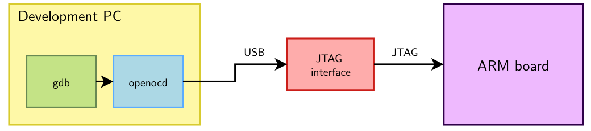
## Early traces
- Nếu có lỗi xảy ra trước khi serial driver, tty layer được đăng ký, ta sẽ chỉ nhìn thấy "Starting kernel..." chứ không thấy gì nữa, vì vậy khó để biết nguyên nhân do gì
- Ở kiến trúc ARM, active early trace bằng `CONFIG_DEBUG_LL` và `CONFIG_EARLY_PRINTK` và thêm `earlyprintk` vào kernel command line (bootargs)
- Ở nền tảng khác, dùng `CONFIG_SERIAL_EARLYCON`
## More kernel debugging tips
- Bật `CONFIG_KALLSYMS_ALL` được bật để nhận được message lỗi với tên ký hiệu thay vì raw address khó đọc
- Bật `CONFIG_DEBUG_INFO` để kernel được biên dịch với tham số -g: `$(CROSSCOMPILE)gcc -g`, giúp giữ lại các dòng code debug, thông tin debug trong file binary output
- Nếu driver không chạy hàm probe() khi load device, bật `CONFIG_DEBUG_DRIVER` để nó bật tất cả debug log trong các file device-driver core của Linux để dễ dàng check vì sao không chạy probe() được
- Với device tree, có thể xem được từng dòng cấu hình xuất phát từ node nào ở dtsi nào, giúp dễ tìm hơn bằng cách chạy `scripts/dtc/dtx_diff -T <dts>`
    + 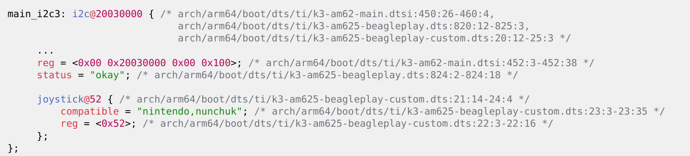
    + cũng có thể dùng để so sánh sự khác nhau giữa các file diff
## Thực hành
- Để thấy được log của dev_dbg(), ... cần cấu hình kernel `CONFIG_DYNAMIC_DEBUG` để thấy log debug, `CONFIG_DEBUG_INFO` in ra được log trong code kernel
- Thêm `loglevel=8` trong bootargs trong UBoot để in message debug ra console, nếu không thì chỉ có thể thấy chúng trong `dmesg`
- Bật log debug cho module mình muốn
    + `echo "file serial.c +p" > /sys/kernel/debug/dynamic_debug/control` bật cho toàn bộ file
    + `echo "file serial.c line 253 +p" > /sys/kernel/debug/dynamic_debug/control` bật cho 1 dòng cụ thể
- Khi driver bị crash, nhìn vào thanh ghi PC để biết crash ở hàm nào
    + Ví dụ `PC is at mmioset+0x50/0xac` vì lỗi xảy ra ở hàm mmioset với vị trí offset là 0x50 trong tổng kích thước 0xac của hàm này
- Debug tìm nguyên nhân crash
    + Nếu crash ở hàm của linux, dùng `gdb-multiarch vmlinux`, nếu crash ở hàm của module, dùng `gdb-multiarch module.o`
    + (gdb) set arch arm
    + (gdb) set gnutarget elf32-littlearm
    + (gdb) disassemble function_name 


# Kernel resources
- Các driver cần đóng góp, tinh chỉnh nằm ở: `drivers/staging`
- Hướng dẫn submit bản vá kernel Linux: `https://www.kernel.org/doc/html/latest/process/submitting-patches.html`