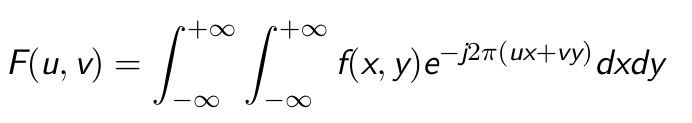
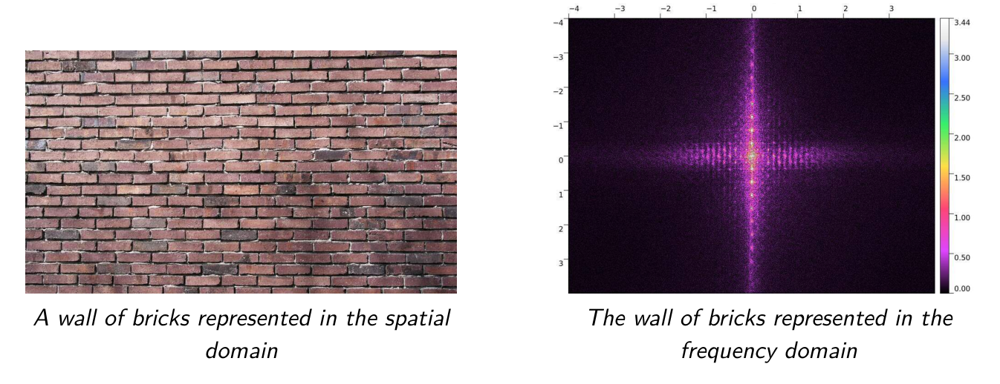
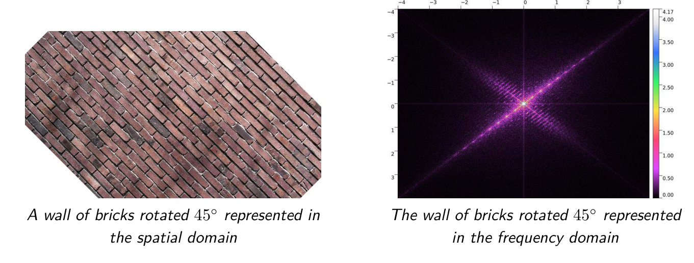
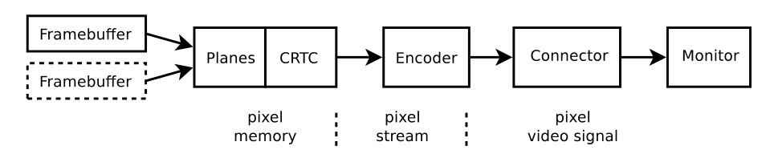
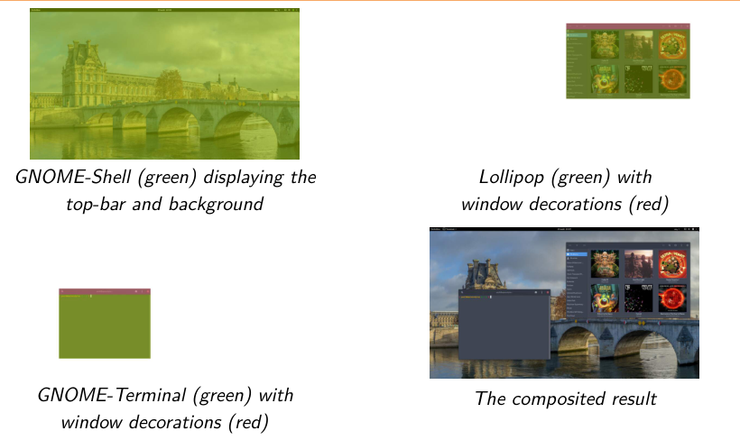
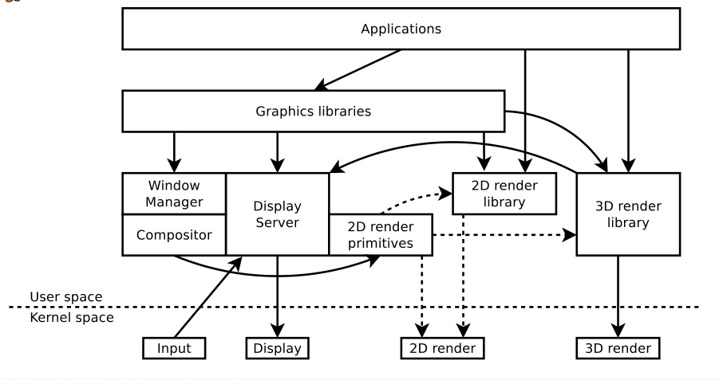

# Menu

# Base Theory and Concepts About Graphics
## Image representation
### Light, pixels and pictures
- picture là biểu diễn của việc phát ra ánh sáng
- Picture được chia 2 loại
    + analog: biểu diễn liên tục trong không gian, với số lượng phần tử vô hạn (quá nhiều)
    + digital: biểu diễn định lượng trong không gian, với số lượng phần tử có hạn, ví dụ màn hình led
- Việc tạo ra 1 biểu diễn digital được gọi là lượng tử hóa - quantization
    + giảm thông tin từ continous world
    + quantization yêu cầu 1 đơn vị phần tử cơ bản hoặc lượng tử (quantum)
    + lượng từ này được gọi là điểm ảnh - pixel
    + quantization cũng được gọi là lấy mấu trong ngữ cảnh này
    + Ví dụ: khi dùng máy ảnh digital giụp ảnh từ thế giới (continous world), ta làm giảm thông tin để chứa toàn bộ thông tin đó vào 1 biểu diễn digital có số lượng phần tử có hạn. Để làm được điều đó, cần khai báo đơn vị phần từ cơ bản quantum
- Picture là các tập hợp điểm ảnh pixel được xếp theo 2 chiều:
    + Frame có kích thước: width và height
    + tỉ lệ: w:h
    + pixel đặt tại các điểm có tọa độ (x,y)
    + đơn vị đo kích thước và vị trí là số lượng điểm ảnh
- Các điểm ảnh được định lượng có mật độ không gian:
    + DPI: dot per inch
    + các điểm ảnh được giả định có hình vuông
    + mật độ theo chiều dọc và chiều ngang thường không được phân biệt rõ ràng
### Sampling and frequency domain - lấy mẫu và miền tần số 
- Pixel là các điểm đại diện cho miền không gian thực
- miền liên tục có phổ tần số đi kèm, trong đó tần số cao là những chi tiết sắc nét, có màu sắc đổi đột ngột
- Phép toán 2D Fourier transform biến đổi từ miền không gian (x,y) thành miền tần số (u,v)
    + 
    + miền tần số này cho biết tỉ lệ chi tiết sắc nét, tỉ lệ mảng màu
- Phép biến đổi Fourier này phân rã miền không gian thành các mẫu sóng lặp đi lặp lại 
- 
- 

# Hardware aspects
## Overview
### Các loại công nghệ triển khai phần cứng đồ họa
- các phần cứng đồ họa chuyên dụng thường được dùng với CPU đa dụng
### Graphics memory and bufers
- pixel data được chứa trong memory buffers được gọi là `framebuffer`
- Framebuffers có thể nằm ở 1 trong 2 nơi:
    + System memory: chia sẻ trong RAM hệ thống
    + Dedicated memory: bộ nhớ dành cho graphic, chỉ xử lý hình ảnh 
- Chỉ những buffer nào được thiết kế để xuất hình ảnh ra cổng màn hình thì được gọi là `scanout framebuffers`. Giới hạn về phần cứng không phải khi nào cũng cho bất kỳ framebuffer được xuất ra màn hình
- Không phải lúc nào CPU cũng có thể truy cập vào pixel data trong bộ nhớ chuyên dụng
- Các phần cứng graphic cần cấu hình để biên dịch pixel data. Và metadata của pixel luôn đi kèm cùng pixel data
### Display hardware overview
- Có thể chuyển pixel data tới 1 display device thông qua display interface (HDMI, VGA, ...)
- Cấu trúc của display hardware thường gồm các component phối hợp với nhau, thường có chức năng cố định là tiếp nhận luồng dữ liệu hình ảnh để xuất ra màn hình
- Các phần cứng này có thể là card màn hình rời hoặc onboard được kết nối tới CPU, RAM thông qua bus tốc độ cao (PCI-e, PCI, ISA, ...)
### Thành phần phổ biến của 1 luồng xử lý hình ảnh 
- 
- framebuffers: chứa pixel data, được truyền đi bằng bộ điều khiển DMA
- planes: liên kết 1 framebuffer với kích thước và vị trí của nó để gộp nó với lớp ảnh trên màn hình 
- CRTC: dùng để truyền luồng pixel với thời điểm thích hợp , nhằm đẩy các pixel tới đúng tần số màn hình và thời gian của màn hình, tránh xé hình
- Encoder: đóng gói thêm metadata cho các dòng pixel đó rồi biến đổi thành tín hiệu điện phù hợp các chuẩn kết nối
- Connector: cổng cắm vật lý 
- Display: màn hình hiển thị
### Render hardware overview
- Gồm rất nhiều khía cạnh khác nhau

# Software aspects
- Kernel quản lý việc xử lý đồ họa độc lập với phần cứng
- Kernel có vai trò:
    + cấp quyền truy cập phần cứng cho userspace app
    + quản lý vận hành cấp thấp: clock, power, truy cập thanh ghi
    + phối hợp quản lý bộ nhớ
    + cung cấp các API
- Kernel luôn phải quản lý:
    + display: 
    + render: điều khối GPU vẽ hình ảnh
    + input: nhận dữ liệu vào để đưa lên màn hình
- Thực tế, nhiều ứng dụng khác nhau cần hiển thị buffer hình ảnh của chúng cùng 1 lúc trên màn hình nhưng kernel chỉ cho phép 1 thực thể được hiển thị trên phần cứng. Để giải quyết được điều này, cần có `display server`
- Display server:
    + Display server điều phối việc hiển thị của các app
    + nó là core và có đặc quyền cao cấp
    + các ứng dụng giao tiếp với server để hiển thị pixel buffer
    + nó phân phối các sự kiện đầu vào đến đúng ứng dụng người dùng tương tác
    + chỉ duy nhất display server mới làm việc với API của kernel và input
- Compositor: merge tất cả pixel buffer từ các app để tạo thành buffer cuối cùng trước khi xuất ra màn hình
- window manager: định nghĩa quy tắc sắp xếp ứng dụng trên màn hình (order, focus, ...)
- cần cách ly giữ liệu đầu vào của các ứng dụng với nhau để tránh các ứng dụng thấy được dữ liệu của nhau
- 
## render ở userspace
- Quá trình render các phần trên màn hình có thể làm chậm hệ thống
- Vì vậy hệ thống cung cấp các khối 2D cơ bản để tăng tốc phần cứng (như khối chữ nhật, đường thẳng, ...) được nằm trong display server hoặc trong các library
- việc render 3D được đi kèm với các library chuyên biệt
- 
## Linux kernel
- Input subsystem:
    + hỗ trợ các thiết bị ngoại vi như chuột, bàn phím, touchscreen, ...
    + cung cấp event `evdev` để đơn giản hóa lập trình tầng userspace
- Framebuffer device subsystem (fbdev)
    + đã lỗi thời
- Direct Rendering manager subsystem (DRM)
    + cho phép đồng bộ hóa nhiều thay đổi đồ họa cùng 1 lúc
    + cung cấp cơ chế quản lý đồ họa chuyên sâu
    + hiện đại
## Các thư viện lập trình cấp thấp tương thích với Linux
- Thư viện cho input:
    + libevdev
    + libinput
- Thư viện cho display/render cấp thấp
    + libdrm
- Thư viện cho 2D render
    + Pixman
    + Cairo
    + Skia
    + Clutter
- Thư viện 3D render
    + Mesa 3D
## X window - X11 overview
- 