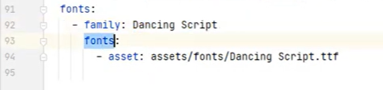
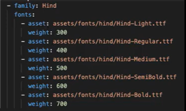
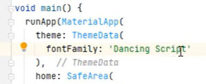

# Dart
## Biến  và kiểu dữ liệu
- Object: là kiểu như void trong C/C++
- String: chỉ rõ kiểu 
    ```Dart
    `String hello = "Hello Dung";`
    `print(hello)`
    ```
- var: không quan tâm kiểu dữ liệu
- dynamic: gán giá trị gì thì nó trở thành kiểu đó
- kiểu số (chỉ có 2 loại):
    + int (64bit)
    + double (64bit)
        - hàm làm tròn tới x chữ số sau thập phân:
            + toStringAsFixed(x) 
            + toStringAsPrecision(x)
    + num: đại diện được cho int hoặc double
    + `print('Calc $a + $b = ${a + b}');`
    + phép chia `/`: ra luôn số thập phân chứ không phải mỗi phần nguyên
    + `~/`: chia chỉ lấy nguyên
    + `%`: lấy phần dư
- bool: `bool a = true;`
- Kiểu có thể null:
    + `int? x;` mặc định được gắn null
    + `x?.isCall`
- Enum: 
    ```Dart
    enum Person {tin, hoa, dung}
    ```
- Iterable: tạo danh sách 10 phần từ 
    ```Dart
    var numbers = Iterable.generate(10);
    ```
## Các toán tử cơ bản
- `??`: check null trước khi dùng
    + `name = check ?? 'Default'`
    + nếu check null thì name là Default
    + nếu check khác null thì name = check
- `..`: `numbers..add(1)..add(2)`
    + thực hiện liên tục các function của numbers
## Nhập liệu và chuyển đổi dữ liệu
- import 'dart:io': thư viện các hàm cơ bản
    + `stdin.readLineSync()`: hàm đọc giá trị từ bàn phím
        - stdin.readLineSync(): mặc định trả về String có thể null, nên có thể để dấu `!` ở cuối. 
        - Nếu giá trị gán cho hàm này là int thì cần hàm chuyển đổi:
            - `int age = int.parse(stdin.readLineSync()!);`
- import 'dart:convert';
    + `stdin.readLineSync(encoding: utf8)!;` thêm encoding để không bị lỗi ký tự ví dụ như tiếng việt khi nhập
## Cấu trúc if-else
- tương tự C++
## Kiểu dữ liệu List - []
- giá trị trong List có thể trùng lặp
- `var numbers = [1, 2, 3, 4, 5, 6];`
- `List<String> people = ['Dung', 'manh'];`
- `var name = <String>[]` các phần từ là String
- `var name = []`: kiểu object chứa được nhiều kiểu trong mảng
- thêm phần tử: `add(x)`
- truy cập 1 phần tử: `people[x]`
## For, For-in
- `for(var i = 0; i < 10>; i++)`: nếu modify giá trị của index thì ra khỏi for sẽ đổi luôn
- `for(var peo in people)`: peo ra khỏi for sẽ không đổi giá trị nếu có modify vì peo là biến tạm ra khỏi scope sẽ mất
## Hằng số final và const
- final: giá trị có thể không xác định trong 1 khoảng thời gian và được gán khi runtime
    + `final res = call api...;` res là hằng số nhưng nó chưa xác định cho tới khi call API xong;
- const: giá trị được xác định khi biên dịch
- `var peo = const []` tương đương `const peo = []`
## Switch case
- kiểu 1:
    ```Dart
    switch(variable){
        case X: do sth;
        case Y: do sth;
        default: do sth;
    }
    ```
- kiểu 2:
    ```Dart
    var variable = abc;
    Object ret = switch(variable){
        'x' => do sth,
        'y' => do sth,
        _ => do sth,
    }
    ```
## while, do-while
    ```Dart
    //while
    while(condition){
        do sth;
    }
    //do-while
    do {
        do sth;
    } while (condition)
    ```
## continue và break
- continue: next đến lần lặp tiếp theo
- break: thoát vòng lặp
## Function
- tương tự C/C++
- kiểu rút gọn: dùng khi hàm ngắn
    ```Dart
    // có thể không cần kiểu trả về
    func(int a) => print(a);
    ```
- hàm có tham số required: bắt buộc phải cấp n
    ```Dart
    bool isDung({required int n, required int m}){}
    isDung(n: 100, m: 200); // n,m không cần đúng thứ tự
    ```
- hàm có tham số có thể null (tham số tùy chọn)
    ```Dart
    bool isDung({int? a}){} // {int? a} hoặc [int? a]
    isDung(100); 
    isDung(); // a sẽ là null
    ```
    Hoặc
    ```Dart
    bool isDung([int a = 0, int? b])
    ```
- Hàm trả về nhiều giá trị - hàm record
    ```Dart
    (String, String) day(int day) {
        return switch(day){
            1 => ('Monday`, `thu 2`),
            ...
        }
    }
    ```
    ```Dart
    (String day, String foo) day(int day) {
        return switch(day){
            1 => (day: 'Monday', foo: 'thu 2'),
            ...
        }
    }
    ```
- Hàm vô danh: hàm dùng 1 lần
    + có thể gán hàm vô danh vào 1 biến để tái sử dụng
    ```Dart
    var peo = ['dung', 'manh'];
    peo.map((e) => e.toUpperCase()).forEach(...);
    ```
- Hàm đệ quy: tương tự c/c++
## Kiểu dữ liệu record
- là kiểu vô danh, có thể nhét nhiều kiểu dữ liệu khác vào đó
    ```Dart
    var record = ('first', 200, 2.3, 'last');
    // truy cập phần tử bằng cách
    record.$1 // first
    record.$2 // 200
    // ...
    ```
- cách khai báo khác
    ```Dart
    (String, int) record;
    record = ('One', 1);
    ```
- nếu phần tử trong recore được đặt tên, thì phần tử đó không được tính trong $x nữa
    ```Dart
    var record = ('first', age: 200, 2.3, 'last');
    // truy cập phần tử bằng cách
    record.$1 // first
    record.$2 // 2.3
    recort.age // 200
    // ...
    ```
## Kiểu dữ liệu Set {}
- cho phép lưu nhiều phần tử, thường dùng lưu danh sách đơn phần tử, có nghĩa là phần tử không trùng nhau
- Set dùng ngoặc `{}`
    ```Dart
    var friend = {'Long', 'dung'}; // cách 1
    var sets = <double>{}; // cách 2
    ```
- Nếu phần tử bị lặp thì Set chỉ tính 1 lần, không phải là có 2 phần tử đó
- Nếu thêm nhiều phần tử trùng lặp thì Set chỉ tính 1 lần
## Kiểu dữ liệu Map
- biểu diễn những cái đi theo cặp
- key: bất kỳ kiểu dữ liệu nào
    ```Dart
    var map = {
        "one": "1",
        "two": "2",
    };
    map['one'];
    for(var item in dic.entries){ // entries là phần tử gồm cả key và value

    }

    var gif = Map<String, String>();
    ```
## Hàm template
- đảm bảo dữ liệu đồng nhất, an toàn
- giảm code lặp lại
    ```Dart
    void show<T>(List<T> items)
    ```
## Class 
```Dart
class Dog {
    String? color;
    String? food;

    void sua(){
        //do sth
    }
}

void main(){
    var bu = Dog();
    bu.color = 'red';
}
```
### Constructor
```Dart
class Dog{
    int x = 0;
    int y = 0;
    // Kiểu 1
    Dog(this.x, this.y); // var dog = Dog(2,3) sẽ gán x = 2, y = 3 luôn
    // Kiểu 2
    Dog({required this.x, required this.y}); // var dog = Dog(x: 1, y: 2)
    // Kiểu 3: đặt lại tên constructor
    Dog.original(): x = 0, y = 0; // var dog = Dog.original();
    Dog.fromJson(Map<String, int> map)
        : x = map['x']!,
          y = map['y']!; // var dog = Dog.fromJson({'x': 100, 'y': 200})
}
```
- Constructor `factory`
    ```Dart
    factory Song.fromJson(Map<String, dynamic> map) {}
    ```
    + constructor factory có thể chứa logic để parse data trước khi tạo object
    + nó không bắt buộc tạo ra object mới
    + dùng phổ biến với json
### Các phương thức của class
- instance method: là phương thức chỉ được gọi từ object của class (là các hàm thông thường trong class)
    ```Dart
    class Point {
        int x; 
        int y;

        // getter
        int get X => x;
        int get Y => y;
        
        // setter
        set X(int value) => x = value;
        set Y(int value) => y = value;

        // constructor
        Point(this.x, this.y);
        Point.original() : this.x = 0, this.y = 1;

        double distanceTO(Point other){
            var dx = x - other.x;
            var dy = y - other.y;
            return sqrt(dx * dx + dy * dy)
        }
    }
    var p = Point();
    p.X;
    p.X = 10;
    p.distanceTO(other);
    ```
- abstract method: phương thức trừu tượng, được khai báo trong class trừu tượng, thân hàm được khai báo trong class kế thừa nó
    ```Dart
    abstract class Calc {
        int add(int a, int b);
        int sub(int a, int b);
    }

    class Foo extends Calc {
        @override
        int add(int a, int b){

        }

        @override
        int sub(int a, int b){

        }
    }

    var foo = Foo();
    foo.add(x,y);
    ```
### Nạp chồng toán tử
    ```Dart
    class Vector {
        int x;
        int y;

        Vector(this.x, this.y);

        Vector operator +(Vector other) => Vector(x + other.x, y + other.y);
        Vector operator -(Vector other) => Vector(x - other.x, y - other.y);
    }
    Vector v1;
    Vector v2;
    Vector sum = v1 + v2; //Nhờ operator + thì mới cộng được vector như này
    ```
### Kế thừa - extends
- Constructor của con sẽ cần thêm đủ các thuộc tính như cons của cha (thuộc tính cha thì đi với `super`)
- *Class trong Dart chỉ có thể kế thừa 1 class duy nhất*
    ```Dart
    class Rec2D {
        int x;
        int y;

        Rec2D({required this.x, required this.y});

        int area(){
            return x * y;
        }
    }
    class Rec3D extends Rec2D {
        int z;

        Rec3D ({
            required super.x, // của cha
            required super.y, // của cha
            required this.z // của con
        });

        @override
        int area(){
            // return super.area()
            // return do sth
        }
    }
    ```
### Abstract class - class trừu tượng
- `abstract class Foo`
- class abstract định nghĩa các function chung, không thể tạo đối tượng riêng vì hàm chưa có thân hàm
- lớp con chỉ cần triển khai 1 số function abstract mà nó muốn
- các function abstract là kiểu kết thúc bằng dấu `;` mà không có thân hàm
    ```Dart
    abstract class Foo {
        Foo({required this.x, required this.y});
        int add(int x, int y); // abstract function không có thân hàm
    }
    class Bo extends Foo {
        int z;
        Bo({required super.x, required super.y, required this.z});
        @override
        int add(int x, int y){
            // do sth
        }
    }
    var bo = Bo(x: 1,y: 2,z: 3);
    ``` 
### Interface và abstract interface
- từ khóa `interface`, `implements`

- `interface class IFoo`
- lớp con phải triển khai lại toàn bộ biến, function abstract của lớp cha
- có thể tạo object riêng của class interface vì function của nó có thân hàm rồi
    ```Dart
    interface class IFoo {
        int x;
        int y;

        int add() => 0; //function trong class interface cần thân hàm
        int sub() => 0;
    }
    class Bo implements IFoo {
        int z;

        @override
        int x;

        @override
        int y;

        @override
        int add() => do sth;

        @override
        int sub() => do sth;
    }
    ```
- `abstract interface class Foo`
    + không tạo được đối tượng riêng
    + nếu function trong class interface không muốn định nghĩa thân hàm thì thêm `abstract` ở trước
    + các function, biến khác trong class implement class interface này vẫn cần override lại tất cả
    ```Dart
    abstract interface class IFoo {
        int x;
        int y;

        int add(); //function trong class abstract interface không cần thân hàm
        int sub();
    }
    ```
### public, private
- public: không có dấu _ trước tên
- private: có dấu _
    ```Dart
    class Foo {
        int x; // public
        int _y; // private
        void dosth() {}; // public
        void _doOhter(){}; // private
    }
    ```

## Phương thức mở rộng
- bổ sung chức năng cho các hàm từ thư viện khác, class khác
- Dùng khi thư viện đó không có chức năng mà mình muốn
    ```Dart
    // VD1
    extension MyList<T> on List<T> {
        // bổ sung chức năng cho List
        List<T> operator -() => doSth // dấu - là ví dụ thôi, là dấu hay gì cũng đc
    }
    var firned = ['a','b'];
    var foo = -firned;

    // VD2
    extension MyString on String {
        int countXXX() {
            return ...;
        }
    }
    var mess = 'Hello';
    mess.countXXX(); // gọi được hàm mà đã được mở rộng từ String
    ```

## Kiểu mixin
- dùng để cung cấp thuộc tính, function cho các class muốn dùng mà không cần kế thừa
- có thể dùng được nhiều mixin cùng lúc
- mixin không thể tạo đối tượng của nó, không hỗ trợ `extends`, không có `constructor`
    ```Dart
    mixin Pri {
        void doSth(int x){
            // doSth
        }
    }

    mixin Bro {
        int abc;
    }

    class A with Pri, Bro {
        //cách 1
        void funcname(){
            doSth(x); // gọi thẳng function của mixin
            abc = 1;
        }
        // cách 2
        @override
        void doSth(int x){ // override lại theo ý muốn

        }
    }

    var a = A();
    a.abc;
    a.doSth(x);
    ```
- abstract mixin class
    ```Dart
    abstract mixin class my {
        num add(num a); // phương thức trừu tượng
        num sub(){
            // do sth
        }
    }
    class X with my {
        @override
        num add(num a){ // bắt buộc override add
            return;
        }

        // sub override nếu có nhu cầu
    }
    ```
- `mixin Music on Person`: chỉ có những class nào kế thừa Person mới dùng mixin Music được
## Exception
- chương trình sẽ dừng khi gặp throw
    - `throw Exception('mess')`
    - `throw Error()`
    - `throw 'someth'`
    ```Dart
    // bắt dựa theo loại ngoại lệ
    try {
        // do sth
    } on Exception { // Exception hoặc Error hoặc FormatException hoặc ...
        // do sth
    } on Error { // có thể bắt nhiều ngoại lê

    } catch (e) {

    }
    
    // catch mọi ngoại lệ
    try {
        // do sth
    } catch(e, stackTrace){

    }
    ```
- Nếu 1 hàm con cần trả ngoại lệ cho hàm cha gọi nó, dùng `rethrow;`
    ```Dart
    void add(int x){
        rethrow;
    }
    ```
- `finally`: luôn chạy kể cả không xảy ra ngoại lệ nhưng chủ yếu dùng để giải phóng tài nguyên khi bị ngoại lệ
    ```Dart
    try {
        // do sth
    } catch(e, stackTrace){

    } finally {
        // dọn dẹp tài nguyên ở đây
    }
    ```
## Bất đồng bộ với future
- `await` chỉ tồn tại nếu hàm có đánh dấu `async`
    ```Dart
    // Cách 1
    Future<String> _read() async {
        var content = await file.doSth()
        return content;
    }

    void main() async {
        var foo = await _read();
        print(foo); // chờ await _read chạy xong thì dòng này mới chạy
    }

    // cách 2
    Future<String> _read() async {
        var content = await file.doSth()
        return content;
    }

    void main() { // dùng then thì k cần async nữa
        _read().then((value) => do sth);
        print(foo); // chờ await _read chạy xong thì dòng này mới chạy
    }

    ```
- khi nào hàm `await` chạy xong thì nó mới chạy tiếp các lệnh bên dưới. 
- nếu `main()` không có `await` thì main sẽ thực hiện tiếp công việc, còn hàm Future tự thực hiện bất đồng bộ đến khi xong

# Flutter
## lệnh với project Flutter: 
- Tạo project
    + `flutter create name`
    + `flutter create --org com.tencongty my_app`: chỉ định thêm package name
    + `flutter create -a java -i objc my_app`: chỉ định ngôn ngữ lập trình
    + `flutter create --platforms android,ios my_app`: chỉ định nền tảng
    + `dart create --template=console utils_example`: tạo project console đơn giản
    + `DISPLAY=:0 flutter run --no-enable-impeller`
- Thêm dependency
    + `flutter pub add http` // thay http bằng dependencied mình muốn
## Các thư mục trong folder flutter
- lib: nơi viết code chính
- test: nơi viết testcase
- pubspec.yaml: cấu hình dependencies, font, ảnh, ...
- analysis_options.yaml: cấu hình coding convention, rule code của project
## Lớp StatefulWidget vs StatelessWidget
- StatelessWidget: không thay đổi trạng thái suốt vòng đời
    + gõ nhanh `stless`
- StatefulWidget
## Các thuộc tính thường dùng
- Text
- TextStyle: dùng trong thuộc tính style của Text 
    + custom font: 
        - tải file font ttf 
        - đưa font vào folder project (tạo folder assets/fonts)
        - thêm font vào pubspec.yaml: mục config fonts
        - muốn dùng thì set thuộc tính fontFamily
        - 
        - 
            + tên font vẫn là Hind, nhưng khi set weight, nó sẽ tự chọn font tương ứng
    + để set toàn bộ màn hình dùng chung 1 font hoặc 1 theme
        - 
- RichText: custom nhiều kiểu chữ trong 1 hàng
    + dùng kết hợp TextSpan
- Padding và Margin
    + Padding: khoảng cách với nội dung chính nó
    + Margin: khoảng cách với các item xung quanh
    + `EdgeInsets.all(x)`: cách đều 4 cạnh x px, ngoài all còn nhiều cái khác
- TextButton: button với chữ
    + muốn button bị disable, set onPressed là null
- ElevatedButton: dùng nhiều nhất
    + nhiều kiểu custom hơn TextButton
    + muốn có icon: `ElevatedButton.icon`
- OutlinedButton: ít dùng hơn ElevatedButton
- Container:
    + là 1 khung chứa
- StreamBuilder: widget lắng nghe Stream và tự rebuild UI khi có data mới, không cần setState
    + `stream`: Stream cần lắng nghe
    + `builder`: hàm rebuild UI, nhận `AsyncSnapshot` chứa trạng thái stream
    + `snapshot.hasData`: đã có data; `snapshot.hasError`: bị lỗi; `snapshot.connectionState`: trạng thái kết nối
    + `snapshot.data`: giá trị mới nhất từ stream
    ```dart
    StreamBuilder<Todo>(
      stream: _todoStream,
      builder: (context, AsyncSnapshot<Todo> snapshot) {
        if (snapshot.connectionState == ConnectionState.waiting) return CircularProgressIndicator();
        if (snapshot.hasError) return Text('Lỗi: ${snapshot.error}');
        if (snapshot.hasData) return Text(snapshot.data!.title);
        return Text('Chưa có data');
      },
    )
    ```
- Bài 45

# FFI
## Cách gọi 1 function trong C/C++
- Nguyên lý: Mở lib C -> tìm function -> gọi function 
```Dart
dylib.lookupFunction<Void Function(), void Function()>('hello');
//                   ^^^^^^^^^^^^^^  ^^^^^^^^^^^^^^^
//                   [1] Kiểu C      [2] Kiểu Dart
```

# gRPC
- `https://grpc.io/docs/`
- **gRPC là gì?** Giao thức giao tiếp giữa các service (client ↔ server) qua mạng, nhanh hơn REST vì dùng binary (Protobuf) thay vì JSON, và có thể gọi hàm từ xa như gọi hàm local
- **Protobuf là gì?** Định dạng serialize dữ liệu của Google — nhỏ gọn, nhanh, và có schema chặt chẽ
- Dependencies cần thiết: `grpc` (framework gRPC), `protobuf` (serialize/deserialize message)
- Cấu trúc project gồm 3 phần tách biệt:
    ```
    gRPC_learning/
    ├── protos/   ← "hợp đồng" chung: định nghĩa kiểu dữ liệu và interface — cả server lẫn client dùng chung
    ├── server/   ← Dart server: implement logic xử lý request
    └── client/   ← Flutter app: gọi server như gọi hàm Dart thông thường
    ```
- Các bước thực hiện:
    - **Bước 1: Tạo package `protos`** — "hợp đồng" dùng chung, tạo 1 lần dùng cho cả server lẫn client
        + `dart create --template=package protos`: tạo dart package (không phải app, không có `bin/`)
        + Thêm dependencies vào `pubspec.yaml`:
            ```yaml
            dependencies:
              grpc: ^5.1.0      # framework gRPC cho Dart
              protobuf: ^6.1.0  # thư viện serialize Protobuf
            ```
        + Tạo file `.proto` — ngôn ngữ trung lập để mô tả dữ liệu và service, sau đó gen ra code cho bất kỳ ngôn ngữ nào:
            ```proto
            syntax = "proto3";

            // Message = kiểu dữ liệu sẽ truyền qua mạng (giống class/struct)
            message Todo { int32 id = 1; string title = 2; bool completed = 3; }

            // Service = định nghĩa các "hàm" mà server cung cấp
            service TodoService {
              rpc getTodo(GetTodoByIdRequest) returns (Todo); // nhận request, trả về Todo
            }

            message GetTodoByIdRequest { int32 id = 1; } // tham số của hàm getTodo
            ```
        + Gen code Dart từ file `.proto` — lệnh này tự động tạo ra các class Dart tương ứng:
            ```bash
            dart pub global activate protoc_plugin  # cài plugin để protoc hiểu Dart
            protoc --dart_out=grpc:lib/src/generated -Iprotos protos/*
            # --dart_out=grpc: gen cả message lẫn gRPC service stub
            # -Iprotos: thư mục chứa file .proto
            # lib/src/generated: thư mục đầu ra
            ```
            Kết quả sinh ra 4 file:
            - `todo.pb.dart` — các class message (Todo, GetTodoByIdRequest)
            - `todo.pbenum.dart` — các enum trong proto
            - `todo.pbjson.dart` — hỗ trợ convert sang JSON
            - `todo.pbgrpc.dart` — `TodoServiceBase` (server implement) và `TodoServiceClient` (client dùng)
        + Export tất cả vào `lib/protos.dart` để server/client chỉ cần `import 'package:protos/protos.dart'`:
            ```dart
            export 'src/generated/todo.pb.dart';
            export 'src/generated/todo.pbenum.dart';
            export 'src/generated/todo.pbjson.dart';
            export 'src/generated/todo.pbgrpc.dart';
            export 'package:grpc/grpc.dart'; // re-export luôn để client/server không cần import grpc riêng
            ```
    - **Bước 2: Tạo server** — implement logic xử lý request từ client
        + `dart create --template=console server`: tạo Dart console project (có `bin/` để chạy)
        + Thêm dependency `protos` vào `pubspec.yaml` bằng path local (không publish lên pub.dev):
            ```yaml
            dependencies:
              protos:
                path: ../protos  # trỏ trực tiếp tới folder protos
            ```
        + Tạo `lib/todo_service.dart` — extend `TodoServiceBase` (được gen ra từ proto) và override từng method:
            ```dart
            class TodoService extends TodoServiceBase {
              @override  // override hàm getTodo đã khai báo trong .proto
              Future<Todo> getTodo(ServiceCall call, GetTodoByIdRequest request) async {
                // call: metadata của kết nối (header, timeout...)
                // request: tham số từ client (đã được deserialize tự động)
                return Todo(id: request.id, title: 'title', completed: false);
                // trả về Todo, gRPC tự serialize và gửi về client
              }
            }
            ```
        + Tạo `bin/server.dart` — đăng ký service và lắng nghe port:
            ```dart
            final server = Server.create(services: [TodoService()]); // đăng ký service
            await server.serve(port: 8080); // lắng nghe cổng 8080
            ```
        + Chạy server: `dart bin/server.dart`
    - **Bước 3: Tạo Flutter client** — gọi server qua gRPC
        + `flutter create client`: tạo Flutter app
        + Thêm dependency `protos` vào `pubspec.yaml` (giống server)
        + Trong `initState()` — thiết lập kết nối tới server (làm 1 lần khi widget khởi tạo):
            ```dart
            _channel = ClientChannel(
              'localhost',      // địa chỉ server
              port: 8080,
              options: ChannelOptions(
                credentials: ChannelCredentials.insecure(), // không dùng TLS (dev mode)
              ),
            );
            _stub = TodoServiceClient(_channel); // stub = đối tượng đại diện cho server, dùng để gọi RPC
            ```
        + Gọi RPC — gọi y hệt như gọi hàm Dart, gRPC lo phần serialize/network/deserialize:
            ```dart
            final todo = await _stub.getTodo(GetTodoByIdRequest(id: 1));
            // _stub.getTodo() thực ra gửi request qua mạng, chờ response, rồi trả về Todo
            ```
- **Server Streaming** — server gửi data liên tục xuống client (realtime)
    - Thêm `stream` vào trước kiểu trả về trong file `.proto`:
        ```proto
        service TodoService {
          rpc getTodo(GetTodoByIdRequest) returns (Todo);           // Unary: 1 request → 1 response
          rpc getTodoStream(GetTodoByIdRequest) returns (stream Todo); // Streaming: 1 request → nhiều response
        }
        ```
    - **Server** dùng `async*` + `yield` để gửi từng message, `await Future.delayed` để giãn cách:
        ```dart
        @override
        Stream<Todo> getTodoStream(ServiceCall call, GetTodoByIdRequest request) async* {
          while (true) {
            final id = Random().nextInt(100);
            yield Todo(id: id, title: 'title $id', completed: false);
            await Future.delayed(Duration(seconds: 1)); // ⚠️ phải có await, thiếu await → spam stream → lỗi
          }
        }
        ```
    - **Client** nhận stream bằng `StreamBuilder` — tự động rebuild UI mỗi khi có data mới:
        ```dart
        // initState: khởi tạo stream 1 lần
        _todoStream = _stub.getTodoStream(GetTodoByIdRequest(id: 1));

        // build: dùng StreamBuilder để lắng nghe
        StreamBuilder(
          stream: _todoStream,
          builder: (context, AsyncSnapshot snapshot) {
            if (snapshot.hasData) {
              final todo = snapshot.data as Todo;
              return Text(todo.title); // tự rebuild mỗi giây
            }
            return Text('Loading');
          },
        )
        ```
    - **Lưu ý quan trọng**: `StreamBuilder` khác `setState` ở chỗ không cần gọi thủ công — nó tự lắng nghe stream và rebuild UI khi có event mới

# BLoC, Cubit, GetIt.
- GetIt: tương đương singleton
- BLoC, Cubit: tương đương state machine, tách xử lý của UI khỏi backend, giúp việc code,test backend có thể độc lập
- flutter/BLoC_Cubit_Dio_GetIt/counter_demo/README.md