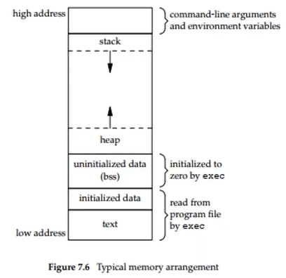

# Process trong userspace
- Process là 1 thực thể được khởi tạo từ 1 file chương trình trên ổ cứng, process sẽ quản lý các thread của nó.
- 1 process có thể có nhiều thread
- Process sẽ sử dụng các tài nguyên của hệ thống như RAM, ngoại vi, ...
## Start chương trình
- 1 chương trình userspace trong linux thì hàm main là điểm đầu tiên đi vào chương trình
- `int main(int argc, char *argv[])` hoặc `void main()`
    + argc: số tham số truyền vào
    + argv[]: mảng chứa các chuỗi ký tự truyền vào (argv[0]), argv[1], ...)
- trước khi vào hàm main, kernel sẽ chạy 1 số code ẩn để khởi tạo tài nguyên cho process
## Kết thúc chương trình
- Chủ động: trong code, gọi các hàm để kết thúc như return, kill(), exit(), ...
- Bị động: bị crash, ctrl + c, kill -9 PID
- Chương trình con khi kết thúc sẽ gửi giá trị trả về cho chương trình cha, dựa vào giá trị này có thể debug được chương trình con kết thúc có bình thường hay không
## Các tham số môi trường ảnh hưởng tới process
- Khi 1 process chạy trong Linux, nó sẽ bị ảnh hưởng bởi các process khác
- Cần quan tâm môi trường mà process chạy vì trong hệ điều hành Linux, 1 process có thể cho ra nhiều kết quả khác nhau phụ thuôc vào môi trường chạy nó
### tham số argc và argv[]
- Việc truyền tham số argc, argv[] sẽ ảnh hưởng tới quá trình chạy của process. CHương trình khi chạy với tham số đầu vào này sẽ làm chương trình rất linh hoạt
```c
#include <stdio.h>

int main(int argc, char *argv[]){
    int i = 0;
    for (i = 0; i < argc; i++){
        printf("%s\n", argv[i]);
    }
    return 0;
}
```
### tham số environment list
- mỗi khi chương trình start, hệ điều hành sẽ cấp cho chương trình 1 danh sách biến môi trường
- `printenv`: in ra các biến môi trường
- để truy câp được biến môi trường từ chương trình
    + khai báo `extern char **environ`: mảng 2 chiều, mỗi phần từ trỏ vào 1 biến môi trường
    + dùng `char *getenv(const char *name)` để truy xuất biến môi trường
## Cấu trúc bộ nhớ của 1 process
- 
- Vùng text: lưu các hằng số, instructions, thường có thuộc tính read-only
- Vùng initialized data: chứa các biến đã được khởi tạo như biến global, biến static
- Vùng uninitialized data: chứa các biến chưa được khởi tạo giá trị, mặc định hệ điều hình gắn là 0 hoặc NULL
- Vùng heap: dùng cho việc cấp phát bộ nhớ động
- Vùng stack: chưa các biến cục bộ, địa chỉ trả về của hàm
- Vùng Command-line argument và environment variable: chứa csac tham số argc, argv[]
- Khi tổ chức trên RAM, các vùng nhớ này rời rạc, không liền mạch. Các process cần địa chỉ virtual memory liền mạch là được
- Khi bị leak memory do kiểm soát cấp phát động yếu kém, nếu process gây leak đó kết thúc thì toàn bộ vùng leak của process đó sẽ được giải phóng
## Shared library và static library
- Shared library: là 1 file, được build ra như chương trình c bình thường nhưng nó không có hàm main, không thể tự chạy được
    + Khi code gọi 1 function, library sẽ load hàm đó vào RAM, và trả về địa chỉ hàm cho chương trình
    + Ưu: 
        - tốn ít bộ nhớ
        - function cần dùng chỉ cần load 1 lần vào RAM, sau đó chương trình nào dùng thì chỉ cần lấy địa chỉ trong RAM
        - function được giải phóng khỏi RAM khi không còn chương trình nào dùng nữa
    + Nhược: mất thời gian load hàm
- Static library: 
    + Khi code gọi 1 function trong library thì khi biên dịch, function đó được chèn luôn vào nơi gọi nó
    + Ưu: nhanh khi gọi hàm
    + Nhược: tốn tài nguyên
## Cách tạo ra process
- PID: mỗi process có 1 số PID, hệ điều hành dùng số này để quản lý các process
- Init process có PID là 0
- Process trong hệ điều hành khi bị crash thì không ảnh hưởng process khác
- Tạo process: 
    + fork(): tạo bản sao của chương trình gọi nó
        ```c
        #include <stdio.h>

        int main(int argc, char *argv[]){
            int pid;
            pid = fork();

            if(pid == 0) {
                printf("CHild"); // Tiến trình con sẽ được tạo ra với giá trị trả về của fork là 0, đây là return của hàm, không phải pid trong hệ thống
            } else {
                printf("Parent");
            }

            return 0;
        }
        ```
        - fork() tạo ra chương trình thứ 2 chạy đoạn code từ sau điểm gọi fork()
    + exec(), execl():
        - tạo ra 1 process mới hoàn toàn theo ý mình muốn, không phải bản copy
        - cần truyền vào chương trình mới (có thể là file binary của 1 file c, và các tham số, ...)
        - Khi đã gọi exec, các code dưới hàm exec của cùng PID không được gọi nữa
        - Nên fork ra 1 process mới trước rồi dùng exec để thay chương trình chạy trong process mới. Ta sẽ có 2 process riêng biệt
        ```c
        #include <stdio.h>

        int main(int argc, char *argv[]){
            int pid;
            pid = fork();

            if(pid == 0) {
                printf("CHild"); // Tiến trình con sẽ được tạo ra với giá trị trả về của fork là 0, đây là return của hàm, không phải pid trong hệ thống
                execl("./child", "child" ,...);
                do_something(); // không chạy được nữa do exec đã thay thế bằng chương trình child
            } else {
                printf("Parent");
            }

            return 0;
        }
        ```
## Cách kết thúc process
+ giá trị trong return hoặc exit sẽ được trả về cho process cha
+ nếu process cha kết thúc trước process con, thì process con sẽ được đổi cha sang init process
+ Khi process con kết thúc, nó gửi SIGCHLD về cho process cha. Process cha nhận SIGCHLD này để xác nhận con kết thúc. Nếu không thì process con sẽ trở thành zombie process, tài nguyên của nó không được giải phóng
    - Dùng wait(..) trong process cha để chờ process con được gửi tín hiệu kết thúc và để hệ điều hành giải phóng tài nguyên của process con
- `ps -aux`: check trạng thái của process, cột STAT (S, R+, Z, Ss, Sl, ...)
- Khi process ở trạng thái Zombie, không thể kill được nó. Vì vậy trong process cha cần gọi 
    + wait(&status): nếu chỉ có 1 process, vì wait chỉ nhận được 1 status của 1 process thôi
    + waitpid(...): nhận status kết thúc theo từng PID của từng process
## User id và group id
- Chương trình được start thì user nào thì có quyền hạn của user đó (ví dụ: admin, user, group, ...)
- Ví dụ: chương trình muốn sửa file hệ thống thì cần start từ root
- Hệ điều hành có thể check được quyền của chương trình thông qua user id và group id
- Có thể thay đổi user id và group id
    + setgid(...)
    + setuid(...)

# Signal
## tổng quan signal
- signal là software interrupt
- hệ điều hành sẽ cung cấp 1 bảng chứa các signal gọi là signal table, sau khi đăng ký signal xong, nếu process nhận được signal, hệ điều hành sẽ gọi ra hàm để xử lý signal
- khi nhận signal, process sẽ dừng việc đang làm lại để ưu tiên xử lý signal
## các trường hợp xảy ra signal
- User dùng lệnh kill
- Process gửi signal
- Chương trình gặp lỗi: crash, truy cập null
- User nhấn ctrl + c hoặc tổ hợp phím khác -> gửi interupt signal tới process đang chạy
## Phân loại signal
- Signal có thể ignore
- Signal không thể ignore
- Signal có thể chủ động điều khiển được
- Signal không thể chủ động điều khiển được
## Signal table
- Mỗi process có 1 signal table
- Mỗi ô trong bảng sẽ lưu trữ địa chỉ trỏ tới hàm signal handler
- Khi signal được gửi tới process, nó sẽ check xem signal đó được đăng ký tới signal table hay chưa, rồi gọi signal handler nếu có
### Đăng ký signal handler
- thư viện /linux/signal.h
- define hàm signal handler: `void sig_handler(int signo)`
- đăng ký signal handler với OS: `sighandler_t signal(int signum, sighandler_t handler)`
### Gửi signal
- `int kill(pit_t pid, int signo)`
- 1 số signal được gửi tới process
    + SIGCHLD: process con gửi tới cha khi con kết thúc
    + SIGILL: được gửi khi truy cập vùng nhớ k hợp lệ
    + SIGINT: khi nhấn ctrl + c
    + SIGKILL: khi nhận termante
    + SIGSEGV: liên quan memory
### Cách ignore 1 signal
- khi 1 signal bị ignore, thì process sẽ không gọi ra signal handler nữa
- `signal(signal_number, SIG_IGN)`
### Cách pending 1 signal
- đôi khi trong 1 thời điểm, ta tạm thời không muốn xử lý 1 số signal nào đó. Signal vẫn được gửi tới process nhưng sẽ nằm trong hàng chờ, không được xử lý ngay
- để block signal, cần tạo 1 mask có số ô bằng với signal table, mỗi ô sẽ có bit 0(unblock) hoặc 1(block) để khi nào cần block signal, ta sẽ 0/1 cho mask table đó rồi mask table parse tương ứng qua từng ô ở signal table. Ô nào ở signal table nhận 1 thì signal đó tạm thời bị block
- `int sigfillset(sigset_t *set)`: bật tất cả ô của mask lên 1
- `int sigemptyset(sigset_t *set)`: bật tất cả ô của mask về 0
- `int sigaddset(sigset_t *set, int signo)`: bật 1 ô trong mask lên 1
- `int sigdelset(sigset_t *set, int signo)`: bật 1 ô trong mask về 0
- signo là enum của các signal như SIGINT, SIGCHILD, thể hiện minh muốn set để block/unblock signal nào
- Sau khi tạo mask xong, cần map mask đó qua signal table
    + `int sigprocmask(int how, const sigset_t *set, sigset_t *oldset)`
        - how: SIG_BLOCK (block tất cả signal có ô mask giá trị 1), SIG_UNBLOCK, SIG_SETMASK (lấy data của signal table rồi cập nhật vào sigset_t *set)
        - oldset: lưu lại mask cũ
- code mẫu: `phuluuan/signal/main.c`
### Cách kiểm tra signal đang bị pending
- `int sigpending(sigset_t *set)`, nếu không có signal nào đang pending thì trả về 0
- signal đang bị pending thì kernel vẫn gửi nó cho process nhưng signal đó sẽ được đưa vào hàng đợi chờ xử lý

# Lập trình multithread
## Tạo mới 1 thread
- inclue pthread.h
-   ```c
    int pthread_create(pthread_t *restrict thread,
                          const pthread_attr_t *_Nullable restrict attr,
                          typeof(void *(void *_Nullable)) *start_routine,
                          void *_Nullable restrict arg);
    ```
    + return 0 nếu OK, error number nếu lỗi
## Kết thúc 1 thread
- Cách chủ động: 
    + gọi return trong thread
    + pthread_exit(...)
- Cách bị động:
    + pthread_cancel(pthread_t tid)
- Sau khi thread kết thúc, cần gọi `pthread_join(...)` để giải phóng tài nguyên cho thread, hàm này sẽ block cho tới khi thread cần đợi kết 
- Nếu 1 thread bị crash/lỗi thì tất cả thread cùng process sẽ bị terminate
- Example:
    ```c
    #include <pthread.h>
    #include <stdio.h>

    void *my_thread (void *arg)
    {
        printf("Hello world %s\n", (char*) arg);
        return arg;
    }

    void main()
    {
        pthread_t thread1;
        pthread_t thread2;
        char a[100] = { 0 };
        memset(a, 0, sizeof(a));
        pthread_create(&thread1, NULL, my_thread, "Phu");
        pthread_create(&thread2, NULL, my_thread, "Phong");
        pthread_join(thread1, (void *)&a);
        printf("thread 1 return %s\n", a); // a là giá trị return từ my_thread
        pthread_join(&thread2, (void *)&a);
    }
    ```
- Khi build cần thêm -lpthread vào gcc
## Bất đồng bộ dữ liệu giữa các thread
 dùng mutex để khóa data giữa các thread
    + `int pthread_mutex_init(pthread_mutex_t *restrict mutex, const pthread_mutexattr_t *restrict attr)`: khởi tạo 1 mutex
    + `int pthread_mutex_destroy(pthread_mutex_t *mutex)`: hủy mutex đó
    + `int pthread_mutex_lock(pthread_mutex_t *mutex)`: lock mutex. Nếu mutex đang bị thread khác lock thì chương trình sẽ bị block ở đây chờ cho tới khi mutex được unlock
    + `int pthread_mutex_unlock(pthread_mutex_t *mutex)`: unlock mutex
    + `int pthread_mutex_trylock(pthread_mutex_t *mutex)`: nếu mutex đang bị lock, nếu đang bị lock thì sẽ trả về luôn, không bị block thread, nếu chưa lock thì lock luôn
- dùng Semaphore:
    + có nhiều khóa, 1 thời điểm có thể có nhiều thread chiếm được lock
    + `sem_t sem_name`
    + `int sem_init(sem_t *sem, int pshared, unsigned int value)`: value: tạo ra số lượng khóa
    + `int sem_wait(sem_t *sem)`: lấy khóa còn khả dụng trong số khóa được tạo
    + `int sem_post(sem_t *sem)`: trả lại khóa khi dùng xong
    + `int sem_destroy(sem_t *sem)`
- 56:22