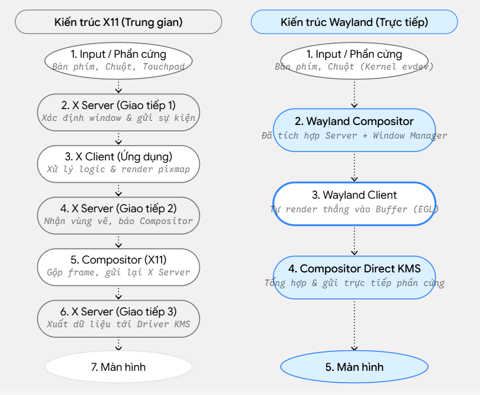
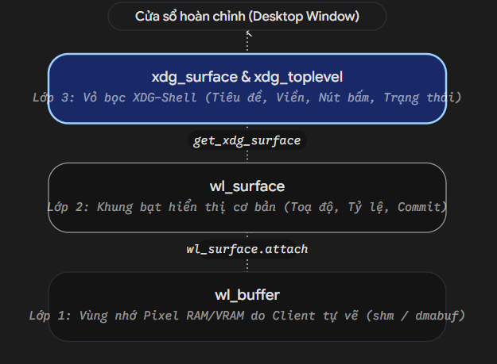
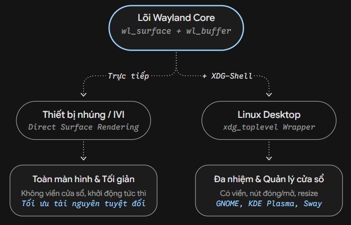
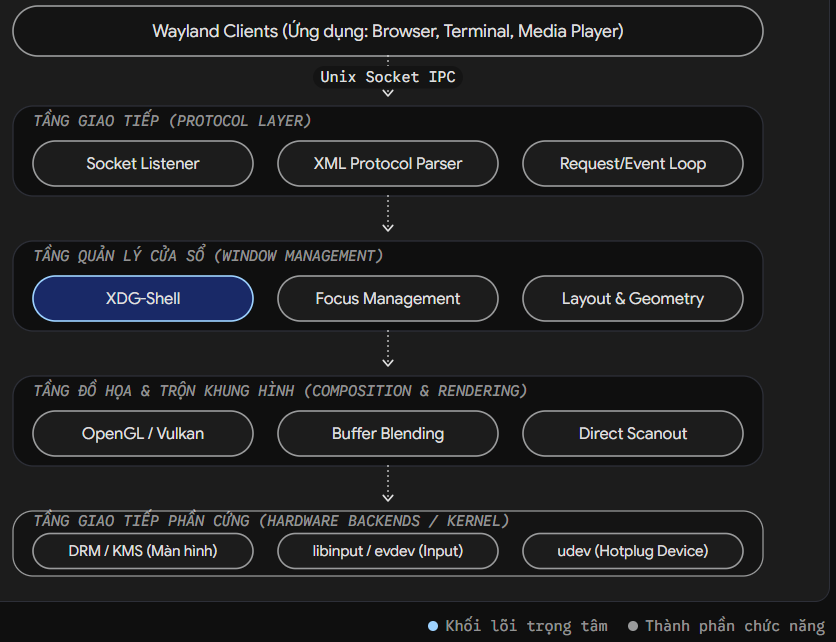

# Tổng quan
- Display server: 
    + nhận input, xuất output cho đúng ứng dụng
    + tránh việc các ứng dụng hỗn loạn khi nhận input, tranh nhau hiển thị
- Wayland:
    + là 1 giao thức 
    + nó gộp Display server và Compositor lại làm 1, gọi là `Wayland compositor`
    + client tự vẽ giao diện -> gửi qua `Wayland compositor` -> `Wayland compositor` sắp xếp lại các cửa sổ rồi hiển thị
- So sánh X11 và Wayland
    + 

# Kiến trúc của Wayland
- Wayland gồm 4 thành phần chính:
    + Wayland client: các ứng dụng
    + Wayland compositor: quản lý, sắp xếp các client, nhận input, xuất output ra màn hình
    + Unix Domain Socket: cách mà compositor và client giao tiếp
    + Wayland protocol: giao thức để compositor và client hiểu nhau
- Cách thức hoạt động:
    + Wayland compositor sẽ tạo 1 device file là `wayland-0`, các client muốn giao tiếp với compositor thì giao tiếp qua file này
    + Wayland dùng mô hình sự kiện (bất đồng bộ): Client yêu cầu compositor vẽ 1 cửa sổ, compositor khi nào vẽ xong thì sẽ báo lại cho client theo cơ chế bất đồng bộ
    + Client -> request -> Compositor
    + Compositor -> event -> Client
    + Nếu compositor hay client đang bận mà chưa thể nhận được request/response thì hệ điều hành có bộ đệm để chứa các req/event đó giúp compositor/client lấy ra sau. Tuy nhiên bộ đệm này có thể đầy.
- Framebuffer: chứa các giá trị màu của từng pixel để compositor vẽ
    + Buffer: chứa các giá trị màu của từng pixel của mỗi client
    + khi vẽ, hệ điều hành sẽ đọc các buffer này để tô màu lên màn hình
    + compositor sẽ phân phối các buffer để chứa vào framebuffer rồi vẽ 

# Object, request, event
- trong wayland, mọi thứ đều là object: màn hình, chuột, ...
- Mỗi object có 1 ID riêng để client và compositor điều khiển
- Interface trong wayland:
    + thường bắt đầu bằng `wl_*`
    + `wl_display`: object cốt lõi nhất, đại diện cho socket kết nối tới compositor
    + `wl_registry`: nơi client check xem compositor có những tính năng gì
    + `wl_surface`: khung trống để client vẽ pixel lên
    + `wl_seat`: đại diện cho nhóm thiết bị input
- Sự tương tác giữa client và compositor:
    + client gọi 1 hàm trên object
    + compositor báo cho ứng dụng biết chuyện gì đã xảy ra với object đó
    + hành động đầu tiên mà client phải làm là:
        - xin compositor cấp object `wl_registry`
        - check `wl_registry` có những input/output gì
        - phản hồi muốn dùng cái gì cho compositor
- File wayland.xml: định nghĩa các request/event
    + để biết `wl_surface` có những interface/request/event gì, người ta định nghĩa chúng trong file wayland.xml
    + hệ điều hành linux có cài wayland đều có file wayland.xml
        ```xml
        <interface name="wl_seat" version="1">
            <description summary="Nhóm thiết bị đầu vào"/>
            
            <!-- Compositor báo cho ứng dụng: "Ê, có chuột/phím cắm vào nè" -->
            <event name="capabilities">
                <arg name="capabilities" type="uint"/>
            </event>

            <!-- Ứng dụng xin Compositor: "Lấy cho tôi cái Object bàn phím" -->
            <request name="get_keyboard">
                <arg name="id" type="new_id" interface="wl_keyboard"/>
            </request>
        </interface>
        ```
# Bufer và shared memory
- Như đã biêt, client vẽ giao diện rồi gửi cho compositor bằng 1 buffer
- Đặt vấn đề: nếu 1 màn hình có 2 triệu pixel, mỗi pixel cần 4 byte để chứa giá trị màu thì mỗi khung hình cần 8MB, chạy ở 60fps thì cần gửi 480MB mỗi giây cho compositor. Nếu gửi lượng dữ liệu này qua Unix socket thì sẽ quá tải và sập ngay
- Giải pháp: dùng shared memory
    + client xin linux cấp phát 1 vùng memory trong RAM để đủ chứa ảnh
    + client gửi thông tin memory đó qua cho compositor
    + mỗi khi client tạo data cho buffer chứa trong memory đó xong, client sẽ báo cho compositor vào đọc data
    + compositor đọc trong RAM đó rồi vẽ hình ảnh ra màn hình
- Trong wayland, cơ chế shared memory được quản lý bởi Pool và Buffer 
    + `wl_shm_pool`: vùng RAM để client chứa data vào
    + `wl_buffer`: buffer của khung hình nằm trong vùng RAM pool đó
    + thông thường, client sẽ xin cấp memory để đủ chứa nhiều khung hình, compositor lấy ra hiển thị thì client có thể vẽ và chèn tiếp data vào memory đó
    + khi compositor đã dùng xong data của khung hình, nó sẽ phát event `wl_buffer.release` cho client

# Cửa sổ - surface và XDG-shell
- khi đã có `wl_buffer` rồi, compositor cần surface để đưa ảnh lên, đó chính là `wl_surface`
- `wl_surface`:
    + là khung để compositor treo ảnh lên
    + chỉ là hình chữ nhật chứa pixel
    + không có viền cửa sổ
    + không có nút đóng
    + không biết tên ứng dụng
    + không thể kéo thả surface
- `XDG-Shell`: protocol mở rộng - sự bổ sung hoàn hảo cho `wl_surface`
    + wayland cốt lõi là tạo ra để dùng cho mọi thiết bị nên nó không cần khái niệm cửa sổ
    + `XDG-Shell` tạo ra nhằm biến wayland surface thành 1 cửa sổ trên desktop
    + 
    + Đóng vai trò vỏ bao bọc (XDG-Shell Wrapper). Cấp cho ứng dụng khả năng giao tiếp với Window Manager để quản lý viền, thanh tiêu đề, trạng thái thu/phóng và tương tác người dùng.
- 2 object chính của XDG-shell
    + `xdg_toplevel`: đại diện cho cửa sổ chính, có hàm để đặt title, app id, nhận event từ người dùng
    + `xdg_popup`: đại diện cho các popup, menu. Nó luôn là con nằm trong `xdg_toplevel`
- tổng quan các bước để hiện 1 cửa sổ:
    + tạo `wl_surface`
    + tạo `xdg_toplevel` và `xdg_popup` bao lấy wl_surface đó
    + xin cấp phát RAM cho `wl_buffer` để client vẽ ảnh vào
    + gắn `wl_buffer` vào `wl_surface`
- So sánh luồng xử lý giữa thiết bị nhúng và môi trường desktop
    + 
    + có thể thiết kế theo 2 hướng, không bắt buộc dùng XDG-shell

# Input (chuột, bàn phím) và khái niệm Seat
- Seat:
    + là tập hợp các thiết bị đầu vào cho 1 user tương tác với máy tính
    + wayland gom 1 chuột, 1 bàn phím, 1 màn hình thành 1 seat là `wl_seat`
    + hầu hết máy tính chỉ có 1 `wl_seat` duy nhất
- Khi client nhận được `wl_seat` thì Registry, nó có thể hỏi seat đó có những gì. Compositor sẽ trả lời lại qua các event `wl_pointer`, `wl_keyboard`, `wl_touch`. Sau đó client có thể request để xin dùng các thiết bị này
- Vì wayland không cho các client đọc input của nhau nên khi chuột đi vào cửa sổ của client A, nó sẽ báo event `wl_pointer.enter`, khi rời chuột đi, nó báo `wl_pointer.leave`
- Vấn đề:
    + khi tạo bàn phím ảo để gõ cho 1 ứng dụng, nếu click chuột vào bàn phím thì ứng dụng đó sẽ mất focus ngay. Dẫn tới chữ từ bàn phím không được gửi tới ứng dụng và được gửi ngược lại bàn phím vì lúc này bàn phím đang được focus
    + giải quyết:
        - protocol đặc biệt `zwp_virtual_keyboard_v` và cửa sổ `wlr_layer_shell`
        - cần khai báo bàn phím là 1 lớp phủ - layer và yêu cầu compositor không focus vào bàn phím khi click chuột vào nó

# Viết client wayland bằng C
- `wayland/code/first_wayland_client`
- `wl_display_connect(NULL)`: tìm `wayland-0` và kết nối vào
- `wl_display_get_registry()`: yêu cầu compositor cấp danh sách các tính năng
- `wl_registry_add_listener()`: đăng ký callback để nhận event từ compositor
- `wl_display_roundtrip()`: gửi tất cả request trong Socket tới compositor và chặn lại cho tới khi compositor gửi hết các event cần thiết
- `wl_registry_bind`: đăng ký dùng tài nguyên này và cấp object thuộc loại mà bind
- biên dịch: `gcc -o client client.c -lwayland-client`

# Vẽ bằng GPU-EGL và DMA-BUF
- khi muốn dùng GPU để vẽ, nó thường dùng các thư viện đồ họa như OpenGL hoặc Vulkan. Nhưng có vấn đề là OpenGL chỉ nói chuyện voiwss GPU, hoàn toàn không biết wayland hay cửa sổ là gì. Wayland cũng chỉ biết quản lý cửa sổ.
- Để OpenGL và wayland kết hợp được với nhau, ta cần EGL và DMA-BUF
## EGL
- là thư viện dùng để giao tiếp giữa OpenGL và Wayland
- cách mà EGL hoạt động:
    + client wayland tạo ra 1 `wl_surface`
    + ta đưa `wl_surface` này cho EGL
    + EGL bọc `wl_surface` này thành object mới: `EGLSurface`
    + Bây giờ, OpenGL có thể vẽ hình lên `EGLSurface` này
    + Khi EGL vẽ xong, nó đóng gói hình ảnh và gửi request tới cho wayland compositor
- nhờ có EGL mà ta không cần thủ công tạo buffer hay tính toán kích thước ảnh nữa
## DMA-BUF - chia sẻ VRAM của GPU
- cùng mục tiêu như shared memory trong `wl_shm` nhưng áp dụng cho VRAM của GPU
- các bước:
    + client vẽ ảnh trong VRAM
    + linux cấp cho client của khóa để trỏ thằng vào VRAM
    + client gửi khóa này cho compositor qua socket
    + compositor lấy khóa này, ra lệnh cho GPU xuất hình

# Compositor
- cấu trúc của compositor cực phức tạp
    + 
- thư viện `wlroots` giúp xử lý việc phức tạp trong quá trình tạo compositor này
## wlroots
- 4 thành phần cốt lõi bạn phải quản lý trong code:
    + wl_display: Bộ não chính. Nó quản lý vòng lặp sự kiện (Event Loop) và giao tiếp Socket với các Client.
    + wlr_backend: Tầng giao tiếp phần cứng. Nó tự động tìm Card màn hình (DRM) và thiết bị nhập (libinput).
    + wlr_renderer & wlr_allocator: Chịu trách nhiệm vẽ ảnh lên màn hình (bằng OpenGL/GLES2) và cấp phát bộ nhớ RAM/VRAM.
    + Các cấu trúc dữ liệu tự định nghĩa: Bạn phải tự tạo ra các struct bằng C để lưu danh sách các cửa sổ đang mở, vị trí chuột, và trạng thái bàn phím.